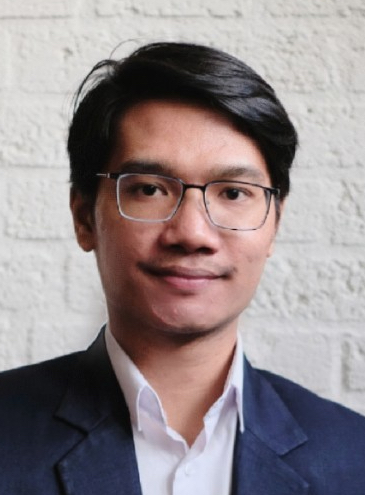

<html><body></body></html>

# **Haposan Cornelius Sinaga**

Haposan Cornelius Sinaga is a PhD student at Protestant Theological University, Utrecht, NL.

   

Webpage:    
[https://pthu.academia.edu/HaposanCornelius](https://pthu.academia.edu/HaposanCornelius){target=_blank}    

### Contributions
[אָמָה – female servant](../words/2amah.md) [עֲבֹדָה – work, service](../words/3abodah.md) [עֶבֶד – servant, slave](../words/3ebed.md) [שִׁפְחָה – maidservant](../words/shipchah.md) 