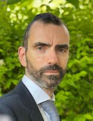

<html><body></body></html>

# Willem van Peursen

Webpage: [https://research.vu.nl/en/persons/willem-van-peursen](https://research.vu.nl/en/persons/willem-van-peursen/){target=_blank}

Willem van Peursen is professor of Old Testament at the Vrije Universiteit (Amsterdam) and director of the Eep Talstra Centre for Bible and Computer (ETCBC). His research concerns the application of digital research methods to the Hebrew Bible and other ancient Hebrew and Syriac texts.
