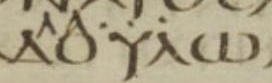

  

    &times;
    

  

<html><body></body></html>

<input id="download" title="Download/print the document" type="image" onclick="print_document()" src="../../images/icons/download3.png" alt="download" />

# עֶבֶד <i>‘èbed</i> – servant, slave

Semantic Fields:
[Servitude](../semantic_fields/servitude.md)&nbsp;&nbsp;&nbsp; Author(s):
[Haposan Cornelius Sinaga](../contributors/haposan_cornelius_sinaga.md) 
First published: 2026-01-06 Citation: Haposan Cornelius Sinaga, עֶבֶד <i>‘èbed</i> – servant, slave,                      &nbsp;&nbsp;&nbsp;&nbsp;&nbsp;&nbsp;&nbsp;&nbsp;&nbsp;&nbsp;&nbsp;&nbsp;&nbsp;&nbsp;                    Semantics of Ancient Hebrew Database (sahd-online.com), 2026
(WORK IN PROGRESS)

## Introduction

Grammatical type: noun masc.   
Occurrences: 800 HB (180/424/196). <!--0x Sir; ??x Qum; ??x Inscr. (Total: ??)-->

* Torah: Gen 9:25 (2x), 26, 27; 12:16; 14:15; 18:3, 5; 19:2, 19; 20:8, 14; 21:25; 24:2, 5, 9, 10, 14, 17, 34, 35, 52, 53, 59, 61, 65 (2x), 66; 26:15, 19, 24, 25, 32; 27:37; 30:43; 32:5, 6, 11, 17 (2x), 19, 21; 33:5, 14; 39:17, 19; 40:20 (2x); 41:10, 12, 37, 38; 42:10, 11, 13; 43:18, 28; 44:7, 9 (2x), 10, 16 (2x), 17, 18 (2x), 19, 21, 23, 24, 27, 30, 31 (2x), 32, 33 (2x); 45:16; 46:34; 47:3, 4 (2x), 19, 25; 50:2, 7, 17, 18; 
Exod 4:10; 5:15, 16 (2x), 21; 7:10, 20; 7:28; 7:29; 8:5; 8:7; 8:17; 8:20; 8:25; 8:27; 9:14, 20 (2x), 21, 30, 34; 10:1, 6, 7; 11:3, 8; 12:30, 44; 13:3, 14; 14:5, 31; 20:2, 10, 17; 21:2, 5, 7, 20, 26, 27, 32; 32:13;
Lev 25:6, 39, 42 (2x), 44 (2x), 55 (2x); 26:13;
Num 11:11; 12:7, 8; 14:24; 22:18; 31:49; 32:4, 5, 25, 27, 31;
Deut 3:24; 5:6, 14 (2x), 15, 21; 6:12, 21; 7:8; 8:14; 9:27; 12:12, 18; 13:6, 11; 15:15, 17; 16:11, 12, 14; 23:16; 24:18, 22; 28:68; 29:1; 32:36, 43; 34:5, 11; 

* Nebiim: Josh 1:1, 2, 7, 13, 15; 5:14; 8:31, 33; 9:8, 9, 11, 23, 24 (2x); 10:6; 11:12, 15; 12:6 (2x); 13:8; 14:7; 18:7; 22:2, 4, 5; 24:17, 29; 
Judg 2:8; 3:24; 6:8, 27; 15:18; 19:19;
1 Sam 3:9, 10; 8:14, 15, 16, 17; 12:19; 16:15, 16, 17; 17:8, 9 (2x), 32, 34, 36, 58; 18:5, 22 (2x), 23, 24, 26, 30; 19:1, 4; 20:7, 8 (2x); 21:8, 12, 15; 22:6, 7, 8, 9, 14, 15 (2x), 17; 23:10, 11 (2x); 25:8, 10 (2x), 39, 40, 41; 26:18, 19; 27:5, 12; 28:2, 7 (2x), 23, 25; 29:3, 8, 10; 30:13;
2 Sam 2:12, 13, 15, 17, 30, 31; 3:18, 22, 38; 6:20; 7:5, 8, 19, 20, 21, 25, 26, 27 (2x), 28, 29 (2x); 8:2, 6, 7, 14; 9:2 (2x), 6, 8, 10 (2x), 11 (2x), 12; 10:2 (2x), 3, 4, 19; 11:1, 9, 11, 13, 17, 21, 24 (3x); 12:18, 19 (2x), 21; 13:24 (3x), 31, 35, 36; 14:19, 20, 22 (2x), 30 (2x), 31; 15:2, 8, 14, 15 (2x), 18, 21, 34 (3x); 16:6, 11; 17:20; 18:7, 9, 29 (2x); 19:6, 7, 8, 15, 18, 20, 21, 27 (3x), 28, 29, 36 (2x), 37, 38 (2x); 20:6; 21:15, 22; 24:10, 20, 21;
1 Kgs 1:2, 9, 19, 26 (2x), 27, 33, 47, 51; 2:38, 39 (2x), 40 (2x); 3:6, 7, 8, 9, 15; 5:15; 5:20 (3x), 23; 8:23, 24, 25, 26, 28 (2x), 29, 30, 32, 36, 52, 53, 56, 59, 66; 9:22 (2x), 27 (2x); 10:5, 8, 13; 11:11, 13, 17, 26, 32, 34, 36, 38; 12:7 (2x); 14:8, 18; 15:18, 29; 16:9; 18:9, 12, 36; 20:6 (2x), 9, 12, 23, 31, 32, 39, 40; 22:3, 50 (2x);
2 Kgs 1:13; 2:16; 3:11; 4:1 (3x); 5:6, 13, 15, 17 (2x), 18 (2x), 25, 26; 6:3, 8, 11, 12; 7:12, 13; 8:13, 19; 9:7 (2x), 11, 28, 36; 10:5, 10, 23; 12:21, 22; 14:5, 25; 16:7; 17:3, 13, 23; 18:12, 24, 26; 19:5, 34; 20:6; 21:8, 10, 23; 22:9, 12; 23:30; 24:1, 2, 10, 11, 12; 25:8, 24;
Isa 14:2; 20:3; 22:20; 24:2; 36:9, 11; 37:5, 24, 35; 41:8, 9; 42:1, 19 (2x); 43:10; 44:1, 2, 21 (2x), 26; 45:4; 48:20; 49:3, 5, 6, 7; 50:10; 52:13; 53:11; 54:17; 56:6; 63:17; 65:8, 9, 13 (3x), 14, 15; 66:14;
Jer 2:14; 7:25; 21:7; 22:2, 4; 25:4, 9, 19; 26:5; 27:6; 29:19; 30:10; 33:21, 22, 26; 34:9, 10, 11 (2x), 13, 16 (2x); 35:15; 36:24, 31; 37:2, 18; 43:10; 44:4; 46:26, 27, 28;
Ezek 28:25; 34:23, 24; 37:24, 25 (2x); 38:17; 46:17;
Joel 3:2; Amos 3:7; Mic 6:4; Hag 2:23; Zech 1:6; 2:13; 3:8; Mal 1:6; 3:22;

* Ketubim:  Pss 18:1; 19:12, 14; 27:9; 31:17; 34:23; 35:27; 36:1; 69:18, 37; 78:70; 79:2, 10; 86:2, 4, 16; 89:4, 21, 40, 51; 90:13, 16; 102:15, 29; 105:6, 17, 25, 26, 42; 109:28; 113:1; 116:16 (2x); 119:17, 23, 38, 49, 65, 76, 84, 91, 122, 124, 125, 135, 140, 176; 123:2; 132:10; 134:1; 135:1, 9, 14; 136:22; 143:2, 12; 144:10;
Job 1:8; 2:3; 3:19; 4:18; 7:2; 19:16; 31:13; 40:28; 42:7, 8 (3x);
Prov 11:29; 12:9; 14:35; 17:2; 19:10; 22:7; 29:19, 21; 30:10, 22;
Eccl/Qoh 2:7; 7:21; 10:7 (2x); Lam 5:8; Est 1:3; 2:18; 3:2, 3; 4:11; 5:11; 7:4;
Dan 1:12, 13; 9:6, 10, 11, 17; 10:17;
Ezra 2:55, 58, 65; 9:9, 11;
Neh 1:6 (2x), 7, 8, 10, 11 (3x); 2:5, 10, 19, 20; 5:5; 7:57, 60, 67; 9:10, 14, 36 (2x); 10:30; 11:3;
1 Chron 2:34, 35; 6:34; 16:13; 17:4, 7, 17, 18 (2x), 19, 23, 24, 25 (2x), 26, 27; 18:2, 6, 7, 13; 19:2, 3, 4, 19; 20:8; 21:3, 8;
2 Chron 1:3; 2:7 (3x), 9, 14; 6:14, 15, 16, 17, 19 (2x), 20, 21, 23, 27, 42; 8:9, 18 (3x); 9:4, 7, 10 (2x), 12, 21; 10:7; 12:8; 13:6; 24:6, 9, 25; 25:3; 28:10; 32:9, 16 (2x); 33:24; 34:16, 20; 35:23, 24; 36:20.

<!--
### Text Doubtful

<b>A.1</b> 

## 1. Root and Comparative Material

The etymology of אָמָה is 

## 2. Formal Characteristics

<b>A.1</b> 
PLURAL WITH HE:   
abs: Gen 31:33; 2 Sam 6:22;   
cnstr without suff: 2 Sam 6:20;   
suff:  Gen 20:17; Deut 12:12; Nah 2:8; Job 19:15; Ezra 2:65; Neh 7:67; 4Q215 fr1_3:2.  

##3. Syntagmatics 

<b>A.1</b> -->

## 4. Ancient Versions

<b>Septuagint (LXX) and other Greek versions</b><a href="#footnote" data-toggle="modal" onclick="show_modal('fn:11')">11</a> 

The following survey of Greek renderings is based on the main text in Alfred Rahlfs, <i>Septuaginta</i>, 1935. <!--text from Accordance--> 

* Αβδησελμα, PN (2x): Ezra 2:55, 58;
* ἄγγελος, ‘messenger’ (1x): Isa 37:24;
* ἄνθρωπος, ‘man’, ‘human being’ (1x): 2 Chron 24:6;
* ἄρχων, ‘one who rules’ (1x): Num 22:18;
* διέρχομαι, ‘to go through, pass through’ (2x): 2 Sam 15:34 (2x);
* δουλεία, ‘slavery, bondage’, ‘service’ (13x): Exod 13:3, 14; 20:2; Deut 5:6; 6:12; 7:8; 8:14; 13:6, 11; Judg 6:8; 1 Kgs 5:20 (3rd); Jer 34:13; Mic 6:4;
* δουλεύω, ‘<i>to perform the duties</i> incumbent upon oneself <i>dutifully and obediently</i>’ (11x): Isa 53:11; 65:8, 13 (3x), 14, 15; Jer 27:6; Zech 2:13; Prov 11:29; 12:9;
* δούλη, ‘female slave, bondswoman’, etc. (1x): Exod 21:7 (see also A.10);
* δοῦλος, ‘male slave, bondsman’, ‘submissive and respectful person’ (300x): Lev 25:44 (2nd); 26:13; Deut 32:36; Josh 9:23; 24:29; Judg 2:8; 6:27; 15:18; 19:19; 1 Sam 3:9, 10; 8:14, 15, 16, 17; 12:19; 16:16; 17:9 (2x), 32, 34, 36; 19:4; 20:7, 8 (2x); 22:8, 14, 15 (2x); 23:10, 11 (2x); 25:10 (2nd), 39; 26:18, 19; 27:5, 12; 28:2; 29:3, 8; 30:13; 2 Sam 3:18; 6:20; 7:5, 8, 19, 20, 21, 25, 27 (2x), 28, 29 (2x); 8:2, 6, 14; 9:2 (2nd), 6, 8, 10 (2x), 11 (2x), 12; 10:2 (1st), 19; 11:9, 11, 13, 17, 21, 24 (3rd); 12:18; 13:24 (1st, 3rd), 35; 14:19, 20, 22 (2x); 15:2, 8, 21, 34; 18:29 (2x); 19:6, 8, 15, 18, 21, 27 (1st, 3rd), 28, 29, 36 (2x), 37, 38 (2x); 21:22; 24:10, 21; 1 Kgs 1:19, 26 (2x), 27, 33, 47, 51; 2:38, 39 (2x), 40 (2x); 3:6, 7, 8, 9; 5:20 (1st, 2nd), 23; 8:23, 24, 25, 28 (2nd), 29, 30, 36, 52, 53, 56, 59, 66; 11:11, 13, 26, 32, 34, 36, 38; 12:7 (2x); 15:29; 18:9, 12, 36; 20:9, 32, 39, 40; 2 Kgs 1:13; 4:1 (3x); 5:6, 15, 17 (2x), 18 (2x), 25; 6:3; 8:13, 19; 9:7 (2x), 36; 10:10, 23; 12:21, 22; 14:5, 25; 16:7; 17:3, 13, 23; 18:12, 24; 19:34; 20:6; 21:8, 10; 22:9, 12; 24:1, 2; Isa 14:2; 42:19 (2nd); 48:20; 49:3, 5, 7; 56:6; 63:17; 65:9; Jer 2:14; 7:25; 25:4; 46:27; Ezek 28:25; 34:23; 37:24, 25 (2x); 38:17; Joel 3:2; Amos 3:7; Hag 2:23; Zech 1:6; 3:8; Mal 1:6; 3:22; Pss 19:12, 14; 27:9; 31:17; 34:23; 35:27; 36:1; 69:37; 78:70; 79:2, 10; 86:2, 4; 89:4, 21, 40, 51; 90:13, 16; 102:15, 29; 105:6, 17, 25, 26, 42; 109:28; 116:16 (2x); 119:17, 23, 38, 49, 65, 76, 84, 122, 124, 125, 135, 140, 176; 123:2; 132:10; 134:1; 135:1, 9, 14; 136:22; 143:2, 12; 144:10; Job 40:28; Eccl/Qoh 2:7; 7:21; 10:7 (2x); Lam 5:8; Ezra 2:65; 9:9, 11; Neh 1:6 (2x), 11 (1st); 2:10, 19, 20; 5:5; 7:57, 60, 67; 9:14, 36 (1st); 10:30; 11:3; 1 Chron 17:7, 18 (2nd), 26; 2 Chron 2:7 (1st); 6:23, 42; 28:10; 36:20;
* δοῦλος ‘subordinate’ (adjective), (1x): Ps 119:91; 
* δύναμις, ‘power, capacity’, ‘armed military force’ (1x): Est 2:18;
* Ἑβραῖος, ‘Hebrew’ (1x): 1 Sam 17:8;
* ἐγώ, ‘I’ (1x): Josh 9:24 (1st);
* ἡμίονος, ‘mule’ (1x): 1 Sam 22:9; <!--4QSam-a?-->
* θεραπεία, ‘worship service’, ‘a body of attendants’ (1x): Gen 45:16;
* θεραπεύω, ‘to serve devotedly’ (1x): Isa 54:17;
* θεράπων, ‘one devoted to sbd else's service’ (44x): Gen 50:17; Exod 4:10; 5:21; 7:10, 20, 28, 29; 8:5, 7, 17, 20, 25, 27; 9:14, 20, 30, 34; 10:1, 6, 7; 11:3; 12:30; 14:5, 31; Num 11:11; 12:7, 8; 32:31; Deut 3:24; 9:27; 29:1; 34:11; Josh 1:2; 8:31, 33; Job 2:3; 3:19; 7:2; 19:16; 31:13; 42:7; 42:8 (3x);
* ἵστημι ἐνώπιον, ‘to stand before’ (1x): 2 Kgs 25:8;
* λαός, ‘a large body of humans’, ‘nation’ (1x): 1 Kgs 8:32 (see also A.9);
* οἰκέτης, ‘male domestic employee’, ‘submissive designation in relation to God’ (35x): Gen 9:25 (2nd); 27:37; 44:16 (2nd); 44:33 (2nd); 50:18; Exod 5:15, 16 (1st); 12:44; 21:26, 27; 32:13; Lev 25:39; 25:42 (2x); 25:55 (1st); Num 32:5; Deut 5:15; 6:21; 15:15, 17; 16:12; 24:18, 22; 34:5; Josh 5:14; 9:8, 11; Isa 36:9; Prov 17:2; 19:10; 22:7; 29:19, 21; 30:10, 22;
* οἶκος, ‘house’ (1x): Jer 22:2;
* παιδάριον, ‘young male child’ (1x): 1 Sam 21:8;
* παῖς, ‘child’, ‘person of servile status’ (333x): Gen 9:25 (1st), 26, 27; 12:16; 14:15; 18:3, 5; 19:2, 19; 20:8, 14; 21:25; 24:2, 5, 9, 10, 14, 17, 34, 35, 52, 53, 59, 61, 65 (2x), 66; 26:15, 19, 25, 32; 30:43; 32:5, 6, 11, 17 (2x), 19, 21; 33:5, 14; 39:17, 19; 40:20 (2x); 41:10, 12, 37, 38; 42:10, 11, 13; 43:18, 28; 44:7, 9 (2x), 10, 16 (1st), 17, 18 (2x), 19, 21, 23, 24, 27, 30, 31 (2x), 32, 33 (1st); 46:34; 47:3, 4 (2x), 19, 25; 50:2, 7; Exod 5:16 (2nd); 11:8; 20:10, 17; 21:2, 5, 20, 32; Lev 25:6; 25:44 (1st); 25:55 (2nd); Num 14:24; 31:49; 32:4, 25, 27; Deut 5:14 (2x), 21; 12:12, 18; 16:11, 14; 23:16; 28:68; Josh 1:7, 13; 9:9, 24 (2nd); 10:6; 11:12, 15; 12:6 (1st); 13:8; 14:7; 18:7; 22:2, 5; Judg 3:24; 1 Sam 16:15, 17; 18:22 (2x), 23, 24, 26; 19:1; 21:12, 15; 22:6, 7, 17; 25:10 (1st), 40, 41; 28:7 (2x), 23, 25; 29:10; 2 Sam 2:12, 13, 15, 17, 30, 31; 3:22, 38; 8:7; 9:2 (1st); 10:2 (2nd), 3, 4; 11:1, 24 (1st, 2nd); 12:19 (2x), 21; 13:24 (2nd), 31, 36; 14:30 (2x), 31; 15:14, 15 (2x), 18; 16:6, 11; 17:20; 18:7, 9; 19:7, 20, 27 (2nd); 20:6; 21:15; 24:20; 1 Kgs 1:2, 9; 3:15; 5:15; 9:22 (2nd); 9:27 (2x); 10:5, 8, 13; 11:17; 15:18; 20:6 (2x), 12, 23, 31; 22:3; 2 Kgs 2:16; 3:11; 5:13, 26; 6:8, 11, 12; 7:12, 13; 9:11, 28; 10:5; 18:26; 19:5; 21:23; 23:30; 24:11, 12; Isa 20:3; 22:20; 24:2; 36:11; 37:5, 35; 41:8, 9; 42:1, 19 (1st); 43:10; 44:1, 2, 21 (2x), 26; 45:4; 49:6; 50:10; 52:13; Jer 21:7; 22:4; 25:19; 26:5; 34:9, 10, 11 (2nd); 34:16 (2x); 35:15; 36:24, 31; 37:2, 18; 44:4; 46:28; Ezek 46:17; Pss 18:1; 69:18; 86:16; 113:1; Job 1:8; 4:18; Est 7:4; Dan 1:12, 13; 9:6, 10, 11, 17; 10:17; Neh 1:7, 8, 10, 11 (2nd, 3rd); 2:5; 9:10; 1 Chron 2:34, 35; 6:34; 16:13; 17:4, 17, 23, 24, 25 (2x), 27; 18:2, 6, 7, 13; 19:2, 3, 4, 19; 20:8; 21:3, 8; 2 Chron 1:3; 2:7 (2nd, 3rd), 9, 14; 6:14, 15, 16, 17, 19 (2x), 20, 21, 27; 8:9, 18 (3x); 9:4, 7, 10 (2x), 21; 10:7; 12:8; 13:6; 24:9, 25; 25:3; 32:9, 16 (2x); 33:24; 34:16, 20; 35:23, 24;
* πάροδος, ‘passer-by’, ‘act of passing on the way to elsewhere’ (1x): 2 Kgs 25:24;
* πατήρ, ‘father’ (1x): Gen 26:24;
* πρᾶγμα, ‘deed, action’ (1x): 1 Kgs 9:22 (1st, 10:22c in LXX);
* σέβω mid., ‘to worship with reverence’ (1x): Isa 66:14;
* υἱός, ‘son’ (1x): Deut 32:43;
* ὑπηρέτης, ‘<i>one who is in service to another</i> or <i>in subservient position</i>’ (1x): Prov 14:35;
* no translation (39x): Exod 9:20; 9:21; Josh 1:1; 1:15; 12:6 (2nd); 22:4; 24:17; 1 Sam 17:58; 18:5, 30; 25:8; 2 Sam 7:26; 1 Kgs 8:26, 28 (1st); 14:8, 18; 16:9; 22:50 (2x); 2 Kgs 24:10; Jer 25:9; 29:19; 30:10; 33:21, 22, 26; 34:11 (1st); 43:10; 46:26; Ezek 34:24; Est 1:3 (or ἔθνος?); 3:2, 3; 4:11; 5:11; Neh 9:36 (2nd); 1 Chron 17:18 (1st), 19; 2 Chron 9:12.

<b>A.1</b> 
During the transmission of the LXX, certain renderings of עֶבֶד were replaced by other renderings of עֶבֶד, especially in LXX<small>Ant</small>, as will be shown in the following paragraphs.<a href="#footnote" data-toggle="modal" onclick="show_modal('fn:13')">13</a>

<b>A.2</b> 
In the following cases, LXX<small>Ant</small> reads a form of δοῦλος instead of a form of παῖς:
2 Sam 10:2 (2nd), 4; 11:24 (2nd); 
14:30 (2x), 31; 15:14; 
19:20, 27 (2nd);
2 Kgs 5:26; 10:5; 
1 Chron 2:34, 35; 6:34; 16:13; 
17:4, 25 (2x), 27; 
18:2 (sing!), 6;
21:3, 8; 
2 Chron 6:14, 17, 19 (2x), 20, 21, 27; 
8:9, 18 (1st);
10:7; 12:8; 24:9; 34:16. 

<b>A.3</b> 
LXX<small>Ant</small> also replaced the following older renderings by a form of δοῦλος: παιδαρίων in
1 Sam 21:8; δουλείας in
1 Kgs 5:20 (LXX<small>Ant</small> 5:9).

<b>A.4</b> 
In the following cases, LXX<small>Ant</small> reads a form of παῖς instead of a form of δοῦλος:
2 Sam 11:9, 11, 13; 12:18; 18:29 (1st);
19:6, 8, 15; 21:22; 
1 Kgs 1:33 (2 Sam 25:19 in LXX<small>Ant</small>);
2 Kgs 14:5; 21:8, 10.

<b>A.5</b> 
LXX<small>Ant</small> replaced the following expressions including a form of δοῦλος by another translation: οἱ δοῦλοι > οἱ συμπορευόμενοι
2 Sam 10:19;
ἐκ τῶν δούλων > κατὰ τὸν λόγον 2 Sam 11:17.
In 2 Sam 21:15, LXX<small>Ant</small> replaced παῖδες by ἄνδρες.

<b>A.6</b> 
There is no rendering of עֶבֶד in the older version of the LXX in
1 Sam 17:58; 18:5, 30; 2 Sam 7:26; 1 Chron 17:18 (1st), 19, but in these cases LXX<small>Ant</small> represents עֶבֶד by a form of δοῦλος. 
In 1 Sam 25:8 there is also no rendering of עֶבֶד in the older version of the LXX, but LXX<small>Ant</small> translates it with a pl. form of παῖς.

<b>A.7</b> 
The older version of the LXX translates עֶבֶד with a form of δοῦλος
in 1 Kgs 1:19 and 1 Kgs 8:24, but for these occurrences there is no rendering in LXX<small>Ant</small> (1:19 = 2 Sam 25:19 in LXX<small>Ant</small>). 
In 2 Kgs 25:24 the older version of the LXX translates עַבְדֵי as πάροδον, but there is no rendering in LXX<small>Ant</small>. 

<b>A.8</b> 
In Judg 19:19 עִם־עֲבָדֶיךָ is translated as τοῖς δούλοις σου in LXX<small>A</small>, but as μετὰ τῶν παιδίων σου, ‘with your young children’, in LXX<small>B</small>.

<b>A.9</b> 
Several manuscripts of the LXX read a form of λαός instead of a form of δοῦλος: 
LXX<small>A</small> in 1 Kgs 8:36 and Isa 48:20; 
LXX<small>S</small>, second hand, in Ps 136:22.

&nbsp;&nbsp;
&nbsp;  &nbsp;&nbsp;&nbsp;&nbsp;&nbsp;&nbsp;&nbsp;&nbsp;&nbsp;&nbsp;&nbsp;&nbsp;&nbsp;&nbsp;&nbsp;&nbsp;&nbsp;&nbsp;&nbsp;&nbsp;&nbsp;&nbsp;&nbsp;&nbsp;&nbsp;&nbsp;&nbsp;&nbsp;&nbsp;&nbsp;&nbsp;&nbsp;&nbsp;&nbsp;&nbsp;&nbsp;&nbsp;&nbsp;&nbsp;&nbsp;&nbsp;&nbsp;&nbsp;&nbsp;&nbsp;&nbsp;&nbsp;&nbsp;&nbsp;&nbsp;&nbsp;&nbsp;&nbsp;&nbsp;&nbsp;&nbsp;&nbsp;&nbsp;&nbsp;&nbsp;&nbsp;&nbsp;&nbsp;&nbsp;&nbsp;  
Ps 136:22[135:22] in LXX<small>S</small>

<b>A.10</b> 
In Neh 5:5 LXX<small>B</small> reads δούλας (pl. of δούλη) instead of δούλους.
In 1 Chron 17:4 
LXX<small>B</small> reads a form of δοῦλος instead of a form of παῖς, just like LXX<small>Ant</small>.

<b>A.11</b> 
In Num 32:5 LXX<small>A</small> reads
a form of παῖς instead of a form of οἰκέτης. 
In Josh 14:7, Jer 35:15[42:15], and Jer 44:4[51:4], LXX<small>A</small> reads forms of δοῦλος instead of forms of παῖς. 
In Job 1:8 LXX<small>A</small> reads
a form of θεράπων instead of a form of παῖς, but in 
Job 42:8 (1st) LXX<small>A</small> reads
a form of παῖς instead of a form of θεράπων.
In Dan 1:13 LXX<small>A</small> reads
a form of παιδάριον instead of a form of παῖς. 
In Ezra 2:55 LXX<small>A</small> reads
δούλων Σαλωμων instead of Αβδησελμα.

<b>A.12</b> 
In 1 Kgs 22:50 LXX<small>A</small> reads two forms of δοῦλος, while LXX<small>B</small> and other mss of the LXX have no rendering of the verse.

<!--ONDANKS HATCH-REDPATH LIJKT DIT VOLGENS DE SITE NIET TE KLOPPEN
In Jer 22:2 LXX<small>S</small>, second hand, reads a form of παῖς instead of οἶκος. 

Neh 7:60: LXX_S omits douloon
Ps 116:16 LXX_A omits tweede doulos
Gen 47:4 omission phrase LXX-B
2Chron6:19 omission 2nd in B*-->

<!--1K16:9 wel pais in LXX-A?-->

<!--EBRAIOS NOG DOEN-->

<!--MICHAEL:   
VOORAL 2 SAM 10 TOT EINDE.  
HOE ELDERS LXX-ANT?  
1 Kgs 9:22 (LXX 10:22c) omission in Ant.? 
1 Kgs 14:8, 18 inderdaad omitted in Ant.? Wel doulos in LXX-A (zie Hatch-Redpath s.v. doulos). 
Daniel Theod (vrij laat) 9:6,10,11,17 pais > doulos

Interesting: 1 Sam 16 alternatively doulos/pais, also in 2S 15:34; 2 Chron 2:7.   
17:8: Εβραῖοι (ook Ant)-->  

<!--CHECK IN HATCH/REDPATH WHETHER `EBED IS TRANSLATED LIKE ABOVE IN PART OF THE MSS OF LXX. ALREADY DONE FOR LEMMAS UNTIL DOULH AND FOR LAOS (SEE A.9, A.10) DOULOS P 346-->

<!--dierchomai vaak vertaling van ABAR! Ebraios en parodos ook vertaling ABAR-->

<!--Deur 32:43 textual criticism-->

<!--<b>Peshitta (Pesh)</b><a href="#footnote" data-toggle="modal" onclick="show_modal('fn:12')">12</a> 

* ܐܡܬܐ (<i>ʾamā</i>), ‘handmaid’:

<b>c. Targumim</b>:  

* אָמָה, ‘maidservant’:  
* לְחֵנָה, ‘concubine’: Job 19:15.

<b>Vulgate (Vg)</b> 

* <i>ancilla</i>, ‘’:
* <i>famula</i>, ‘’:

## 5. Lexical/Semantic Fields

## 6. Exegesis 

## 7. Conclusion-->

## Bibliography

For the abbreviations see the 
<a href="/store/abbreviations/">List of Abbreviations</a>.

Fernández Marcos & Busto Saiz 1989  
Natalio Fernández Marcos, José Ramón Busto Saiz,
<i>El texto antioqueno de la Biblia griega</i>, I: <i>1-2 Samuel</i> (TECC 50), Madrid: Instituto de Filología, C.S.I.C.

Fernández Marcos & Busto Saiz 1992  
Natalio Fernández Marcos, José Ramón Busto Saiz,
<i>El texto antioqueno de la Biblia griega</i>, II: <i>1-2 Reyes</i> (TECC 53), Madrid: Instituto de Filología, C.S.I.C.

Fernández Marcos & Busto Saiz 1996  
Natalio Fernández Marcos, José Ramón Busto Saiz,
<i>El texto antioqueno de la Biblia griega</i>, III: <i>1-2 Crónicas</i> (TECC 60), Madrid: Instituto de Filología, C.S.I.C.

## Notes

[^11]: The translations of the Greek are based on <i>GELS</i>.  
[^13]: For LXX<small>Ant</small>, see Fernández Marcos & Busto Saiz 1989; Fernández Marcos & Busto Saiz 1992; Fernández Marcos & Busto Saiz 1996. 
