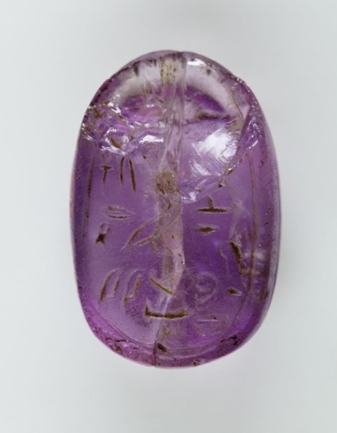
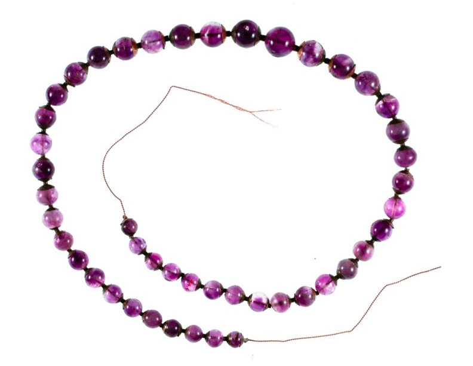

<html><body></body></html>

<input id="download" title="Download/print the document" type="image" onclick="print_document()" src="../../images/icons/download3.png" alt="download" />

# חַשְׁמַן – amethyst(?)

Semantic Fields:
[Gemstones](../semantic_fields/gemstones.md)&nbsp;&nbsp;&nbsp;[Metals](../semantic_fields/metals.md)&nbsp;&nbsp;&nbsp;[Cloth](../semantic_fields/cloth.md)&nbsp;&nbsp;&nbsp;[Colours](../semantic_fields/colours.md)&nbsp;&nbsp;&nbsp;[Tribute](../semantic_fields/tribute.md)&nbsp;&nbsp;&nbsp; Author(s):
[Meindert Dijkstra](../contributors/meindert_dijkstra.md),&nbsp;[Paul Sanders](../contributors/paul_sanders.md) 
First published: 2024-07-27 Citation: Meindert Dijkstra,&nbsp;Paul Sanders, חַשְׁמַן – amethyst(?),                      &nbsp;&nbsp;&nbsp;&nbsp;&nbsp;&nbsp;&nbsp;&nbsp;&nbsp;&nbsp;&nbsp;&nbsp;&nbsp;&nbsp;                    Semantics of Ancient Hebrew Database (sahd-online.com), 2024

## Introduction

Grammatical type: n.m.  
Occurrences:   1x HB (0/0/1); 0x Sir; 0x Qum; 0x Inscr.  (Total: 1).

* Ketubim: Ps 68:32. 

<b>B.1</b> 
Since *חַשְׁמַן 
is a <i>hapax legomenon</i>, it is not surprising that there have been suggestions to emend the text. 
It has been proposed to replace חשׁמנים 
with בִּשְׁמָנִים, ‘with olive oil’ (BDB, 365; <i>BHK</i>2; GB, 267),
or with מַשְׁמַנִּים, ‘fat gifts’ 
(GB, 
267).
Following the suggestion of others, Noonan 
(2019:330-31; cf. BDB, 365; <i>BHK</i>2)
assumes that the reading חשׁמנים
is corrupt and that the text originally read חׇשׁ̣ים,
‘quick ones’ (part. <i>qal</i> חושׁ, ‘to hurry’);
cf. <a href="#AV">Ancient Versions</a> for α´ and 
VgPsH. 
However, there are no solid reasons to emend the consonantal text, which is the <i>lectio difficilior</i>.

<b>B.2</b> 4Q554 fr 2.ii:15 has the following reading (Aram.): בניה בחש֯[מל] וספיר וכדכוד,
‘built of elec[trum] and sapphire and chalcedony’ (reconstruction and translation according to DJD XXXVII, 122-24).
Instead of בחש֯[מל] the reconstruction בחש֯[מן]
is possible. If \*חַשְׁמַן denotes amethyst or another gemstone, the phrase with the reconstruction בחש֯[מן]
would include three precious stones (cf. Isa 54:11-12).
However, in view of the relationship of 4Q554 
(= 4QNewJerusalemb)
with the book of Ezekiel and the unequivocal occurrence of חשמל in 4Q405
(= 4QShirShabbf) fr 20ii-22:10, 
the reconstruction בחש֯[מל] is more probable
(cf. <a href="#jvml">Root and Comparative Material, A.8</a>). 
Furthermore, if \*חַשְׁמַן designated a gemstone, this meaning seems to have become unknown relatively early.

## 1. Root and Comparative Material

<b>A.1</b> 
Older as well as more recent dictionaries indicate that the meaning of the noun is unknown (BDB, 365; GB, 267; Ges18, 409). 
Its derivation is still contested.
The deciphering of several ancient Near Eastern languages during the nineteenth and twentieth centuries has led to
the identification of possible cognates in 
Egyptian and Akkadian,
but proposals to connect  \*חַשְׁמַן with Arabic words (see B.1) have been abandoned.
While many <a href="#AV">Ancient Versions</a> suggest that in Ps 68:32 חַשְׁמַנִּים refers to persons
(cf. KJV, ASV: ‘princes’; NIV: ‘envoys’),
recent analyses suppose that the word represents luxury goods; see A.2-A.5.
The following survey shows the
translation options for Heb. \*חַשְׁמַן, 
Eg. <i>ḥsmn</i>, and/or Akk. <i>ḫašmānu</i>
as mentioned in Hebrew dictionaries.[^2] 

<table style="width:100%">
  <tr>
    <td> </td> 
    <td>  &nbsp;KBL&nbsp;   1958 </td>
    <td> &nbsp;<i>HAL</i>  1967&nbsp;</td>
    <td> Ges<small>18</small>   1995 </td>
    <td> <i>DCH</i>   1996 </td>
    <td> <i>DCHR</i>   2023 </td>
  </tr>
  <tr>
    <td> bronze&nbsp;(cf.&nbsp;A.2)</td> 
    <td> X </td> 
    <td> &nbsp;&nbsp;&nbsp;X </td> 
    <td> X </td> 
    <td> &nbsp;&nbsp;&nbsp;X </td> 
    <td> X </td> 
    </tr>
  <tr>
    <td> natron&nbsp;(cf.&nbsp;A.2)</td> 
    <td> </td> 
    <td> &nbsp;&nbsp;&nbsp;X </td> 
    <td> X </td> 
    <td> </td> 
    <td> </td> 
    </tr>
  <tr>
    <td> red&nbsp;cloth&nbsp;(cf.&nbsp;A.3)</td> 
    <td> </td> 
    <td> &nbsp;&nbsp;&nbsp;X </td> 
    <td> </td> 
    <td> &nbsp;&nbsp;&nbsp;X </td> 
    <td> X </td> 
    </tr>
  <tr>
    <td> bluish&nbsp;cloth&nbsp;(cf.&nbsp;A.4)</td> 
    <td> </td> 
    <td> </td> 
    <td> X </td> 
    <td> </td> 
    <td> X </td> 
    </tr>
</table>

The dictionaries do not yet mention the possibility of identifying *חַשְׁמַן
with amethyst (see A.5 below).

<b>A.2</b> <i>Bronze</i> or <i>natron</i>.
Initially, Albright (1950-51:33-34, 39) identified \*חַשְׁמַן with the hieroglyphic Egyptian noun <i>ḥsmn</i>,
which in Egyptian is probably not a loanword. 
Egyptian <i>ḥsmn</i> can designate ‘bronze’ as well as ‘natron’, the latter being
a valued product that was used as a detergent
(see <i>WÄS</i> III, 162-63; Faulkner 1962:178).
The word
could apparently be used as a synonym for <i>nṯry</i> (later: <i>ntry</i>), ‘natron’ (see <i>LÄ</i> 2, 358-59;
Faulkner 1962:143; cf.
Heb. נֶתֶר; Greek νίτρον ).
Albright preferred the meaning ‘natron’ for  \*חַשְׁמַן 
in Ps 68:32, supposing that bronze and copper had to be imported into Egypt, while natron was 
mined in Egypt (especially in Wadi El Natrun) and 
exported from there. 
Barthélemy (2005:462) countered that natron could hardly be appropriate as a gift to God (cf. לֵאלֹהִים, Ps 68:32b; cf. Noonan 2019:330).
Like Albright, Mowinckel identified \*חַשְׁמַן in Ps 68:32 with
Egyptian <i>ḥsmn</i>, but assuming a direct relationship with חַשְׁמַל (see A.8 below)
he preferred to interpret חַשְׁמַנִּים as ‘brass equipment’ 
(Mowinckel 1953:59, 61-62: ‘Messinggeräte’).
The identification of \*חַשְׁמַן with Egyptian <i>ḥsmn</i>, ‘bronze’,
was accepted in several Bible translations
(CEV, NAB, RSV, NRSV: ‘bronze’; cf. KBL, 342: ‘bronze ware’).

<b>A.3</b> <i>Red cloth</i>.
A few years later, Albright identified \*חַשְׁמַן with the noun <i>ḫašmānu</i> in Akkadian
texts from Ugarit and argued that both \*חַשְׁמַן and <i>ḫašmānu</i> designate ‘red cloth’ 
(Albright 1955:5; similarly: NET; cf. <i>HAL</i>, <i>DCH</i>, <i>DCHR</i>).[^3]
It had been shown that in the tribute inventory of RS 11.732 (14th cent. BCE)
the pair SÍG ZA.GÍN and
SÍG ZA.GÍN <i>ḫašmāni</i> 
denotes two different categories of woolen gifts 
offered by the Ugaritic court to the Hittite royal family and court
(Virolleaud 1940:258-60; 1951:56).[^4] 
While SÍG  is the determinative for wool,
ZA.GÍN represents Akkadian <i>uqnû</i>, the bluish stone lapis lazuli.
Preceded by  SÍG, 
ZA.GÍN is assumed to represent Akkadian <i>uqnâtu</i>, 
apparently wool with a lustrous hue similar to the colour of lapis lazuli.
Albright also had knowledge of the Akkadian text RS 12.33, also from Ugarit, 
which mentions SÍG <i>ḫusmāni</i> 
(with <i>s</i>)
and SÍG <i>takilta</i> 
 to designate two different kinds of wool that were given to an Ugaritic queen named Šarelli
(see Virolleaud 1951:54-56; PRU 3, 1955: 14-15).
Since <i>takiltu</i> denotes ‘blue(-purple) cloth’ (see Heb. תְּכֵלֶת; cf. Hartley 2010:38, 185-90),
Albright interpreted <i>ḫašmānu</i> as denoting a category of textile with a different colour, namely red.
However, he still assumed that there is a relationship with Egyptian <i>ḥsmn</i>, ‘natron’ (see A.2), supposing that
red dyes could be dissolved with the help of natron. 
The interpretation of SÍG ZA.GÍN <i>ḫašmāni</i>  as referring to red(-purple) wool emerges in translations of RS 11.732 (e.g., Beckman 1999:168),
but also in translations of other Akkadian texts from Ugarit:  

* an edict of the Hittite king Suppiluliuma I to the Ugaritic king Niqmaddu (ca. 1330 BCE; see Freu 2004),
with an inventory of required tribute in which
SÍG ZA.GÍN and
SÍG ZA.GÍN <i>ḫašmāni</i>, usually in this order, repeatedly occur side by side
(RS 17.227 and duplicates; PRU 4, 1956, 40-44; translations in
<i>TUAT</i> 1: 133-34; Beckman 1999:166-67); 
* an edict of the Hittite king Mursili II to the Ugaritic king Niqmepa, with 
an inventory of tribute in which SÍG ZA.GÍN <i>ḫašmāni</i> is mentioned several times before SÍG ZA.GÍN <i>takiltu</i>
(RS 17.382+380;
PRU 4, 1956, 80-83; translations in Beckman 1999:175-77; <i>TUAT.NF</i> 2: 169-71). 

The interpretation of SÍG ZA.GÍN <i>ḫašmāni</i> as referring to wool with 
a reddish colour seems to be confirmed by the alphabetic Ugaritic text <i>KTU</i> 3.1:27-39 (= RS 11.772+),
which shows conspicuous correspondences with RS 17.227:25-35,
although the differences show that <i>KTU</i> 3.1 is not a direct translation (Knoppers 1993; Pardee 2001). 
The following parallel phrases are repeated several times in these texts.

<table style="width:100%">
  <tr>
    <td> <i>KTU</i>&nbsp;3.1 </td> 
    <td> <i>mʾit</i> (100 sheqel) </td>
    <td> <i>pḥm</i> </td>
    <td> <i>mʾit</i>&nbsp;(100&nbsp;sheqel) </td>
    <td> <i>ʾiqnʾi</i> </td>  
</tr>
  <tr>
    <td> RS&nbsp;17.227 </td> 
    <td> <i>1&nbsp;meʾat</i>&nbsp;(100&nbsp;sheqel)</td> 
    <td> SÍG&nbsp;ZA.GÍN </td> 
    <td> <i>1&nbsp;meʾat</i>&nbsp;(100&nbsp;sheqel) </td> 
    <td> SÍG&nbsp;ZA.GÍN&nbsp;<i>ḫašmāni</i> </td> 
    </tr>
</table>

In these two parallel phrases, the two kinds of wool appear to occur in opposite orders
(Dietrich and Loretz 1966:227-32; Van Soldt 1990:335-43, 354-57). 
Only in lines 36-37 of RS 17.227 is SÍG ZA.GÍN <i>ḫašmāni</i> not preceded but
followed by SÍG ZA.GÍN (cf. RS 17.382+380). Only there does the order correspond with the order in <i>KTU</i> 3.1.
Given that <i>ʾiqnʾi</i>, ‘lapis lazuli’, seems to be identical to 
SÍG ZA.GÍN (= <i>uqnâtu</i>, ‘lapis lazuli’), 
<i>pḥm</i> is assumed to correspond with SÍG ZA.GÍN <i>ḫašmāni</i>.
Since in other Ugaritic texts <i>pḥm</i> seems to designate ‘glowing coal’
(<i>KTU</i> 1.4.ii:8-9; 1.23:41, 45, 48: pl. <i>pḥmm</i> parallel to <i>ʾišt</i>, ‘fire’; cf. Heb. פֶּחָם), 
the supposition arose that in <i>KTU</i> 3.1 <i>pḥm</i> denotes 
something with a reddish hue (Van Soldt 1990:341-42; <i>DULAT</i>3, 657-58;
differently Knoppers 1993:88: ‘kind of precious gem’). 
This interpretation of <i>pḥm</i> in <i>KTU</i> 3.1 supports the interpretation of 
the Akkadian counterpart SÍG ZA.GÍN <i>ḫašmāni</i> as 
referring to red-dyed wool.
However, since SÍG ZA.GÍN <i>ḫašmāni</i> contains the element ZA.GÍN, which
usually denotes the bluish stone lapis lazuli,
it has been argued that the identification of SÍG ZA.GÍN <i>ḫašmāni</i> with red-dyed wool is somewhat problematic; see A.4.  

<b>A.4</b> <i>Bluish cloth</i>.
With reference to <i>CAD</i> Ḫ, Dahood (1968:132, 150) translated חַשְׁמַנִּים in Ps 68:32 as ‘blue cloth’.
Most Akkadian dictionaries[^5] 
indicate that <i>ḫašmānu</i> designates a bluish colour of 
cloth, and also a bluish stone, which agrees with the pairing of the <i>ḫašmānu</i>-stone and the bluish <i>saggilmud</i>-stone 
in ancient lexical lists.[^6]
The stone <i>ḫašmānu</i> was apparently the namesake for the colour <i>ḫašmānu</i>. 
The interpretation of <i>ḫašmānu</i> as denoting a bluish colour is confirmed by the expression
SÍG ZA.GÍN <i>ḫašmāni</i> (see A.3), in which the element ZA.GÍN represents
<i>uqnû</i>, the bluish stone ‘lapis lazuli’. 
While SÍG ZA.GÍN represents Akkadian <i>uqnâtu</i>,
apparently wool with a bluish hue similar to the colour of lapis lazuli,
SÍG ZA.GÍN <i>ḫašmāni</i> 
seems to denote wool with a variant of this bluish colour.
Some scholarly literature suggests that the colour designated by <i>ḫašmānu</i> was blue-green.[^7]
Lackenbacher (2002:74-76, 135-37) interprets SÍG ZA.GÍN <i>ḫašmāni</i> in the Akkadian texts from Ugarit
as ‘purple wool’ (‘laine pourpre’).
The stone <i>ḫašmānu</i> was used in jewellery, as is shown by 
a text from Mari (18th cent. BCE): 
‘1 string of kidney-shaped beads of <i>ḫašmānu</i>, consisting of 19 kidney-shaped beads of gold’.[^8] 
The option of translating חַשְׁמַנִּים as ‘blue cloth’ is mentioned in 
<i>DCHR</i> (iii: 587; cf. Ges18, 409), 
but the possibility that it designates stones (see A.5) remains unmentioned in the Hebrew dictionaries.  

<b>A.5</b> <i>Amethyst</i>.
Harris (1961:121-22) was able to identify an Egyptian word <i>ḥsmn</i> with the obvious meaning ‘amethyst’ in addition to the similarly or identically written 
terms for ‘bronze’ and ‘natron’ (see A.2). 
Hannig lists occurrences of the word <i>ḥsmn</i>, ‘amethyst’,
from the time of the Middle Kingdom, mainly from Wadi el-Hudi, an area in southern Egypt with amethyst quarries (Hannig 2006, vol. 2: 1775-76),
but no occurrences from earlier times (Hannig 2003). 
Some occurrences from the time of the New Kingdom are listed by Seyfried (1981:141-42, 147;
see <a href="#Exe">Exegesis</a> for the latest attestations).
Because of the phonetic similarity,
Black proposed to interpret Akkadian <i>ḫašmānu</i> as a loanword derived from Egyptian <i>ḥsmn</i>, ‘amethyst’, 
suggesting that <i>saggilmud</i> (see A.4) might have been the native Mesopotamian term for this stone (Black 2001; cf. Schuster-Brandis 2008:440).
Like Black, Thavapalan (2020:173-74, 270, 272) assumed that Egyptian <i>ḥsmn</i>, ‘amethyst’, was taken over in Akkadian during the early second millennium BCE.
This theory implies that only in Akkadian did the stone name <i>ḫašmānu</i>
begin to function as a term for amethyst-like colours of leather and cloth, especially wool (Thavapalan 2020:274-81).
Thavapalan pointed out that Latin used the term <i>amethystinus</i>, 
a derivative of <i>amethystus</i>, ‘amethyst’, 
to designate hues ranging from violet into purple 
(Thavapalan 2020:230, with reference to Pliny the Elder, <i>Natural History</i> 21:45). 
Thavapalan (2016:176; 2020:282-83) also demonstrated that
interpreting <i>ḫašmānu</i> as referring to amethyst and the colours violet and purple explains that on the one hand the term 
could be connected with a reddish colour (A.3: Ug. <i>pḥm</i>) and on the other hand could be associated with blue lapis lazuli
(A.4: Akk. SÍG ZA.GÍN <i>ḫašmāni</i>). 
Both Black and Thavapalan disregarded חַשְׁמַנִּים in Ps 68:32, but each of them does discuss the possibility that חַשְׁמַל (see A.8 below)
is a cognate of Egyptian <i>ḥsmn</i>, ‘amethyst’, and Akkadian <i>ḫašmānu</i>. While Black regards the possibility that חַשְׁמַל means
‘amethyst’ as reasonable (2001:185),  Thavapalan rejects the identification of חַשְׁמַל with amethyst and does not see that word as
a cognate of <i>ḥsmn</i>/<i>ḫašmānu</i> (Thavapalan 2020:269-70). 
The option of interpreting חַשְׁמַנִּים as ‘amethyst’ will be discussed more extensively in the section <a href="#Exe">Exegesis</a> below.  

<b>A.6</b>  <i>Hurrian</i>.
In an Akkadian text from Nuzi (late 15th or early 14th cent. BCE), a colour of cloth is denoted with the term <i>ḫašmānu</i>
and also with a form with a typically Hurrian suffix: 
<i>ḫašmanuḫḫe</i> 
(Thavapalan 2016:178; 2020:276;
cf. <i>CAD</i> Ḫ, 142; Richter 2012:142). 
In Hurrian <i>ḫašmānu</i> was apparently used as a loanword from Akkadian. 
Conversely, it has been suggested that Akkadian <i>ḫašmānu</i> is a loanword from Hurrian (Richter 2012:142; Noonan 2019:330-31),
but this suggestion seems to be unfounded (Thavapalan 2020:269-70).
Marked as a Hurrian word, the form <i>ḫašmāni</i> occurs twice in an Akkadian letter from 14th-century Qatna,
apparently since the scribe regarded the word as a loan through Hurrian.
In this case the meaning of the word is disputed (Richter and Lange 2012:48, 52), but 
Dijkstra (2016:461) proposed to interpret it as an additional occurrence of the word <i>ḫašmānu</i>.  

<b>A.7</b> <i>Hittite</i>.
In Hittite administrative texts from Ḫattuša, 
the Akkadian term <i>ḪAŠMĀNU</i> is written to represent a Hittite term for a colour of cloth.
<i>ḪAŠMĀNU</i> is interpreted as logograms, which means that in Hittite itself
the Akkadian word was not used as a loanword. The underlying Hittite word is unknown. 
One of the texts contains the following enumeration:
‘blue wool, red wool, <i>ḫašmānu</i>-coloured wool’,[^9] 
which suggests that <i>ḫašmānu</i> designates a colour different from ordinary blue and red.
Other texts display the spelling
<i>ḪAŠMAN</i>(<i>NI</i>)
to represent the same colour of cloth.[^10]  

<b>A.8</b>
Some scholars assumed that there is a relationship 
between \*חַשְׁמַן and the word חַשְׁמַל in Ezek 1:4, 27; 8:2; 4QShirShabbf fr 20ii+22:10
(= 4Q405; DJD XI, 345). 
חַשְׁמַל evidently denotes a shining substance. 
In the LXX the occurrences of חַשְׁמַל in Ezekiel are translated as ἤλεκτρον  and in the Vulgate as <i>electrum</i>, 
terms that designate either ‘amber’, or an alloy of gold and silver
(<i>GELS</i>, 319; LSJ, 768; <i>OLD</i>, 598). 
The etymology of חַשְׁמַל is uncertain and some of the recent dictionaries survey the most relevant options 
(<i>HALOT</i>, 362; 
Ges18, 408-09; 
<i>DCHR</i> iii: 433, 587). 
Some scholars assume that the Hebrew form is due to metathesis of some consonants and derive it from Akkadian 
<i>elmēšu</i>, ‘amber’
(Landsberger 1967:190-98; Heltzer 2000; Noonan 2019:106-07),
or ‘a quasi-mythical precious stone of great brilliancy’ 
(<i>CAD</i> E, 107-08).
In <i>AHw</i> (i:257) חַשְׁמַל is regarded as a derivative of Akkadian <i>ešmarû</i>, a silver alloy, 
but this option is rejected in <i>CAD</i> (E, 366-67). 
Others have proposed a connection with Akkadian <i>ḫašmānu</i> (see A.3-A.5 above) and/or Egyptian <i>ḥsmn</i>, ‘bronze’ 
(see A.2 above). 
If there is indeed a connection with Egyptian <i>ḥsmn</i>, חַשְׁמַל and \*חַשְׁמַן 
can be seen as directly related, with each of them designating bronze (Ges18, 409 s.v. חַשְׁמַנִּים;
cf. Mowinckel 1953:61-62).
In Egyptian, the spelling <i>ḥsml</i> instead of <i>ḥsmn</i>, ‘bronze’, is not attested, but the final letter of <i>ḥsmn</i> may have been pronounced more or less as <i>l</i> (cf. Muchiki 1999:246; Allen 2020:41, 81-82).

<b>A.9</b> 
Barthélemy (2005:463-65) preferred to interpret חַשְׁמַנִּים as a gentilic. 
He pointed out that Gen 10:14 in LXXa includes
the gentilic Χασμωνιειμ  (apparently supported by pap. 961)
as the rendering of MT כַּסְלֻחִים, 
‘Kasluḥim’, who are descendants of מִצְרַיִם, ‘Egypt’ (Gen 10:13). 
In the rest of the LXX manuscripts, Χασλωνι(ε)ιμ  is the rendering of כַּסְלֻחִים.
Barthélemy regarded the majority reading Χασλωνι(ε)ιμ  as secondary and
argued that the original translators chose Χασμωνιειμ  to represent the unknown Hebrew gentilic.
He supposed that the translators were familiar with Χασμωνιειμ  as a gentilic denoting the population of the Egyptian city Hermopolis Magna, 
known as <i>Ḫmnw</i> in Egyptian and as <i>Shmun</i> in Coptic.
Barthélemy interpreted חַשְׁמַנִּים in MT Ps 68:32 as the Hebrew version of this gentilic and translated 68:32a as follows (2005:465):
‘Les Hashmannim viendront d’Egypte’ (‘the Hashmannim will come from Egypt’). 
For the interpretation of חַשְׁמַנִּים as a gentilic, see also the discussion
of the Targum under  <a href="#AV">Ancient Versions</a>.

<b>A.10</b> 
It has been suggested (cf. Barthélemy 2005:461) that there may be a relationship between \*חַשְׁמַן and the toponyms חֶשְׁמוֹן, ‘Heshmon’ (Josh 15:27), and חַשְׁמֹנָה, ‘Hashmonah’ (Num 33:29-30), or with חַשְׁמוֹנַאי, ‘Hasmonean’ (mMiddot 1:6; bShabbat 21b, etc.), 
which may be a derivative of one of these toponyms.
However, the relationship between \*חַשְׁמַן and these terms remains unclear.

<b>B.1</b> <i>Arabic</i>.
Gesenius (<i>TPC</i> I, 534-35) translated חַשְׁמַנִּים
as ‘<i>pingues</i> i.e. <i>divites</i>, <i>magnates</i>’ (‘<i>fat ones</i>, which is <i>rich ones</i>, <i>persons of eminence</i>’)
and assumed a connection with Arab. <i>ḥašīm</i>, ‘venerated’, ‘respected’ (cf. Lane, vol. 2, 577; 
Wortabet 1984:102; 
cf. also Zorell, 276). 
Delitzsch (1894:461-62) preferred to derive the noun from Arab. <i>ḥšm</i>, ‘to become fat’
(cf. Lane, vol. 2, 576;
Wortabet 1984:102).
Delitzsch translated חַשְׁמַנִּים as ‘die Feisten’ (‘the fat ones’) and assumed that it is a designation for ‘magnates’ (1894:442; cf. <i>HAWAT</i>, 130).
Such derivations from roots attested in Arabic have become obsolete since the disclosing of closer counterparts to *חַשְׁמַן
in Egyptian and Akkadian.  

<b>B.2</b> Driver (1922:407) also supposed that חַשְׁמַנִּים relates to persons and connected the word with Akk. <i>ušmannu</i>, ‘camp’ (n.f.;
cf. <i>CAD</i> U/W, 301-02): ‘hosts shall come out of Egypt’. However, this suggestion has not caught on.

## 2. Formal Characteristics

<b>A.1</b> 
In the light of comparative material, especially the Akkadian form <i>ḫašmānu</i> (see
<a href="#RCM">Root and Comparative Material</a>, A.2-A.5), 
the hypothetical original form \*חַשְׁמַן can be accepted as correct. 

## 3. Syntagmatics

<b>A.1</b> 
In Ps 68:32, the noun חַשְׁמַנִּים
is either the subject or the object of the verb אתה.
The Masoretic vocalisation יֶאֱתָיוּ demonstrates that the Masoretes interpreted this word as a <i>qal</i> form of the verb, 
with חַשְׁמַנִּים as its plural subject: ‘חַשְׁמַנִּים
shall/may come’.
Following this interpretation, חַשְׁמַנִּים seems to designate humans (cf. <a href="#AV">Ancient Versions</a>), 
although objects can also be the subject of the verb (Job 37:22a; with בוא in
Josh 6:19; 1 Kgs 10:14/2 Chron 9:13; Isa 60:5, 13; Jer 6:20).

<b>A.2</b> 
The verb can also be vocalised as a <i>hiph.</i> form of the same verb: יַאֲתִיוּ 
(cf.  הֵתָיוּ <i>hiph.</i> in Isa 21:14 and Jer 12:9). 
Following this interpretation,   חַשְׁמַנִּים
can be regarded as the object of the verb:
‘They will/may bring חַשְׁמַנִּים’. 
Compare Ps 68:30 (<i>hiph.</i> יבל)
as well as α´ and VgPsH (<a href="#AV">Ancient Versions</a>). 

## 4. Ancient Versions

<b>A.1</b> The word חַשְׁמַנִּים is rendered as follows in the ancient translations.

<b>a.</i> Septuagint (LXX) and other Greek versions</b>: 

* ἐκφαίνω, ‘to reveal’, ‘to disclose’, ‘to bring to light’; 
here pass., ‘to appear’, ‘to come in sight’:[^11] 
ἐλθέτωσαν ἐκφανέντες  οἱ ἐξ Αἰγύπτου, ‘let those from Egypt come 
while becoming visible’, ‘let those from Egypt come in sight’
(σ´[^12]); 
* ἐσπευσμένως, ‘with eager haste’:[^13] 
οἴσουσιν ἐσπευσμένως  ἐξ Αἰγύπτου, ‘they shall bring 
with eager haste out of Egypt’ (α´[^14]);
* πρέσβυς, ‘envoy’, ‘ambassador’:[^15] 
ἥξουσιν πρέσβεις ἐξ Αἰγύπτου, ‘ambassadors shall come out of Egypt’ (LXX, 67:32).

<b>b. Peshitta (Pesh)</b>:

ܐܝܙܓܕܐ
(<i>ʾīzgaddā</i>), 
‘messenger’, ‘ambassador’, ‘envoy’:[^16] 
ܢܐܬܘܢ ܐܝܙ̈ܓܕܐ ܡܢ ܡܨܪܝܢ,
‘ambassadors shall come out of Egypt’.

<b>c.</i> Targumim  (Tg)</b>:
The following renderings of חשמנים occur in the manuscripts:[^17]

* אוּכָּמָא, ‘black’, ‘dark’:[^18] 
ייתון בנוי דחם אוכמיא ממצרים,
‘the black sons of Ham shall come out of Egypt’;
* אוּסְמָנָא, apparently a toponym (Usmana)[^19] 
or a gentilic (Usmanite?):[^20] 
ייתון בנוי דחם אוסמנא ממצרים,
‘the sons of Ham, the Usmanites (?), shall come out of Egypt’;
* חוּסְמָנָא, apparently a gentilic, ‘Husmanite’ (?):[^21]
ייתון בנוי דחם חוסמניא ממצרים, 
‘the sons of Ham, the Husmanites, shall come out of Egypt’.

<b>d. Vulgate (Vg) </b>

* <i>legatus</i>, ‘ambassador’, ‘envoy’:[^22]
<i>venient legati ex Aegypto</i>, ‘ambassadors shall come out of Egypt’ (VgPsG, 67:32);
* <i>velociter</i>, ‘swiftly’, ‘quickly’:[^23]
<i>offerant(ur) velociter ex Aegypto</i>, 
‘may they bring (var.: be brought) swiftly from Egypt’ (VgPsH,  67:32).

<b>A.2</b> 
The reading πρέσβεις  in LXX has influenced the translators of Pesh (ܐܝܙ̈ܓܕܐ ) 
and VgPsG (<i>legati</i>). The translation in LXX seems to be a guess inspired by the context (Barthélemy 2005:460).  

<b>A.3</b> 
Jerome’s translation
<i>velociter</i> in VgPsH follows the reading ἐσπευσμένως  in α´. 
VgPsH is Jerome’s
‘<i>iuxta Hebraeos</i> translation’ of the Psalms, which
‘shows the influence of Aquila, even on incidental points’ (<i>THB</i> 1C: 105). 
The translation ἐσπευσμένως 
in α´ may have been inspired by 68:32b: כּוּשׁ תָּרִיץ, possibly: ‘Kush will hurriedly bring’.
Furthermore, α´ and Jerome may have regarded חשמנים
as a corrupt reading and may have assumed that the text originally read  חשים (part. <i>qal</i> חושׁ, ‘to hurry’).
Cf. <a href="#I">Introduction</a>, B.1. 

<b>A.4</b> 
The interpretation of חשמנים as a gentilic in only found in part of the manuscripts of the Targum. 
Since the Aramaic reading חוסמניא
in Tg is relatively close to MT חשמנים, 
this may be the original Aramaic rendering. 
The reading אוכמיא
may have emerged because the adjective אוּכָּמָא, ‘black’, was more common and since it was regarded as appropriate for the inhabitants of Kush
(see בנוי דכוש, ‘sons of Kush’, in Tg Ps 68:32b; cf. MT Jer 13:23). 
Since the interpretation of חשמנים as a gentilic is not found in any of the other ancient translations, it is
dubious whether the Targum can be adduced to defend
Barthélemy’s understanding of חשמנים
(see <a href="#Gen10:14">Root and Comparative Material, A.9</a>).

<b>A.5</b> The expression בנוי דחם, ‘the sons of Ham’, in Tg lacks a counterpart in MT. 
It may have been introduced to specify who constitutes the subject of the verbal form 
ייתון.
Instead of the common reading
בנוי דחם, a few Tg manuscripts read either
בכורחא, ‘involuntarily’, ‘by force’,[^24]
or בבודחא, ‘with joy’.[^25] 
Tg specifies that the foreigners will come ‘in order to be converted’ (לאיתגיירא, <i>ithpaal</i> 
גור). This element also lacks a counterpart in MT.

<b>A.6</b> 
None of the ancient translations interprets חשמנים
as denoting precious objects, as do many recent analyses with reference to possible cognates in 
Egyptian and Akkadian (see <a href="#RCM">Root and Comparative Material</a>).  

<b>B.1</b>
In the Targum, ייתון 
is a <i>peal</i> form of the verb אתא: יֵיתֹון, ‘they shall come’. 
In principle, it is possible to interpret it as an <i>aphel</i> form of the same verb 
(יַיתֹון, ‘they shall bring’; see Stevenson 1962:73),
but that leads to a strange reading: 
‘the sons of Ham shall bring the black ones (?) out of Egypt’. 
It is more logical to assume that the ‘sons of Ham’ are identical to the ‘black ones’ (or ‘Husmanites’, ‘Usmanites’).   

## 5. Lexical/Semantic Fields

<b>A.1</b> The context of חַשְׁמַנִּים in Ps 68:32 suggests offering of tribute as a possible semantic field;
see שַׁי, ‘gift’ or ‘tribute’, in Ps 68:30.
The etymology and meaning of the word cannot be established with certainty (see <a href="#RCM">Root and Comparative Material</a>).
Depending on its meaning, חַשְׁמַנִּים may belong to one of the following semantic fields:
gemstones, metals, cloth, or colours.

##6. Exegesis

<b>A.1</b> The noun *חַשְׁמַן occurs only in Ps 68:32. 
Following the Masoretic vocalisation and leaving the form חַשְׁמַנִּים untranslated, this verse can be translated as follows: 
   
&nbsp;&nbsp;&nbsp;&nbsp;&nbsp;&nbsp;יֶאֱתָיוּ חַשְׁמַנִּים מִנִּי מִצְרָים     
&nbsp;&nbsp;&nbsp;&nbsp;&nbsp;&nbsp;כּוּשׁ תָּרִיץ יָדָיו לֵאלֹהִים   

&nbsp;&nbsp;&nbsp;<i>Ḥšmnym</i> will/may come from Egypt;   
&nbsp;&nbsp;&nbsp;&nbsp;&nbsp;&nbsp;&nbsp;Kush will/may hurriedly stretch out its hands for the sake of God. 

If יאתיו
is vocalised as a <i>hiph.</i> form of the same verb אתה (יַאֲתִיוּ; cf. <a href="#Syn">Syntagmatics</a>),  חַשְׁמַנִּים
can be regarded as the object of the verb, while in that case 
מְלָכִים, ‘kings’ (68:30), or עַמִּים, ‘peoples’ (68:31), can be regarded as the verb’s implicit subject:
  
&nbsp;&nbsp;&nbsp;They will/may bring <i>ḥšmnym</i> from Egypt.

The idea that חַשְׁמַנִּים denotes precious objects is supported by the phrase 
לְךָ יוֹבִילוּ מְלָכִים שָׁי, 
‘to you will kings bring tribute’ (68:30b). 
See also the presentation of tribute to God by Israelites in Ps 76:12 (שָׁי),
and from abroad in Isa 18:7 (שָׁי) and Zeph 3:10 (מִנְחָה from Kush).
If Egyptian and Akkadian words with phonetic similarity are cognates of 
*חַשְׁמַן, they confirm the interpretation as objects brought as a tribute from Egypt (see <a href="#RCM">Root and Comparative Material</a>).
However, this interpretation is not supported by the <a href="#AV">Ancient Versions</a>.

<b>A.2</b> In the second colon of Ps 68:32, the form  תָּרִיץ is traditionally interpreted as a <i>hiph.</i> form of the verb רוץ, which means ‘to run’ in the 
<i>qal</i> and ‘to cause to run’ or ‘to relocate in a hurry’ in the <i>hiph.</i>
(cf. Gen 41:14; 1 Sam 17:17; 2 Chron 35:13). 
According to this interpretation,  יָדָיו is the direct object of תָּרִיץ, while 
לֵאלֹהִים is its indirect object:
‘Kush will/may hurriedly stretch out its hands for the sake of God’. 
The two cola describe both the Egyptians and the Kushites as worshipping God.
If in the first colon חַשְׁמַנִּים denotes tribute, 
it is logical to suppose that according to the second colon
Kush stretches out its hands also to offer tribute to God. 
The suggestion in <i>BHS</i> to interpret תריץ as a form of the conjectural Hebrew verb תרץ (cf. Akk. <i>taraṣu</i>)
must be rejected (see Barthélemy 2005:460; cf. <i>HALOT</i>, 1208). 

<b>A.3</b> If in Ps 68:32 חַשְׁמַנִּים indeed denotes objects, it is logical to suppose that these objects were precious. 
To avoid a choice Hossfeld and Zenger translated the word as ‘precious goods’ (2005:159).
On the basis of possible cognates in Egyptian and Akkadian, 
it has been suggested that חַשְׁמַנִּים refers to either bronze, or natron, or red cloth, or bluish cloth, while it could also refer to amethyst 
(see <a href="#RCM">Root and Comparative Material</a>). 
While the Akkadian noun <i>ḫašmānu</i> denotes a bluish stone or a bluish colour of cloth or leather, 
Egyptian <i>ḥsmn</i> can have three meanings: natron, bronze, and amethyst.
According to the Thesaurus Linguae Aegyptiae,[^26] 
the different Egyptian nouns written as <i>ḥsmn</i> (or <i>ḥzmn</i>) are attested during the following periods:

* <i>ḥsmn</i>, ‘natron’: 2494 BCE — 324 CE[^27] 
* <i>ḥsmn</i>, ‘bronze’: 1920 — 714 BCE
* <i>ḥsmn</i>, ‘amethyst’: 1920 — 1077 BCE 

The different interpretations inspired by possible cognates will be briefly assessed hereafter.

<b>A.4</b> <i>Bronze</i> was a valued metal (see, e.g., 2 Sam 8:8-11; 1 Chron 18:8-11). 
In Ps 68:32 חַשְׁמַנִּים may represent bronze objects from Egypt. However, Egypt was not known for exporting bronze (see <a href="#RCM">Root and Comparative Material</a>, A.2).
Furthermore, bronze was much cheaper than silver and gold (cf. Isa 60:17).
It seems to be significant that other texts referring to metals brought as tribute to Jerusalem mention gold, and sometimes also silver, instead of bronze
(see 1 Kgs 10:2, 10, 24-25; Isa 60:5-6; Ps 72:10-11, 15), or mention bronze <i>after</i> silver and gold (2 Sam 8:10-11; cf. 1 Kgs 7:51). 
This renders the interpretation of חַשְׁמַנִּים as ‘bronze (objects)’ less attractive.
If חַשְׁמַנִּים does relate to bronze objects, this word may have been used instead of
the Hebrew word for bronze (נְחֹשֶׁת; already in EA 69:28: <i>nuḫuštum</i>) 
due to the Egyptian provenance of these objects. 

<b>A.5</b> <i>Natron</i> was rejected as an appropriate meaning of חַשְׁמַנִּים by Barthélemy (2005:462;
see <a href="#RCM">Root and Comparative Material</a>, A.2), but
natron played an important role in Egyptian burial and purification rituals (<i>LÄ</i> 2, 358-59; for attestations, see 
https://thesaurus-linguae-aegyptiae.de/lemma/110020) 
and probably also in Israelite purification rituals; see Jer 2:22, where natron is designated as נֶתֶר. 
In Egyptian, natron was designated as <i>ḥsmn</i> until far beyond the Biblical period (see above). 
If in Ps 68:32 חַשְׁמַנִּים relates to natron, the word is probably a pseudo-plural singular noun (cf. KBL, 342). 

<b>A.6</b> <i>Dyed cloth</i> has been proposed as the meaning of חַשְׁמַנִּים
on account of the supposition that Akkadian <i>ḫašmānu</i> is a cognate 
(see <a href="#Red">Root and Comparative Material</a>, A.3-A.5). 
In the meantime it has become clear that the colour denoted by <i>ḫašmānu</i> was not red, 
but that its hues can be identified as purple or violet.
The labour-intensive purple dyeing of cloth with murex derived from murex snails
probably began to thrive in the Aegean in the 17th century BCE, 
and somewhat later along the coast of the Levant (Thavapalan 2020:238-40).
Purple cloths that had been dyed with murex were highly valued and very expensive.
However, the vast amounts of blue wool and <i>ḫašmānu</i>-coloured wool that are mentioned in the texts,
such as the tribute inventory in RS 17.227 (1200 sheqels of each type; cf. <a href="#Red">Root and Comparative Material, A.3</a>),
and also the fact that these types of wool were relatively cheap,
suggests that they had been dyed with woad and other vegetal substances, not with genuine murex
(Thavapalan 2016; 2020:236-38, 275-81, 319-22).
Nonetheless, dyed clothes were apparently valued as gifts, also when they were offered to the gods: 
<i>hlny ʾargmn</i> d[ybl n]<i>qmd lšpš ʾarn</i>, ‘here is the tribute which Niqmaddu brings to the Sun(-goddess) of Arinna’
(<i>KTU</i> 3.1:18-19, followed by the tribute inventory;
see <a href="#Red">Root and Comparative Material, A.3</a>).
In Israel, certain types of garments were also highly valued as spoil or tribute (cf. Josh 22:8; 
1 Kgs 10:24-25).
However, interpreting חַשְׁמַנִּים in Ps 68:32 as ‘dyed cloth’ is problematic, 
since in Egypt, where חַשְׁמַנִּים is said to come from, <i>ḥsmn</i> never relates to textiles. 
Moreover, there are no indications that the Akkadian word <i>ḫašmānu</i> was used in Hebrew, Ugaritic, or any other North-West Semitic language to designate
dyed textiles. In Hebrew, reddish purple was designated as אַרְגָּמָן, and bluish purple as תְּכֵלֶת (Hartley 2010:38, 185-90, 198-204).

<b>A.7</b> <i>Amethyst</i> has apparently not yet been proposed as the meaning of חַשְׁמַנִּים in Ps 68:32, since the word was overlooked
by Black and Thavapalan, who did assume a connection between Egyptian <i>ḥsmn</i>, ‘amethyst’, and Akkadian <i>ḫašmānu</i>.
Both authors interpreted Akkadian <i>ḫašmānu</i>
also as amethyst, and additionally as amethyst-like colours of cloth, leather, etc. (see <a href="#Ameth">Root and Comparative Material, A.5</a>).
Amethyst was a valued gemstone, and since exceptional efforts were required to mine it, it was also precious.
Amethyst was used in the form of scarabs, amulets, and beads, mainly for necklaces
(Seyfried 1981:143-44; Thavapalan 2020:272-73).
It is unclear whether amethyst used in ancient Mesopotamia had come from Anatolia, Iran, or Egypt (Moorey 1994:94;
Thavapalan 2020:273-74).
However, in view of its geographical location, it is quite probable that amethyst used in Israel had come from Egypt, 
more specifically from Wadi el-Hudi in southern Egypt. This area is close to Kush (cf. Ps 68:32b), which explains why a stela of Usersatet, Viceroy of Kush
(ca. 1400 BCE), was erected there (Liszka 2017:38-39). 
An amethyst scarab beetle with hieroglyphic signs that turned up in Byblos (Lebanon) had probably been produced in Egypt in the time of the Middle Kingdom.[^28]
The connection of חַשְׁמַנִּים with Egypt in Ps 68:32 corresponds with the assumption that the Hebrew word denotes amethyst.
If Akkadian <i>ḫašmānu</i> is indeed a derivative of Egyptian <i>ḥsmn</i>, ‘amethyst’, it is not surprising that 
a cognate occurs also in Biblical Hebrew. 
Identifying *חַשְׁמַן in Ps 68:32 with amethyst is not problematic if Psalm 68, or at least the part including 68:32, 
is regarded as an early composition.[^29] 
A tribute including precious stones was highly valued; see 1 Kgs 10:2, 10-11.

Amethyst scarab, Egypt, Middle Kingdom[^30]

 
String of 46 amethyst beads, Egypt, Middle Kingdom–Early New Kingdom[^31]

## 7. Conclusion

<b>A.1</b> 
The meaning of חַשְׁמַנִּים is unknown.
It is mentioned only in Ps 68:32, where it is described as coming from Egypt. 
Several <a href="#AV">Ancient Versions</a> took the plural form as referring to ‘envoys’ or ‘ambassadors’, but that interpretation seems to have been inspired only by the context
and has no etymological basis whatsoever. 
חַשְׁמַנִּים has also been interpreted as a gentilic 
(see <a href="#Gen10:14">Root and Comparative Material, A.9</a>, and 
<a href="#TG">Ancient Versions, A.4</a>), but 
on the basis of possible cognates in Egyptian and Akkadian 
scholars nowadays understand it as referring to precious objects
(cf. Ps 68:30b). 
Among the proposed identification options are objects of bronze or dyed cloth, 
but those options are somewhat problematic
(see <a href="#Bronze">Exegesis</a>, A.4, A.6). 
Identification with the detergent natron is certainly possible, since it was a substance found in Egypt, where it
was designated as <i>ḥsmn</i> until far beyond the Biblical period
(see <a href="#Natron">Exegesis</a>, A.5). 

<b>A.2</b> 
It is a more attractive option to identify חַשְׁמַנִּים with amethysts. This proposal is new, but its advantage is that amethyst was highly valued
and that it was mined in Egypt, in an area close to Kush (see Ps 68:32b). 
It implies that חַשְׁמַנִּים is a cognate of Egyptian <i>ḥsmn</i>, ‘amethyst’, just like Akkadian <i>ḫašmānu</i>
(see <a href="#Ameth">Root and Comparative Material, A.5</a>;
<a href="#Am2">Exegesis, A.7</a>).
In Egyptian, there are only relatively early attestations of <i>ḥsmn</i>, ‘amethyst’ ,
but if Psalm 68 is an old composition the occurrence of a cognate in 68:32 is explicable.
We propose the following translation:  

&nbsp;&nbsp;&nbsp;&nbsp;&nbsp;&nbsp;יֶאֱתָיוּ חַשְׁמַנִּים מִנִּי מִצְרָ֑ים      
&nbsp;&nbsp;&nbsp;&nbsp;&nbsp;&nbsp;כּוּשׁ תָּרִיץ יָדָיו לֵאלֹהִים   
      
&nbsp;&nbsp;&nbsp;Amethysts will/may come from Egypt;   
&nbsp;&nbsp;&nbsp;&nbsp;&nbsp;&nbsp;&nbsp;Kush will/may hurriedly stretch out its hands for the sake of God.   

## Bibliography

For the abbreviations see the 
<a href="/sahd/store/abbreviations/">List of Abbreviations</a>.

Albright 1950-51  
William F. Albright, ‘A Catalogue of Early Hebrew Lyric Poems (Psalm LXVIII)’, <i>HUCA</i> 23:1-39.

Albright 1955  
William F. Albright, ‘Notes on Psalms 68 and 134’, <i>Norsk Teologisk Tidsskrift</i> 56:1-12.

Allen 2020  
James P. Allen, <i>Ancient Egyptian Phonology</i>, Cambridge: Cambridge University Press.

Barthélemy 2005  
	Dominique Barthélemy, <i>Critique textuelle de l’Ancien Testament</i>,  
	tome 4: <i>Psaumes</i> (eds. S.D. Ryan and A. Schenker; OBO 50/4),  
	Fribourg: Éditions Universitaires; Göttingen: Vandenhoeck & Ruprecht.

Beckman 1999  
Gary Beckman, <i>Hittite Diplomatic Texts</i> (WAW, 7), 2nd ed., Atlanta: SBL.

Black 2001  
Jeremy Black, ‘Amethysts’, <i>Iraq</i> 63:183-86.

Burgin 2022  
James M. Burgin, <i>Studies in Hittite Economic Administration: A New Edition of the Hittite Palace-Temple Administrative Corpus and Research on Allied Texts Found at Ḫattuša</i>, 
Volume 2: 
<i>Text Editions and Philological Commentary</i>, Wiesbaden: Harrassowitz.

Dahood 1968  
	Mitchell Dahood, <i>Psalms II: 51-100: 
	Introduction, Translation, and Notes</i> (AB, 17),
	Garden City, NY: Doubleday.

Delitzsch 1894  
Franz Delitzsch, <i>Biblischer Kommentar über die Psalmen</i>, fünfte überarbeitete Auflage, Leipzig: Dörffling & Franke

De Moor  1997  
Johannes C. de Moor, <i>The Rise of Yahwism: The Roots of Israelite Monotheism</i> (BETL, 91), 2nd ed., Leuven: Peeters.

Diez Merino 1982  
Luis Diez Merino, <i>Targum de Salmos: Edición Príncipe del Ms. Villa-Amil n. 5 de Alfonso de Zamora</i>
(Biblia Poliglota Complutense, Tradición sefardí de la Biblia Aramea IV, 1), Madrid: CSIC Instituto ‘‘Francisco Suárez’’.

Dietrich and Loretz 1966  
Manfred Dietrich and Oswalt Loretz, 
‘Der Vertrag zwischen Šuppiluliuma und Niqmandu: Eine philologische und kulturhistorische Studie’,
<i>WO</i> 
3:206-45.

Dijkstra 2016  
Meindert Dijkstra, review of Richter and Lange 2012, <i>BiOr</i> 73:455-61. 

Driver 1922  
Godfrey Rolles Driver, ‘Notes on Hebrew Lexicography’, <i>JTS</i> 23:405-10.

Edwards 2007  
Timothy Edwards, <i>Exegesis in the Targum of Psalms: The Old, the New, and the Rewritten</i>
(Gorgias Dissertations, 28; Biblical Studies, 1), Piscataway, NJ: Gorgias.

Faulkner 1962  
Raymond O. Faulkner, <i>A Concise Dictionary of Middle Egyptian</i>, 
London: Griffith Institute, Ashmolean Museum.

Freu 2004  
Jacques Freu, ‘Šuppiluliuma I ou Šuppiluliyama (II)?’, 
<i>Res Antiquae</i> 1:111-24.

Gelb 1957  
Ignace J. Gelb, <i>Glossary of Old Akkadian</i> (Materials for the Assyrian Dictionary, 3), Chicago: University of Chicago.

Hannig 2003  
Rainer Hannig, <i>Ägyptisches Wörterbuch I: Altes Reich und Erste Zwischenzeit</i>, 
Mainz: Philipp von Zabern.

Hannig 2006  
Rainer Hannig, <i>Ägyptisches Wörterbuch II: Mittleres Reich und Zweite Zwischenzeit</i>, 2 vols.,
Mainz: Philipp von Zabern.

Harris 1961  
John Richard Harris, <i>Lexicographical Studies in Ancient Egyptian Minerals</i>, Berlin: Akademie-Verlag.

Hartley 2010  
John E. Hartley, <i>The Semantics of Ancient Hebrew Colour Lexemes</i>
(ANESSup, 33), Leuven: Peeters.

Heltzer 2000  
Michael Heltzer, ‘On the Origin of the Ancient Near Eastern Archaeological Amber’, 
in Karel van Lerberghe and Gabriella Voest (eds), 
<i>Languages and Cultures in Contact: At the Crossroads of Civilizations in the Syro-Mesopotamian Realm,
Proceedings of the 42th RAI</i> (OLA, 96), Peeters: Leuven, 169-76. 

Horowitz 1998  
Wayne Horowitz, <i>Mesopotamian Cosmic Geography</i> 
(Mesopotamian Civilisations, 8), Winona Lake, IN: Eisenbrauns.

Hossfeld and Zenger 2005  
Frank-Lothar Hossfeld and Erich Zenger, 
<i>Psalms 2: A Commentary on Psalms 51-100</i> (Hermeneia), Minneapolis: Fortress.

Knoppers 1993  
Gary N. Knoppers, ‘Treaty, Tribute List, or Diplomatic Letter: <i>KTU</i> 3.1 Reexamined’, <i>BASOR</i> 289:81-94.

Lackenbacher 2002  
Sylvie Lackenbacher, <i>Textes akkadiens d’Ugarit: Textes provenant des vingt-cinq premiéres campagnes</i> (LAPO, 20), Paris: Cerf.

Landsberger 1967  
Benno Landsberger, ‘Akkadisch-hebräische Wortgleichungen’, in  
<i>Hebräische Wortforschung: Festschrift zum 80. Geburtstag von Walter Baumgartner</i> 
(VTSup, 16), Leiden: Brill, 176-204.

Liszka 2017  
Kate Liszka. ‘Wadi el-Hudi Site 4: A Lost Amethyst Mining Settlement’, <i>Egyptian Archaeology</i> 51 (autumn): 36-40.

Martin 1996  
Geoffrey Thorndike Martin, ‘A Late Middle Kingdom Prince of Byblos’, 
in Peter Der Manuelian (ed.), <i>Studies in Honor of William Kelly Simpson</i>, vol. 2, 
Boston: Museum of Fine Arts, 595-99.

Moorey 1994  
Peter Roger Stuart Moorey, <i>Ancient Mesopotamian Materials and Industries: The Archaeological Evidence</i>, Oxford: Clarendon Press.

Mowinckel 1953  
Sigmund Mowinckel, <i>Der achtundsechzigste Psalm</i>, Oslo: Jacob Dybwad. 

Muchiki 1999  
Yoshiyuki Muchiki, <i>Egyptian Proper Names and Loanwords in North-West Semitic</i> (SBLDS, 173), Atlanta: SBL. 

Noonan 2019  
Benjamin J. Noonan, <i>Non-Semitic Loanwords in the Hebrew Bible: A Lexicon of Language Contact</i> (LSAWS, 14), 
University Park, Pennsylvania: Eisenbrauns.

Pardee 2001  
Dennis Pardee, ‘Le traité d’alliance RS 11.772+’, <i>Semitica</i> 51:5-31.

Richter 2012  
Thomas Richter, <i>Bibliographisches Glossar des Hurritischen</i>, Wiesbaden: Harrassowitz.

Richter and Lange 2012  
Thomas Richter and Sarah Lange, <i>Das Archiv des Idadda: Die Keilschrifttexte aus den deutsch-syrischen Ausgrabungen 2001 - 2003 im Königspalast von 
Qaṭna</i> 
(Qaṭna Studien, 3), Wiesbaden: Harrassowitz. 

Schuster-Brandis 2008  
Anais Schuster-Brandis, 
<i>Steine als Schutz- und Heilmittel:
Untersuchung zu ihrer Verwendung in der Beschwörungskunst Mesopotamiens im 1. Jt. v. Chr.</i> (AOAT, 46), Münster: Ugarit-Verlag.

Seyfried 1981  
Karl-Joachim Seyfried, <i>Beiträge zu den Expeditionen des Mittleren Reiches in die Ost-Wüste</i>
(Hildesheimer Ägyptologische Beiträge, 15), Hildesheim: Gerstenberg.

Stevenson 1962  
William B. Stevenson, <i>Grammar of Palestinian Jewish Aramaic</i>, 2nd ed., Oxford: Clarendon.

Thavapalan 2016  
Shiyanthi Thavapalan, ‘Purple Fabrics and Garments in Akkadian Documents’, <i>Journal of Ancient Near Eastern History</i> 3:163-90.

Thavapalan 2020  
Shiyanthi Thavapalan, 
<i>The Meaning of Color in Ancient Mesopotamia</i> (CHANE, 104), Leiden: Brill.

Van Soldt 1990  
Wilfred H. van Soldt, ‘Fabrics and Dyes at Ugarit’, <i>UF</i> 22:321-57.

Virolleaud 1940  
Charles Virolleaud, ‘Lettres et documents administratifs provenant des archives d’Ugarit’, <i>Syria</i> 21:247-76.

Virolleaud 1951  
Charles Virolleaud, ‘Les nouvelles tablettes de Ras Shamra’, <i>Syria</i> 28:22-56.

White 1988  
Emanuel White, <i>A Critical Edition of the Targum of Psalms: A Computer Generated Text of Books I and II</i>
(unpublished dissertation Department of Jewish Studies, McGill University, Montreal).

## Notes 

Many thanks are due to Ben Haring and Rients de Boer (Leiden) for their valuable suggestions with regard to the  Egyptian and Akkadian evidence.

[^2]: KBL, 342; <i>HAL</i>, 348 (cf. <i>HALOT</i>, 362);   Ges18, 409: <i>DCH</i> iii: 333; <i>DCHR</i> iii: 433, 587.
[^3]: The personal name m<i>Ḫa-aš-ma-nu-um</i> is already attested in the Old Akkadian period; see Gelb 1957:135. The relationship with  the noun <i>ḫašmānu</i> is unclear.
[^4]: In 1940 Virolleaud transcribed the noun as  <i>tar-ma-nu</i>, although he already indicated that  the first cuneiform sign could represent <i>ḫas</i> instead of <i>tar</i> (1940:259 n. 1). It was later confirmed that the interpretation as <i>ḫas</i> is correct.
[^5]: <i>AHw</i> i:334 s.v. <i>ḫašmānu(m)</i>; <i>CAD</i> Ḫ, 142 s.v. <i>ḫašmānu</i>, 257 s.v. <i>ḫusmānu</i>;  <i>CAD</i> S, 23-24 s.v. <i>saggilmud</i>.
[^6]: Cf. Van Soldt 1990:339; Black 2001:184; Schuster-Brandis 2008:440. See also Horowitz 1998:11.
[^7]: E.g., <i>CAD</i> Ḫ, 142 s.v. <i>ḫašmānu</i>.
[^8]: ARM 7 247:10-11 (cf. <i>CAD</i> T, 459): 1 GÚ <i>ša takpīt ḫašmānim</i> ŠÁ.BA 19 <i>takpīt ḫurāṣim</i>.
[^9]: IBoT 1, 31:1: SÍG ZA.GÍN SÍG SA5 SÍG <i>ḪAŠ-MA-NU</i>. See Burgin 2022:40. The rendering in <i>CAD</i> U/W, 194 s.v. <i>uqnâtu</i>, omits SÍG between SA5 and <i>ḫašmānu</i>, which results in the incorrect translation ‘blue wool, red <i>ḫašmānu</i>-wool’.
[^10]: <i>ḪAŠ-MAN</i>(-<i>NI</i>); e.g.,   KBo 18.175a, KBo 18.181.  See Burgin 2022:242, 244, 334.
[^11]: Adrados, <i>DGE</i> VII, 1419; <i>GELS</i>, 219.
[^12]: Fieldii, 204; Barthélemy 2005:459. For the interpretation of the Greek reading, see Barthélemy 2005:460.
[^13]: LSJ, 697.
[^14]: Fieldii, 204; Barthélemy 2005:459.
[^15]: LSJ, 1462;  <i>GELS</i>, 582.
[^16]: Payne Smith, <i>CSD</i>, 12. Sokoloff, <i>SLB</i>, 32-33.
[^17]: For the readings, see Diez Merino 1982:416.
[^18]: Jastrow, <i>DTT</i>, 25; <i>WTM</i> I, 75;  Dalman, <i>ANHT</i>, 17.
[^19]: <i>WTM</i> I, 126.
[^20]: Jastrow, <i>DTT</i>, 31;  similarly Dalman, <i>ANHT</i>, 30.
[^21]: <i>WTM</i> II, 89 (‘Husmanier’);  similarly Dalman, <i>ANHT</i>, 155.  Jastrow, <i>DTT</i>, 31, refers to the gentilic χασμωνιειμ  in Gen 10:14 in LXXa; cf. <a href="#Gen10:14">Root and Comparative Material, A.9</a>, and <a href="#TG">Ancient Versions, A.4</a>).
[^22]: Lewis and Short, <i>LD</i>, 1047; <i>OLD</i>, 1013.
[^23]: Lewis and Short, <i>LD</i>, 1965; <i>OLD</i>, 2024.
[^24]: <i>Aramaic Bible</i>, vol. 16, 133 (Ms Bibl. Nat. Paris 17).
[^25]: White 1988:289; Edwards 2007:237-38, 241 (Breslau Ms).
[^26]: https://thesaurus-linguae-aegyptiae.de/, lemmas 110020,  110060, and 110070, respectively.
[^27]: For the term <i>ḥsmn</i>, ‘natron’, in Demotic texts, see <a href="https://isac.uchicago.edu/sites/default/files/uploads/shared/docs/CDD_H2.pdf"><i>Chicago Demotic Dictionary</i> Ḥ</a>
[^28]: See Martin 1996. The beetle is now kept in the <a href="https://collections.louvre.fr/en/ark:/53355/cl010006920">Louvre</a>.
[^29]: See, e.g., De Moor 1997:181-88.
[^30]: https://picryl.com/media/scarab-f34154 or https://picryl.com/media/scarab-81f285.
[^31]: https://picryl.com/media/string-of-46-round-beads-in-graded-sizes-19ad36.
 

