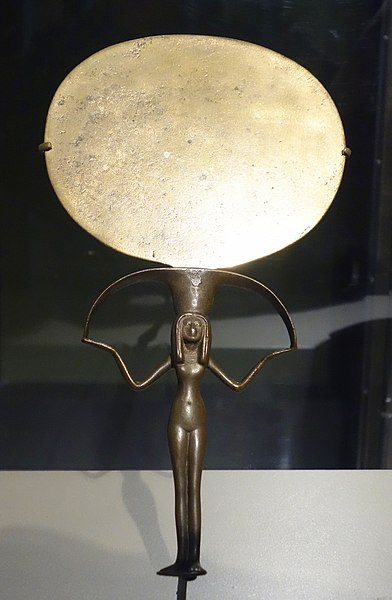
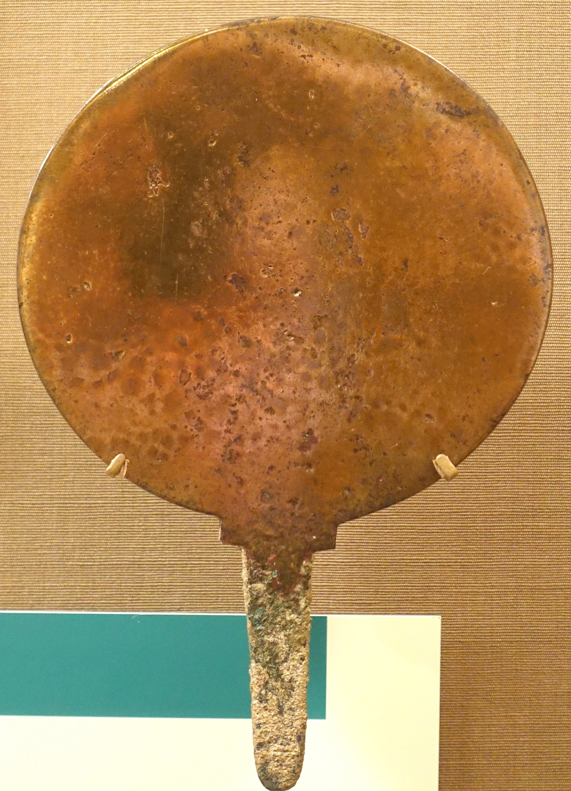

  

    &times;
    

  

<html><body></body></html>

<input id="download" title="Download/print the document" type="image" onclick="print_document()" src="../../images/icons/download3.png" alt="download" />

# גִּלָּיוֹן <i>gillāyōn</i> – mirror, stone tablet (?)

Semantic Fields:
[Utensils](../semantic_fields/utensils.md)&nbsp;&nbsp;&nbsp; Author(s):
[Archibald L.H.M. van Wieringen](../contributors/archibald_l.h.m._van_wieringen.md)<a href="#footnote" data-toggle="modal" onclick="show_modal('contributors_footnote')"> *</a> 
First published: 2025-01-19 Citation: Archibald L.H.M. van Wieringen, גִּלָּיוֹן <i>gillāyōn</i> – mirror, stone tablet (?),                      &nbsp;&nbsp;&nbsp;&nbsp;&nbsp;&nbsp;&nbsp;&nbsp;&nbsp;&nbsp;&nbsp;&nbsp;&nbsp;&nbsp;                    Semantics of Ancient Hebrew Database (sahd-online.com), 2025
(WORK IN PROGRESS)

## Introduction

Grammatical type: n.m.  
Occurrences:   2x HB (0/2/0); 0x Sir; 0x Qum; 0x Inscr.  (Total: 2).

* Nebiim: Isa 3:23; 8:1.

## 1. Root and Comparative Material

## 2. Formal Characteristics

## 3. Syntagmatics

In Isa 3:23, ִגִּלְיֹנִים is part of an enumeration in the verses 18-23 that functions as object of the verbal form יָסִיר in 3:18. In Isa 8:1, ִגִּלָּיוֹן is modified by the adjective 
גָּדוֹל and the noun
is the object of the imperative קַח.
The suffix 3 sg. masc. in עָלָיו refers back to ִגִּלָּיוֹן and indicates that something must be written on it (כתב).  

## 4. Ancient Versions

<b>a.</i> Septuagint (LXX) and other Greek versions</b>:<a href="#footnote" data-toggle="modal" onclick="show_modal('fn:9')">9</a> 

* διαφανῆ (from διαφανής) λακωνικὰ, ‘translucent Laconian dresses’:<a href="#footnote" data-toggle="modal" onclick="show_modal('fn:10')">10</a>
Isa 3:23<small>LXX</small>? (see A.1);
* διφθέρωμα, ‘hide’:<a href="#footnote" data-toggle="modal" onclick="show_modal('fn:11')">11</a> Isa 8:1<small>θʹ</small>;
* κεφαλίς, ‘little head’ (dim. of κεφαλή), here probably ‘scroll’:<a href="#footnote" data-toggle="modal" onclick="show_modal('fn:12')">12</a>
Isa 8:1<small>αʹ</small>;
* τεῦχος, ‘implement’, here probably ‘roll of writing material’:<a href="#footnote" data-toggle="modal" onclick="show_modal('fn:13')">13</a>
Isa 8:1<small>σʹ</small>;
* τόμος, ‘roll’:<a href="#footnote" data-toggle="modal" onclick="show_modal('fn:14')">14</a> Isa 8:1<small>LXX</small>? (see A.2).

[^9]: For Isa 8:1 in αʹσʹθʹ, see Field II:445.
[^10]: LSJ, 417; <i>GELS</i>, 162.
[^11]: LSJ, 438. 
[^12]: LSJ, 945; <i>GELS</i>, 396.
[^13]: LSJ, 1784.
[^14]: LSJ, 1804, <i>GELS</i>, 683.

<b>b. Peshitta (Pesh)</b>:

* ܓܠܝܘܢܐ 
(<i>gellāyūnā</i>) (see A.3): Isa 8:1;
* ܢܚܬܐ 
(<i>naḥtā</i>), 
‘garment’,<a href="#footnote" data-toggle="modal" onclick="show_modal('fn:15')">15</a>
‘long outer garment reaching to the feet’:<a href="#footnote" data-toggle="modal" onclick="show_modal('fn:16')">16</a>
Isa 3:23.

[^15]: Costaz, <i>DSF</i>, 202; Sokoloff, <i>SLB</i>, 910.
[^16]: Payne Smith, <i>CSD</i>, 336.

<b>c.</i> Targumim  (Tg<small>J</small>)</b>:  

* לוּחַ רַב,
‘large tablet (or plank)’:<a href="#footnote" data-toggle="modal" onclick="show_modal('fn:17')">17</a> 
Isa 8:1;
* מַחְזִיתָא,
‘mirror’:<a href="#footnote" data-toggle="modal" onclick="show_modal('fn:18')">18</a> Isa 3:23.

[^17]: Jastrow, <i>DTT</i>, ???; <i>WTM</i> II, ???; Dalman, <i>ANHT</i>, ???; Sokoloff, <i>DJPA</i>, 279; <i>DJBA</i>, 619).
[^18]: Jastrow, <i>DTT</i>, 758 <b>[ook: show]</b>; <i>WTM</i> III, ???; Dalman, <i>ANHT</i>, ???.

<b>d. Vulgate (Vg)</b>:

* <i>liber</i>, ‘book’, ‘roll’:<a href="#footnote" data-toggle="modal" onclick="show_modal('fn:19')">19</a> 
Isa 8:1;
* <i>speculum</i>, ‘mirror’, ‘looking-glass’:<a href="#footnote" data-toggle="modal" onclick="show_modal('fn:20')">20</a>
Isa 3:23.

[^19]: Lewis \& Short, <i>LD</i>, 1057; <i>OLD</i>, 1024. 
[^20]: Lewis \& Short, <i>LD</i>, 1739; % usually made of polished metal <i>OLD</i>, 1802.} 

<b>A.1</b> Usually, τὰ διαφανῆ λακωνικὰ, ‘the translucent Laconian dresses’, in LXX Isa 3:22 is seen as the rendering of MT 3:23
הַגִּלְיֹנִים (e.g., Camilo dos Santos, <i>EHIH</i>, 36; Muraoka, <i>HIS</i>, 34). However, the LXX’s rendering of these verses is very confused and the equation is by no means certain (Van der Meer 2008).

<b>A.2</b> In Isa 8:1 the LXX paraphrases τόμον καινοῦ μεγάλου, ‘a scroll of a new large (book)’, but τόμον καινοῦ μεγάλου 
could be a corruption of τόμον καινὸν μεγάλον, ‘a new large scroll’. 
In 1 Esd 6:22 τόμος seems to be the rendering of Aram. מְגִלָּה, ‘scroll’, in Ezra 6:2
(see <a href="/words/mgillah/#4-ancient-versions">מְגִלָּה: 4. Ancient Versions</a>).
Probably all the Greek translators interpreted גִּלָּיוֹן as a derivative of גלל, ‘to roll’, just like מְגִלָּה: αʹ opts for κεφαλίς, here probably ‘scroll’, σʹ for τεῦχος, here apparently also ‘scroll’, while διφθέρωμα, ‘hide’, in θʹ is probably an attempt to explain that it was an unrolled parchment scroll.

<b>A.3</b> In Isa 3:23 Pesh guesses ܢܚ̈ܬܝܗܝܢ, ‘their long mantles’. In Isa 8:1 Pesh simply transcribes the Hebrew into Syriac: ܓܠܝܘܢܐ. The  Syriac dictionaries (Payne Smith, <i>CSD</i><small>3</small>, 71: ‘writing-tablet’; Costaz, <i>DSF</i>, 48: ‘roll (volume)’; SLB, 236: ‘scroll’) fill in the presumed meaning of the Hebrew word and for that reason are not really helpful.

<b>A.4</b> In Isa 3:23 Tg<small>J</small> has the rendering מחזיתא
(var. מַחְזִיאתָא), ‘mirrors’. The rendering לוּחַ רַב, ‘a large tablet (or plank)’, in Isa 8:1 is possibly due to harmonisation with Hab 2:2.

## 5. Lexical/Semantic Fields

##6. Exegesis

Mirror from Egypt, silver and copper alloy, ca. 1479-1390 <small>BCE</small>,
<a href="https://commons.wikimedia.org/wiki/File:Mirror_-_Egypt,_reportedly_from_Aswan,_New_Kingdom,_Dynasty_18,_c._1479-1390_BC,_silver_and_copper_alloy_-_Brooklyn_Museum_-_Brooklyn,_NY_-_DSC08678.JPG" target="_blank" rel="noopener noreferrer">wikimedia-commons</a>

 
Bronze mirror from Khorsabad, Assyria, 900-612 <small>BCE</small>, 
<a href="https://commons.wikimedia.org/wiki/File:Mirror,_Khorsabad,_Citadel,_residence_K,_room_66,_Neo-Assyrian_period,_900-612_BC,_bronze_-_Oriental_Institute_Museum,_University_of_Chicago_-_DSC07309.JPG" target="_blank" rel="noopener noreferrer">https://commons.wikimedia.org/</a>

## 7. Conclusion

<b>A.1</b> 
Already in some of the oldest translations 
(Tg<small>J</small>, Vg), גִּלָּיוֹן in Isa 3:23 is interpreted as ‘mirror’. This interpretation is defensible in view of the noun's derivation from the verb גלה/<i>gly</i>, which means ‘to uncover’ or ‘to reveal’ in several
Northwest Semitic languages; see <a href="#RCM">Root and Comparative Material</a>

<b>A.2</b> 
The common interpretation of גִּלָּיוֹן in Isa 8:1 as ‘tablet’ or ‘writing board’ rests on a precarious basis. Only one of the ancient versions supports it (Tg<small>J</small>). Furthermore, it is unclear why the usual designation of such an object (לוּחַ) would have been avoided here. For these reasons, this view should be considered a possible but less likely option.

<b>A.3</b>
A better solution is to accept the meaning ‘mirror’ also for גִּלָּיוֹן in Isa 8:1. Following this interpretation of Isa 8:1, the goal of Isaiah's writing on a mirror was apparently to warn passers-by who saw their reflection in it and to make them realise that they were the target of the inscription. 

## Bibliography

For the abbreviations see the 
<a href="/store/abbreviations/">List of Abbreviations</a>.

Anlen & Padiou 1989     
Léon Anlen, Roger Padiou, 
<i>Les miroirs de bronze anciens: Symbolisme et tradition</i>, Paris: Guy Trédaniel.
	

Ben Yehuda & Weinstein 1975     
Ehud Ben Yehuda, David Weinstein, 
<i>Pocket English-Hebrew, Hebrew-English Dictionary</i>, New York, NY: Washington Square Press, 197518 (19611).
	

Bird 1986 
Julian G. Bird, ‘An Inscribed Mirror in Athens’, 
<i>JEA</i> 72:187-89.
	

Cook 2008     
Edward M. Cook, 
<i>A Glossary of Targum Onkelos according to Alexander Sperber’s edition</i> (SAIS, 6), Leiden: Brill.
	

dbeth-Dayroyo 1986     
Simon Atto dbeth-Dayroyo, 
<i>Nederlands Suryoyo woordenboek</i>, Enschede: Atto.
	

De Moor 1964 
Johannes C. de Moor, 
‘Ugaritic <i>ṯkḥ</i> and South Arabian <i>mṯkḥ</i>’, 
<i>VT</i> 14:371-72.
	

Derriks 2001 
Claire Derriks, ‘Mirrors’,
in: Donald B. Redford (ed.), 
<i>The Oxford Encyclopedia of Ancient Egypt</i>, vol. 2, Oxford: Oxford University Press, 419-22.
	

Galling 1933 
Kurt Galling, ‘Ein Stück judäischen Bodenrechts in Jesaja 8’, 
<i>ZDPV</i> 56:209-18.
	

Galling 1971 
Kurt Galling, ‘Tafel, Buch und Blatt’, in:
Hans Goedicke (ed.),
<i>Near Eastern Studies in Honor of William Foxwell Albright</i>, Baltimore: John Hopkins Press, 207-23.
	

Herford 1903    
Robert Travers Herford, 
<i>Christianity in Talmud and Midrash</i>, London: Williams & Norgate (reprint 2010).
	

Hönig 1957     
Hans Wolfram Hönig, 
<i>Die Bekleidung des Hebräers: Eine biblisch-archäologische Untersuchung</i>, Zürich: Brunner Bodmer.
	

Hyatt 1943 
James Philip Hyatt, ‘The Writing of an Old Testament Book’, 
<i>BA</i> 6:71-80.
	

Krupnik & Silbermann 1927     
Baruch Krupnik, Abraham M. Silbermann, 
<i>A Dictionary of the Talmud, the Midrash and the Targum, Hebrew / English / German</i>, London: Shapiro, Vallentine & Co.
	

Kühne 1973     
Cord Kühne, 
<i>Die Chronologie der internationalen Korrespondenz von El-Amarna</i> (AOAT, 17), Neukirchen-Vluyn: Neukirchener.
	

Landmann 1988     
Salcia Landmann, 
<i>Jiddisch: Das Abenteuer einer Sprache</i>
(Ullstein Materialien, Ullstein Buch 35240), Frankfurt: Ullstein.
	

Leopold 1910     
Ernst Friedrich Leopold, 
<i>Lexicon Hebraicum et Chaldaicum in libros Veteris Testamenti ordine etymologico compositum in usum scholarum</i>, Lipsiae: Sumptibus succ. Ottonis Holtze.
	

Lowth 1815     
Robert Lowth, 
<i>Isaiah</i>, Boston, MA: Buckingham.
	

Munro 1969 
Peter Munro, 
‘Eine Gruppe spätägyptischer Bronzespiegel’, 
<i>ZÄS</i> 95:92-109 (Pl. II-IX).
	

Nemet-Nejat 1993 
Karen Rhea Nemet-Nejat, 
‘A Mirror Belonging to the Lady-of-Uruk’,
in: Mark E. Cohen <i>et al.</i> (eds), 
<i>The Tablet and the Scroll: Near Eastern Studies in Honor of William W. Hallo</i>,  Bethesda, MD: CDL, 163-69.
	

Norin 2006 
Stig Norin, ‘Was ist ein Gillajon?’, 
<i>VT</i> 56:363-69.
	

Pappi 2011 
Cinzia Pappi, ‘Spiegel (mirror)’, 
<i>RLA</i> 12:645-46.
	

Reckenberger 1749     
Johann Leonhard Reckenberger, 
<i>Liber radicum sive lexicon hebraicum: In quo formae vocabulorum codicis hebraei grammaticae</i>, Ienae: Impensis B. Io. Rudolphi Croekeri Vidvae.
	

Sivan 1997 
Daniel Sivan,
<i>A Grammar of the Ugaritic Language</i> (HdO, 1/28), Leiden: Brill.
	

Van der Meer 2008  
Michaël N. van der Meer, ‘Trendy Translations in the Septuagint of Isaiah: A Study of the Vocabulary of the Greek Isaiah 3, 18-23 
in the Light of Contemporary Sources’, in:
M. Karrer, W. Kraus (eds), <i>Die Septuaginta – Texte, Kontexte, Lebenswelten: 
Internationale Fachtagung veranstaltet von Septuaginta Deutsch (LXX.D), Wuppertal 20.-23. Juli 2006</i> (WUNT, 219), Tübingen: Mohr-Siebeck, 581-96.

	

Van Wieringen 2006     
Archibald L.H.M. van Wieringen, 
<i>The Reader-Oriented Unity of the Book Isaiah</i> (ACEBT.SS, 6), Vught: Skandalon.
	

Waschke 2007 
Ernst-Joachim Waschke, ‘Die Tafel des Propheten: Überlegungen zu Jes 8,1- 7’,
in: Rüdiger Lux, Ernst-Joachim Waschke (eds),
<i>Die unwiderstehliche Wahrheit: Studien zur alttestamentlichen Prophetie. Festschrift für Arndt Meinhold</i> (Arbeiten zur Bibel und ihrer Geschichte, 23),
Leipzig: Evangelische Verlagsanstalt, 115-128.
	

Williamson 2018     
Hugh G.M. Williamson, 
<i>A Critical and Exegetical Commentary on Isaiah 1-27</i>, vol. 2: <i>Isaiah 6-12</i> (ICC), 
London: T&T Clark. 
	

Winter 1983     
Urs Winter, 
<i>Frau und Göttin: Exegetische und ikonographische Studien zum weiblichen Gottesbild im alten Israel und in dessen Umwelt</i> (OBO, 53),
Freiburg (Schweiz): Universitätsverlag.
	

## Notes 

Many thanks are due to Paul Sanders (PThU) for his suggestions.

[^29]: https://picryl.com/media/scarab-f34154
[^30]: https://picryl.com/media/string-of-46-round-beads-in-graded-sizes-19ad36

Many thanks are due to Paul Sanders (PThU) for his suggestions.
