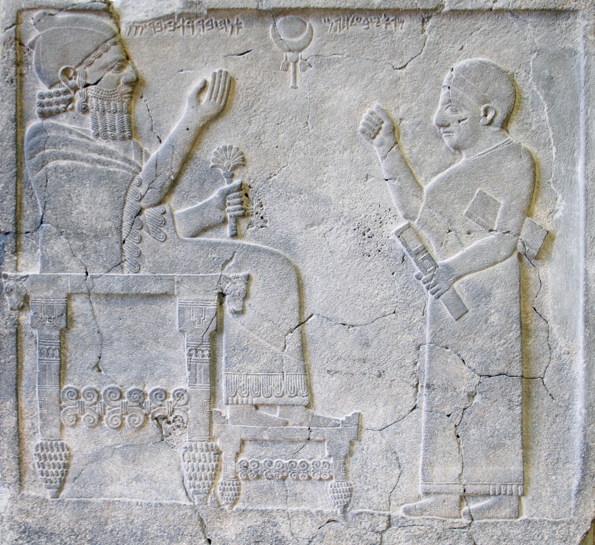

  

    &times;
    

  

<html><body></body></html>

<input id="download" title="Download/print the document" type="image" onclick="print_document()" src="../../images/icons/download3.png" alt="download" />

# כִּסֵּא <i>kissēʾ</i> – throne

Semantic Fields:
[Kingship](../semantic_fields/kingship.md)&nbsp;&nbsp;&nbsp; Author(s):
[Alison Salvesen](../contributors/alison_salvesen.md) 
First published: 2024-10-18 Citation: Alison Salvesen, כִּסֵּא <i>kissēʾ</i> – throne,                      &nbsp;&nbsp;&nbsp;&nbsp;&nbsp;&nbsp;&nbsp;&nbsp;&nbsp;&nbsp;&nbsp;&nbsp;&nbsp;&nbsp;                    Semantics of Ancient Hebrew Database (sahd-online.com), 2024

##Introduction
Grammatical Type: noun masc.

Occurrences: 135x HB (4/85/46); 5x Sir; 25x Qum; 0x inscr. (Total:
165).

* Torah: Gen 41:40; Exod 11:5; 12:29; Deut 17:18; 
* Nebiim: Judg 3:20; 1 Sam 1:9; 2:8; 4:13, 18; 2 Sam 3:10; 7:13, 16; 14:9; 1 Kgs 1:13, 17, 20, 24, 27, 30, 35, 37 (2x), 46, 47 (2x), 48; 2:4, 12, 19 (2x), 24, 33, 45; 3:6; 5:19; 7:7; 8:20, 25; 9:5 (2x); 10:9, 18, 19 (2x); 16:11; 22:10, 19; 2 Kgs 4:10; 10:3, 30; 11:19; 13:13; 15:12; 25:28 (2x); Isa 6:1; 9:6; 14:9, 13; 16:5; 22:23; 47:1; 66:1; Jer 1:15; 3:17; 13:13; 14:21; 17:12, 25; 22:2, 4, 30; 29:16; 33:17, 21; 36:30; 43:10; 49:38; 52:32 (2x); Ezek 1:26 (2x); 10:1; 26:16; 43:7; Jon 3:6; Hag 2:22; Zech 6:13 (2x); 
* Ketubim: Pss 9:5, 8; 11:4; 45:7; 47:9; 89:5, 15, 30, 37, 45; 93:2; 94:20; 97:2; 103:19; 122:5 (2x); 132:11, 12; Job 26:9; 36:7; Prov 9:14; 16:12; 20:8, 28; 25:5; 29:14; Lam 5:19; Est 1:2; 3:1; 5:1; Neh 3:7; 1 Chron 17:12, 14; 22:10; 28:5; 29:23; 2 Chron 6:10, 16; 7:18; 9:8, 17, 18 (2x); 18:9, 18; 23:20;
* Sira: Sir 10:14<small>A</small>; 11:5a<small>A,B</small>; 11:5b<small>B</small>; 40:3<small>B</small>; 47:11<small>B</small>;
* Qumran:
3Q15 (Copper Scroll) XI:5 (כסה);
4Q161 (4QpIsa<small>a</small>) fr8-10:19 (כ]סא);
4Q174 (4QFlor) fr1-2.i:10;
4Q215a fr1.ii:10;
4Q252 (4QCommGen<small>a</small>) 5:2;
4Q282c fr1:5;
4Q405 (4QShSh) fr20ii-22:2, 8; fr23i:3;
4Q418 fr86:4;
4Q419 fr1:9;
4Q434 fr2:7;
4Q491 (4QM<small>a</small>) fr11.i:12;
4Q504 (4QDibHam<small>a</small>) fr1-2Riv:7;
4Q511 (4QShirb) fr2.i:10;
4Q521 (4QMessApoc) fr2.ii+4:7;
4Q525 fr14.ii:2;
11Q5 (11QPsa) 26:11;
11Q17 (11QShSh) 5:8; 7:2, 11; 10:7; 
11Q19 (11QTemple<small>a</small>) 56:20; 59:14; 59:17 (= 4Q524 /  4QTemple<small>b</small> fr6-13:1).

##Art and Archaeology

<b>A.1</b> 
Thrones are very frequently represented in the Ancient Near East, especially in Egyptian and Assyrian art, and these represent the two main styles. For thrones of approximately biblical date and provenance, see Broshi (1962:219-20): an Egyptian-style round-backed throne flanked by sphinxes, found in Israel, and the similar one on the Ahiram sarcophagus (see below and <i>ANEP</i> 458). Metzger (1985:II, figure 271A) provides a drawing of a throne with lion figures on the arm rests, belonging to Rameses III. There is an Assyrian-style throne with cedar cone feet, scroll work on stretcher, and straight backrest on the Bar-Rakib stele (<i>ANEP</i> 460). See also Keel (1977, figures 111, 113, 114, 115).

Ahiram sarcophagus, Byblos, 10th cent. BCE?   
<a href="https://en.m.wikipedia.org/wiki/File:Ahiram.jpg" target="_blank" rel="noopener noreferrer">https://en.m.wikipedia.org/wiki/</a>

    

King Bar-Rakib with his secretary, Zincirli, ca. 730 BCE   
<a href="https://commons.wikimedia.org/wiki/File:Relief_of_king_Barrakib_from_Zincirli_-_Pergamonmuseum_-_Berlin_-_Germany_2017.jpg" target="_blank" rel="noopener noreferrer">https://commons.wikimedia.org/wiki/</a>

See also the following websites:    
<a href="https://www.imj.org.il/en/collections/432048-0" target="_blank" rel="noopener noreferrer">https://www.imj.org.il/</a> (Megiddo 1300-1130 BCE)    
<a href="https://mainzerbeobachter.com/2017/01/26/ugaritische-mythologie/" target="_blank" rel="noopener noreferrer">https://mainzerbeobachter.com/</a> (Ugarit 14th/13th cent. BCE)

 

##Conclusion

(For good general coverage of the concept of throne, see Brettler 1989:81-85).
    
<b>A.1</b> כִּסֵּא is probably derived ultimately from Sum. <i>gu-za</i>, via Akk. <i>kussû</i>.

<b>A.2</b> כִּסֵּא is intrinsic to the notion of kingship to a much greater degree than 
עֲטָרָה,
נֵזֶר,
כֶּתֶר or
אֶצְעָדָה.
‘Throne’ stands for ‘regal power’ in Gen 41:40. ‘To sit on the throne’ means ‘to be king’, and is synonymous with 
מלך and 
משׁל. 
It is an expression used of both human kings and God, and is absolutely central to the concept of kingship both symbolically and literally, with a significance similar to that of ‘crown’ and ‘coronation’ in English.
 
<b>A.3</b> God’s throne is located in the sanctuary, and at a later period in the heavens. However, although he is often described as sitting upon the cherubim, the term כִּסֵּא does not appear in this exact context; cf. Ps 61:8, Isa 10:13 of kings where כִּסֵּא is not mentioned.
 
<b>A.4</b> Only Solomon’s כִּסֵּא is described in detail, and we can only speculate about the form of other thrones and seats, though there are plenty of Ancient Near Eastern representations of ‘Sitzmöbel’.
 
<b>A.5</b> כִּסֵּא in the sense of an ordinary seat exists, but does not often occur. It appears to be understood in 1 Kgs 13:20, Est 6:10, Judg 4:5, but ישׁב, in the sense of sitting could mean that the subject sat on the floor or ground (as implied in Judg 13:9, and stated in Jer 25:5; 35:15; possibly at 2 Kgs 6:32) or on a bed. When a chair is mentioned it may be a significant detail, indicating the honour due to and possibly the function and age of the sitter, as with Eli and Bathsheba. 

<b>For this entry, see further Alison Salvesen, 
‘כִּסֵּא’, in:
T. Muraoka (ed.), <i>Semantics of Ancient Hebrew</i> 
(AbrNSup, 6), Leuven: Peeters, 1998, 44-65, 146-47 (<a href="/store/printed_publications/">Printed publications</a>).</b>

## Bibliography

Brettler 1989  
Marc Zvi Brettler, <i>God is King: Understanding an Israelite Metaphor</i> (JSOTSup, 76), Sheffield: JSOT.

Broshi 1962  
Magen Broshi, ‘כִּסֵּה
,כִּסֵּא’,
in E.L. Sukenik et al. (eds.), <i>Encyclopaedia Biblica</i>
(אנציקלפדיה מקראית), IV:216-20.

Keel 1977  
Othmar Keel, <i> Jahwe-Visionen und Siegelkunst: Eine neue Deutung der Majestätsschilderung in Jes 6, Ez 1 and 10 und Sach 4</i> (SBS 84/85), Stuttgart: Katholisches Bibelwerk.

Metzger 1985  
Martin Metzger, <i>Köningsthron unf Gottesthron: Thronformen und Throndarstellungen in Ägypten und im Vorderen Orient im dritten und zweiten Jahrtausend vor Christus und deren Bedeutung für das Verständnis von Aussagen über den Thron im Alten Testament</i> 
(AOAT, 15), 2 vols., Butzon & Berger: Kevelaer; Neukirchen-Vluyn: Neukirchener.

