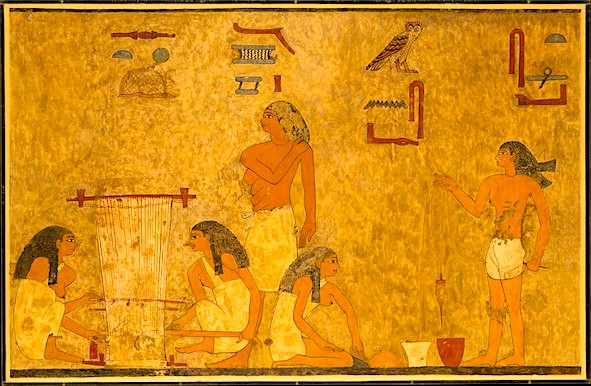

  

    &times;
    

  

<html><body></body></html>

<input id="download" title="Download/print the document" type="image" onclick="print_document()" src="../../images/icons/download3.png" alt="download" />

# כְּרוּב <i></i> – cherub

Semantic Fields:
[Utensils Or Other](../semantic_fields/UTENSILS OR OTHER.md)&nbsp;&nbsp;&nbsp; Author(s):
[Alice Wood](../contributors/alice_wood.md) 
First published: 2021-11-08 Last update: 2024-12-21  Citation: Alice Wood, כְּרוּב <i></i> – cherub,                      &nbsp;&nbsp;&nbsp;&nbsp;&nbsp;&nbsp;&nbsp;&nbsp;&nbsp;&nbsp;&nbsp;&nbsp;&nbsp;&nbsp;                    Semantics of Ancient Hebrew Database (sahd-online.com), 2021 (update: 2024)

## Introduction

Grammatical type:   
Occurrences:   91x HB (??/??/??); ??x Sir; ??x Qum; ??x Inscr.  (Total: ??)

* Torah: Gen 3:24; Exod 25:18, 19, 20, 22; 26:1, 31; 36:8, 35; 37:7, 8, 9; Num 7:89; 

* Nebiim: 1 Sam 4:4; 2 Sam 6:2; 22:11; 1 Kgs 6:23, 24, 25, 26, 27, 28, 29, 32, 35; 7:29, 36; 8:6, 7; 2 Kgs 19:15; Isa 37:16; Ezek 9:3; 10:1, 2, 3, 4, 5, 6, 7, 8, 9, 14, 15, 16, 18, 19, 20; 11:22; 28:14, 16; 41:18, 20, 25; 

* Ketubim: 1 Chron 13:6; 28:18; 2 Chron 3:7, 10, 11, 12, 13, 14; 5:7, 8; Pss 18:11; 80:2; 99:1.

* Qumran:

<b>A.1</b> 

## 1. Root and Comparative Material

<b>A.1</b>  

## 2. Formal Characteristics

<b>A.1</b>  

## 3. Syntagmatics

<b>A.1</b> 

## 4. Ancient Versions

<b>a. Septuagint (LXX) and other Greek versions (αʹ, σʹ, θʹ)</b>:  

* 

<b>b.  Peshitta (Pesh):</b>  

* 

<b>c. Targum (Tg):</b>  

* 

<b>d.  Vulgate (Vg):</b>  

* 

<b>A.1</b>

## 5. Lexical/Semantic Fields

<b>A.1</b> 

## 6. Exegesis

### 6.1 Textual Evidence

<b>A.1</b>

### 6.2 Pictorial Material

<b>A.1</b> 
 

&nbsp;&nbsp;&nbsp;&nbsp;&nbsp;&nbsp;&nbsp;&nbsp;

&nbsp;&nbsp;&nbsp;&nbsp;&nbsp;&nbsp;&nbsp;&nbsp;<small>Figure&nbsp;1:&nbsp;&nbsp;
Spinning and weaving scene from the tomb of Khnumhotep II.</small>   
&nbsp;&nbsp;&nbsp;&nbsp;&nbsp;&nbsp;&nbsp;&nbsp;<small>Beni Hasan, Middle Egypt, ca. 1900 <small>BCE</small> 
(picture: Rogers Fund, 1933;
<a href="https://www.metmuseum.org/art/collection/search/548575" target="_blank" rel="noopener noreferrer">Metropolitan Museum</a>)
<!-- Alamy rechten geldig tot 15 aug 2026
-->

</small>

<b>A.2</b> 

### 6.3 Archaeology

<b>A.1</b> 

## 7. Conclusion

<b>A.1</b>

## Bibliography

For the abbreviations see the 
<a href="/store/abbreviations/">List of Abbreviations</a>.

Andersson Strand & Nosch 2015 
Eva Andersson Strand, Marie-Louise Nosch (eds), <i>Tools, Textiles and Contexts: Investigating Textile Production in the Aegean and Eastern
Mediterranean Bronze Age</i>  
(Ancient Textiles Series, 21), Oxford: Oxbow.
	

	

Arnaud 1987 
Daniel Arnaud, <i>Recherches au pays d’Aštata, Emar VI/4:
Textes de la bibliothèque: transcriptions et traductions</i>,
Paris: Éditions Recherche sur les Civilisations.
	

	

Barber 1991     
Elizabeth J.W. Barber, 
<i>Prehistoric Textiles: The Development of Cloth in 
the Neolithic and Bronze Ages, with Special 
Reference to the Aegean</i>, Princeton: Princeton University Press.
	

	

Bergmann 2007 
Claudia Bergmann, ‘We Have Seen the Enemy, and He is Only a “She”:
The Portrayal of Warriors as Women’, 
<i>CBQ</i> 69:651-72.
	

	

	

## Notes

Many thanks are due to Johannes C. de Moor (†2023; professor emeritus Protestant Theological University, Kampen) and Benjamin Bogerd (Protestant Theological University, Utrecht) for their valuable suggestions.

