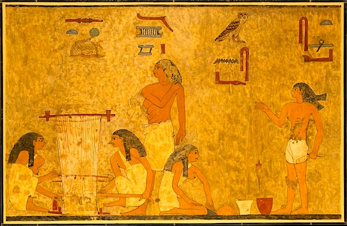

  

    &times;
    

  

<html><body></body></html>

<input id="download" title="Download/print the document" type="image" onclick="print_document()" src="../../images/icons/download3.png" alt="download" />

# פֶּרֶס <i>pères</i> – bird of prey

Semantic Fields:
[Birds](../semantic_fields/birds.md)&nbsp;&nbsp;&nbsp; Author(s):
[Cees Stavleu](../contributors/cees_stavleu.md)<a href="#footnote" data-toggle="modal" onclick="show_modal('contributors_footnote')"> *</a> 
First published: 2026-03-?? Citation: Cees Stavleu, פֶּרֶס <i>pères</i> – bird of prey,                      &nbsp;&nbsp;&nbsp;&nbsp;&nbsp;&nbsp;&nbsp;&nbsp;&nbsp;&nbsp;&nbsp;&nbsp;&nbsp;&nbsp;                    Semantics of Ancient Hebrew Database (sahd-online.com), 2026
(WORK IN PROGRESS)

##Introduction
Grammatical Type: noun masc.

Occurrences: 2x HB (2/0/0); 0x Sir; 0x Qum; 0x inscr. (Total:
2).

* Torah: Lev 11:13; Deut 14:12.

##1. Root and Comparative Material

<b>A.1</b>  

## 2. Formal Characteristics

<b>A.1</b>  

## 3. Syntagmatics

<b>A.1</b> 

## 4. Ancient Versions

<b>a. Septuagint (LXX) and other Greek versions (αʹ, σʹ, θʹ)</b>:  

* 

<b>b.  Peshitta (Pesh):</b>  

* 

<b>c. Targum (Tg):</b>  

* 

<b>d.  Vulgate (Vg):</b>  

* 

<b>A.1</b>

## 5. Lexical/Semantic Fields

<b>A.1</b> 

## 6. Exegesis

### 6.1 Textual Evidence

<b>A.1</b>

### 6.2 Pictorial Material

<b>A.1</b> 
 

&nbsp;&nbsp;&nbsp;&nbsp;&nbsp;&nbsp;&nbsp;&nbsp;

&nbsp;&nbsp;&nbsp;&nbsp;&nbsp;&nbsp;&nbsp;&nbsp;<small>Figure&nbsp;1:&nbsp;&nbsp;
Birds
<!-- Alamy rechten geldig tot 15 aug 2026
-->

</small>

<b>A.2</b> 

### 6.3 Archaeology

<b>A.1</b> 

## 7. Conclusion

<b>A.1</b>

## Bibliography

Thanks are due to Michaël N. van der Meer for his valuable suggestions.
