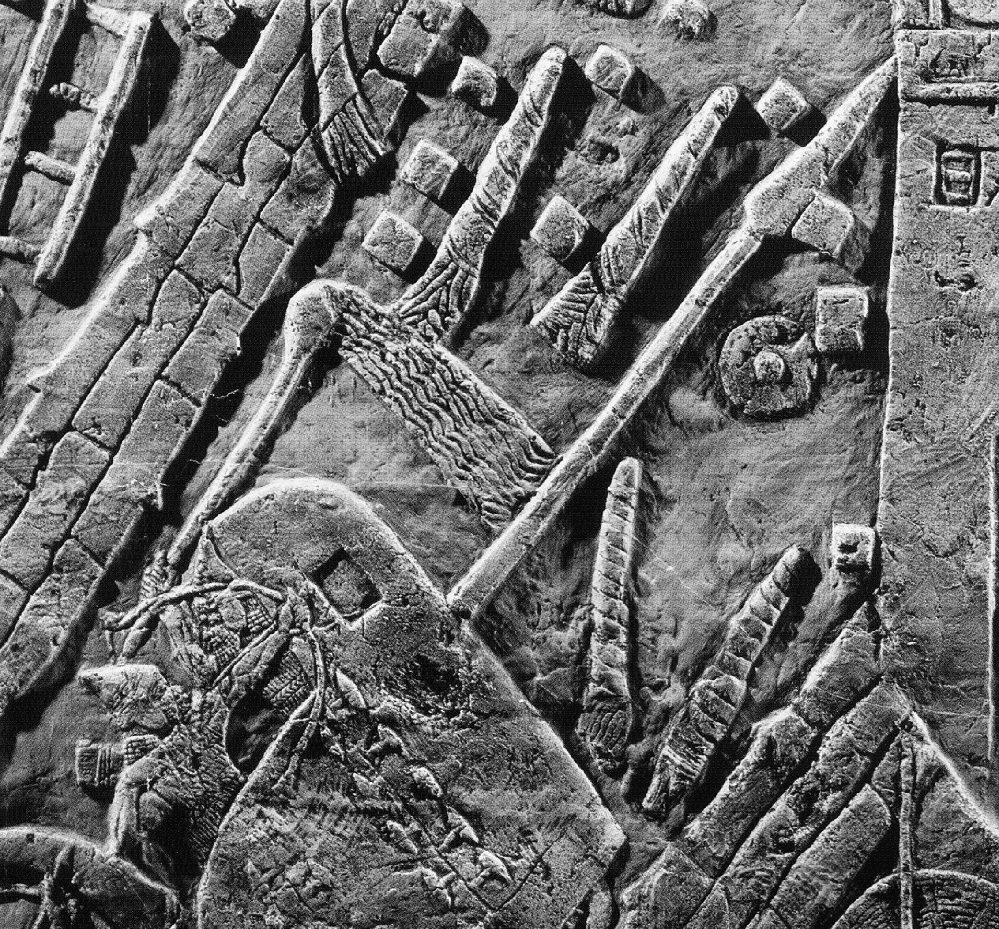

  

    &times;
    

  

<html><body></body></html>

<input id="download" title="Download/print the document" type="image" onclick="print_document()" src="../../images/icons/download3.png" alt="download" />
# span dir="rtl">זֵק / זִיק <i>zīq</i> – fiery missile

Semantic Fields:
[Utensils](../semantic_fields/utensils.md)&nbsp;&nbsp;&nbsp; Author(s):
[Marjo Korpel](../contributors/marjo_korpel.md) 
First published: 2011-10-28 Last update: 2025-10-10  Citation: Marjo Korpel, span dir="rtl">זֵק / זִיק <i>zīq</i> – fiery missile,                      &nbsp;&nbsp;&nbsp;&nbsp;&nbsp;&nbsp;&nbsp;&nbsp;&nbsp;&nbsp;&nbsp;&nbsp;&nbsp;&nbsp;                    Semantics of Ancient Hebrew Database (sahd-online.com), 2011 (update: 2025)
(WORK IN PROGRESS)

## Introduction

Grammatical type: noun masc. (זֵק) or fem. (זִיק) 

Occurrences: 3x HB (0/2/1); 0x Sir; 0x Qum; 0x Inscr. (Total: 3)

* Nebiim: Isa 50:11 (2x)
* Ketubim: Prov 26:18

<b>A.1</b> 
First of all there is the problem of establishing the correct lemma for this word. In MT it occurs only twice as זִיקֹות in Isa 50:11. So it is actually a <i>hapax legomenon</i> in the Hebrew Bible.<a href="#footnote" data-toggle="modal" onclick="show_modal('fn:1')">1</a> The most natural choice is to regard it as a plural of \*זִיקָה.<a href="#footnote" data-toggle="modal" onclick="show_modal('fn:2')">2</a> However, since many Hebrew nouns exist both in a masculine and a feminine form<a href="#footnote" data-toggle="modal" onclick="show_modal('fn:3')">3</a> and feminine plurals are fairly common with masculine singulars<a href="#footnote" data-toggle="modal" onclick="show_modal('fn:4')">4</a>, a singular \*זִיק is an acceptable alternative.<a href="#footnote" data-toggle="modal" onclick="show_modal('fn:5')">5</a> Other dictionaries refuse to choose between these two options.<a href="#footnote" data-toggle="modal" onclick="show_modal('fn:6')">6</a> The circumstance that the masculine plural form זיקים is well-attested in Postbiblical Hebrew (see <a href="#RCM">1. Root and Comparative Material</a>) argues in favour of those who opt for the masculine form of the lemma.
The next question is whether the lemma also occurs in the form of זֵק in Prov 26:18. Apparently this has the same meaning as זִיק in Isa 50:11. Some scholars regard זִיקֹות as a secondary form which developed from an original זִקֹּּות, plural of זֵק which in that case would be the more original form of the lemma.<a href="#footnote" data-toggle="modal" onclick="show_modal('fn:7')">7</a> Whether this זֵק in turn is same word as the זֵק which is thought to mean ‘fetter, chain’ in Isa 45:14; Nah 3:10; Ps 149:8; Job 36:8 depends on the etymology and basic meaning of all three words concerned (see <a href="#RCM">1. Root and Comparative Material</a>). To avoid confusion the statistics above are based only on the three passages where the word is thought to mean ‘flaming missile’ or ‘torch’.

## 1. Root and Comparative Material

<b>A.1</b>
<i>Root.</i>
Klein does not indicate which root he prefers for זִיק I, זִיקָה and זֵק II, but he derives זֵק I ‘chain, fetter’ from the √נזק.<a href="#footnote" data-toggle="modal" onclick="show_modal('fn:8')">8</a> Gesenius & Roediger and König, assume that both words have been derived from √\*נזק. This is a less exotic proposal than it may seem at first sight. It is indeed noteworthy that both זִקִּּים  in Prov 26:18 and אֲזִקִּּים in Jer 40:1, 4 have a double ק. זֵק is easily explained as a normal development: \*<i>zinq</i> &gt; \*<i>ziqq</i> &gt; זֵק. זִיק has long been recognised as a case of metathesis of quantity[^10]: the ‘long’ consonant <i>qq</i> with short preceding vowel <i>i</i> in \*<i>ziqq</i> was exchanged for a long vowel <i>ī</i> with a ‘short’ (single) <i>q</i>: <i>*zīq</i>.<a href="#footnote" data-toggle="modal" onclick="show_modal('fn:11')">11</a> Because the basic meaning of the root <i>znq</i> seems to be ‘to wrap tightly’ (see the cognates below) it seems indeed possible that זֵק II ‘chain, fetter’ is nothing but a semantic differentiation of זֵק ‘torch’. The Pi. of זנק which is thought to mean ‘to leap forth’ in Deut 33:22 has nothing to do with our lemma. As seen by Guillaume, this verb is a metathesis of √<i>nzq</i>, ‘to storm ahead, rush forward’.<a href="#footnote" data-toggle="modal" onclick="show_modal('fn:12')">12</a>

<b>A.2</b>
<i>Akkadian.</i>
The noun is related to Neo-Asyrian <i>zīqtu</i>, ‘torch’, and <i>zīqu</i> II, ‘torch’.<a href="#footnote" data-toggle="modal" onclick="show_modal('fn:13')">13</a> 

<b>A.3</b>
<i>Postbiblical Hebrew.</i> 
See below, <a href="#Rab">A.7 Rabbinical Literature</a>.<a href="#footnote" data-toggle="modal" onclick="show_modal('fn:14')">14</a>

<b>A.4</b>
<i>Jewish Aramaic.</i>
In the Aramaic Henoch זיקא ‘meteor’ occurs several times.<a href="#footnote" data-toggle="modal" onclick="show_modal('fn:15')">15</a> In other apocalyptic works these ‘meteors’ are mentioned too.<a href="#footnote" data-toggle="modal" onclick="show_modal('fn:16')">16</a> For Rabbinic Aramaic see Jastrow: זֵיק, ‘sparks, burning arrows; meteors, shooting stars [or comet];<a href="#footnote" data-toggle="modal" onclick="show_modal('fn:17')">17</a> זִיקָא I, ‘1. shooting star, or comet; 2. blast, wind, draught (spirit)’.<a href="#footnote" data-toggle="modal" onclick="show_modal('fn:18')">18</a> The Job Targum from Qumran renders the Hebrew לַפִּּידִים ‘torches’ of Job 41:11 as זיקין.<a href="#footnote" data-toggle="modal" onclick="show_modal('fn:19')">19</a> With regard to rabbinic Aramaic, cf.זיקא 2, according to Sokoloff: ‘flash of fire, comet, demon’; זיקוק ‘spark’.<a href="#footnote" data-toggle="modal" onclick="show_modal('fn:20')">20</a>

<b>A.5</b>
<i>Syriac.</i>
<i>zīqā</i> and <i>zīqtā</i>, ‘a. violent rain with wind; rain falling in great drops; boisterous wind; b. a shooting star, metaph. radiancy’.<a href="#footnote" data-toggle="modal" onclick="show_modal('fn:21')">21</a> <i>znaq</i>, ‘to shoot an arrow, to hurl, sling’.<a href="#footnote" data-toggle="modal" onclick="show_modal('fn:22')">22</a>

<b>A.6</b>
<i>Classical Arabic.</i>
<i>zanaqa</i> ‘to tighten, constrict’.<a href="#footnote" data-toggle="modal" onclick="show_modal('fn:23')">23</a> <i>zanaq</i> ‘thin part of an arrow-head’.<a href="#footnote" data-toggle="modal" onclick="show_modal('fn:24')">24</a> See <a href="#Roo">A.1 Root</a>.

<b>A.7</b>
<i>Rabbinical Literature.</i>
In Sir 43:13 (17) - according to manuscripts M and B - God’s משׁפט זיקות ‘fiery missiles of judgment’ light up in the sky, accompanying his hail (ברד). Both the Hebrew and Aramaic texts of Qumran mention the זיקים/זיקיא. Here too the expression משׁפט זקי ‘fiery missiles of judgment’ occurs.<a href="#footnote" data-toggle="modal" onclick="show_modal('fn:25')">25</a> According to 1QM 6.2-3 ‘fiery missiles of blood’ (דם זיקי) shall be written on darts (שׁלט).  CD-A 5:13 clearly alludes to Isa 50:11, when it describes followers of Belial as זיקות ומבערי אשׁ קדחי,  ‘kindlers of fire and igniters of fiery missiles’. 1QHa 9:12 pairs וברקים זקים ‘fiery missiles and lightnings’. Apparently these missiles have acquired a celestial, apocalyptic status.

## 2. Formal Characteristics

<b>A.1</b>
[Discussion will be added later.]

## 3. Syntagmatics

<b>A.1</b> 
[Discussion will be added later.]

## 4. Ancient Versions

<b>a. Septuagint (LXX) and other Greek versions (αʹ, σʹ, θʹ)</b>:  

* φλὸξ, ‘flame’, ‘gleaming object’:<a href="#footnote" data-toggle="modal" onclick="show_modal('fn:26')">26</a> Isa 50:11. Interesting is the fact that LXX translates ‘to gird the torches’ as ‘to strengthen/to feed the torches’ (κατισχύω φλόγα), which also might refer to the binding of pine splinters with cloth or wool into a bundle, and made inflammable with oil, resin or bitumen. 
* ῥόπαλον, ‘<i>cudgel</i>, instrument for discipline and pubishment’:<a href="#footnote" data-toggle="modal" onclick="show_modal('fn:27')">27</a> Prov 26:18. It is paralleled by sword (μάχαιρα) and arrow (τόξευμα).  

<b>b.  Peshitta (Pesh):</b>  

* Isa 50:11 <i>šalhebītā</i> ‘flame, blaze’<a href="#footnote" data-toggle="modal" onclick="show_modal('fn:28')">28</a>; the paraphrasis of Pesh in Prov 26:18 does not allow a definite identification of its rendering of זִקִּּים: ‘Like the behaviour of boys throwing things (or: words), so are the sharp arrows of death’.

<b>c. Targum (Tg):</b>  

* Isa 50:11  חרב מתקפי ‘(all you) who grasp a sword’. 

<b>d.  Vulgate (Vg):</b>  

* Isa 50:11 <i>flamma</i>, ‘flame’; Prov 26:18 <i>lancea</i>, ‘lance’.

## 5. Lexical/Semantic Fields

<b>A.1</b> 
[Discussion will be added later.]

## 6. Exegesis

### 6.1 Textual Evidence

<b>A.1</b>
In Isa 50:11 people  kindling a fire (קדח Qal אֵשׁ) are addressed. In the parallel colon they are called people ‘girding’ (אזר Pi.) זִיקות. In the next verse-line they are invited to walk into the blaze of their own fire אֵשׁ אוּר | into the זִיקֹות that they themselves burn (בער Pi.). The use of the verb אזר Pi. often caused translation problems. Duhm and others solved this by emendation (זִיקֹות מְאִירֵי ‘those who light torches’). Nowadays most commentators suggest אזר Pi. has to be taken metaphorically, meaning that the people addressed surround themselves with torches, thus protecting themselves by their light. As a consequence, renderings like ‘walk by the light of your fire’ (RSV) came into existence. However, it is questionable whether אוּר can mean ‘light’ (cf. Isa 2:5; Ps 56:14: בְּאֹור הָלַך!). Moreover, the verb אזר Pi. occurs 6 times in the Hebrew Bible and in all other 5 cases it is a direct object that is girded. The verb is never used reflexively. Thus, it would be more appropriate to surmise that the people ‘gird’ or ‘wrap’ the torches.<a href="#footnote" data-toggle="modal" onclick="show_modal('fn:29')">29</a> Because it stands in parallelism with ‘to kindle a fire’, it is more likely that the expression describes the preparation of torches by wrapping  wooden sticks in wool or pieces of cloth, and drenching them in oil, wax or bitumen (see <a href="#Arch">6.4 Archeological Remarks</a>). This preparatory work nicely matches the kindling of fire.

<b>A.2</b>
Isa 50:11 mockingly exhorts those who hope to illuminate the darkness surrounding them by man-made light instead of trusting in the Lord (cf. 51:10). They kindle their torches - possibly to participate in Babylonian nightly processions<a href="#footnote" data-toggle="modal" onclick="show_modal('fn:30')">30</a> - but these torches will become a pyre on which they will burn (one should not emend אוּר into אֹור<a href="#footnote" data-toggle="modal" onclick="show_modal('fn:31')">31</a>). They seem to forget that it is God himself who commands both the darkness of judgment (Isa 50:3; 51:6; cf. 47:5, 14) and the light of salvation (51:4, cf. 42:16; 45:7; 49:6). 

<b>A.3</b>
In Prov 26:18 the plural זִקִּּים is used, which presupposes a singular זֵק  (also known from Jewish Aramaic, see <a href="#RCM">1. Root and Comparative Material</a>). It occurs in the expression וָמָוֶת חִץִים זִקִּּים הַיֹּרֶה, literally ‘one who continuously shoots זִקִּּים, arrows and death’. He who deceives his neighbour is like a madman wildly shooting off זִקִּּים, arrows (חִץִים) and death (מָוֶת). Apparently the writer saw the זִקִּּים as potentially deadly weapons which one should not handle carelessly. If it is admissable to view the sequal, Prov 26:19-20, as an elaboration of the imagery, the missiles are fiery here too. Both biblical texts suggest a kind of torch or fiery missile.

### 6.2 Pictorial Material

<b>A.1</b> 
On the well-known relief depicting Sennacherib’s siege of Lachish an Assyrian soldier who is almost entirely hidden behind the archer in the foreground is igniting tightly wrapped missiles with a torch (<a href=http://otw-site.eu/wp-content/uploads/2017/07/lpyd.pdf target="_blank">→ לַפִּּיד</a>). 

<b>A.2</b> 
Unfortunately it is unclear how the Assyrians hurled these projectiles into the city, but the association with arrows  and fire matches the biblical data.

<b>A.3</b> 
On the Baal-stele from Ugarit the lightning spear the god holds in his left hand is a kind of burning arrow.<a href="#footnote" data-toggle="modal" onclick="show_modal('fn:32')">32</a> Probably, the idea was that lightning was created by the god Baʿal throwing his flaming arrows from heaven. 

### 6.3 Archaeological Remarks 

<b>A.1</b> 
The material used to make זִיקֹות cannot have been very different from that of torches. According to Salonen, torches were made of wood and wool, seldom bronze was used for the haft.<a href="#footnote" data-toggle="modal" onclick="show_modal('fn:33')">33</a> The ideogram for the word ‘torch’ is izi ‘burning torch, fire’. The wick or burner was made of wool or a piece of woolen cloth. In Sumerian several words were used for the torch, mostly constructed with gi ‘reed-stem’ and izi ‘fire’. The Neo-Assyrian word <i>ziqtu</i> (see <a href="#RCM">1. Root and Comparative Material</a>) is marked as combustible material by the determinative <i>giš</i> ‘wood’.<a href="#footnote" data-toggle="modal" onclick="show_modal('fn:34')">34</a> In one text the making of the torch is described, ‘you insert cedar, cypress and aromatic reed into two torches, wrap white and red wool around them, set fire (to them) by means of sulphur and throw them on the pyre’.<a href="#footnote" data-toggle="modal" onclick="show_modal('fn:35')">35</a> Often resinous wood like pine was used to make a torch from a bundle of kindle-wood splinters bound around a stick.<a href="#footnote" data-toggle="modal" onclick="show_modal('fn:36')">36</a> Torches not only were used for lightning but also as a kind of telegraphy. Staves of pine wood were used to which reeds and branches of olive trees were attached by a cord.<a href="#footnote" data-toggle="modal" onclick="show_modal('fn:37')">37</a>

<b>A.2</b> 
In ancient Greece too bundles of splinters were used as torches. They were made of resinous wood, and bound together with rushes, papyrus, or vine tendrils, and drenched into resin, pitch or wax.<a href="#footnote" data-toggle="modal" onclick="show_modal('fn:38')">38</a> Torches were used predominantly when going out by night. The Romans too used <i>malleoli</i>, ‘fire-darts’ and <i>fasces sarmentorum</i>, ‘bundles of twigs’, to start a fire in the cities they besieged.<a href="#footnote" data-toggle="modal" onclick="show_modal('fn:39')">39</a>

## 7. Conclusion

<b>A.1</b>
The evidence assembled warrants the conclusion that זִיק and זֵק are the same word which designated a missile made of tightly wrapped rushes or kindle-wood, impregnated with combustible fluids. As such it could also be used as a dreaded type of weapon that could be used to kindle a besieged city. Only later on it became a designation of comets or heavenly demons, although it is possible that this was derived from existing popular belief. See also <a href=http://otw-site.eu/wp-content/uploads/2017/07/lpyd.pdf target="_blank">→ לַפִּּיד</a>.

<b>A.2</b>
The root from which the word was derived is most likely the Semitic √<i>nzq</i> ‘to wrap tightly’. There is insufficient reason to assume the existence of a feminine form *זִיקָה.

## Bibliography

For the abbreviations see the 
<a href="/store/abbreviations/">List of Abbreviations</a>.

Dalman, <i>AuS</i>, Bd. 4, 269 (<i>mešʿal</i>), describes the use of torches for light and at nightly wedding processions. The torches were made from pieces of cloth, drenched in oil, and put on wooden staves   

<i>BDB</i>, 278: ‘missile, spark’  

<i>BHH</i>, 462-3  

<i>BRL</i>2, 72  

Klein, <i>CEDHL</i>, 197  

Cornelius 1994  
I. Cornelius, <i>The Iconography of the Canaanite Gods Reshef and Baʿal: Late Bronze and Iron Age I Periods (c 1500-1000 bce</i> (OBO, 140), Fribourg 1994, Pl. 32, BR 1; Pl. 45, BM 5 

<i>DBHE</i>, 218, s.v. זִיקות: ‘teas, antorchas’; 224, s.v.זִיקִּּים2: ‘venablos’  

<i>DCH</i>, vol. 2, 102, s.v זִיקָה: ‘flaming arrow, firebrand, lightning flash’; 129, s.v. זֵק II: ‘flaming arrow, firebrand, lightning flash, perhaps meteor’  

<i>EM</i>, vol. 4, 527  

<i>GB</i>, 197, s.v. זִיקות: ‘Brandpfeile’; 204, s.v.זִיקִּּים II: ‘Brandpfeile’  

Guillaume 1959  
A. Guillaume, ‘Hebrew and Arabic Lexicography: A Comparative Study’, <i>Abr-Nahrain</i> 1 (1959-60), 3-35 (8) 

<i>HAHAT</i>, Bd. 2,  s.v. זִיקות: ‘Brandpfeile’ (‘Blitze’ for Sir. 43:13); 309, s.v.זִיקִּּים2: ‘Brandpfeile’  

<i>HALAT</i>, Bd. 1, 257,  s.v. זִיקות: ‘Brandpfeile’; 266, s.v. זֵק II: ‘Brandpfeile’  

<i>HAWAT</i>, 89: ‘Brandpfeile’ (identifying the two forms of the lemma)  

<i>HCHAT</i>, Bd. 1, 361: ‘Brandgeschoss, -pfeil’ (identifying the two forms of the lemma)  

<i>KBL</i>, 254: ‘Brandpfeile fire-arrows’  

Korpel & De Moor 1998  
M.C.A. Korpel & J.C. de Moor, <i>The Structure of Classical Hebrew Poetry: Isaiah 40-55</i> (OTS, 41), Leiden 1998 

<i>LÄ</i>, Bd. 2, 79-81  

<i>LHA</i>, 207, s.v. זִיקֹות: ‘iacula incendiaria’; 214, s.v. זֵק: ‘1. vincula, 2. iaculum, sagitta’  

<i>NIDOT</i>, vol. 1, 1096-7: ‘flaming arrow’ (for both forms of the word)  

<i>RLA</i>, Bd. 3, 2  

Salonen, <i>Hausgeräte</i>, 138-145  

Sperber 1959  
A. Sperber, <i>A Grammar of Masoretic Hebrew: A Gereal Introduction to the Pre-Masoretic Bible</i>, Copenhagen 1959, 38-40 

Loewenstamm & Blau, <i>TLB</i>, vol. 3, 30, s.v. *זִיקָה: ‘spark’; 54, s.v. זֵק: ‘fiery arrow, or burning coal shot from a sling’  

Gesenius & Roediger, <i>TPC</i>,  424: derives the noun from <i>znq</i>, and Arab. <i>znq</i>, <i>malleoli, tela ardentia</i>. %= brandpijlen, brandende  

D.N. Freedman <i>et al.</i> (eds), <i>Eerdmans Dictionary of the Bible</i>, Grand Rapids 2000, 1321  

Watts 1987  
J.D.W. Watts, <i>Isaiah 34-66</i> (WBC, 25), Waco 1987. 

[^1]: Not recognised as such by Cohen, <i>BHL</i> and Greenspahn <i>HLBH</i>.
[^2]: So <i>TLB</i>, vol. 3, 30; <i>DCH</i>, vol. 3, 102.
[^3]: Cf. e.g. Sperber 1959.
[^4]: E.g. <i>GKC</i> §87m-p.
[^5]: So <i>HCHAT</i>, 361; <i>BDB</i>, 278.
[^6]: E.g. <i>GB</i>, 197, 204; <i>LHA</i>, 207; <i>KBL</i>, 254; <i>HALAT</i>, 257; <i>DBHE</i>, 169; <i>HAHAT</i>, 299.
[^7]: Cf. Gesenius & Roediger, <i>TPC</i>,  424; <i>GKC</i> §20n.
[^8]: Klein, <i>CEDHL</i>, 197.
[^9]: Gesenius & Roediger, <i>TPC</i>, 424; König, <i>HAWAT</i>, 89, 93.
[^10]: Cf. <i>BL</i> §23c.
[^11]: Cf. <i>GKC</i> §20n.
[^12]: Guillaume 1959.
[^13]: Cf. <i>CAD</i> (Z), 133; <i>AHw</i>, 1532; Salonen, <i>Hausgeräte</i>, 138-145; Tawil, <i>ALCBH</i>, 90.
[^14]: For some (rare) rabbinic references, Levy, <i>WTM</i>, Bd. 1, 531: ‘Feuerkugel, Brandpfeil ... ein Komet’; Jastrow, <i>DTT</i>, 395: ‘sparks, burning arrows ... meteors, shooting stars.
[^15]: 4Q201:IV.3; 4Q204:VI.20, 24, 30, next to thunder and lightning.
[^16]: 4Q246:II.1; .4Q558:Fr. 1, II.5.
[^17]: Jastrow, <i>DTT</i>, 395.
[^18]: Idem, 396.
[^19]: 11Q10:XXXVI.6.
[^20]: Sokoloff, <i>DJPA</i>, 176. See also Sokoloff, <i>DJBA</i>, 411.
[^21]: Payne Smith (Margoliouth), <i>CSD</i>, 115.
[^22]: Idem, 115.
[^23]: Wehr, <i>DMWA</i>, 383.
[^24]: Lane, <i>AEL</i>, 1259.
[^25]: 1QHa16.37.
[^26]: <i>GELS</i>, 717.
[^27]: <i>GELS</i>, 615.
[^28]: Payne Smith (Margoliouth), <i>CSD</i>, 518.
[^29]: Cf. Watts 1987, 194, who renders ‘tying up torches’.
[^30]: Cf. <i>RLA</i>, Bd. 3, 2.
[^31]: Cf. Korpel & De Moor 1998, 449, n. 7, 486.
[^32]: For the imagery, see e.g. Cornelius 1994.
[^33]: Salonen, <i>Hausgeräte</i>, 138-145, esp. 138.
[^34]: Von Soden, <i>AHW</i>, vol. 3, 1532.
[^35]: Salonen, <i>Hausgeräte</i>, 143.
[^36]: Salonen, <i>Hausgeräte</i>, 144-5; Forbes, <i>SAT</i>, vol. 6, 129, 131.
[^37]: Forbes, <i>SAT</i>, vol. 9, 174.
[^38]: Forbes, <i>SAT</i>, vol. 9, 131.
[^39]: Cf. Lewis & Short <i>LD</i>, 1104.