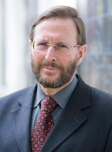

# Eric Peels

Webpage: [https://www.tua.nl/en/prof-dr-h-g-l-peels](https://www.tua.nl/en/prof-dr-h-g-l-peels){target=_blank}

H.G.L. (Eric) Peels was senior lecturer in Old Testament studies at the TUA, where he obtained his doctorate in 1992 with a dissertation on the vengeance of God in the Old Testament. In the same year he was appointed professor of Old Testament by the General Synod of the Christian Reformed Churches. He has held this chair since 1993 through January 2023.
