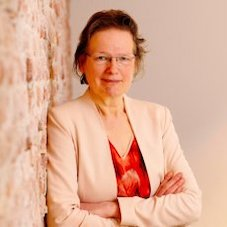

# Marjo Korpel

Webpage: <a href="https://www.pthu.nl/en/about-us/people/marjoc.a.korpel/">https://www.pthu.nl/en/about-us/people/marjoc.a.korpel/</a>.

Marjo Korpel is Associate Professor in Old Testament Studies at Protestantse Theologische Universiteit (Utrecht, the Netherlands). Her publications concern Old Testament exegesis, Canaanite and Israelite religion and ancient Hebrew epigraphy. She is well-known for her  research on metaphorical language describing the divine in Ugarit and the Bible (<i>A Rift in the Clouds</i>, 1990).

