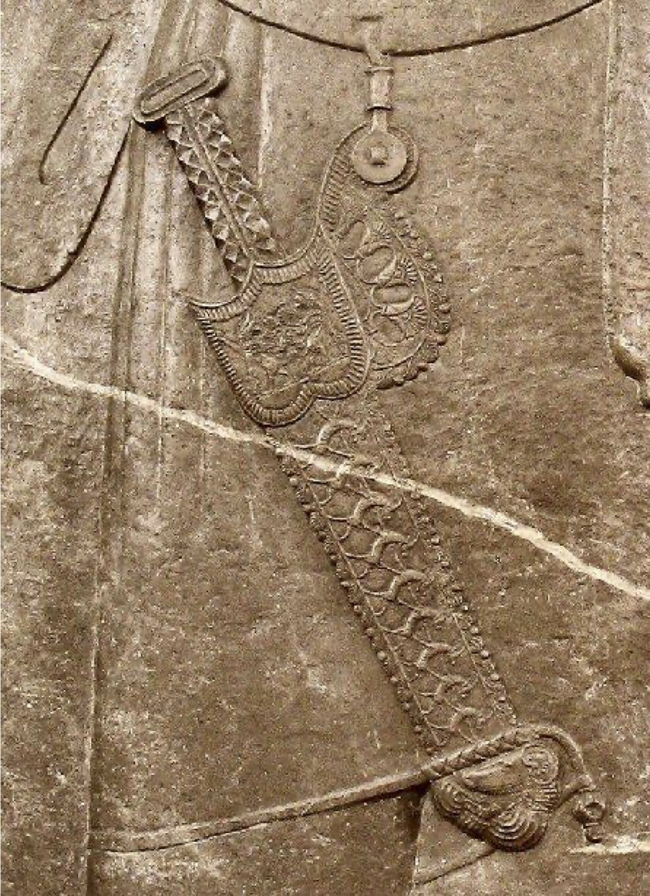
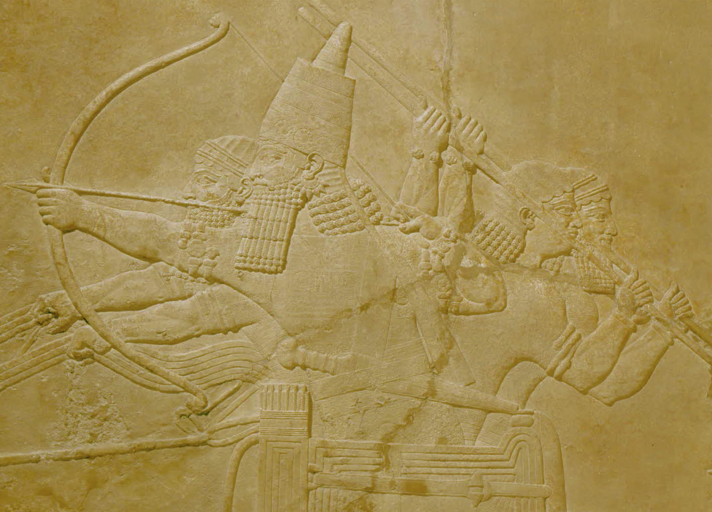
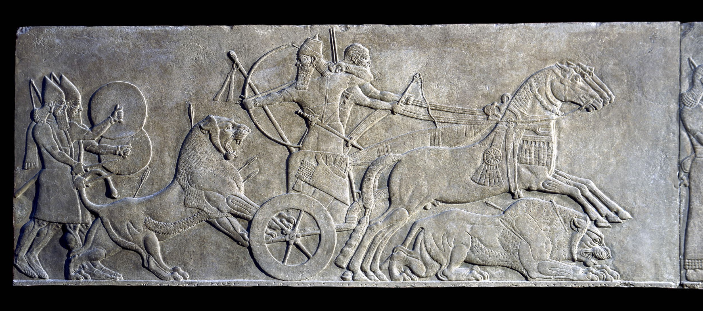

## Introduction

Grammatical type: noun masc.     

Occurrences:   1x HB (1/0/0); 0x Sir; 0x Qum; 0x Inscr.  (Total: 1)

* Torah: Deut 23:14.

## 1. Root and Comparative Material

<b>A.1</b>  <i>Root.</i>
A connection with √ <i>ʾdn</i> which is always connected with hearing (>
Hebrew אֹזֶן, אזן hiph.) is unlikely. Probably the א is a prosthetic alef (see below), so
the best solution is to assume that the noun has to be vocalized as אְַזֵן rather than as
(unattested) אָזֵן, as it is traditionally vocalized in Hebrew lexica, with the א forming
an open semi-syllable.[^1] This opinion is already
attested with early Hebrew lexicographers.[^2]

<b>A.2</b>
<i>Palmyrean Aramaic.</i>
Hoftijzer and Jongeling noted a word ʾzn of
unknown meaning,[^3] in an inscription in archaic Palmyrean script (end first century
bce),[^4] which has the attribute <i>špyr</i>, ‘beautiful’. It appears to be related to the
erection of a statue of two persons to which the expression <i>ʾzn spyr</i> fits. It might
suit a piece of armour like a baldric (cf. <a href="#pic"> 6.3. Pictorial Material</a>), which was often
beautifully decorated (but this may be too speculative).

<b>A.3</b>
<i>Official Aramaic.</i>
<i>zyn2 / zn4</i>, ‘weapon, armour’ in Elephantine papyrus Cowley
31:8: <i>znyhwm</i>, in the second draft of the letter to governor Bagohi of Yehud. In the
first version Cowley 30:8 the first scribe had written <i>tlyhm</i>.[^5] <i>tlyhm</i> from the Semitic
√<i>tly</i> suggests a hanging weapon or piece of armour (in Gen 27:3 most probably a
quiver as part of Esau’s כֵּלִים [<a href=https://sahd-online.com/words/kli/ target="_blank">→ כְּלִי</a>] ‘(hunting) equipment’).

<b>A.4</b>
<i>Persian.</i> 
Probably אָזֵן (אֲזֵן) was derived from Awestian <i>zaēna</i>, Old Persian <i>*zaina</i>,
Pehlevi <i>zēn</i>,‘weaponry’.[^6]

<b>A.5</b>
<i>Postbiblical Hebrew.</i> 
זֵן: ‘Waffe, eig. wohl Schmuck,
s.w.u. Kriegsrüstung’, with reference to Arab. <i>zayn</i> ‘ornamentum’.[^7]

<b>A.6</b>
<i>Jewish Aramaic.</i>
זֵיְינָה: ‘weapon’.[^8] In TJ to Jer
5:16 and Isa 49:2 אֲזֵינָא is a rendering of Hebrew אַשְׁפָּה ‘quiver’, whereas in Isa 22:6
the same word is equated with Aramaic זֵינָה ‘weapon, weaponry’.[^9]

<b>A.7</b>
<i>Samaritan Aramaic.</i>
זיון, זין, זינה: ‘gear’.[^10]

<b>A.8</b>
<i>Syriac.</i>
<i>zaynā</i>: ‘arms, armour, weapons’;[^11]
‘arma’;[^12] <i>zaynā</i> ‘armure, armour’;[^13] <i>zaynā</i> ‘shield, armor, implements’.[^14]

<b>A.9</b>
<i>Classical Arabic.</i>
<i>zayn</i>: ‘ornament, finery’.[^15]

<b>A.10</b>
<i>Hurrian.</i>
If a word of non-Semitic origin and, perhaps, a loan of Indo-European
provenance, also Hur. <i>ziyani</i> should be taken in consideration. It is attested as a
determined noun or ablative: <i>ziyan(i)=ni/e</i> in the first tablet of the Hurrian-Hittite
bilingue <i>para tarnumar</i> ‘Epic of Release’.[^16] It is also attested in the Ugaritic trilingual vocabulary Sa 46.1 HAL
= <i>hallu</i> = <i>ziyani</i> = <i>kurza’u</i> ‘thigh, shank(-bone)’. Also a related or variant noun
may be <i>ziyari</i> ‘side (of body, house)’.[^17] It is known that in
Hurrian many words relating to horse-breeding and warfare have been adopted from
ancient Indo-European stock. If so, it implies that the word <i>(ʾa)zaynu*</i> may have
entered the West-Semitic world at a much earlier stage than the Persian period.

<b>A.11</b>
<i>Rabbinical literature.</i>
Deut 23:14 is quoted in b. Yoma 75b where it is explained that the tool was only
needed to cover up excrements produced by food that was bought from foreign merchants because the manna the Israelites ate normally was digested entirely. In b. Ket.
5a it is proposed to read בְּאָזְנֶךָ ‘in your ear’ which is then interpreted figuratively.

## 2. Formal Characteristics

[Discussion will be added later.]

## 3. Syntagmatics

[Discussion will be added later.]

## 4. Ancient Versions

<b>a. Septuagint (LXX) and other Greek versions (αʹ, σʹ, θʹ):</b>

* LXX Deut 23:14 (13) renders ἐπὶ τῆς ζώνης σου ‘on
your belt’.[^18] LXX’s rendering
suggests that the Hebrew text has been read (or interpreted) as עַל־אֲזֹרֶךָ (אֲזֹר‘girdle’).
However, this interpretation might be a mere guess, since it is unlikely that a soiled
tentpin would have been worn on the belt.

<b>b. Samaritan Targum	 (Tg<small>Smr</small>):</b>

* See: <a href="#RCM7"> Root and Comparative Material, A.7</a>.

<b>c. Peshitta (Pesh):</b>  

* As often, S seems to follow the Targumic tradition in translating עַל־אֲזֵנֶךָ as ‘<i>l zynk</i>, ‘on your equipment’.[^19] It is interesting that the important manuscript family of 9a1 has the variant reading ‘<i>m</i> ‘with (your equipment)’.

<b>d. Targum (Tg):</b> 

* Some manuscripts of TO read אזנך, but the best text has ךניז.[^20] TN Deut. 23:14 has מאזני זייניכון. This would seem a conflated
reading which attempts to reconcile the Aramaic with MT. Probably TPs-J has
the better reading here: מאני זיניכון‘your war equipment’.[^21] The Targumists further explain their intention by אתר דתיסדון סייפוּכון‘the
place where you fasten your swords’.[^22] So the Targumim are connecting אָזֵן with Aramaic זֵיְינָה, apparently
regarding the א as prosthetic.

<b>e. Vulgate (Vg):</b>  
* Deut 23:13 <i>balteum</i>, ‘girdle, belt’, apparently following LXX.

## 5. Lexical/Semantic Fields

[Discussion will be added later.]

## 6. Exegesis

### 6.1 Literal Use

<b>A.1</b>
The noun אָזֵן occurs in Deut 23:14[^23] only, where it is found within a passage about
purity and cleanliness of the military camp (Deut 23:10-15). In this pericope two
instructions are given. The first one (vv. 11-12) is rather vague: ‘When someone
among you is unclean by reason of an accident of the night…’ (מִקְּרֵה־לָיְלָה). Though
modern Bible translations (e.g. NEB; REB) have interpreted this expression as ‘an
emission of seed’, it is not the most probable solution, since ‘emission of seed’ is
elsewhere characterized as שִׁכְבַת־זָרַע(Lev. 15:16).
Therefore, מִקְּרֵה־לָיְלָה in Deut
23:11 should be considered a more general term: every kind of accident related to
impurity that could happen at night. The second case discussed in Deut 23:10-15
concerns a specific instruction on easing oneself (vv. 13-15). This has to be done (1)
at a special place (יָד[v. 13][^24]) outside the camp and
(2) with a specific tool. One has to scrape ( חפר qal) a hole with a tentpeg or pin
(→ יָתֵד) in order to cover the excrements.

<b>A.2</b>
The instruction in Deut 23:14 is rather peculiar, as ‘there is no Biblical reference to the effect that human excrement defiles’.[^25] It is therefore
motivated in Deut 23:15 as having a theological, rather than a practical background:
God’s presence in the camp requires purity. J. Tigay writes, ‘it may be objectionable
in God’s presence simply because it is filthy and repugnant. However, Ezekiel’s
objection, as a priest, to eating food cooked over human excrement as fuel may
indicate that it was regarded as impure in some contexts (Ezek 4:12-15)’.[^26] The proximity of the preceding verses, especially v. 11, argues in favour
of this interpretation.

<b>A.3</b>
It is the apposition עַל־אֲזֵנֶךָ in Deut 23:14 that poses a problem, mainly because
the noun אָזֵן is a hapax legomenon in the Hebrew Bible, though it is not listed as
such in either Cohen, BHL, or Greenspahn, HLBH. The preposition עַל can have
many meanings,[^27] but in view of the
fact that the יָתֵד came into contact with excrements it is unlikely that the meaning
would be ‘among, with’ or ‘on, over’ here. The preposition could mean ‘in addition
to, besides’,[^28] implying that it should be kept apart from אֲזֵֶנֶךָ,
probably a generic term for ‘(military) equipment, weapons’.

### 6.2 Figurative Use

<b>A.1</b> 
Not attested.

### 6.3 Pictorial Material

<b>A.1</b> 
If אֲזֵן was a general term for weaponry and armour, it is difficult if not futile to
search for relevant examples in the vast iconographic resources of the art of warfare
in the ancient Near East. If, however, it may be assumed that as a hapax legomenon
the word designated a rare piece of equipment, or was a rare term for a specific piece
of armour such as a kind of baldric hanging from the girdle or a shoulder-belt, it is
rather easy to provide examples of them from ancient Near Eastern iconography. We
display one example of each. First, the often beautifully decorated Persian ‘akinakes’
or short sword from the southern ‘Treasury Relief’ at Persepolis (Figure 1). The decorated leather scabbard is here hanging from the girdle connected to
it by a single metal device.[^29]

Figure 1: Short Persian sword or akinakes from Persepolis
with leather scabbard attached to the girdle
(Courtesy of the Oriental Institute of the University of Chicago)

  

Figure 2: Assyrian relief: Ashurbanipal[^30] hunting lions
(©Trustees of the British Museum).

Baldricks or shoulderbelts made from leather straps hanging over the right shoul-
der slanting to the left, are known since the Late Bronze Age. They also appear
frequently in the Neo-Assyrian-Babylonian and Persian period. Compare, for in-
stance the two reliefs which show king Ashurbanipal (668-ca 627 v.Chr.) and king
Ashurnasirpal II (883-859 v.Chr.) hunting lions (Figure 2; Figure 3).[^31]
[M. Dijkstra]

  

Figure 3: Gypsum Assyrian relief: Ashurnasirpal II hunting lions
(©Trustees of the British Museum).

### 6.4 Archeology

<b>A.1</b> 
A large number of different types of Assyrian and Persian swords, usually made from
bronze alloys, have been found in excavations all over the ancient Near East includ-
ing Palestine and are nowadays on display in museum collections.[^32] Also often the
remains of the golden and silver adornments of the ornamented hilts and scabbards
have been unearthed.[^33]
These material remains complete nicely the iconographic
records cited above. Unfortunately, the leather parts of the scabbards and straps
of the belts and baldrics perished except for an occasionally preserved bronze ring,
buckle or some small floral ornaments adorning these parts of the weaponry. As
early as about 1500 BCE in shaft-grave V at Mycenae (Greece) the golden adorn-
ments of a bronze swords scabbards and baldrics were found, which are examples
of how a beautiful and a precious baldric could look like in the ancient Near East
(Figure 4). Near a long bronze sword, a golden shoulder-belt was found.
The strip gold was about 130 cm (4 ft.) long and about 3 cm (1 3/4 in.) broad.
In the extremity of the shoulder-belt are two perforations; at the other end there
has probably been a clasp, because no perforations are present. Near this shoulder-
belt a gold decorated disk similar to the ones covering the sword’s scabbard was
also found. Many of such round golden and silver floral plates have been found all
over the ancient world. These golden belts were the covering decorative element of
leather baldrics used for the sword’s scabbard suspension.[^34]
[M. Dijkstra]

  

Figure 4a: Golden strap from baldrick found in Mycenae (ca 1500).
(Courtesy of the National Archaeological Museum Athens) 

Figure 4b: Golden straps from baldricks found in Mycenae (ca 1500).
(© unknown; picture in Salimbeti s.a.)

## 7. Conclusion

<b>A.1</b>
The word is a hapax legomenon, perhaps borrowed from an Indo-European language.
If a relationship be accepted with Hurrian <i>ziyani</i> and <i>ziyari</i>, it may have entered the West-Semitic languages in the Bronze Age. According to the Septuagint and
the Vulgate the apposition עַל־אֲזֵנֶךָ in Deut 23:14 refers to a specific spot (‘on your
girdle’) or a special piece of equipment to attach the scabbard for sword or dagger
to a girdle or a shoulder-belt (baldrick, the Roman balteus).
The same kind of
equipment is also supposed to carry the special → יָתֵד‘tentpin’ used when leaving
the camp towards the special place to ease oneself.

<b>A.2</b>
Some considerations argue in favour of a more general, collective meaning of
the word. This more general meaning ‘equipment, weaponry’ has been preserved
in Official Aramaic, Persian, Postbiblical Hebrew, Targumic Aramaic, and Syriac.
Though the context does not provide conclusive evidence to decide which of these two
options is correct, a specialized meaning such as a ‘baldrick’ seems to be preferable
because of the fact that it is a hapax legomenon in the Old Testament Hebrew, i.e.
a rarely used term. Another possible solution is to translate ‘in addition to your
equipment’ which would imply that it should be kept apart from the other gear
because of its hygienic use. Though not defiling in the strict religious sense, and
obviously cleaned when used and carried around for sanitary purpose attached to a
belt like the other weaponry, it was still regarded repugnant in the presence of God.

## Bibliography

For the abbreviations see the 
<a href="/store/abbreviations/">List of Abbreviations</a>.

Alonso Schökel, <i>DBHE</i>, 32: ‘Ajuar, equipo’.  

BDB, 24: ‘implements, tools’.  

<i>BHL</i> 
H.R. Cohen, <i>Biblical Hapax Legomena in the Light of Akkadian and Ugaritic</i> (SBL.DS, 37), Missoula 1978. 

Cantineau 1933  
J. Cantineau, ‘Tadmorea,’ <i>Syria</i> 14 (1933) 169–202. 

<i>DCH</i>, vol. 1, 171: ‘perh. collective, tool(s) or weapons’. 

Déaut 1980  
R. le Déaut, <i>Targum du Pentateuque, t. 4: Deutéronome</i> (Sources Chrétiennes, 271), Paris 1980. 

Díez Macho, <i>Neophyti</i> 
A. Díez Macho, <i>Neophyti I: Targum Palestinense MS de la Biblioteca Vaticana</i>, vol. 5: Deuteronomio, Madrid 1978. 

Dijkstra 2013 
M. Dijkstra, ‘The First Tablet of the Hurritic Bilingual Song of Release in the Light of Hurritic Mythological Tradition,’ <i>UF</i> 44 (2013) 121–42. 

GB, 21: ‘unsicheres Wort: Waffen’. 

<i>HAHAT</i>, 30: ‘Etymologie unsicher: Geräte’. 

<i>HALAT</i>, 27:‘Ausrüstung (?)’. 

<i>HAWAT</i>, 10: ‘Gerät’.  

<i>HCHAT</i>, 48: a very elaborate treatment, resulting in the translation ‘Geräth, Werkzeug’. 

<i>HLBH</i>, F.E. Greenspahn, <i>Hapax Legomena in Biblical Hebrew</i> (SBL.DS, 74), Chico 1984.  

<i>HWAT</i>, 21: ‘Werkzeug’. 

<i>KBL</i>, 25: ‘Gerät, tools’. 

<i>LHA</i>, 28: ‘arma’ (Zorell renders: ‘praeter <i>arma tua</i>’). 

<i>MHH</i>, 22: םתוס(unclear). 

Neu 1996 
E. Neu, <i>Das hurritische Epos der Freilassung I: Untersuchungen zu einem hurritisch-hethitischen Textensemble aus Hattuša</i>, (SBoT 32) Wiesbaden 1996. 

Porten 1996 
B. Porten (ed.), <i>The Elephantine Papyri in English: Three Millennia of Cross-Cultural Continuity and Change</i> (DMOA, 22), Leiden 1996.

Reade 1983 
J. Reade, <i>Assyrian Sculpture</i>, London 1983. 

Richter 2012 
Th. Richter, <i>Bibliographisches Glossar des Hurritischen</i>, Wiesbaden 2012. 

Salimbeti s.a. 
A.  Salimbeti, ‘The Greek Bronze Age: Swords/Daggers’ Salimbeti.com. 

Sperber, BiA 
A. Sperber, <i>The Bible in Aramaic Based on Old Manuscripts and Printed Texts</i> (4 vols.), Leiden 1959–68. 

Stern 2001 
E. Stern, <i>Archaeology of the Land of the Bible, Vol. II: The Assyrian, Babylonian and Persian Periods (737-322 B.C.E.)</i>, (ABRL) New York etc. 2001. 

Tigay 1996  
J.H. Tigay, <i>Deuteronomy: The Traditional Hebrew Text with JPS Translation</i> (JPS Torah Commentary), Philadelphia (PA) 5756 / 1991. 

<i>TLB</i>, vol. 1, 61: Meaning uncertain. 

<i>TPC</i>, 60: ‘supellex’ (utensils, stuff). 

Van der Woude 1978 
A.S. van der Woude, ‘ יָד, <i>yād</i>, Hand,’ <i>THAT</i>, Bd. I, 667-674. 

Weinfeld 1972 
M. Weinfeld, <i>Deuteronomy and the Deuteronomic School</i>, Oxford 1972, 238. 

[^1]: cf. Joüon & Muraoka, <i>GBH</i>, § 88a.
[^2]: cf. Fürst & Ryssel, <i>HCHAT</i>, 48.
[^3]: Hoftijzer and Jongeling, <i>DNWSI</i> I, 26.
[^4]: Cantineau 1933, 190–91.
[^5]: Hoftijzer and Jongeling, <i>DNWSI</i> I, 309; Grelot, <i>DAE</i>, No 102; Porten 1996, 139–47.
[^6]: cf. <i>HAHAT</i>, 30; Sokoloff, <i>SLB</i>, 378.
[^7]: Levy, <i>WTM</i>, Bd. 1, 528.
[^8]: Sokoloff, <i>DJPA</i>, 175; <i>DJBA</i>, 410.
[^9]: cf. Levy, <i>CWT</i>, Bd. 1, 18.
[^10]: Tal, <i>DSA</i>, 276.
[^11]: Payne Smith (Margoliouth), <i>CSD</i>, 115.
[^12]: Brockelmann, <i>LS</i>, 195.
[^13]: Costaz, <i>DSF</i>, 87.
[^14]: Sokoloff, <i>SLB</i>, 378.
[^15]: Lane, <i>AEL</i>, 1279-80.
[^16]: KBo 32,67 IV, 8’; Neu 1996, 527; Dijkstra 2013, 135–36.
[^17]: see Richter 2012, 367, 371.
[^18]: GELS-L, 195: ‘girdle, belt’; GELS-M, 316: ‘girdle’.
[^19]: Payne Smith [Margoliouth], CSD, 87: ‘armour’;
Brockelmann, LS, 195: ‘arma’; Costaz, DSF, 87: ‘armure, armour’; Sokoloff, SLB,
378: zaynā ‘shield, armor, implements’.
[^20]: Sperber, BiA, vol. 1, 329.
[^21]: Díez Macho, Neophyti, vol. 5, 193: ‘vuestros equipos de armes’; Le Déaut 1980, 188: ‘vos équipements d’armes’.
[^22]: Le Déaut 1980, 189: ‘l’endroit où vous attachez
vos glaives’.
[^23]: There is a difference between the numbering of verses in MT (Deut. 23:10-15) and V (23:9-14), whereas the latter is followed in a number of older translations, like e.g. KJV, NRSV, NEB, StV, NBG; newer translations are according to the numbering in MT: JPS, NBV.
[^24]: see Van der Woude 1978, 669.
[^25]: Weinfeld 1972, 238.
[^26]: Tigay 1996, 214.
[^27]: cf. DCH, vol. 6, 385–98; opting for ‘with’, 392b.
[^28]: DCH, vol. 6, 392a.
[^29]: see also ANEP, 11, 463.
[^30]: Note that the shoulder strap from which the sword is hanging, here also is secured inside his girdle!
[^31]: Both reliefs are displayed in the British Museum, see Reade 1983, Figs. 33; 80, 81; further: Figs. 79, 96; ANEP, Nos 184, 441, 185, 235; see also AOB, No 380; ANEP, No 651, and BRL2, 61 the winged deity; another Persian example ANEP, No 11; other examples from Zincirli
ANEP, No 49 and Neo Hittite Kargemish ANEP, No 461.
[^32]: See also Stern 2001, 531.
[^33]: Usually subsumed under jewellery. Perforations and small ringlets on the edges show however that they were ornaments sewn on clothes, or attached on leather and cloth belts and other objects. 
[^34]: Salimbeti s.a. For examples of archaeological remains of such equipment from Palestine, see BRL2, 61.