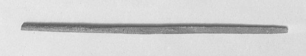

## Introduction

Grammatical type: n.m.

Occurrences: 2x HB (1/1/0); 0x Sir; 2x Qum; 0x Inscr. (Total: 4)

* Torah: Exod 32:4;

* Nebiim: Isa 8:1;

* Qumran: 1Q33 (1QM) XII:3; 4Q382 fr25:4.

Ketiv/ Qere: none.

## 1. Root and Comparative Material

<b>A.1</b> 
<i>Root.</i>
√חרט is considered a variant form of √חרץ, ‘to incise, engrave’ (Ges18, 396, 401; <i>CDG</i>, 264).

An original connection with 
√חרת, ‘to plough’ (Syr. √ܚܪܬ [<i>ḥrat</i>] also ‘hollow out’), Hebr. √חרשׁ I, ‘to plough’, and √חרת, ‘to incise, engrave’, is not excluded, but see the discussion in Williamson 2011, 364, and the references there for the word חרת (as it is used in 1QHa I:24).

<b>A.2</b>
<i>Akkadian.</i>
<i>ḫarāṣu</i>, ‘to cut down, to cut off, to incise’ (<i>CAD</i>, Ḫ, 92); <i>maḫruṣu</i>, ‘graver, chisel, burin’ (<i>AEAD</i>, 58).

<b>A.3</b> 
<i>Ugaritic</i>.
<i>ḥrṣ</i>, ‘to cut, bite’ (?) (<i>DULAT</i>3, 364-65). However, also Ugar. <i>ḥrẓn</i>, a PN of uncertain derivation, might be related.

<b>A.4</b> 
<i>Phoenician, Punic</i>.
<i>ḥrṭyt</i>, ‘sculpture’ (cult image in a temple, <i>PPD</i>, 196), but doubted by <i>DNWSI</i>, vol. 1, 404. See also <i>ḥrṣ</i>, ‘moat, canal’ and ‘carving, chiselling, carved work’ (<i>DNWSI</i>, vol. 1, 406-07).

<b>A.5</b> 
<i>Postbiblical Hebrew.</i>
חרט, ‘to chisel, model’ (Dalman, <i>ANHT</i>, 160; Jastrow, <i>501</i>); חרט, ‘to incise’; חֶרֶץ, ‘incision, groove’ (<i>WTM</i>, Bd. 2, 115; Jastrow, <i>DTT</i>, 505).

<b>A.6</b> 
<i>Jewish Aramaic.</i>
חריץ, ‘incision, groove’; חרט, ‘to cut into, dig’ (Levy, <i>WTM</i>, Bd. 2, 115; Sokoloff, </i>DJBA</i>, 484).

<b>A.7</b> 
<i>Samaritan Aramaic.</i>
חרץ, ‘to mutilate’; ערק, ‘opening’ (in the ark) (Tal, <i>DSA</i>, 296).

<b>A.8</b>
<i>Syriac.</i> 
ܚܪܛܐ (<i>ḥūrāṭā</i>), ‘cutting, laceration’; ܚܪܛ (<i>ḥeraṭ</i>), ‘to scrape, scratch, make incisions’; ܚܪܛܐ (<i>ḥarṭā</i>), ‘gash, scratch’ (Payne Smith, <i>CSD</i>, 134, 157;
Sokoloff, <i>SLB</i>, 489; Brockelmann, <i>LS</i>, 256).

<b>A.9</b> 
<i>Classical Arabic.</i>
<i>ḥaraṣa</i>, ‘to rend, cleave’ (Lane, 547), less likely <i>ḫaraṭa</i>, ‘to peel, rub off’ (Lane, 723), though this is also attested as ‘to cut off’ (<i>SDA</i>, t. 1, 362).

<b>A.10</b> 
<i>Greek.</i>
χάραγμα, ‘any mark engraved, character’; χαρακτήρ, ‘graving tool, mark engraved, character’; χαράσσω, ‘to whet, cut into, engrave’ (<i>LSJ</i>, 1976-80), may ultimately go back on Semitic <i>ḥrṣ</i> because the Greeks learned how to write from the Semitic world.

## 2. Formal Characteristics

<b>A.1</b> 
Both in Exod 32:4 and in Isa 8:1 the word is spelled as חֶרֶט. Also in the texts from the Qumran there is no variation in the spelling of חרט.
	

## 3. Syntagmatics

<b>A.1</b>
Only the singular form of חֶרֶט is attested in the Hebrew Bible.

<b>A.2</b> חֶרֶט occurs as <i>nomen regens</i> of
אנושׁ, ‘man’ (Isa 8:1),
חיים, ‘life’ (1Q33 XII:3), and
זהב, ‘gold’ (4Q382 fr25:4).

<b>A.3</b> חֶרֶט is preceded by the preposition
בְּ in Exod 32:4, Isa 8:1, 1Q33 XII:3, and 4Q382 fr25:4. In three cases, the preposition
בְּ introduces the instrument with which the action is performed; יצר <i>qal</i>, ‘to shape’, in Exod 32:4;
כתב <i>qal</i>, ‘to write’, in Isa 8:1;
חרת <i>qal</i>, ‘to engrave’, in 11Q33 XII:3.

<b>B.1</b> In 1QIsaa VII:18, the preposition ב is written above the line with the text of Isa 8:1.

## 4. Ancient Versions

<b>a. Septuagint (LXX) and other Greek versions:</b> 

* γραφίς, ‘stylus, chisel’:
Exod 32:4; Isa 8:1;

* τέχνη, ‘skill, art’:[^2]
Exod 32:4 (according to ἄλλος: see <a href="#AVa2">Ancient Versions A.2 </a>).

<b>b. Peshitta (Pesh):</b>

* ܛܘܦܣܐ
(<i>ṭūpsā</i>), ‘mold’:[^3] Deut 32:4;

* ܟܬܒܐ
(<i>kṯābā</i>), ‘script’:[^4] 
Isa 8:1.

<b>c. Targumim (Tg): </b>

* זיפא, ‘pitch, mold’:[^5]
Exod 32:4 (TgO);

* טופסא, ‘mold, framework’:[^6]
Exod 32:4 (TgN,PsJ);

* כתב, ‘script, writing’:[^7]
Isa 8:1.

<b>d. Vulgate (Vg):</b> 

* <i>opere fusorio</i>, ‘foundry-work’:[^8]
Exod 32:4;

* <i>stilo</i>, ‘stylus’:[^9]
Isa 8:1.

<b>A.1</b> 
For Exodus 32:4 the corresponding passage in LXX clearly expresses the idea of 
giving the essential shape (πλάσσω) to the idol with the 
help of a stylus or chisel (γραφίς, cf. <i>GELS-L</i>, 93).

<b>A.2</b> 
In the Hexaplaric tradition, a reference to other translations of the word in Exod 32:4 are cited thus: ἄλλος ἐν τέχνῃ.[^10]
Exod 32:4 in Syro-Hexapla (Vööbus 1975) has ܒܪܘܫܡܐ <i>brūšāmā</i>, ‘sign, mark’,[^11], this variant is also given by Field transliterated in Greek script.
The Syro-Hexaplaric rendering of the word in Isa 8:1 is ܒܟܬܝܒܬܐ <i>bkṯiḇṯā</i>, ‘writing, script, written characters’.[^12].

<b>A.3</b> The Samaritan targum of Exod 32:4 has מרכי, ‘trough, mold’.
One Samaritan MS contains the following supralinear annotations to that word: בזיפה, בזפיתה, בציאף, and בטופרין (Tal, <i>DSA</i>, 835). 

<b>A.4</b>
In Exod 32:4 Pesh presents a connection between the verb ܨܘܪ (<i>ṣwr</i>), ‘to form, shape’ (Payne Smith, <i>CSD</i>, 476), and the Greek loanword ܛܘܦܣܐ (<i>ṭūpsā</i>), ‘type, model, or mold’. It appears that Pesh has understood חרט as a mold, possibly under the influence of the Palestinian Targum (see above <a href="#AV">Ancient Versions</a>) and perhaps Sam.
In Isa 8:1 Pesh has ܒܟܬܒܐ ܕܐܢܫܐ <i>bkṯābā dnāšā</i>, ‘in human script’. The two passages, Exod 32:4 and Isa 8:1, together render it likely that the Syriac translator did not know what to do with the Hebrew word חרט, but was acquainted with the Palestinian exegetical traditions about its meaning.

<b>A.5</b> 
TgO renders וצר יתיה בזיפא, ‘and he shaped it with pitch’, in Exod 32:4, apparently interpreting the verb as a form of צור, ‘to shape’ (Dalman, <i>ANHT</i>, 361), and assuming that the cast was hollow because in antiquity pitch was used to achieve a hollow shape (see the literature cited under <a href="#Exe-lit">Textual Evidence</a> A.1.).
TgN has ורמה יתה בטופסא, ‘and he cast it in a mould’. TgPsJ has a double rendering, וצר יתיה בשושיפא ורמא יתיה בטופרסא, ‘and he shaped it in a cloth and cast it in a mould’.
In Isa. 8:1 the Targumist avoids the difficult חרט by rendering וכתוב עלוהי כתב מפרש, ‘and write on it in clearly readable script’.

## 5. Lexical/Semantic Fields

<b>A.1</b> 
The word חֶרֶט is used in two occasions: in Exod 32:4 Aaron was brought the broken golden rings of the people. These were made with a חֶרֶט into a molten calf. In Isa 8:1 this tool with the adjective ‘human’ is used to write down the words מַהֵר שָׁלָל חָשׁ בַּז on a גִּלָּיוֹן גָּדוֹל.

## 6. Exegesis

### 6.1 Textual Evidence

<b>A.1</b>
The word חֶרֶט is rendered most commonly as ‘graving tool’ or ‘stylus’ (BDB, 354-55: ‘graving-tool, stylus’; Klein, <i>CEDHL</i>, 232: ‘graving tool, stylus’; <i>HWAT</i>, 223: ‘1. Griffel; 2. Meißel’; GB, 259: Isa. 8:1 ‘Griffel z. Eingraben’, Exod. 32:4 ‘Meissel ... unwahrsch.’; Ges18, 396: Isa. 8:1 ‘Griffel, übertr. Schrift’, Exod. 32:4 ‘Griffel od. Meißel’ (?); <i>HAL</i>, 339: Isa. 8:1 ‘Griffel’, Exod. 32:4; </i>MHH</i>, 351: מפלסת, אזמל (‘chisel, adze’); <i>TLB</i>, vol. 3, 248: ‘chisel, graving-tool’; Gesenius, <i>TPC</i>: ‘stylus, scalprum’ (?)), or just as ‘stylus’ (<i>DCH</i>, vol. 3, 316: ‘stylus’), or ‘graving tool’ (Zorell, 268: ‘scalprum’); ‘chisel’ (Zhakevich, 135).
Others have <i>DBHE</i>, 255: Exod. 32:4 ‘Cincel, estilo’; Isa. 8:1 ‘Por metonimia, lo escrito o grabado’; <i>HCHAT</i>, Bd. 1, 438: Isa. 8:1 ‘Griffel ... Menschengriffel, d.h. mit vulgären, gewöhnlichen Schriftzügen’ as, Exod. 32:4 ‘Meisel’ oder besser ‘Beutel’; (<i>HAWAT</i>, 125:  Exod. 32:4 ‘Schabewerkzeug 2. synekd. speziell: Griffel zum Einritzen’. There is some variation in the renderings chosen by English translations: 
Exod 32:4 ‘mold’ NRSV; ‘graving tool’ KJV, ESV, ASV, and JPS; ‘engraving tool’ NASB; ‘tool’ ISV. Isa 8:1 ‘common characters’ NRSV, ESV; ‘a man’s pen’ KJV; ‘pen of a man’ ASV; ‘common script’ JPS; ‘ordinary letters’ NASB; ‘stylus pen’ ISV.

<b>A.2</b>
The meaning of חֶרֶט in Exod 32:4 is disputed. Houtman 2000 enumerates no less than six different interpretations and finally prefers to render וַיָּצַר אֹתוֹ בַּחֶרֶט as ‘(Aaron) tied the (gold) in a cloth’ (similarly <i>HCHAT</i>, Bd. 1, 438; Loewenstamm 1967; 1975; Gevirtz 1984, and others), because he believes that a rendering like ‘he shaped it with a חֶרֶט’ requires a repointing of the Hebrew. However, this is an unnecessary assumption if one accepts the existence of a √צור III, ‘to draw, design, shape, form’, that is also attested in several other Semitic languages (cf. Childs 1974; Schroer 1987; <i>HAL</i>, 952; <i>DCH</i>, vol. 7, 107) and is supported by the <a href="#AV">Ancient Versions</a>. The hypothesis that חֶרֶט should be regarded as a cloth bag or purse (identical to or repointed as 
→ חָרִיט, for which 2~Kgs 5:23 is invoked) leaves unexplained how the gold became an image of cast metal (מַסֵּכָה). The assumption of a miracle has no basis in the text.

<b>A.3</b>
It is highly unlikely that the chief priest Aaron himself would have engaged in the specialist’s work of casting a molten image of a bull-calf (on the techniques required see e.g. <i>SAT</i>, vol. 8, 105-95; M. Weippert, in: <i>BRL</i>2, 219-24; <i>AMMI</i>, 216-40; J. Ogden in: <i>AEMT</i>, 161-66; <i>MMHB</i>, 231-35). Small images of cast metal bulls and bull-calves have been found in many places in Israel and the neighbouring countries, but Exod 32:2-3 and 32:19-20 create the impression that it was a big image which would have complicated the smith’s task considerably. Therefore it is more likely that it was the writer’s intention to indicate that it was Aaron who commisioned and outlined the shape of the calf with a חֶרֶט, whereas others did the actual casting, probably in the form of gold sheets which were subsequently hammered into shape over a wooden base (cf. Exod 31:1-11; 35:30-36:1 and <i>MMHB</i>, 234).
If this was the case, the עשׂה, ‘he made it’, of Exod 32:4, 35 must be understood as ‘he had it made’, as was the oriental way of giving the employer all the credit for building or making things (see the building inscriptions of many kings, Baal’s boast to have built his palace in <i>KTU</i> 1.4:VI.35-37 whereas actually it was built by the technician among the gods Kotharu, and for the OT, e.g. 1 Kgs 10:12, 16, 18; 12:28, 31-32; 16:33 and especially 2 Kgs 16:10-11). So חֶרֶט in Exod 32:4 is most likely a burin or stylus with which one could draw a sketch of an object on a writing tablet (for a similar interpretation, cf. Propp 2006: 549-50).

<b>A.4</b>
According to Isa 8:1 the prophet has to write characters on a large object (→ <a href="/words/gillayon/">גִּלָּיוֹן</a>) with a חֶרֶט אֱנושׁ, ‘a man’s חֶרֶט’ (i.e., a normal tool, as distinct from the finer jeweller’s tool). Such a tool was commonly used for making notes on a wax or clay tablet, or to mark jars (after firing), weapons and tools with indications of ownership. 
Since the lettering on the to be displayed object had to be clearly readable to all passers-by it may be assumed that a חֶרֶט was a rather thick engraving tool, a burin or stylus.
Discussing the translation of גִּלָּיוֹן might establish the meaning of חֶרֶט. Translating גִּלָּיוֹן as ‘mirror’ (see Van der Toorn 2007, see below <a href="#Exe-litb1">Textual Evidence B.1</a>; see also Van Wieringen, 
<a href="/words/gillayon/">גִּלָּיוֹן</a>)
or as ‘papyrus’, ‘parchment’, or ‘scroll’ (among others VanDyke 2022: 227, see below <a href="#Exe-litb2">Textual Evidence B.2</a>), is difficult to reconcile with writing on it with a stylus or burin. Equally so, the word is not related to √גלל, ‘to roll’ (for a discussion → גִּלָּיוֹן and cf. Williamson 2011: 360).

<b>A.5</b>
It might be interesting to point to its Akkadian cognate <i>galālu</i>, which is a West-Semitic loanword in Akkadian for a polished stone out of which <i>stelae</i>, a doorpost, and mortars were made (</i>CAD</i> G, 11), or to the Aramaic גלל (Ezra 5:8; 6:4), cf. also the the mortars made out of chert unearthed in Persepolis on which the inscription אבן גלל, ‘<i>gll</i> stone’, is engraved).

<b>A.6</b>
One may infer חֶרֶט, because of its receptor in Isa 8:1 (גִּלָּיוֹן), that the חֶרֶט must have been robust enough to incise at least chert stone (or building objects, see Williamson 2011: 362 who refers to a Palmyrene Aramaic example). 

<b>A.7</b>
In the Bab. Talmud tractate Avodah Zarah 22b, an instrument used to split a <i>gll</i>-stone (גללא ברע) is called a מכתבא, an Aramaic word which is interpreted as ‘awl’ (Greenfield 2001: 254). 

<b>B.1</b> 
Both terms are thus set into relationship of each other: on a גִּלָּיוֹן one could write with a חֶרֶט. If it was a mirror of bronze on which Isaiah wrote, as has been suggested, the stylus must have been harder than that metal and therefore it may have had a point of iron or sapphire (cf. Jer. 17:1). There is certainly no basis for Van der Toorn’s guess that a חֶרֶט אֱנושׁ would have been a ‘brush’ (Van der Toorn 2007: 180, 336).

<b>B.2</b> 
VanDyke 2022 interprets חֶרֶט in Exod 32:4 as a tool to make a sketch of an object (here, a calf), and translates the word as ‘rush-pen’. She points to the fact that the object of the verb יָּצַר changes within Exod 32:3-4, here the presumed object of אֹתוֹ וַיָּצַר (in vs. 4 set in masculine singular) is the plural נִזְמֵי הַזָּהָב (vs. 3a). But the object of the suffix in vs. 4 could also point to either the molten earrings or the people, or simply denote a step not mentioned to arrive from ‘golden earrings’ to a ‘calf’.

### 6.2 Figurative Use

<b>A.1</b>
The חרט חיים in 1Q33 XII:3 וברית שלומכה חרתה למו בחרט חיים, ‘and the covenant of your peace you engraved for them with the stylus of life’, may denote the engraving devise used by God which seems deliberately lacking in Exod 32:16 מִכְתַּב אֱלֹהִים ה֔וּא חָרוּת עַל־הַלֻּחֹת, ‘the writing of God, engraved upon the tablets’. 

### 6.3 Pictorial Material

<b>A.1</b>
On Neo-Assyrian murals frequently a pair of scribes is depicted, of which one is writing on a tablet and another writing on other material (for instance parchment). See Figure 1.

&nbsp;&nbsp;&nbsp;&nbsp;&nbsp;&nbsp;&nbsp;&nbsp;<small>Figure&nbsp;1:&nbsp;&nbsp;
Two Neo-Assyrian scribes recording booty, taken from Austen Henry Layard’s Nineveh and its Remains (1867), following an ancient Assyrian relief</small>

### 6.4 Archaeology
<b>A.1</b>
Chisels or bronze awls, presumably also to be used as engraving tools, are found in many excavations in Egypt and the Levant (<i>AEMT</i>, 356), for example see Figure 2.

&nbsp;&nbsp;&nbsp;&nbsp;&nbsp;&nbsp;&nbsp;&nbsp;<small>Figure&nbsp;2:&nbsp;&nbsp;
Chisel or Awl From Foundation Deposit 2 of Hatshepsut’s Valley Temple from the New Kingdom (ca. 1479-1458 BCE).](https://www.metmuseum.org/art/collection/search/550009)</small>

## 7. Conclusion

<b>A.1</b>
Because the Old Testament provides the scholar with but two instances, the meaning of the word חֶרֶט depends mainly on its context. Though in this case the two instances are very
different, ‘stylus’ may be taken as the basic meaning of the word under discussion. Several ancient versions, an important passage in a Qumran text, as well as the most likely etymology support this choice which makes good sense in each of the passages quoted. The word belongs to the small category of technical terms (→עֵט, →צִפֹּרֶן, →ְקֶסֶת, →שֶׂרֶד, →מְּחוּגָה), the basic function of which is either the essential shaping of artefacts or the writing of characters. 

<b>Bibliography</b>

For the abbreviations see the 
<a href="/store/abbreviations/">List of Abbreviations</a>.

Childs 1974  
Brevard S. Childs, <i>Exodus: A Commentary</i> (OTL), London: S.C.M. Press, 553-56.

Greenfield 2001  
Jonas C. Greenfield, ‘Notes on the Early Aramaic Lexicon’ in: Shalom Paul, Michael E. Stone, and Avital Pinnick (eds.), <i>Al kanfei Yonah: collected studies of Jonas C. Greenfield on Semitic philology</i> Vol. 1, Jerusalem: The Hebrew University Magnes Press, 251-57 (previously published in <i>Orientalia Suecana</i> 33-35 (1984-1986), 149-55).

Gevirtz 1984  
Stanley Gevirtz, ‘חֶרֶט in the Manufacture of the Golden Calf’, <i>Bib.</i> 65, 377-81. 

Houtman 2000  
Cornelis Houtman, <i>Exodus</i> (HCOT), vol. 3, Leuven: Peeters Publishers, 608, 636-38.

Loewenstamm 1967  
Samuel E. Loewenstamm, ‘The Making and Destruction of the Golden Calf’, <i>Bib.</i> 48 (1967), 481-90 (reprinted in: S.E. Loewenstamm, <i>Comparative Studies in Biblical and Ancient Oriental Literatures</i> (AOAT, 204), Neukirchen-Vluyn, 1980, 236-45).

Loewenstamm 1975  
Samuel E. Loewenstamm, ‘The Making and Destruction of the Golden Calf - A Rejoinder’, <i>Bib.</i> 56 (1975), 330-43 (reprinted in: S.E. Loewenstamm, <i>Comparative Studies in Biblical and Ancient Oriental Literatures</i> (AOAT, 204), Neukirchen-Vluyn, 1980, 503-16).

Propp 2006  
William H.C. Propp, <i>Exodus 19-40</i> (AncB, 2A), New York: Doubleday 2006.

Schroer 1987  
Sylvia Schroer, <i>In Israel gab es Bilder: Nachrichten von darstellender Kunst im Alten Testament</i> (OBO, 74), Freiburg Universitätsverlag; Göttingen: Vandenhoeck & Ruprecht 1987, 86.

Van der Toorn 2007  
Karel van der Toorn, <i>Scribal Culture and the Making of the Hebrew Bible</i>, Cambridge: Harvard University Press.

VanDyke 2022  
Elizabeth VanDyke, ‘Designing the Golden Calf: Pens and Presumption in the Production of a "Divine" Image’, <i>JBL</i> 141/2, 219-33.

Vööbus 1975  
Arthur Vööbus, <i>A Facsimile Edition of a Midyat Ms. Discovered 1964</i> (Corpus Scriptorum Christianorum Orientalium, Subs. 45), Peeters Publishers: Leuven.

Williamson 2011  
Hugh G. M. Williamson, ‘The Practicalities of Prophetic Writing in Isaiah 8:1’, in: John A. Emerton (ed.) <i>On Stone and Scroll: Essays in Honour of Graham Ivor Davies</i> (Beihefte zur Zeitschrift für die alttestamentische Wissenschaft, 420), Berlin: De Gruyter, 357-69.

[^1]: LSJ, 360; <i>GELS</i>, 136.
[^2]: LSJ, 1785; <i>GELS</i>, 677. 
[^3]: Payne Smith, <i>TS</i>, 1448; Sokoloff, <i>SLB</i>, 520.
[^4]: Payne Smith, <i>TS</i>, 1851-52; Sokoloff, <i>SLB</i>, 660-61.
[^5]: Jastrow, <i>DTT</i>, 393; Sokoloff, <i>DJBA</i>, 410; Sokoloff, <i>DJPA</i> no reference.
[^6]: Jastrow, <i>DTT</i>, 525; Sokoloff, <i>DJBA</i>, 498; Sokoloff, <i>DJPA</i>, 230.
[^7]: Jastrow, <i>DTT</i>, 679; Sokoloff, <i>DJBA</i>, 608; Sokoloff, <i>DJPA</i>, 271.
[^8]: Lewis & Short, <i>LD</i>, 1207, 798; <i>OLD</i>, 1251, 751.
[^9]: Lewis & Short, <i>LD</i>, 1759; <i>OLD</i>, 1820.
[^10]: FieldI, 140.
[^11]: Payne Smith, <i>TS</i>, 3987; Sokoloff, <i>SLB</i>, 1453.
[^12]: Payne Smith, <i>TS</i>, 1852-53; Sokoloff, <i>SLB</i>, 661-62. 