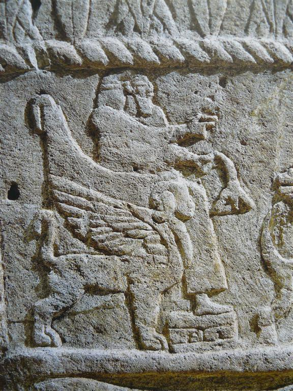
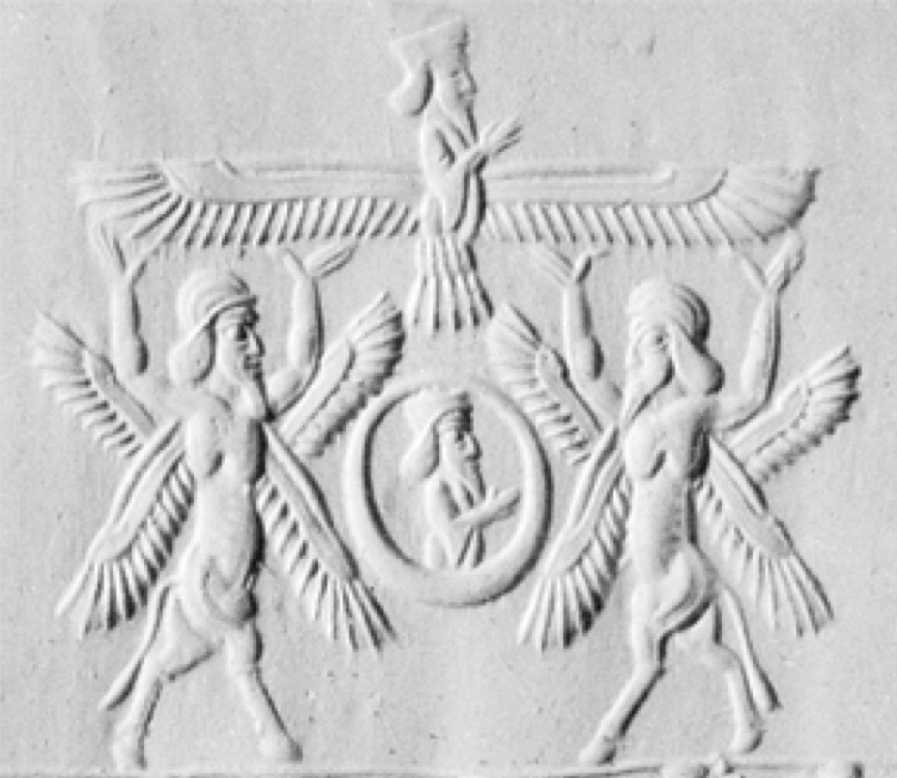

## Introduction

Grammatical type:   
Occurrences:   91x HB (19/56/16); 0x Sir; 20x Qum; 0x Inscr.  (Total: 111)

* Torah: Gen 3:24; Exod 25:18, 19 (3x), 20 (2x), 22; 26:1, 31; 36:8, 35; 37:7, 8 (3x), 9 (2x); Num 7:89; 

* Nebiim: 1 Sam 4:4; 2 Sam 6:2; 22:11; 1 Kgs 6:23, 24 (2x), 25 (2x), 26 (2x), 27 (3x), 28, 29, 32 (2x), 35; 7:29, 36; 8:6, 7 (2x); 2 Kgs 19:15; Isa 37:16; Ezek 9:3; 10:1, 2 (2x), 3, 4, 5, 6, 7 (3x), 8, 9 (3x), 14, 15, 16 (2x), 18, 19, 20; 11:22; 28:14, 16; 41:18 (4x), 20, 25; 

* Ketubim: Ps 18:11; 80:2; 99:1; 1 Chron 13:6; 28:18; 2 Chron 3:7, 10, 11 (2x), 12 (2x), 13, 14; 5:7, 8 (2x);

* Qumran: 4Q11 29-30 i 9, 10, 11 (2×), 12; 4Q54 6, 9; 4Q73 1, 4; 4Q73 1, 7; 4Q73 2, 2; 4Q286 1 ii 2; 4Q364 16, 2; 4Q391 16, 2; 4Q403 1 ii 15; 4Q405 20 ii 20-21-22 3, 7, 8; 4Q511 41, 2; 11Q17 V, 9, VII, 5, 11Q19 VII 10; 11QShirShab 3-4, 4.

## 1. Root and Comparative Material

<b>A.1</b> The root כרב is not attested elsewhere in ancient Hebrew, apart from in Ezr 2:59 and Neh 7:61, where the form כְּרוּב II occurs as a place name.

<b>A.2</b> The etymology of כְּרוּב is uncertain. Several attempts at tracing its derivation have been made, yet there is not enough evidence to confirm its origin beyond doubt. The root <i>k-r-b</i> occurs frequently in East Semitic and the majority of scholars link כְּרוּב, in some way, to the Akkadian terms <i>kāribu</i> and <i>kurību</i>; see, e.g. De Vaux 1967:235. <i>Kāribu</i> is the present participle of the verb <i>karābu</i> and has the meaning ‘one who prays’ or ‘intercessor’. <i>Kurību</i> is a diminutive form from the same root (see von Soden 1952 §55k). Dhorme (1926:338) was among the first to make a connection between these terms and Hebrew כְּרוּב. He states: ‘le <i>kâribu</i> et le <i>kerûb</i> appartenaient à la meme racine et, par conséquent, présentaient une signification analogue’. According to Dhorme, the Akkadian terms refer to specific statues of deities that flanked the gateways of Mesopotamian temples and interceded with the gods on behalf of humanity. However, he fails to take full account of the difference between <i>kāribu</i> and the diminutive <i>kurību</i>. Towards the end of his article, Dhorme states, ‘Nul doute que le <i>kuribu</i> ne corresponde au <i>kâribu</i> d’antan’ (1926:338). Later, he adds, ‘Quel que fût le nom adopté, <i>kâribu</i> ‘orant’, <i>kuribu</i> ‘petit orant’… il s’agit toujours du même être qui se trouve à l’entrée du sanctuaire’ (1926:339). In the Chicago Assyrian Dictionary, however, an important difference between the two forms is noted. <i>Kāribu</i> is recorded as an adjective (<i>CAD</i>, VIII 1991:216), whereas <i>kurību</i> is said to be a substantive (<i>CAD</i>, VIII 1991:559). If this is the case, <i>kāribu</i> may be nothing more than a descriptive word, modifying a god (or a statue of a god), and not a noun designating a specific type of divine being or representation of such a being. Indeed, the data suggests that <i>kāribu</i> is used in a generic way, to refer to any statue which was fashioned in a position of prayer.

Turning to the diminutive form <i>kurību</i>, we can argue that the word refers to a statue of a specific type of divine being. The form occurs in two Assyrian building inscriptions from the reign of Esarhaddon, in which <i>kurību</i> statues appear together with statues of apotropaic beings, such as <i>laḫmu</i>, <i>anzû</i> and lion figurines (see <i>CAD</i>, VIII 1991:559). That the <i>kurību</i> was of non-human form is suggested by a text describing an Assyrian prince’s vision of the underworld (von Soden 1936:16; <i>ANET</i>, 109). In his vision, the prince sees a monster which he describes as having the head of a <i>kurību</i> but human hands and feet.

Non-human characteristics and an apotropaic function, are common to both the Assyrian <i>kurību</i> and the biblical cherubim statues. These features bolster the argument for an etymological link between Hebrew כְּרוּב and Akkadian <i>kurību</i>, although there is not sufficient evidence to prove such a connection.

<b>B.1</b> It is possible that כְּרוּב is related in some way to the Semitic verb <i>k-r-b</i>, ‘to plough’, which occurs in Aramaic, Arabic and South Semitic and possibly in Akkadian (in the word <i>nukarribu</i>, meaning ‘gardener’).

There may be a link here between this meaning of the stem <i>k-r-b</i> and the biblical portrayal of the cherubim. First, the biblical evidence shows that the cherubim were associated with vegetation. The best known passage in this regard is Gen 3:24, where Yahweh places the cherubim to the east (or in front) of the Garden of Eden in order to guard the way to the Tree of Life. In Ezek 28:14 and 16, a cherub is also situated in the Garden of Eden. In Ezek 41:18-19 and 1 Kgs 6:29, cherubim are depicted on the walls of the temple, alternating with palm trees and open flowers. Hence the biblical evidence may help to support a connection between Semitic <i>k-r-b</i>, ‘to plough’, and כְּרוּב, ‘cherub’. Iconographic evidence corroborates a link between the cherubim and vegetation: supernatural, hybrid beings and sacred trees regularly appear together in artwork from all over the ancient Near East, even as far as South Arabia. See Cleveland 1963:55-61 and Stordalen 2000:159-160.

Yet there is no evidence that the cherubim ever actually tended to the plants. Some scholars have argued that in Neo-Assyrian art, hybrid beings are depicted pollinating a date-palm, which was the Assyrian sacred tree. However, a closer inspection of the Akkadian terminology reveals that this was, in fact, a ritual of purification and not pollination. The cherubim are never described as ploughing or tilling the soil. In Gen 3:24, they are given a clear task: to guard the way to the Tree of Life. The iconographical evidence also points in this direction, a pair of hybrid beings is often depicted either side of a sacred tree, facing towards it. This is similar to the iconography described in Ezek 41:18-20. Hence the function of the cherubim seems to be to guard the sacred plants, not to tend to them, and thus the biblical evidence does not strengthen a link between Semitic <i>k-r-b</i>, ‘to plough’, and biblical כְּרוּב. If Stordalen is correct in arguing that gardens and vegetation are symbolic of thresholds and boundaries, then the cherubim depicted on the walls of the temple may represent guardian figures that protect the sacred space from contamination (2000:137, 161, 284).

On the other hand, it has been suggested that the connection between the cherubim and the meaning ‘to plough’ lies in their physical appearance and not in their purpose or function (see Dhorme 1926:330). It is argued that the cherubim could have been associated with oxen that pulled ploughs. Evidence for this connection is found in Ezekiel’s second vision of the cherubim in chapter 10. Where, in Ezekiel’s first vision in chapter 1, the four faces attributed to each cherub are said to be that of a man, a lion, an ox and an eagle, in the second vision the four faces are said to be that of a man, a lion, a cherub and an eagle (10:14). This may imply that the prophet saw a certain resemblance between a cherub, on the one hand, and an ox, on the other.

However, the assertion that the prophet changed the face of the ox to that of a cherub merely because he saw a correspondence between the two is not sufficient. There is a more plausible explanation for the removal of the bovine features of the face. This is given by Halperin in his important work <i>The Faces of the Chariot</i> (1988), where he argues that the author of Ezek 10:14 purposefully deleted the ox’s face of 1:10 and substituted it instead with the rather uninformative ‘cherub’s face’. The reason for this replacement is, according to Halperin, that the ox’s face was a reminder of the golden calf episode at Sinai and hence represented Israel’s apostasy. Such an interpretation of this substitution is made explicit in rabbinic tradition (e.g. Tanh. Buber ´Emor #23 (ed. 49a-b [222]), cited in Halperin 1988:163). If, as some scholars argue, the cherubim (in their function as the throne of Yahweh) were the southern counterpart to the golden calves set up by Jereboam at Bethel and Dan, then the substitution of cherub for ox is perhaps all the more appropriate. See Albright 1940:228-230. Thus we cannot argue for the equation of cherubic and bovine features on the basis of Ezek 10:14 and hence the case for a relationship between <i>k-r-b</i>, ‘to plough’, and כְּרוּב is weakened.

<b>B.2</b> There is also root <i>krb</i>, ‘to plait, unite’, which occurs in Aramaic, Arabic, South Semitic and possibly Ugaritic (in <i>KTU</i> 1.19 i 2). Again, there is no real evidence to suggest that this root might be related to Hebrew כְּרוּב.

<b>B.3</b> Dhorme (1926:331) and Rinaldi (1967:211) assert that כְּרוּב, and hence the Akkadian verb <i>karābu</i>, can be related etymologically to the Hebrew verb 
→ <a href="/words/b-r-k_2/">ברך</a>, ‘to bless’. Dhorme argues that ברך is clearly a derivative of <i>karābu</i>, ‘<i>b</i>’ switching with ‘<i>k</i>’ by means of metathesis. However this has since been refuted. Mitchell (1987:11), in his study on the meaning of ברך in the Old Testament, argues that ‘in spite of the close similarity in meaning… it is unlikely that the two are related; metathesis of the first and third radicals of a root is extremely rare’.

<b>B.4</b> Brown (1968:163) revives an older argument (cf. GB, 362), which opposes a Semitic origin and makes a link between כְּרוּב and Greek γρύψ (stem γρυπ-). He claims that the words are identical, apart from the shift in articulation between the stops. This may have been assisted in Greek by means of assimilation to Greek γύψ, ‘bird of prey’, or γρυπος, ‘hook-nosed’, or in Hebrew by means of assimilation to רכב (see Ps 18:11 = 2 Sam 22:11 and ‘the chariot (<i>merkābāh</i>) of the cherubim’ in 1 Chron 28:18). The latter seems unlikely, however, as the association of cherub with רכב in Ps 18:11 (= 2 Sam 22:11) is purely for poetic purposes and the further association between the cherubim and the <i>merkābāh</i> only occurs in post-exilic texts.

## 2. Formal Characteristics

<b>A.1</b> <i>qitūl</i> or <i>qutūl</i> (BL, 473, §61aβ).

## 3. Syntagmatics

<b>A.1</b> כְּרוּב appears frequently in the plural כְּרוּבִים‎ (כְּרֻבִים), however, the plural construct (כרובי) only occurs in the Qumran texts. 
כְּרוּב is found once with suffix (כרוביהם) in 4Q403 1 ii 15.

<b>A.2</b> כְּרוּב occurs as the <i>nomen regens</i>  
a) of קודשׁ in 4Q405 20 ii-21-22 3; 4Q511 41, 2; 11Q17 VII, 5; 11QShirShab 3-4, 4.

<b>A.3</b> כְּרוּב appears as the <i>nomen rectum</i>  
a) of פָּנֶה in Exod 25:20, 37:9; Ezek 10:14;  
b) of שְׁנַיִם in Exod 25:22; Num 7:89; 1 Kgs 6:25;  
c) of כָּנָף in 1 Kgs 6:24, 27; 8:6; 2 Chron 3:11, 12, 13; 5:7; Ezek 10:5;  
d) of קוֹמָה in 1 Kgs 6:26;  
e) of מִקְלַעַת in 1 Kgs 6:29, 32;  
f) of מֶרְכָּבָה in 1 Chron 28:18;  
g) of רֹאשׁ in Ezek 10:1;  
h) of רקיע in 4Q405 20-21-22 ii 8.  

<b>A.4</b> כְּרוּב is found in nominal clauses:  
a) כרבים מעשׂה חשׁב, ‘Cherubim are the work of a craftsman’ (Exod 26:1);  
b) אַתְּ־כְּרוּב, ‘You are the cherub’ (or, following LXX, emended to ‘with’; Ezek 28:14);  
c) כְּרוּבִים הֵמָּה, ‘They were the cherubim’  (Ezek 10:20);  
d) עֶשֶׂר בָּאַמָּה הַכְּרוּב הַשֵׁנִי‎,
‘Ten cubits was the second cherub’ (1 Kgs 6:25);  
e) וְכֵּן הַכְּרוּב הַשֵׁנִי‎, ‘And so was the second cherub’
 (1 Kgs 6:26);  
f) וְעַל־המִּסְגְּרוֹת…כְּרוּבִים‎, ‘And upon the borders … were cherubim’ (1 Kgs 7:29);  
g) הַכְּרוּבִים אֲשֶׁר עַל־אֲרֹן הָעֵדֻת, ‘The cherubim that were upon the ark of the testimony’ (Exod 25:22).  

<b>A.5</b> Verbs:  
a) כְּרוּב appears as the [direct] object of:  
שׁכן <i>hiph.</i> Gen 3:24;  
עשׂה <i>qal</i> Exod 25:18, 19, 22; 37:7, 8; 1 Kgs 6:23//2 Chron 3:10; Ezek 41:12, 20, 25;  
נתן <i>qal</i> 1 Kgs 6:27;  
צפה <i>piel</i> 1 Kgs 6:28;  
קלע <i>qal</i> 1 Kgs 6:35;  
פּתח <i>piel</i> 1 Kgs 7:36; 2 Chron 3:7;  
עלה <i>hiph.</i> 2 Chron 3:14;  
ראה <i>niph.</i> Ezek 10:8
[with ל of direction]. 
 
b) כְּרוּב is governed by מִבֵּין‎:  
דבר <i>piel</i> Exod 25:22; <i>hithp.</i> Num 7:89.  
 
c) כְּרוּב is governed by מִבֵּינוֹת לְ‎:  
מלא <i>piel</i> Ezek 10:2;  
לקח <i>qal</i> Ezek 10:6;  
שׁלח <i>qal</i> Ezek 10:7.  

d) כְּרוּב is governed by עַל‎:  
רכב <i>qal</i> 2 Sam 22:11 = Ps 18:11;  
רדד <i>hiph.</i> 1 Kgs 6:32;  
עמד <i>qal</i> Ezek 10:18.  

e) כְּרוּב is governed by מֵעַל‎:  
עלה <i>niph.</i> Ezek 9:3;  
רום <i>qal</i> Ezek 10:4.  

f) כְּרוּב is governed by אֶל־תַּחַת לְ‎:  
בוא <i>qal</i> Ezek 10:2.  

<b>A.6</b> כְּרוּב is subject of:  
היה  Exod 25:20/37:9; 2 Chron 5:8;  
סכך
1 Kgs 8:7, Ezek 28:14, 16, 1 Chron 28:18;  
פרשׂ
<i>qal</i> part. 1 Kgs 8:7, 1 Chron 28:18;  
כסה
<i>piel</i> 2 Chron 5:8;  
עמד
<i>qal</i> part. Ezek 10:3;   
שׁלח
<i>qal</i> Ezek 10:7;   
רמם
<i>niph.</i> Ezek 10:15; 4Q405 20-21-22 7;   
הלך
<i>qal</i> inf.cstr. Ezek 10:16;   
נשׂא
<i>qal</i> inf.cstr. Ezek 10:16, 19;   
אבד
<i>piel</i> Ezek 28:16;   
נפל‎
4Q405 20-21-22 ii 7;   
ברך
<i>piel</i> 4Q403 1 ii 15; 4Q405 20-21-22 ii 7.

<b>A.7</b> כְּרוּב appears in apposition with:  
a) מִמְשַׁח (‘anointed one’?), Ezek 28:14;  
b) זָהָב (‘gold’), Exod 25:18.

<b>A.8</b> יֹשֵׁב הַכְּרוּבִים, sometimes known as the ‘cherubim formula’ (Mettinger 1982:112), occurs several times as a divine epithet of Yahweh (1 Sam 4:4; 2 Sam 6:2; 2 Kgs 19:15; 1 Chron 13:6; Ps 80:2, 99:1; Isa 37:16). Grammatically, it is most likely a construct phrase. Where one might expect עַל (as commonly occurs with → <a href="/words/krub/">כִּסֵּא</a>) or בַּיִן (following Exod 25:22//Num 7:89), there is no preposition. Because of this, there have been a variety of translations of the phrase, e.g. ‘enthroned above the cherubim’ (RSV), ‘enthroned between the cherubim’ (NIV), ‘the one who dwells between the cherubim’ (NKJV). Prepositions in Hebrew are left out in certain circumstances (cf. Joüon-Muraoka, <i>GBH</i>, §121n) and hence the omission is consistent with Hebrew linguistic convention. With the exception of 1 Sam 4:4, the LXX reads ὁ καθήμενος ἐπὶ τῶν χερουβιν or καθημένου ἐπὶ χερουβιν, supplying the preposition ἐπὶ, ‘upon’.

In the Samuel passages, as well as Isa 37:16, the formula follows the 
title יהוה צְבָאוֹת. In Ps 80, the cherubim formula occurs at the beginning of the psalm and יהוה צְבָאוֹת appears in vv 5, 8, 15 and 20. According to Eissfeldt, it is probable that the 
phrase יֹשֵׁב הַכְּרוּבִים never originally existed independently but was connected with the epithet יהוה צְבָאוֹת from the beginning (1966:116-121). Preuss (1991:166) argues that the fact that both occur in the Samuel references to the cult at Shiloh may suggest that the cherubim formula originated there.

Archaeological evidence, in the form of ‘cherubim’ thrones depicted in iconography found in Israel and Lebanon, lends support to the idea that Yahweh is enthroned above/between/upon the cherubim. These thrones are flanked by Phoenician-style sphinxes, whose wings are outstretched in order to form the seat. Such sphinxes are commonly identified as cherubim (Albright 1938; De Vaux 1967; Mettinger 1982). According to Haran (1978:257), the cherubim on the <i>kappōret</i> of P’s ark of testimony also form a seat. He cites the
phrase מבין שׁניה כרובים (Exod 25:22; Num 7:89) as evidence for this.

## 4. Ancient Versions

<b>a. Septuagint (LXX)</b>:  

<b>A.1</b> The LXX translators transliterate both כְּרוּב and כְּרוּבִים, offering χερούβ and χερουβιμ/χερουβιν.

<b>A.2</b> The LXX account of the construction of the tabernacle (Exod 36-37) differs considerably from that of the MT. The Greek omits the reference to the cherubim worked into the curtains in 36:8 but includes them in 36:35. The description of the gold cherubim on the <i>kappōret</i> in 37:8-9 is much shorter in the Greek than the Hebrew and the LXX omits the reference to the position of the faces of the cherubim in 37:9.

<b>A.3</b> In Ps 18:11, the LXX has the plural where the MT has the singular. Thus the Greek reads καὶ ἐπέβη ἐπὶ χερουβιν καὶ ἐπετάσθη (‘And he mounted on cherubim and flew…’). It is likely that the LXX translator understood the Hebrew singular to be a collective noun here. The LXX also has the plural in the parallel passage 2 Sam 22:11, however, here, a different verb is used. In place of Hebrew רכב, LXX has the verb ἐπιβαίνω (‘to mount, board’) in Ps 18:11 but ἐπικαθίζω (‘to sit’) in 2 Sam 22:11.

<b>A.4</b> In Ezek 9:3 and 10:2, 4, the LXX again supplies the plural χερουβιν, where the Hebrew has the singular כְּרוּב. Once more, it is possible that the LXX translator understood the Hebrew to be a collective in these verses. Alternatively, the LXX text may be the result of a desire to tidy up the inconsistent use of the singular and plural of כְּרוּב in the Hebrew version of Ezek 9-10.

<b>A.5</b> In Ezek 10:7, the LXX does not clarify who it is that stretches out his hand, where in the MT it is one of the cherubim. This renders the Greek text incoherent and has caused Allen (1994:124) to suggest that an original ἐκ μέσου τῶν χερουβιν could have dropped out by homoeoarcton before εἰς μέσον (εκ).

<b>A.6</b> Ezek 10:14 is absent from the LXX and most scholars regard the verse as a gloss.

<b>A.7</b> The Greek version of Ezek 28:14 understands the king of Tyre to be placed with a cherub and reads μετὰ τοῦ χερουβ in place of the Hebrew אַתְּ־כְּרוּב, ‘You are the cherub’. The original text, without vowels, could have been read either way, although the form of the 2 m.sg. pronoun that appears in the MT is rare. In verse 16, the LXX continues to view the king of Tyre as entirely separate from the cherub and understands the cherub to be the instigator, and not the recipient, of the punishment.

<b>b.  Peshitta (Pesh):</b>  

<b>A.1</b> ܟܪܘܽܒܳܐ (<i>krūḇā</i>), a loanword from BHeb. (Sokoloff, <i>SLB</i>, 647).

<b>c. Targum (Tg):</b>  

<b>A.1</b> The targumim transliterate the Hebrew, unless the word was indigenous to Aramaic as well as to Hebrew. They always use the determined singular form כְּרֻובָא and never the undetermined form כְּרוּב. For the plural, the Tg supplies both the undetermined form, כְּרֻובִין, and the determined, כְּרֻובַיָּא.

<b>A.2</b> As one would expect, the divine 
epithet יֹשֵׁב הַכְּרוּבִים, with its anthropomorphic undertones, is changed in the Tg 
to דִשְׁכִינְתֵּיהּ שַׁרְיָא עֵיל מִן כְּרוּבַיָא, ‘whose Shekinah dwells above the cherubim’ (2 Sam 6:2).

<b>A.3</b> Likewise, in Ps 18:11, the anthropomorphic ‘And he rode upon a cherub and flew’ is changed 
to ואתגלי בגבורתיה על כרובין קלילין, ‘And he was revealed in his might upon swift cherubim’. In 2 Sam 22:11, it is the Shekinah and not God himself who is revealed. Like the LXX, the Tg has the plural form in place of the MT singular, כְּרוּב. Again, the translator may have understood the Hebrew singular as a collective or, alternatively, the writers of the Tg could be envisaging the cherubim as a chariot-throne, in accordance with the Ezekiel tradition and <i>merkābāh</i> mysticism.

<b>d.  Vulgate (Vg):</b>  

<b>A.1</b> Transliterates: <i>cherub</i> (pl. <i>cherubim</i>/<i>cherubin</i>).

## 5. Lexical/Semantic Fields

<b>A.1</b> There is no synonym for the lexeme כְּרוּב in ancient Hebrew. Evidence suggests that כְּרוּב refers to a specific genus of supernatural beings. If this is the case, the absence of a synonym is to be expected.

<b>A.2</b> The lexeme appears most frequently in prose descriptions of cult furniture in the books of Exodus, 1 Kings and 1 and 2 Chronicles. Cherubim appear on Solomon’s bronze cult stands together with lions (אֲרָיוֹת) and cattle (בָּקָר). Cherubim, palm trees (תִּמֹרוֹת) and open 
flowers (פְטוּרֵי צִצִּים) are carved onto the doors of the inner sanctuary. In Ezek 41:18-20, cherubim, alternating with palm trees (תִּמֹרִים), are carved all around the temple.

<b>A.3</b> In parallelism with כַּנְפֵי־רוּחַ (‘wings of the wind’) in 2 Sam 22:11//Ps 18:10. However, it is arguable whether the terms are to be regarded as synonymous, as Greenberg (1983:54) suggests. Some scholars (e.g. Skinner 1910:90) view the four ‘living creatures’ in Ezekiel’s inaugural vision (and in chapter 10) as representative of ‘the four winds of heaven’ (cf. Ezek 39:9; Jer 49:36; Dan 8:8; 11:4; Zech 2:10; 6:5). Yet, as the creatures in Ezek 1 are never explicitly identified as cherubim and recognition of them as such in Ezek 10:15, 20 may be the product of a later hand, we cannot be sure that the cherubim were originally associated with רוּחַ beyond the notion that both appear with Yahweh in a storm theophany.

<b>A.4</b> Some scholars have argued that the seraphim in Isa 6 belong to the ‘category’ of cherubim beings. In Ezek 1:11, the ‘living beings’ (identified as cherubim in Ezek 10:15) have two pairs of wings, one used to fly and one used to cover their bodies. This statement recalls that of Isa 6:2, where the seraphim fly with one pair of wings and cover themselves with two other pairs. The similar descriptions of the creatures have caused some scholars to suppose that the two types of beings were related in some way. However, there is little other evidence to suggest that this was the case. The seraphim only appear in Isa 6 and have the task of praising the deity, a function which is never attributed to the cherubim.

<b>A.5</b> The relationship between the cherubim and other supernatural or angelic beings is difficult to ascertain. In the Hebrew Bible, they are never listed among other such figures and never explicitly identified as belonging to the ‘host of heaven’. The only evidence for including them in the host of heaven is the fact that the
epithet יֹשֵׁב הַכְּרוּבִים appears together with the
title יהוה צְבָאוֹת, ‘Yahweh of Hosts’ in 1 Sam 4:4; 2 Sam 6:2; 2 Kgs 19:15; 1 Chron 13:6; Isa 37:16 and Ps 80.

<b>A.6</b> In the Songs of the Sabbath Sacrifice from Qumran, the כרובים appear in parallel with the אופנים, ‘wheels’ (4Q403 1 ii 15; 4Q405 20-21-22 ii 3). These texts are heavily influenced by Ezek 1 and 10. In 4Q403 and 4Q405, the אופנים are more fully developed than they are in Ezekiel. Both כרובים and אופנים are linked to the <i>markabot</i> (chariots), as shown in 4Q403 1 ii 15, where both appear with 3 m.pl. suffix referring back to markabot at the beginning of the line (see Newsom 1985:237). Although later Jewish tradition viewed the divine throne theophany in Ezek 1 as a vision of God’s chariot throne (<i>markabah</i>), the term <i>markabah</i> is only associated with the cherubim, in BHeb., in 1 Chron 28:18. In Ezekiel, the <i>ophanim</i> are, to some extent, animate, as the ‘spirit of life’ is said to be in them. In the Qumran texts this is taken one step further, as they join the cherubim in blessing God, 4Q403 1 ii 15. Nonetheless, the <i>ophanim</i> are always associated with the <i>markabot</i> in Q and have not become a class of angels as they have in 1 Enoch 61:10 and 71:7 (see Newsom 1985:309). In the Qumran texts, the cherubim are less closely linked to the <i>markabot</i> than the <i>ophanim</i> and can function independently from them (see 4Q405 20-21-22 ii 7-8).

## 6. Exegesis

### 6.1 Textual Evidence

<b>A.1</b> Despite the wealth of references to the cherubim in the biblical and Qumran texts, the creatures remain somewhat elusive, as the authors do not give a precise description of their form or function. Josephus in Ant 8:73 admits that, by his time, people were ignorant about what the cherubim looked like: τὰς δὲ Χερουβεῖς οὐδεὶς ὁποῖαί τινές εἰσιν εἰπεῖν οὐδ᾽ εἰκάσαι δύναται, ‘No one can tell, or even conjecture, what was the shape of these Cherubim’. It is likely that the original form and function of the cherubim was rapidly forgotten during and after the exile and this may well account for the reluctance among the translators of the versions to offer an appropriate substitute for כְּרוּב in their target languages.

<b>A.2</b> The contrast between the portrayal of the cherubim in Ezekiel’s visions (Ezek 1:10) and their portrayal elsewhere in the Hebrew Bible is striking. Scholars have made varying attempts to deal with this contrast. Greenberg (1983:198), for example, argues that the cherubim in Ezekiel’s visions are the real ‘heavenly’ cherubim and are therefore of a very different nature to the man-made statues (as described in 1 Kgs 6:23-28 and Exod 25:18-20), which could never truly represent their celestial prototypes.

Other scholars have suggested that the lack of consistency among the biblical descriptions of the cherubim indicates that כְּרוּב does not refer to a specific type of creature but denotes an assortment of winged beings (Freedman and O’Connor 1995:314; Meyers 1992:899-900; Haran 1978:259). The cherubim in Ezek 10 have four heads and two pairs of wings. In Ezek 41:18-20, they are described as having two heads, although this is probably because they are depicted in profile. Elsewhere in the Bible, they seem to have one head and one pair of wings (Exod 25:18-22; 37:7-9; 1 Kgs 6:23-28). In Ezekiel, the cherubim may be biped (Ezek 1:5, 7), whereas elsewhere they appear to be quadruped (Ps 18:10 = 2 Sam 22:11). From the biblical texts, the only thing we can be sure of is that the cherubim were winged beings. This has resulted in the view that the lexeme כְּרוּב is merely a label that identifies an array of divine beings and does not designate one specific type of creature.

However, if we disregard the Ezekiel passages, the cherubim are depicted quite consistently, as quadruped hybrid beings with one head and one set of wings. It is possible to argue that the identification of the חַיּוֹת as cherubim in Ezek 10:15, 20 is a later interpretation (see Block 1997:323, n. 53; Halperin 1988:39-44; Zimmerli 1969:240) and that the beings with four heads and two sets of wings in Ezek 1 were not originally intended to be recognized as cherubim. The later description of the cherubim with two heads in Ezek 41:18-20 might then be inspired by the earlier accounts in Ezek 1 and 10 and denote the creatures in profile. Alternatively, the description of the חַיּוֹת (and their identification as cherubim in 10:15, 20) may be entirely innovative or may have been influenced by new ideas concerning the cherubim, or by Babylonian artwork or mythology. Allen (1994:26-28) argues that the חַיּוֹת are an amalgamation of two different types of creature that were prevalent in ancient Near Eastern iconography: throne-carriers (cherubim, lions etc) and sky-bearing deities. See especially figures 1 and 2 in Allen 1994:27-28. According to Allen, sky-bearing deities often have four wings, two arms and bovine feet (all of which are attributed to the חַיּוֹת). Throne-carriers, on the other hand, are quadruped and carry the throne of the deity on their backs. They usually occur in pairs or fours. Allen’s theory is tempting as many of these aspects occur in Ezekiel’s visions. Nevertheless, there are still many elements (such as the creatures’ four heads) which cannot be accounted for.

<b>A.3</b> If it is the case that the beings in Ezekiel’s inaugural vision are not accurate representations of what cherubim originally looked like, we should ignore the Ezekiel passages if we are to ascertain how they were initially conceived. Turning to the descriptions of them elsewhere in the Hebrew Bible, the creatures occur predominantly as statues in the inner sanctuary of the temple (or on the <i>kappōret</i> of P’s tabernacle) or as appendages to cult furnishings (e.g. Exod 26:1; 1 Kgs 6:29). They often occur with trees or other vegetation and they adorn the doors of the temple and the פָּרֹכֶת veil. They also embellish the wheeled cult stands of the Solomonic temple (1 Kgs 7:29-39). By comparison with archaeological finds from Israel, the descriptions may well be depicting the sort of Syrian or Phoenician-style winged sphinx found flanking thrones and adorning plaques and cylinder seals. Such sphinx images have been discovered at Megiddo, Hazor and Samaria, as well as further afield, at Byblos, ‘Ain Dara, Arslan-Tash and Nimrud (see De Vaux 1967, Pl. I-IV for illustrations and references). The Phoenician sphinxes have leonine bodies, eagles’ wings (that always extend upwards and outwards) and human heads with royal headdresses. They are quite consistently depicted. These sphinxes occur in many of the contexts in which the cherubim are said to have appeared in the Hebrew Bible. They are depicted supporting thrones, which may correspond to Yahweh’s throne, as perhaps envisaged in the divine
epithet ישֵׁב הַכְּרוּבִים‎ (1 Sam 4:4; 2 Sam 6:2; 2 Kgs 19:15; 1 Chron 13:6; Ps 80:2, 99:1; Isa 37:16). The frequent representation of the sphinxes in pairs is consistent with the biblical evidence (Exod 25:18; 1 Kgs 6:23; 2 Chron 3:10), as is their depiction with stylised lotus blossoms and sacred trees (see Gen 3:24; 1 Kgs 6:29-35; Ezek 28:14, 16; 41:18-20). Several cult stands (which may correspond to those described in 1 Kgs 7:27-39; 2 Chron 4:6, 14) have also been discovered with these same leonine winged sphinxes adorning them (note especially those found at Enkomi and Taanach). Consequently, it seems that כְּרוּב may have originally denoted a specific type of supernatural hybrid being and not a collection of various winged beings.

<b>A.4</b> According to Haran (1978:256-257), the cherubim in the Holy of Holies and on P’s <i>kappōret</i> were images of the heavenly cherubim. Excluding Ezekiel, these heavenly cherubim only occur in two biblical passages: Gen 3:24 and 2 Sam 22:11 = Ps 18:11. In the Eden tradition, it is their apotropaic function that is highlighted as they guard the way to the Tree of Life. If sacred vegetation is a symbol of the threshold of sacred space (see Stordalen 2000:137, 161, 284), the cherubim may function to ward off evil and the profane. In the Song of David, it is the cherub’s locomotive function that is underscored. Yet, as this poem describes a theophany and holy war, and Yahweh is appearing with his heavenly host, this passage again highlights the guardian role of cherubim.

<b>A.5</b> It is the identification of the living beings in Ezekiel’s inaugural vision as cherubim in Ezek 10:15 that is partly responsible for the portrayal of the cherubim in the Qumran texts. However, the Qumran interpretation of the cherubim has also been influenced by the portrayal of the seraphim in Isa 6. In 4Q403 and 4Q405, the cherubim fall before God and bless him. Here it seems that the function of the cherubim has merged with the function of the seraphim and they have become agents of praise.

 
### 6.2 Pictorial Material and Archaeology

For the following illustrations, see De Vaux 1967, Pl. IV;  
Keel 1977:18, 20, 213-214; Allen 1994:27-28.

Ahiram sarcophagus, Byblos, 10th cent. BCE?
<a href="https://en.m.wikipedia.org/wiki/File:Ahiram.jpg" target="_blank" rel="noopener noreferrer">https://en.m.wikipedia.org/wiki/</a>
   
For another depiction of a throne flanked by sphinxes
(Megiddo 1300-1130 BCE), see
<a href="https://www.imj.org.il/en/collections/432048-0" target="_blank" rel="noopener noreferrer">https://www.imj.org.il/</a>   

Impression from a cylinder seal showing two four-winged ‘skybearers’ (Allen 1990:28) that support a depiction of the Persian deity Ahuramazda (cf. Ezek 1:5-7 and Ezek 10). 

## 7. Conclusion

<b>A.1</b> The etymology of כְּרוּב is uncertain, although an association with Akkadian <i>kurību</i> is possible.

<b>A.2</b> כְּרוּב is used to designate a type of winged, hybrid being. The majority of occurrences in BHeb. refer to representations of such beings.

<b>A.3</b> The cherubim have a close connection to the temple and the manifestation of the deity due to their apotropaic function. Their association with vegetation in the temple iconography and in Gen 3:24 is linked to the idea that they served as boundary markers, designating and guarding sacred space. In 2 Sam 22:11 and Ps 18:11 this apotropaic role is also implicit (although secondary to their locomotive function) as they occur in a war theophany.

<b>A.4</b> In later texts, the form and function of the cherubim changed considerably. We can detect the beginning of this development in Ezek 1 and 10, where they are transformed into a category of angelic beings that are symbolic of divine omnipotence. In Ezek 3:12, the Songs of the Sabbath Sacrifice and 1 Enoch, the function of the cherubim echoes that of the seraphim (as portrayed in Isa 6) and they become agents of praise. Such worship of Yahweh is not attributed to the cherubim in earlier texts, where their guardian role is paramount.

## Bibliography

For the abbreviations see the 
<a href="/store/abbreviations/">List of Abbreviations</a>.

Albright 1938  
W.F. Albright, ‘What were the Cherubim?’, <i>BA</i> 1:1-3.

Albright 1940  
W.F. Albright, <i>From the Stone Age to Christianity: Monotheism and the Historical Process</i>, Baltimore.

Allen 1990  
L.C. Allen, <i>Commentary on Ezekiel 20-48</i> (WBC).

Allen 1994  
L.C. Allen, <i>Commentary on Ezekiel 1-19</i> (WBC).

Block 1988  
D.I. Block, ‘Text and Emotion: A Study in the ‘Corruptions’ in Ezekiel’s Inaugural Vision (Ezekiel 1:4-28)’, <i>CBQ</i> 50:418-442.

Block 1997  
D.I. Block, <i>The Book of Ezekiel: Chapters 1-24</i> (NICOT), Grand Rapids, MI.

Brown 1968  
J.P. Brown, ‘Literary Contexts of the Common Hebrew-Greek Vocabulary’, <i>JSS</i> 13:184-188.

Clevelan 1963  
R.L. Cleveland, ‘Cherubs and the ‘Tree of Life’ in Ancient South Arabia’, <i>BASOR</i> 172:55-61.

Dhorme 1926  
É Dhorme, ‘Les Chérubins. I: Le Nom’, <i>RB</i> 35:328-339.

Eissfeldt 1966  
O. Eissfeldt, <i>Kleine Schriften 3</i>, Tübingen.

Freedman and O’Connor 1995  
D.N. Freedman and M. P. O’Connor, ‘כּרוּב <i>kerûb</i>’ <i>TDOT</i> 7:307-319.

Greenberg 1983  
M. Greenberg, <i>Commentary on Ezekiel 1-20</i> (AB).

Halperin 1988  
D. Halperin, <i>The Faces of the Chariot: Early Jewish Responses to Ezekiel’s Vision</i>, Tübingen.

Haran 1959  
M. Haran, ‘The Ark and the Cherubim: their Symbolic Significance in the Biblical Ritual’, <i>IEJ</i> 9:30-38, 89-97.

Haran 1978  
M. Haran, <i>Temples and Temple Service in Ancient Israel. An Inquiry into the Character of Cult Phenomena and the Historical Setting of the Priestly School</i>, Oxford.

Keel 1977  
Othmar Keel, <i>Jahwe-Visionen und Siegelkunst:
Eine neue Deutung der Majestätsschilderungen in Jes 6, Ez 1 und 10 und Sach 4</i> (SBS, 84/85), Stuttgart: Katholisches Bibelwerk.

Mettinger 1982  
T.N.D. Mettinger, ‘Yhwh Sabaoth: The Heavenly King on the Cherubim Throne’, in T. Ishida (ed.), <i>Studies in the Period of David and Solomon and other Essays: International Symposium for Biblical Studies, Tokyo</i>, Winona Lake, IN, 109-138.

Meyers 1992  
Carol Meyers, ‘Cherubim’, in <i>ABD</i> 1:899-900.

Mitchell 1987  
C.W. Mitchell, <i>The Meaning of BRK ‘To Bless’ in the Old Testament</i>
(SBLDS, 95), 
Atlanta, GA: Scholars Press.

Newsom 1984  
C.A. Newsom, ‘Maker of Metaphors: Ezekiel’s Oracles against Tyre’, <i>Int</i> 38:151-64.

Newsom 1985  
C.A. Newsom, <i>Songs of the Sabbath Sacrifice: A Critical Edition</i>
(HSS, 27), Atlanta, GA: Scholars Press.

Preuss 1991  
H.D. Preuss, <i>Theologie des Alten Testaments I: JHWHs erwählendes und verpflichtendes Handeln</i>, Stuttgart.

Rinaldi 1967  
Giovanni Rinaldi, ‘Nota: <i>kerûb</i>’, <i>Bibbia e Oriente</i> 9:211-212.

Skinner 1910  
J. Skinner, <i>A Critical and Exegetical Commentary on Genesis</i>, Edinburgh.

von Soden 1936  
Wolfram von Soden, ‘Die Unterweltsvision eines assyrischen Kronprinzen’, <i>ZA</i>, N.S 9[43]:1-31.

von Soden 1952  
Wolfram von Soden, <i>Grundriss der akkadischen Grammatik</i> (AnOr, 33), Roma: Pontificium Institutum Biblicum.

Stordalen 2000  
T. Stordalen, <i>Echoes of Eden: Genesis 2-3 and Symbolism of the Eden Garden in Biblical Hebrew Literature</i> (CBET, 25), Leuven: Peeters.

De Vaux 1967  
R. de Vaux, ‘Les chérubins et l’arche d’alliance, les sphinx gardiens at les trônes divins dans l’ancien Orient’, <i>Bible et Orient</i>, Paris: Cerf, 231-259. 

Zimmerli 1969  
W. Zimmerli, <i>Ezechiel</i>, vol. 1 (BKAT), Neukirchener: Neukirchen-Vluyn.

	

<!--## Notes-->

