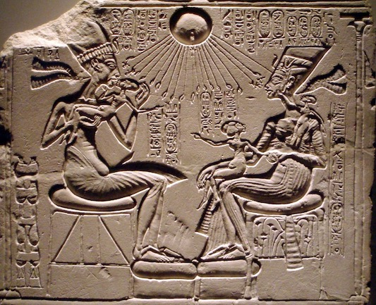
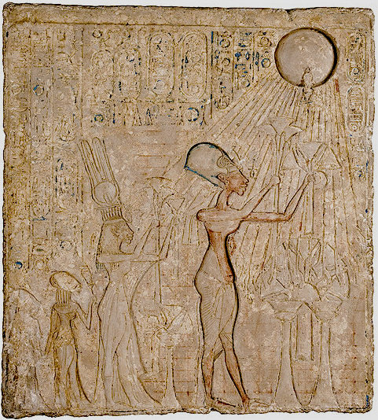

---
word_english: light  
word_hebrew: מָאוֹר   
transcription: <i>māʾōr</i>     
title: light (source)  
semantic_fields: light  
contributors: raymond_de_hoop, cornelis_houtman  
first_published: 2011-03-24  
last_update: 2019-11-16
update_info:  

---

##Introduction

Grammatical type: n.m.  
Occurrences:  19x HB (15/1/3); 1x Sir.; 23x Qum.; 0x Inscr. (Total: 43).

* Torah: Gen 1:14, 15, 16 (3x); Exod 25:6;[^1] 27:20; 35:8, 14 (2x), 28; 39:37; Lev 24:2; Num 4:9, 16.
* Nebiim: Ezek 32:8.
* Ketubim: Pss 74:16; 90:8; Prov 15:30.
* Ben Sira: 43:4 (mss B, Mas).
* Qumran:[^2] 1QHod<small>a </small>[^3] IX:13; XIII:34; XV:28; XVII:26; XX:8; XXIII:32;[^4] 1Q28 (1QS) X:3; 1Q28<small>b</small> (1QS<small>b</small>) IV:27; 1Q33 (1QM) X:11; XIII:10; 1Q34<small>bis</small> (1QFestival Prayers<small>ab</small>) fr3.II:1; 4Q256 (4QS<small>b</small>) XIX:1; 4Q286 (4QBerakhot<small>a</small>) fr1.II:3; 4Q287 (4QBerakhot<small>b</small>) fr1:1; 4Q301 (4QMyst<small>c</small>?) fr2<small>b</small>:4; 4Q402 (4QShirShabb<small>c</small>) fr12:2;	4Q418 (4QInstr<small>d</small>) fr1:5; 4Q429 (4QHod<small>c</small>) fr3:5;[^5] 4Q440 (4QHod-like C) fr1:1; 4Q503 (4QpapPrQuot) fr215:6; 4Q504 (4QDibHam<small>a</small>) fr8<i>verso</i>:1; 4Q511 (4QShir<small>b</small>) fr2.I:8; 11Q5 (11QPs<small>a</small>) XV:10 (136:7).
* Text doubtful: 1QHod<small>a</small> frC.6:2; 4Q185 (4QSapiential Admonitions B) fr1-2.III:2; 4Q258 (4QS<small>d</small>) VIII:12; 4Q260 (4QS<small>f</small>) II:2;  4Q299 (4QMyst<small>a</small>) fr5:1; 4Q392 (4QWorks of God) fr1:9; 4Q416 (4QInstr<small>b</small>) fr1:7; 4Q422 (4QparaGenExod) II:12; 4Q427 (4QHod<small>a</small>) fr8.II:11; 4Q432 (4QpapH<small>f</small>) fr1:1; 4Q495 (4QM<small>e</small>) fr2:1. 

### Text Doubtful

<b> A.1</b>  All the texts listed here as ‘doubtful’, seem to have included the word מאור in one way or another. Yet, most of these readings are reconstructions based on parallel texts. Although most of them seem likely, they are not included in this list of occurrences.

<b> B.1</b> In Prov 15:30 the critical apparatus of <i>BHS</i> proposes to read 
מַרְאֵה־עֵינַיִם / מָרְאֵה, ‘the sight of the eyes’,
 instead of MT 
מְאוֹר־עֵינַיִם 
(without reference to LXX’s reading,
θεωρῶν ὀφθαλμὸς καλὰ, 
‘the eye that observes good things’; 
see below, 
<a href="#lxxprov">section 4.a</a>).
Michael Fox suggests that this reading would be in line with LXX, resulting in 
the following text: 
מַרְאֵה־עֵ֭ינַיִם יְשַׂמַּֽח־לֵ֑ב, ‘the sight of the eyes makes the heart glad’. 
He argues that the words ‘the sight of the eyes’  would refer to something 
that is visible and desirable to the viewer.[^6] 
MT ’s  מְאוֹר־עֵינַיִם יְשַׂמַּח־לֵב, ‘light of the eyes gladdens the heart’, would mean
something like ‘<i>joy</i> or <i>vitality</i> makes the heart glad’ 
(comparable to 
the idiom with אוֹר in 1 Sam 14:27, 29; Ps 13:4; Prov 29:13). 
According to Fox (2009:604) this would be awkward and tautologous.
In his view מְאוֹר־עֵינַיִם, ‘light of the eyes’ cannot refer to one’s own eyes, 
‘because that would be the <i>effect</i> of the glad heart, not … its cause’ (Fox 2009:604). 
The solution offered by <i>e.g.</i> Delitzsch (1873:257-58; see also Plöger 1984:184-85) 
that it does not refer to one’s own eyes, but to the bright eyes of another person, 
thus their smiles and favour, is rejected by Fox since ‘the light of the eyes’ is not used in this way (Fox 2009:604).
Although the other Versions appear to presuppose  מָאוֹר (cf. below, <a href="#AV">section 4</a>), a different reading in the pre-MT version of the text is possible. However, a reading- or 
writing-error of מראה &gt; מאור is unlikely. Fox (2015:243; cf. p. xv)
suggests metathesis of רא &gt; אר, as well as a change (or misconstrual) of 
orthography, and the association of two words in the same semantic field. Three errors in order to misconstrue one word would require a rather clumsy scribe. In his commentary Fox did not take into consideration the complete reading of LXX, 
which not only read one word θεωρέω, ‘to look at, to behold, to see’, as the rendering of the Hebrew word, but apparently offered an interpretation of the Hebrew original 
by rendering θεωρῶν ὀφθαλμὸς καλὰ, ‘the eye that observes good things’ (<i>NETS</i>). In his text edition of Proverbs Fox (2015:243) suggests that LXX added καλά, ‘good, beautiful’ 
for ’logical clarity’, because not everything the eye sees is pleasing. This ‘adjustment’ would only make sense in 
response to מראה, ‘sight, appearance, vision’, instead of מאור, ‘light’, 
in the source text. 
Indeed, as Fox states himself (2015:243), not everything the eye sees, pleases the heart,
and it is questionable whether such a saying would fit into the book of Proverbs.   
Thus, in addition to the fact that we have to assume that MT was copied by a rather clumsy scribe, 
who makes three errors in one word, we also 
have to assume that LXX added the word καλά  
to ‘correct’ the original proverb. 
4QProv<small>b</small> has not been well preserved, nevertheless, the extant fragment 
containing 15:30 reads [מאו]ר̊ עינים, which indicates that 4QProv has a similar reading to 
MT.[^14] 
The likelier option is that LXX was not translating a different word than the other 
Versions, but sought to interpret the expression מְאוֹר־עֵינַיִם.[^15]
This is in line with the translation technique of the LXX-translator of Proverbs, 
who was sometimes extremely free, and (perhaps appropriately when translating proverbs) actively interpreted his <i>Vorlage</i>.[^16]   
The reading of MT might be understood in two ways. First, the most frequently adopted reading
is, that
‘light’ indicates something positive that somebody sees and that this gladdens the heart, 
and that this parallels ‘a good report’ (שְׁמוּעָה) in the next colon (v. 30B). 
Another possibility, however, is to understand the word מָאוֹר literally, 
as happened in later usage: מְאוֹר עֵינַיִם, ‘eye-sight’.[^17] 
Whichever one prefers, MT makes sense and does not require conjecture. 

<b> B.2</b> 
In Song 4:9 we read לִבַּבְתִּ֙ינִי֙ בְּאַחַד מֵעֵינַ֔יִךְ, ‘you captured my heart 
with one of your eyes’, 
which seems grammatically awkward because of the incongruence of אַחַד (msc.) and
עַיִן (fem.). 
Furthermore, Wilhelm Rudolph argued that this reading is practically impossible because
‘she sees with both eyes’ (‘sie sieht ja mit beiden Augen’). For that reason he proposed the reading 
בְּאַחַד מְאוֹרֵי מֵעֵינַ֔יִךְ, ‘with one glance of your 
eyes’.[^18]   
The textual witnesses  (incl. 4QCant<small>b</small>) do not indicate a problem in the text,[^19] 
except that the <i>Qere</i> suggests the reading 
בְּאַחַת (fem.) to compensate for the incongruence. 
However, as was indicated by other scholars 
עַיִן is not dealt with everywhere as a feminine, namely in
Zech 3:9, 4:10; Job 21:20; Song 6:5.[^20]
The morphology of the numeric noun אֶחָד is not unproblematic and 
the forms were not applied in an absolutely consistent 
manner, for instance with רֹתֶם אֶחָת and רֹתֶם אֶחָד 
in 1 Kgs 19:4-5.[^21] 
Even more important is the fact that if the numeral אֶחָד is applied before 
a substantive in the genitive it is a substantive itself and thus does not adjust its gender 
or number, as in: אַחַד הֶהָרִים (Gen 22:2; cf. 37:22).[^22]
Othmar Keel instead interprets  עֵינַיִךְ as ‘look, glance’, which would also solve 
Rudolph’s other problem (‘she sees with both eyes’).[^23]
In conclusion, Rudolph’s proposal in Song 4:9 is to be rejected and the text might be rendered
(after Keel):

&nbsp;&nbsp;&nbsp;<i>You captured my heart, my love, my bride!</i>  
&nbsp;&nbsp;&nbsp;&nbsp;&nbsp;<i>You captured my heart, with one of your glances,</i>  
&nbsp;&nbsp;&nbsp;&nbsp;&nbsp;&nbsp;&nbsp;&nbsp; <i>with one coil of your necklace.</i>

<i>Ketiv</i>/<i>Qere</i>: none.[^24]

##1. Root and Comparative Material

<b> A.1</b> מָאוֹר is derived from the √ אור, ‘be light’,[^25] 
which has numerous derivatives in the Hebrew Bible, such as 
אוֹר, ‘light’, 
אוּר, ‘fire’, 
אוֹרָה, ‘light’, 
מְאוּרָה</i>, ‘light-hole’;
while the root is also applied in l.n./p.n. 
אוּר, ‘Ur’,
and p.n.: 
אוּרִי, ‘Uri’, 
אוּרִיאֵל, ‘Uriel’, 
אוּרִיָּה(וּ), ‘Uriyah(u)’, and 
יָאִיר, ‘Jair’. 

<b> A.2</b> The 
√<i>ʾwr</i> seems to be Hamito-Semitic (<i>DRS</i>, 13; <i>HSED</i>, 35), but only in NWSem languages is it fully developed. 
Yet, the root is not unequivocally  attested in NWSem epigraphical texts but only in uncertain contexts.[^27]
 In Akk. the root is attested as <i>urru</i> (<i>ḫurru</i>), ‘day, daylight’ (<i>CAD</i> U/W, 243-44;  <i>AHw</i> iii:1433). 
Ug. also applies the verb <i>ʾir</i>, ‘to shine’[^29] 
and the nomen <i>ʾar</i>/<i>ʾir</i>, ‘light’.[^30]
However, the word <i>mʾwr</i>/מָאוֹר itself is only found in BHebr., Sam., Qum., 
LMHebr., and Jewish Aramaic. 

<b> A.3</b> <i>Post-biblical Hebrew</i>: the word מאור is attested as 1. ‘luminary, light’; 2. ‘light-hole, opening, window’ (cf. BHebr. מְאוּרָה</i>).[^31]

<b>A.4</b> <i>Jewish Aramaic</i>: 
the word מאור, ‘light’ occurs again in an inscription of the synagogue in Synchar, l. 7: ומאורה דקה(לה), ‘the light of the congregation’ (<i>ATTM</i>, 401-02, 506), 
and in T<small>F</small> to Exod 13:22 מאור עמודא דעננא, ‘the light of the pillar of 
fire’.[^33]

<b>A.5</b> <i>Samaritan Aramaic</i>: 
מָאוֹר is attested in the sense of 
‘light’, ‘luminary’ and it is applied as an epithet for Moses and Aaron (Tal, <i>DSA</i>, 14.). Furthermore it is applied to render Heb. מָאוֹר in Gen 1:16; Exod 35:14<small>1</small>; Num 4:9 in T<small>Smr</small> (see below, §4.c).

##2. Formal Characteristics

<b> A.1</b> מָאוֹר (spelt once מָאֹר, Exod 25:6)
is a  <i>maqāl</i>-formation of the 
√אור.[^35] 
Nouns with the preformative מ are mainly abstract nouns, nouns of place and 
nouns of instrument.[^36]

##3. Syntagmatics

<b> A.1</b>  מָאוֹר occurs in the singular absolute (e.g. Gen 1:16; Exod 35:14; Ps 74:16), 
in the singular construct as מְאוֹר (Ps 90:8; Prov 15:30), 
as well as plural (with fem. ending): מְאוֹרֹת (Gen 1:15)
and מְאֹרֹת (Gen 1:14, 16).
The plural construct occurs only once with masc. ending: 
מְאוֹרֵי in Ezek 32:8; while in the texts from the Judean Desert it occurs 
with the fem. ending: מאורות. 

<b> A.2</b>  מָאוֹר occurs as <i>nomen regens</i> of: 
אוֹר, ‘light’ in Ezek 32:8; 
כבודו, ‘his glory’ in 4QShir<small>b</small> fr2.I:8; 
עֵינַיִם, ‘eyes’ in Prov 15:30; 
עולם, ‘long time’ in 1QHod<small>a</small> XV:25; 
פני, ‘my face’ in 1QHod<small>a</small> XIII:32; 4QHod<small>c</small> fr3:5;  
פָּנֶיךָ, ‘your face’ in Ps 90:8. 

<b> A.3</b>   מָאוֹר is <i>nomen rectum</i> of:[^37]  
דבר, ‘word’ in 4QDibHam<small>a</small> 
fr8<i>verso</i>:1;  
חקה, ‘law, statute’ in 1QHod<small>a</small> XX:5;  
לשאון, ‘for a/the noise of’  in Sir 43:4 (Ms-B); 
לשון, ‘tongue’ in Sir 43:4 (Ms B-margin and M); 
מלא[כי], ‘angels’ in 4QShir<small>b</small> fr2.I:8; 
מְנֹרָה, ‘lampstand’ in Exod 35:14; Num 4:9; 
צבא, ‘army’ in 1QM X:11;  
שר, ‘prince’ in 1QM XIII:10;  
שֶׁמֶן, ‘oil’ in Exod 35:14; 39:37; Num 4:16. 

<b> A.4</b>   מָאוֹר in nominal clauses: 
כי אתה לי מאור עולם, ‘for you are my everlasting luminary’, 1QHod<small>a</small> XV:25.

<b>A.5</b> Verbs   
<b>A.5.1</b> מָאוֹר is subject of:  
אור <i>hiph.</i>, inf.cstr., ‘to give light, to shine’, Gen 1:15;  
בדל <i>hiph.</i>, inf.cstr., ‘to separate, to divide from’, Gen 1:14;  
גלה <i>qal</i>, ‘to uncover, reveal’ in 1QHod<small>a</small> XXIII:32 (= <i>DSS.SE</i> XXIII-<i>bottom</i>:12); 
היה <i>qal</i> jus., ‘to be’, Gen 1:14; 
חשׁך <i>qal</i>, ‘to be dark’ in 1QHod<small>a</small> XIII:32; 
שׂמח <i>pi.</i>, ‘to gladden, make someone merry’, Prov 15:30. 

<b>A.5.2</b> מָאוֹר is <i>nomen rectum</i> with a verbal form of: 
באופיע, inf.cstr. (‘in the shining of’) 1QS X:3.

<b> A.5.3</b>   מָאוֹר is the [direct] object of:  
אור <i>hiph.</i>, ‘to give light, to shine’, 1QHod<small>a</small> XVII:26-27;  
כון <i>hiph.</i>, ‘to prepare, make ready, to set up’, Ps 74:16;  
עשׂה <i>qal</i>, ‘to do, make’, Gen 1:16 (3x with part. אֵת);  
פתח <i>qal</i>, ‘to open’, 4QHod-like C 
fr1:1;  
קדר <i>hiph.</i>, ‘to darken’, Ezek 32:8.

<b> A.5.4</b>   מָאוֹר is governed by לְ:  
היה <i>qal</i>, ‘to be’, Gen 1:15;   
שׁית <i>qal</i>, ‘to put, set’, Ps 90:8.

<b> A.6</b>  מָאוֹר is specified by the following adjectives: 
גָּדוֹל, ‘great’, Gen 1:16 (2x); 1QHod<small>a</small> XX:5; 1QFestival Prayers<small>ab</small> II:1; 4QHod-like C fr1:1;  
פלא, ‘wonderful’, 4QBerakhot<small>a</small> fr1.II:3; 
קָטֹן, ‘small’, Gen 1:16.

<b> A.7</b>  מָאוֹר is used in a prep. construction with לְ: 
שֶׁמֶן [... ] לַמָּאוֹר,[^38] 
Exod 25:6; 27:20; 35:8; 35:28;[^39]
Lev 24:2.

##4. Ancient Versions

<b>a. Septuagint (LXX) and other Greek versions (α´/ σ´/θ´):</b>

* θεωρέω … καλὰ, ‘to observe / notice visually … good things’[^40] (cf. discussion above, <a href="#introb1">introduction, B.1</a>): 
Prov 15:30<small>LXX</small>;
* πυρώδης, ‘fiery, fire-like’:[^41]
Sir 43:4<small>LXX</small>;
* φαίνω, ‘to shine’:[^42] Ezek 32:8<small>LXX</small>, Ps 89:8<small>σʹ</small> (90:8<small>MT</small>);
* φαῦσις,  ‘light … illumination’:[^43] 
Gen 1:15<small>LXX</small>; Exod 25:6<small>αʹσʹθʹ</small>; 35:8<small>σʹ</small>; Lev 24:2<small>αʹσʹθʹ</small>; Ps 73:16<small>LXX</small> (74:16<small>MT</small>);[^44]
* φῶς, ‘light’:[^45] Exod 27:20<small>LXX</small>; 35:8<small>θʹ</small>, 14<small>1: LXX</small>, 14<small>2: θʹ</small>, 28<small>θʹ</small>; 39:16<small>LXX</small> (39:37<small>MT</small>); Lev 24:2<small>LXX</small>; Num 4:16<small>LXX</small>; Ps 73:16<small>θʹ</small> (74:16<small>MT</small>);
* φωστήρ, ‘that which gives out light’:[^46] 
Gen 1:14<small>LXX</small>, 15<small>αʹ</small>, 16<small>LXX</small> (3x ); Ps 73:16<small>αʹσʹ</small> (74:16<small>MT</small>); Prov 15:30<small>αʹ</small>; 
* φωτίζω, ‘to illumine, to provide light’:[^47] 
Num 4:9<small>LXX</small>;
* φωτίσμος, ‘light’:[^48] 
Ps 89:8<small>LXX</small> (90:8<small>MT</small>); Prov 15:30<small>σʹ</small>; 
* No rendering: Exod 25:6<small>LXX</small>; 35:8<small>LXX</small>, 14<small>1: θʹ</small>,	14<small>2: LXX</small>, 28<small>LXX</small>.[^49]

<b>b. Peshitta (Pesh):</b>

* ܢܗܝܪܐ (<i>nahhīrā</i>),
‘light’:[^50]
Gen 1:14, 16 (3x); Ezek 32:8;
* ܢܗܪ (<i>nhr</i>),
<i>aphel</i>, ‘to give forth light, to shine brightly’:[^51] 
Gen 1:15,
Exod 25:6; 27:20; 35:8, 14 (2x), 28; 39:37; Lev 24:2; Num 4:9, 16;
* ܢܘܗܪܐ
(<i>nūhrā</i>), ‘light, brightness’:[^52] Pss 74:16; 90:8; Prov 15:30;
* ܢܘܪܐ (<i>nūrā</i>),
‘fire’:[^53] Sir 43:4.

<b>c. Targum (Tg: O/PsJ/N/Smr/J/K):</b>

* אַנְהוֹרֵי, ‘lighting, illumination’:[^54] Exod 35:14<small>1: O,PsJ</small>; 	Num 4:9<small>O,PsJ</small>; 
* אַנְהֹרָה, ‘giving of light’:[^55]
Exod 35:14<small>1: </small><small>N</small>; 	35:14<small>2: </small><small>Smr</small>, 	28<small>Smr</small>; 	39:37<small>Smr</small>;[^56]  Lev 24:2<small>Smr</small>; Num 4:16<small>Smr</small>; 
* אַנְהָרוּ, ‘lighting, illumination’:[^57] Exod 25:6<small>O,N</small>; 27:20<small>N</small>; 	35:8<small>O,PsJ,N,Smr</small>, 	14<small>2: </small><small>O,N</small>, 	28<small>O,PsJ,N</small>; 	39:37<small>O,PsJ,N</small>; 	Lev 24:2<small>N</small>; 	Num 4:9<small>N</small>, 	16<small>O,PsJ,N</small>; 
* מָאוֹר ‘light’[^58]
	Gen 1:16<small>Smr</small> (3x); 	Exod 35:14<small>1: </small><small>Smr</small>; 	Num 4:9<small>Smr</small>; 
* נְהוֹר, sg. and plur.
‘light’:[^59] 
	Gen 1:14<small>O,PsJ,N</small>, 	15<small>O,PsJ</small>, 	16<small>O,PsJ,N</small>   (3x); 	Ps 90:8<small>K</small>; 	Prov 15:30<small>K</small>; 
* נהר, ‘to give light, illumine’:[^60] 
Gen 1:15<small>N</small>; 	Exod 25:6<small>PsJ</small>; 	27:20<small>O,PsJ,Smr</small>; 	Lev 24:2<small>O,PsJ</small>; 	Ezek 32:8<small>J</small>;[^61] 
* נַהֲרוּ ‘light’:[^62] 
Exod 25:6<small>Smr</small>; 
* סַהַר ‘moon’:[^63] Ps 74:16<small>K</small>;
* No rendering: Exod 35:14<small>2: PsJ</small>. 

<b>d. Vulgate (Vg):</b> 

* <i>aurora</i>, ‘dawn, daybreak’:[^64] 
Ps 73:16 (74:16<small>MT</small>);[^65]
* <i>igneus</i>,  ‘fiery’:[^66] 
Sir 43:4;
* <i>ignus</i>, ‘fire’:[^67]  Exod 35:14<small>2</small>; 
* <i>inluminatio</i>, ‘a lighting up, enlightening’:[^68] Ps 89:8 (90:8<small>MT</small>);[^69]
* <i>luceo</i>, ‘to be light, to shine’:[^70] Gen 1:15;
* <i>lucerna</i>, ‘lamp, oil-lamp’:[^71]  Num 4:16;
* <i>lucidus</i>, ‘clear, bright’:[^72]  Lev 24:2;
* <i>luminare</i>, 
‘that which gives light, luminary, lamp’:[^73] 
Gen 1:14, 16 (3x); Exod 25:6; 35:8, 14<small>1</small>, 28;  Ezek  32:8; Ps 73:16 (74:16<small>MT</small>);[^74] 
* <i>lux</i>, ‘light’:[^75] Ps 89:8 (90:8<small>MT</small>);[^76] Prov 15:30;
* No rendering: Exod 27:20; 39:37; Num 4:9.

<b> A.1</b> It appears that the hexaplaric witnesses worked with a kind of standard vocabulary and preferred to translate every occurrence of a term in the same way, irrespective of context. In this way we see that α´ and  σ´ preferred to render מָאוֹר with φωστήρ, ‘that which gives out light, luminary’, while θ´ preferred to apply φῶς, ‘light’. There seems to be a certain tendency in the Hexaplaric witnesses to translate each occurrence with the same Greek word and thus to harmonise the translation.

<b> A.2</b> The Greek translation relates the Hebrew word  מָאוֹר to the verb אוֹר <i>hiph.</i>, ‘give light, shine, illuminate’. The word φαῦσις  is used exclusively for מָאוֹר, while φωτίσμος  and to a very large degree φῶς  are used to render אוֹר. The word φωστήρ  is applied to  מָאוֹר as well as to זֹהַר, shining, splendour’.[^77] Apparently the translators did not regard the word מָאוֹר as an object, but as a word which described the effect of ‘(giving) light’, <i>viz.</i> an abstractum. 

<b> A.3</b>  The Targumists chose a number of verbal nouns derived from √נהר, ‘to illuminate, shine, give light’,[^78] resulting in nominal renderings like ‘lighting, illumination’.[^79] 
Aram. נהר and derivates are used in Tg to represent the following words in MT: 
אוֹר, ‘light’; אור, <i>qal</i>: ‘to be bright’, <i>hiph.</i>: ‘to shine, brighten’; אוֹרָה I, ‘light, joy’; נגה, gleam, shining’; נֵיר, ‘lamp’;[^80] חזה, ‘to see, perceive’;[^81] נהר <i>qal</i>, ‘to shine’; זרח <i>qal</i>, ‘to shine.[^82] Apparently the Targumists interpreted the Hebr. מָאוֹר as closely related to its √אור.

<b> A.4</b> The remarks regarding the translation of Tg apply to the interpretation of Pesh as well.

<b>A.5</b> In the Vulgate of Exod 25:6; 35:8, 28 the text  שֶׁמֶן לַמָּאֹר is rendered <i>oleum ad luminaria concinnanda</i>, ‘oil to make lights’ (dynamic equivalent translation). In Exod 35:14<small>1</small> וְאֶת־מְנֹרַת הַמָּאוֹר is translated in a similar way: <i>candelabrum ad luminaria sustentanda</i>, ‘candle to support the lights’. In Exod 35:14<small>2</small> שֶׁמֶן הַמָּאוֹר is rendered <i>oleum ad nutrimenta ignium</i>, ‘the oil for nourishing the fires’ (dynamic equivalent translation of the <i>nomen rectum</i> הַמָּאוֹר). 

<b>A.6</b> In Ezek  32:8 the construction מְאוֹרֵי אוֹר is represented with one word in Vg: <i>luminaria</i>.
 
<b>B.1</b> The rendering of מאור in Sir 43:4 apparently raised some problems, since the three ancient Versions, LXX, Pesh, and Vg, each used a word which was not used elsewhere to represent the Hebrew word מאור: πυρώδης, ‘fiery, fire-like’;[^83] ܢܘܪܐ 
(<i>nūrā</i>), ‘fire’;[^84] <i>igneus</i>, ‘fiery’.[^85] Hatch & Redpath, and Muraoka suppose that Gr. πυρώδης  represents 
Hebr. אוּר I, ‘fire’,[^86] but they do not explain the מ-prefix of מאור, which is found in two mss (B-margin and M). It is more likely that the translator did read לשון מאור, ‘tongue, ray of light’, 
but sought to interpret the expression with a more frequently attested expression  לְשׁוֹן אֵשׁ, ‘tongue of fire’ (Isa. 5:24; 1QLit.3Tongues of Fire fr1.3, fr2.3; 4QApocrMoses<small>b</small> fr1.II.1),[^87] and which was better suited to a context describing the extreme heat of the sun.[^88] This reading common to LXX, Pesh and Vg can be explained by the dependency of the translators of Pesh and Vg on LXX.[^89]

<b>B.2</b> In the rendering of Hebr. מָאוֹר in Num 4:16 by <i>lucerna</i>, ‘lamp, oil-lamp’ in Vg, we are confronted for the first time in the Versions with a word that clearly refers to a lamp as a source of light. Of course the word <i>luminare</i> (e.g. in: Exod 35:8, 14<small>1</small>, 28) could also be rendered in English by the word ‘lamp’.[^90] But this depends on the interpretation of the texts of Vg to which it was applied. The word <i>luminare</i> is derived from <i>lumen</i>, ‘light’, which also can represent an object, viz. ‘a light, a source of light’, but also ‘brightness, splendour, bright colour, daylight’ etc.[^91] The same kind of transfer from the source to its object can be discerned regarding the word <i>luminare</i>, which is applied to ‘I. a luminary, heavenly body’; ‘III. a window-shutter, window’, but also to: ‘II. a <i>light, lamp</i> burned in the Jewish temple and in Christian churches’.[^92] However, in line with the etymological development of the word, the rendering into English would be more correct if the more general word ‘a light, source of light’ were applied. In that case, only the rendering of Vg in Num 4:16 suggests that we are dealing with
an implement, viz.  ‘a lamp’. Obviously the translator struggled with the terminology since the expression שֶׁמֶן הַמָּאוֹר was rendered in a dynamically equivalent manner (cf. above, A.2), which might indicate that he had not found a satisfactory equivalent in Latin, or even 
that he was not clear on what the Hebr. word מָאוֹר meant. 

##5. Lexical/Semantic Fields

<b>A.1</b>  מָאוֹר occurs in the creation story in the plural (מְאוֹרֹת) as the entities that shall separate (בדל) night from day. It is an echo of the first day (Gen 1:3-5), when the light (אוֹר) was created (Jacob 1934:48-49). 
מְאוֹרֹת in vv. 14-15 is the designation for all the entities in the full expanse (רָקִיעַ) of the sky, the sun, moon and the stars. Later the adjectives ‘great’ (גָּדֹול, 2x) and ‘small’ (קָטֹן, 1x) 
serve to single out the sun and the moon. In Ezek 32:7-8 a similar usage can be discerned, where first in v. 7
stars (כּוֹכָב), sun (שֶׁמֶשׁ) and moon (יָרֵחַ)
are mentioned and subsequently are summarised in one description: כָּל־מְאוֹרֵי אוֹר, ‘all lights that shine’ (NJPS). In Ps 74:16 מָאוֹר is used in juxtaposition with the sun (וָשָׁמֶשׁ, ‘and sun’), which might suggest that ‘sun’ is more specific: ‘you established light and sun’.[^94] 

<b>A.2</b> In the non-biblical Dead Sea Scrolls the expression מאור גדול is used several times 
as a designation for the sun (1QHod<small>a</small> XX:5; 1QFestival Prayers<small>ab</small> II:1; 4QHod-like C fr1:1). The expression מאורות גדולים is also found in 11QPs<small>a</small> frD.XV:10 (= Ps 136:7), where MT has אוֹרִים גְּדֹלִים. It is applied in combination with words for light (אור, 1QHod<small>a</small> XX:5), 
and day (יום,  1QHod<small>a</small> XX:5; 1QFestival Prayers<small>ab</small> II:1), and —
in line with Gen 1:14-16 — considered to have dominion (ממשלה, 1QHod<small>a</small> XX:5; 4QHod-like C fr1:1) over the day, and have its own laws (חוקות, 1QHod<small>a</small> XX:5; 1QFestival Prayers<small>ab</small> II:1-2). In this sense the plural (מאורות) is also applied to the lights (צבא מאורות, ‘army of lights’, 1QM X:11) that shine from the ‘holy vault’ (מזבול קודש, 1QS X:3; 
4QS<small>b</small> XIX:1; 4QS<small>f</small> II:2).   
The word מאור seems to be related to holiness because the lights all shine from holy places.
On the other hand, holiness is also compared to מאור (1QS<small>b</small> iv:27)
and the מאורי פלא, ‘wonderful lights’, are part of God’s glory (4QBerakhot<small>a</small> 
fr1.II:1-3). They are paralleled to angels and spirits, 
1QHa IX:11; 4QShir<small>b</small> f2.I:8.

<b>A.3</b>  מָאוֹר occurs in the context of the description of the Tabernacle and its furniture. With the exception of  Exod 35:14<small>1</small> and Num 4:9 it is always used here in combination with שֶׁמֶן, ‘(olive)oil’. It occurs in two specific combinations: 

1. שֶֶׁמֶן לַמָּאוֹר (Exod 25:6; 35:8, 28)[^95], further particularized as שֶׁמֶן זַיִת זָךְ כָּתִית לַמָּאוֹר, ‘pure beaten olive oil 
for the מָאוֹר’ (Exod 27:20; Lev 24:2); 
2. שֶׁמֶן הַמָּאוֹר  (Exod 35:14<small>2</small>; 39:37; Num 4:16). 

According to Exod 27:20; Lev 24:2 the ‘oil לַמָּאוֹר’ is intended for the permanent maintenance of the lamp 
(<a href=http://www.otw-site.eu/wp-content/uploads/2017/07/nr.pdf target="_blank">→ נֵר</a>). 
As such the oil is mentioned together with the implements 
(<a href=http://www.otw-site.eu/wp-content/uploads/2017/07/kly.pdf target="_blank">→ כְּלִי</a>) and lamps 
(<a href=http://www.otw-site.eu/wp-content/uploads/2017/07/nr.pdf target="_blank">→ נֵר</a> plur.) 
of the lampstand 
(<a href=http://www.otw-site.eu/wp-content/uploads/2017/07/mnrh.pdf target="_blank">→ מְנֹרָה</a>) 
in Exod 35:14; 39:37, to which are added other utensils in Num 4:9. The oil for (the) מָאוֹר figures among the valuable substances used in the Tabernacle (Num 4:16). From Exod~27:20; Lev 24:2 the conclusion can be drawn that מָאוֹר is not to be equated with נֵר, ‘lamp’.[^96]

<b>A.4</b>  מָאוֹר is a few times used as <i>nomen regens</i> of face (פָּנֶה, Ps 90:8; 1QHod<small>a</small> XIII:32; 4QHod<small>c</small> fr3:5[^97]) and eyes (עֵינַיִם, Prov 15:30). The first combination (מאור פני[ך]) finds a parallel usage in the construct chain אֹור פני(ך) (מלך), the light of my / your / the king’s face (Pss 4:7; 44:4; 89:16; Job 29:24; Prov 16:15). It is contrasted to darkness (חשך), 1QHa xiii:32; xvii:26; 4QHod<small>c</small> fr3:5;[^98] but also combined with אור (1QHa xvii:26; 4QMyst<small>c</small>? fr2:4). It is also used to describe the power  assisting God to protect his people, viz. the ‘prince of light’ (שר מאור, 1QM XIII.10), and, finally, God is described as an מאור עולם, ‘everlasting light’ in 1QHa xv:25. 

##6. Exegesis
 
###6.1 Literal Use

<b>A.1</b> The word מָאוֹר in Gen 1:14-16; Ezek 32:8; Ps 90:8 is rendered as ‘light’,[^99] ‘licht’,[^100] ‘lumbrera, astro’,[^101] ‘coeli luminibus’,[^102] ‘Leuchte’,[^103] ‘Licht, Lichtkörper’[^104] (for the rendering ‘Leuchte(r), Lampe’, cf. below B.1); while the word in the scrolls from Qumran when occurring in a similar context is sometimes also rendered as ‘light’.[^105] Commentators agree that the word מָאוֹר is applied deliberately to the celestial bodies in Genesis 1, although their names, שֶׁמֶשׁ, ‘sun’ and יָרֵחַ, ‘moon’ as names of deities in Israel’s 
Umwelt,[^106] are not explicitly mentioned. With regard to the latter we may compare ‘the white one’ (הַלְּבָנָה, the moon) and ‘the hot one’ (הַחַמָּה, the sun) in Isa. 24:23. It is part of the theology of the narrator to suggest that these מְאוֹרוֹת are in fact the continuation of God’s creation of the light (אוֹר, 1:3) and as such are (only) <i>creations</i> by God for governing the day and the 
night—and that they are nothing more than that—in contrast to what was believed in Israel’s Umwelt.[^107]

<b>A.2</b> In Ezekiel 32 a dirge (in reality an oracle of doom) over the Pharaoh is given and — recalling the plague of darkness in Exod 10:21-29 (Greenberg 1997:653) — in Ezek 32:7 Pharaoh is threatened with a sky (שָׁמַיִם) that will be covered, stars (כֹּכְבֵיהֶם) that will be darkened, a sun (שֶׁמֶשׁ) that will be covered, and a moon (יָרֵחַ) that will not give its light (לֹא־יָאִיר אוֹרוֹ). In Ezek 32:8 this threat is summarized in everything that will be darkened above him כָּל־מְאוֹרֵי אוֹר, ‘all the lights that shine’,[^109] and darkness (חֹשֶׁךְ) will be brought upon the land. The genitive  כָּל־מְאוֹרֵי אוֹר may be explained in this case as a genitive of quality:[^110] ‘all of the lights of light’, viz. ‘all the bright lights’.[^111]

<b>A.3</b> In the context of the materials needed for the sanctuary in Exodus, Leviticus, and Numbers, the word מָאוֹר  occurs as nomen rectum with מְנֹרָה,‘lampstand’ and of שֶׁמֶן, ‘oil’ (or in a prep. construction with לְ[^112]). In this context it is rendered as ‘luminary, light’,[^113]‘light’,[^114] ‘illumination’,[^115] ‘lighting’,[^116] ‘Beleuchtung’,[^117] ‘res lucens, sidus’;[^118] but mostly it is rendered as a concrete object, such as ‘lamp’ or ‘Leuchter’ (for the rendering ‘Leuchte[r], Lampe’, cf. however, B.1, below).    
The construct chain מְנֹרַת הַמָּאוֹר (Exod 35:14; Num 4:9) is sometimes explained as: הַמָּאוֹר is the ‘sum of seven sacred lamps on golden lamp-stand’.[^119] However, Jacob Milgrom argues that the word מָאוֹר should not be interpreted as a noun, referring to an object used for lighting, because the construction with מְנֹרָה, ‘lampstand’, excludes the meaning ‘lampstand’ or ‘lamp’ for  מָאוֹר. Milgrom proposed to interpret the word as an infinitive construct (as in Aram.) to be rendered ‘for lighting’.[^120] This interpretation as an infinitive is unnecessary, however, because the word מָאוֹר can still be regarded as a noun, while the construct chain is best interpreted as a genitive of attribute with the word rendered as ‘light, lighting, shining’,[^121] and the construct chain literally as ‘the lampstand of the light’, i.e. ‘the shining / bright lampstand’ (cf. the parallel text, Exod 39:37 [see also Exod 31:8; Lev 24:4] which has הַמְּנֹרָה הַטְּהֹרָה, ‘the pure / bright lampstand’). 
Following this line of reasoning, the expression שֶׁמֶן לַמָּאוֹר (Exod 25:6; 27:20; 35:8; 35:28; Lev 24:2), could be translated as the ‘oil for the light(ing)’ in 
the sanctuary, and the construct chain שֶׁמֶן הַמָּאוֹר can be rendered as ‘the lighting oil’.[^122] 

<b>B.1</b> In addition to the translation of the word מָאוֹר in Gen 1:14-16; Ezek 32:8; Ps 74:16 (and in the non-biblical scrolls from Qumran) as ‘light’ etc. (see A.1, above) the word is frequently rendered more specifically as ‘luminary’,[^123] ‘Lichtträger, Leuchter’,[^124] ‘Leuchte, Lampe’,[^125] ‘Beleuchtungskörper, Lampe’,[^126] ‘lamps’.[^127] In the scrolls from Qumran with a similar meaning the word is mostly rendered as ‘luminary’.[^128] In the context of the materials needed for the sanctuary in Exodus, Leviticus, and Numbers, the word in construct with שֶׁמֶן, ‘oil’
is quite often rendered as 
‘luminary’[^129] ‘lámpara, candelabro’,[^130] ‘candelabrum’,[^131] ‘Leuchter’,[^132] ‘Leuchte, Lampe’,[^133] ‘Lichtträger’,[^134] ‘lamps’.[^135]   
However, if the word מָאוֹר is translated as ‘lamp’ or the like, the construction מְנֹרַת הַמָּאוֹר (Exod 35:14; Num 4:9) offers a real problem, because in that case 
we have a pleonasm: ‘the lampstand  of the lamp’. However, as has already been suggested in A.3 above, הַמָּאוֹר can be interpreted as a genitive of attribute, rendering it as ‘the bright lampstand’ (Houtman 2000:347-48). In both verses which mention the מְנֹרַת הַמָּאוֹר, ‘the bright lampstand’ (Exod 35:14; Num 4:9), reference is also made to the lamps of the lampstand: 
וְאֶת־נֵרֹתֶיהָ, ‘and its lamps’ (plur.! similarly in Exod 39:37), clearly indicating the difference in meaning between the two words מָאוֹר and נֵר.   
The expression שֶׁמֶן הַמָּאוֹר, however, is easily misunderstood and equated with the oil, which we know in our era, viz. ‘lamp oil’. Yet ‘lamp oil’ is a specific
kind of oil, whereas the oil mentioned for use in the sanctuary was not. The oil was ‘pure, beaten olive oil’, which was also used for cooking, and was prescribed for the sanctuary since it was better than the oil which was generally used in lamps (see Sarna 1991:175-76; Milgrom 2001:2086-87). In other words, it is not oil specificcally for lamps, but oil that could be used in lamps as well in order to light the sanctuary. Therefore it stands to reason, that the word מָאוֹר indicates the function for which the oil was to be applied (‘lighting’[^138]) rather than the object in which it was to be applied (‘lamp’),[^139] which is mentioned separately: לְהַעֲלֹת נֵר תָּמִיד, ‘to kindle a lamp continually’ (Exod 27:20; Lev 24:2). In this respect it is remarkable that מָאוֹר is nowhere used in the same way as the word נֵר ‘lamp’,[^140] whereas it is frequently used in the same way as the noun אוֹר, ‘light’ (cf. 
<a href="#Exe-fig">§&nbsp;6.2.A.4</a> below).
 
<b>B.2</b> With regard to Genesis 1 Gerhard von Rad stated that the text breathes a strong anti-mythological pathos, and that the expression ‘lamps’ (for מְאֹרוֹת) is deliberately prosaic and demeaning.[^142] The emphasis on the heavenly bodies as just מְאֹרוֹת in contrast to the ancient mythological concept of the sun, moon and stars as deities was criticized by Claus Westermann (1974:179), who called it even caricatural. His critical stance is based on the fact that in Egypt the sun-god Amon-Re was called ‘the living Lamp’ (Westermann 1974:179; also Gunkel 1910:109).
It can be added that the Akk. god Nusku is designated as <i>nūrū</i>, but even YHWH is called ‘lamp’ (נֵר, 2 Sam. 22:29[^145]), a concept which recurs in PNN as well (e.g. Neriah).[^146] Westermann therefore stresses the bare fact that the heavenly bodies are depicted as creations of God, while their function became simultaneously their designation.[^147] Their limitation is that they are part of creation and God has ordered their goal and function. Their name in the creation narrative is at the same moment their function. 

###6.2 Figurative Use

<b>A.4</b> מָאוֹר in Ps 90:8 and Prov  15:30 occurs as <i>nomen regens</i> in construct chains with respectively פָנִים, ‘face’ (of God) and עֵינַיִם, ‘eyes’ (of man) and is rendered as ‘luminary’,[^148] ‘radiante’,[^149] ‘lumen’,[^150] ‘light’,[^151] ‘Licht’,[^152] ‘leuchten’.[^153] In the scrolls from Qumran we find identical constructions, in which מָאוֹר is rendered mostly as ‘light’.[^154] Face and eyes are closely related and sometimes appear to be interchangeable. This is the case also in Ps 90:8 and Prov 15:30 where the source of light is a metaphor for the look reflecting the mood, the judgement and the feelings  of a person. This is reflected in the use of the construction מאור פני, ‘light of my face’, in Qumran, where it is said that it ‘darkened’ (ויחשך) in a time of stress and turmoil (1QHod<small>a</small> XIII:32;
4QHod<small>c</small> fr3:5). In the case of Ps 90:8 the (brightly burning) light is a metaphor for the 
penetrating look of YHWH, from whom nothing is concealed (Ridderbos 1958:399). In the case of Prov 15:30 an exhortation to kindness, the light is a metaphor for the favourable look of the highly-placed, who is the bearer of good news (cf. Prov 15:30b). As for its metaphorical meaning, ‘look’, there is no difference between the use of מָאוֹר in Ps 90:8 and Prov 15:30, nor in the use of אוֹר as <i>nomen regens</i> in a construct chain with פָנִים in Pss 4:7; 44:4; 89:16; Job 29:24; Prov 16:15.[^156]

###6.3 Pictorial Material

<b>A.5</b> If the interpretation of מָאוֹר as ‘light’ is correct, it is hard to find any iconographic material for the word מָאוֹר. Yet, the iconography from the Amarna period of Akhenaten might be illustrative, because it shows the attempt to visualize an abstract concept as ‘(ray of) light’ (see figs. 1-2). In the case of Akhenaten, however, the sun (Aten) was seen as the only god, whose rays of light were blessing hands, providing ‘life’.[^157]

&nbsp;&nbsp;&nbsp;&nbsp;&nbsp;&nbsp;&nbsp;&nbsp;

&nbsp;&nbsp;&nbsp;&nbsp;&nbsp;&nbsp;&nbsp;&nbsp;<small>Figure&nbsp;1:&nbsp;&nbsp;House-altar depicting the royal family before Aten[^158]</small>   
&nbsp;&nbsp;&nbsp;&nbsp;&nbsp;&nbsp;&nbsp;&nbsp;<small>(ÄM 14145; courtesy Ägyptisches Museum, Berlin)</small>  

&nbsp;&nbsp;&nbsp;&nbsp;&nbsp;&nbsp;&nbsp;&nbsp;

&nbsp;&nbsp;&nbsp;&nbsp;&nbsp;&nbsp;&nbsp;&nbsp;<small>Figure&nbsp;2:&nbsp;&nbsp;Stela of adoration of Aten by the royal family[^159]</small>  
&nbsp;&nbsp;&nbsp;&nbsp;&nbsp;&nbsp;&nbsp;&nbsp;<small>(courtesy Egyptian Museum, Cairo)</small>

##7. Conclusion

<b>A.1</b> In the HB מָאוֹר is found in all sorts of texts, particularly in the Torah; but also in Ben Sira and in the non-biblical scrolls from Qumran. 

<b>A.2</b> The word מָאוֹר is grammatically hard to classify because it might refer either to an abstract term or to an object. 

<b>A.3</b> Its use in cognate languages does not contribute to the discussion, since the languages in which the word מָאוֹר is attested are all later than, and influenced by BHebr. Nevertheless, in these languages the word’s meaning is restricted to ‘light’ in general, and as references to the heavenly bodies providing light, and (maybe) also as epithets for important figures (Moses). 

<b>A.4</b> In the Versions, the word is generally represented by verbs and nouns expressing ‘to shine, to give light’ and ‘light’, respectively.

<b>A.5</b> In the HB, Sir, and Q, the word מָאוֹר is nowhere used to denote an object, as is the case with for instance the word נֵר, ‘lamp’.

<b>A.6</b> The word is used to qualify especially the word שֶׁמֶן, ‘oil’ and מְנֹרָה, ‘lampstand’ which led in that context to the meaning ‘light, lighting (bright)’.

<b>A.7</b> The use of the word מָאוֹר as a designation for the sun, moon and stars in the creation story led quite often to the designation ‘luminary’, which is certainly a too modern 
rendering (Gunkel);  a simple ‘light’ (which might indicate also a light source as <i>abstractum pro concreto</i>) as a functional name seems appropriate.

##Bibliography

For the abbreviations see the 
<a href="/sahd/store/abbreviations/">List of Abbreviations</a>.

Aalders 1957   
	Gerhard Ch. Aalders, 
	<i>Ezechiël II: Hoofdstuk 25-48</i>
	(COuT), Kok: Kampen.

Aalen 1973 (1974) 
	Sverre Aalen, 
	‘אוֹר, <i>ʾôr</i>’,
	<i>ThWAT</i> 1:160-82 
	(ET 1974: <i>TDOT</i> 1:147-67).

Beek 1984   
	Martinus A. Beek, <i>Prediker – Hooglied</i> (PredOT),
	Nijkerk: Callenbach.

Beentjes 1997  
	Pancratius C. Beentjes, <i>The Book of Ben Sira in Hebrew: 
	A Text Edition of All Extant Hebrew Manuscripts and 
	a Synopsis of All Parallel Hebrew Ben Sira Texts</i> 
	(SVT, 68), Leiden: Brill.

Block 1998  
	Daniel I. Block, <i>The Book of Ezekiel: Chapters 25-48</i> 
	(NICOT), Grand Rapids (MI): Eerdmans.

Carbajosa 2016  
	Ignacio Carbajosa, ‘Primary Translations: Peshitta’, 
	<i>THB</i> 1A:262-78.

Conzelmann 1973 (1974) 
	Hans Conzelmann, 
	‘φῶς, φωτιζω, φωτισμός, φωτεινός, φωσφόρος, φωστήρ, 
	ἐπιφαύσκω, ἐπιφώσκω’, <i>ThWNT</i> 9:302-49
	(ET 1974: <i>TDNT</i> 9:310-58).

Cook 2000a  
	Johann Cook, 
	‘Textual Problems in the Septuagint Version of Proverbs’,
	<i>JNSL</i> 26/1:171-79.

Cook 2000b  
	Johann Cook, ‘Lexical Matters in LXX Proverbs’,
	<i>JNSL</i> 26/2:163-73.

Cook 2004  
	Johann Cook, ‘Exegesis in the Septuagint’,
	<i>JNSL</i> 30/1:1-19.

Dahood 1968  
	Mitchell Dahood, <i>Psalms II: 51-100, 
	Introduction, Translation, and Notes</i> (AB, 17),
	Garden City (NY): Doubleday.

Delitzsch 1873  
	Franz Delitzsch, <i>Salomonisches Spruchbuch</i>,
	Leipzig: Dörffling und Franke 
	(repr. Giessen: Brunnen-Verlag, 1985).

De Waard 1998  
	Jan de Waard, ‘4QProv and Textual Criticism’, 
	<i>Textus</i> 19:87-96.

Dohmen 2004  
	Christoph Dohmen, 
	<i>Exodus 19-40: Übersetzt und ausgelegt</i>
	(HThKAT), Freiburg: Herder.

Driver 1904  
	Samuel R. Driver, <i>The Book of Genesis 
	with Introduction and Notes</i> 
	(WC), London: Methuen & Co.

Forti 2017  
	Tova Forti, ‘Proverbs: Primary Translations – Septuagint’, 
	<i>THB</i> 1C:253-59.

Fox 2009  
	Michael V. Fox, 
	<i>Proverbs 10-31: A New Translation with Introduction and Commentary</i>
	(AB, 18B), New Haven: Yale University Press.

Fox 2015  
	Michael V. Fox, משלי 
	<i>Proverbs: An Eclectic Edition with Introduction
	and Textual Commentary</i> (HBCE, 1), Atlanta: SBL Press.

Gispen 1974 
	Willem H. Gispen, <i>Genesis vertaald en verklaard, 
	I: Genesis 1–11:26</i> 
	(COuT), Kampen: Kok.

Greenberg 1997   
	Moshe Greenberg, 
	<i>Ezekiel 21-37: 
	A New Translation with Introduction and Commentary</i>
	(AB, 22A), New York: Doubleday.

Gunkel 1910  
	Hermann Gunkel, 
	<i>Genesis übersetzt und erklärt</i> (HKAT, I/1) 
	3rd ed., Göttingen: Vandenhoeck & Ruprecht.

Houtman 2000  
	Cornelis Houtman, 
	<i>Exodus, volume 3: Chapters 20-40</i>
	(HCOT), Leuven: Peeters.

Houtman & De Moor 2005  
	Alberdina Houtman & Johannes C. de Moor (eds.), 
	<i>A Bilingual Concordance to the Targum of the 
	Prophets</i>, Volume 21: 
	<i>Introduction, Additions and Corrections, Indices</i>,
	Leiden: Brill.

Jacob 1934  
	Benno Jacob, 
	<i>Das erste Buch der Tora: Genesis 
	übersetzt und erklärt</i>, Berlin: Schocken Verlag
	(repr. New York: KTAV Publishing House, s.a.).

Jagersma 1995 
	Hendrik Jagersma, <i>Genesis 1:1–25:11</i> 
	(VHB), Nijkerk: Callenbach.

Keel 1992 
	Othmar Keel, <i>Das Hohelied</i> (ZBKAT, 18) 2nd ed.,
	Zürich: Theologischer Verlag.

König 1897 
	Eduard König, 
	<i>Historisch-comparative Syntax der Hebräischen Sprache: 
	Schlusstheil des Historisch-kritischen Lehrgebäudes 
	des Hebräischen</i>,
	Leipzig: J.C. Hinrichs’sche Buchhandlung.

König 1925 
	Eduard König, 
	<i>Die Genesis eingeleitet, übersetzt und erklärt</i>,
	3rd ed., Gütersloh: Bertelsmann.

Lange 2017  
	Armin Lange, ‘Proverbs: Ancient Hebrew Texts — Ancient Manuscript Evidence’, 
	<i>THB</i> 1C:248-50.

Levey 1987  
	Samson H. Levey, 
	<i>The Aramaic Bible</i>, Volume 13:
	<i>The Targum of Ezekiel Translated, with a Critical Introduction,
	Apparatus, and Notes</i>, Edinburgh: T&T Clark.

Levine 1993  
	Baruch A. Levine, 
	<i>Numbers 1-20: A New Translation with Introduction and Commentary</i>
	(AB, 4A), New York: Doubleday.

Lipiński 1995a (1999a) 
	Edouard Lipiński,
	‘Lamp, ניר,
	נר’, 
	<i>DDD</i>, 941-44
	(1999a – <i>DDD</i><small>2</small>, 504-05).

Lipiński 1995b (1999b)  
	Edouard Lipiński,
	‘Shemesh, שׁמשׁ’, 
	<i>DDD</i>, 1445-52
	(1999b – <i>DDD</i><small>2</small>, 764–68).

Maarsingh 1988   
	Berend Maarsingh, <i>Ezechiël, deel II</i> (PredOT),
	Nijkerk: Callenbach.

Milgrom 2001   
	Jacob Milgrom, 
	<i>Leviticus 23-27: A New Translation with Introduction and Commentary</i>
	(AB, 3B), New York: Doubleday.

Plöger 1984  
	Otto Plöger, <i>Sprüche Salomos (Proverbia)</i>, (BKAT, XVII),
	Neukirchen-Vluyn: Neukirchener Verlag. 

Pope 1977   
	Marvin H. Pope, 
	<i>Song of Songs: A New Translation with Introduction and Commentary</i>
	(AB, 7C), New York: Doubleday.

Propp 2006  
	William H.C. Propp, <i>Exodus 19-40: 
          A New translation with with Introduction and Commentary</i>
	(AB, 2A), New York: Doubleday.

Ridderbos 1958  
	Jan Ridderbos, <i>De Psalmen, II: Psalm 42-106</i>
	(COuT), Kampen: Kok.

Rudolph 1962   
	Wilhelm Rudolph, 
	<i>Das Buch Ruth — Das Hohe Lied — Die Klagelieder</i>
	(KAT), Gütersloh: Gerd Mohn 
	(repr. Berlin: Evangelische Verlagsanstalt, 1970).

Sæbø 1978  
	Magne Sæbø,
	‘אוֹר, <i>ʾôr</i>, Licht’,
	<i>THAT</i> 1:84-90. 

Sanders 1965  
	James A. Sanders, <i>The Psalms Scroll of Qumrân Cave 11 
	(11QPs<small><i>a</i></small>)</i>
	(DJD, 4), Oxford: Claredon Press. 

Sarna 1991  
	Nahum M. Sarna, 
	שמות <i>Exodus: The
	Traditional Hebrew Text with New JPS Translation</i>
	(JPS Torah Commentary), Philadelphia (PA).

Schmidt 1995 (1999) 
	Brian B. Schmidt, 
	‘Moon, ירח, 
	כסא,
	לבנה,
	חדשׁ’,
	<i>DDD</i>, 1098-113 
	(1999 – <i>DDD</i><small>2</small>, 585-93).

Schroer & Staubli 2005  
	Silvia Schroer & Thomas Staubli,
	<i>Die Körpersymbolik der Bibel</i>,
	Darmstadt: Wissenschaftliche Buchgesellschaft. 

Seebass 1996 
	Horst Seebass, <i>Genesis I: Urgeschichte (1,1-11,26)</i>
	Neukirchen-Vluyn: Neukirchener Verlag.

Skinner 1930 
	John Skinner, 
	<i>A Critical and Exegetical
	Commentary on Genesis</i> (ICC) 2nd ed., Edinburgh: 
	T&T Clark.

Soggin 1997 
	J. Alberto Soggin, <i>Das Buch Genesis</i>, 
	Darmstadt: Wissenschaftliche Buchgesellschaft.

Speiser 1964 
	Ephraim A. Speiser, <i>Genesis: A New Translation  with
          Introduction and Commentary</i> (AB, 1), Garden City (NY): Doubleday.

Staubli 2016 
	Thomas Staubli, 
	‘Cultural and Religious Impacts of Long-Term Cross-Cultural 
	Migration between Egypt and the Levant’, 
	<i>JAEI</i> 12 (December 2016):50-88.

Stoop 2002 
	Nelleke W.Th. Stoop - van Paridon, 
	<i>Het Lied der Liederen: 
	Een filologische analyse van het Hebreeuwse boek</i>,
	Leuven: Peeters.

Sukenik 1955 
	Eleazar L. Sukenik (ed.), 
	<i>The Dead Sea Scrolls of the Hebrew University</i>
	Jerusalem: Magnes Press / The Hebrew University 
	(= אוצר המגילות הגנוזות,
	Jerusalem: Mosad Bialik / The Hebrew University, 1954).

Tov 1999 
	Emanuel Tov, 
	‘Recensional Differences between the Masoretic Text and the 
	Septuagint of Proverbs’, in: 
	<i>The Greek & Hebrew Bible: Collected Essays on 
	the Septuagint</i>
	(SVT, 72), Leiden: Brill, 419-31.

Ueberschaer 2016  
	Frank Ueberschaer, ‘Sophia Sirach / Ben Sira / Das Buch Jesus Sirach’, 
	in: Siegfried Kreuzer (Hrsg.), <i>Einleitung in die Septuaginta</i> 
	(LXX.H, 1), Gütersloh: Gütersloher, 437-55.

Van Selms 1979  
	Adrianus van Selms, <i>Genesis, deel I</i> (PredOT),
	Nijkerk: Callenbach. 

Vattioni 1968  
	Francesco Vattioni, <i>Ecclesiastico: 
	Testo ebraico con apparato critico e versioni
	greca, latina e siriaca</i>, 
	Napoli: Istituto Orientale di Napoli.

Vawter 1977  
	Bruce Vawter, <i>On Genesis: A New Reading</i>, 
	Garden City (NY): Doubleday.

Von Rad 1972  
	Gerhard von Rad, 
	<i>Das Erste Buch Mose: Genesis übersetzt und 
	erklärt</i> (ATD, 2-4) 10th ed., 
	Göttingen: Vandenhoeck & Ruprecht.

Wenham 1987 
	Gordon J. Wenham, <i>Genesis 1-15</i> (WBC, 1), 
	Waco (TX): Word Books.

Westermann 1974  
	Claus Westermann, 
	<i>Genesis, 1. Teilband: Genesis 1-11</i> (BKAT, I/1), 
	Neukirchen-Vluyn: Neukirchener Verlag.

Wright 2015  
	Benjamin G. Wright, ‘Sirach (Ecclesiasticus)’, 
	in: James K. Aitken (ed.), 
	<i>The T&T Clark Companion to the Septuagint</i>, 
	London: Bloomsbury T&T Clark, 410-24.

Zimmerli 1967  
	Walther Zimmerli, 
	<i>1.Mose 1-11: Urgeschichte</i> (ZBKAT, 1.1) 3rd ed.,
	Zürich: Theologischer Verlag.

Zimmerli 1979  
	Walther Zimmerli, 
	<i>Ezechiel, 2. Teilband: Exechiel 25-48</i> (BKAT, XIII/2)
	2nd ed.,
	Neukirchen-Vluyn: Neukirchener Verlag.

## Notes 

<small>

The first version of this article was published  March 24th, 2011, as Cornelis Houtman, ‘מָאוֹר, luminary, lightbearer’. For the publication in the  <i>Semantics of Ancient Hebrew Database</i>   the article was thoroughly reworked and expanded by Raymond de Hoop and is published   as a co-publication by both authors. Thanks are due to Mrs Alice Deken (Amsterdam), who was so kind as to correct the English of this paper. 

</small>

[^1]: In Ex. 25:6 the word has the defective spelling: מָאֹר.
[^2]: Based on <i>Accordance</i> XII; checked against the relevant  volumes in the series DJD.
[^3]: There are considerable differences in numbering of the consecutive    columns between the first edition of Sukenik 1955, and the more recent edition in DJD 40.   The texts from 1QHod<small>a</small> listed above are in the edition of Sukenik the following: I:11; V:32; VII:25; IX:26; XII:5; fr2:12.
[^4]: <i>DSS.SE</i>, 197:XXIII-<i>bottom</i>:12.
[^5]: <i>DSS.SE</i>, 903: fr1.IV:5.
[^6]: Fox 2009:603-04;  Fox 2015:243.  Fox refers <i>inter alia</i> to Qoh 6:9, טוֹב מַרְאֵה עֵינַיִם מֵהֲלָךְ־נָפֶשׁ,  ‘better is the sight of the eyes than the wandering of desire’.   However, whereas this interpretation of Qoh 6:9 might be correct,  contrasting what the eye sees (concretum) with the desire of the soul (fata morgana),  does not apply to Prov 15:30, because   — as Fox states himself (2015:243) —   not everything the eye sees, pleases the heart.

[^14]: Cf. De Waard 1998:96, concluding that in four out of five cases   4QProv<small>b</small> supports MT, stating that   in ‘view of the idiosyncrasies of the Greek translator such a result is not surprising.’   See also De Waard, <i>BHQ</i> 17:5\*-6\*.; Lange 2017:248.
[^15]: Note that   the text of this verse — and thus the reading of MT מָאוֹר — is not discussed   and thus not considered to be problematic, by  Plöger 1984:178-79;  Tov 1999:427;  De Waard, <i>BHQ</i> 17:29, 46\*;   Barthélemy, <i>CTAT</i> 5:627-28.
[^16]: Tov 1999:420;   Cook 2000a:173-76;  Cook 2000b:164;  Cook 2004:7-12;   Forti 2017:254-55. An additional problem with LXX-Proverbs is the fact that the order of verses at   the end of chapter 15 and the beginning of chapter 16 differs considerably (see Tov 1999:426-27), and LXX reads in our case MT-Prov 16:8-9 before v. 30   (numbered in Rahlfs as 15:29a-29b).   Taking the contents of these verses into consideration (<i>Better   is a small intake with righteousness / than abundant produce with injustice. //   Let the heart of  a man think righteous things, /   that his steps may be directed by God.</i> [<i>NETS</i>]), might explain the translator’s manner of interpreting the text.
[^17]: Jastrow,   <i>DTT</i>, 721 (referring to bPesaḥ. 62<small>b</small>;    yTaʿan. 4:8/18, 68<small>d</small>);  Dalman, <i>ANHT</i>, 221.   The expression also became a euphemism for blindness (bḤag. 5<small>b</small>),   see the lexica, referred to above.
[^18]: Rudolph 1962:149, with n. 9b: ‘mit einem Blick aus deinem Augen’;   cf. also NJPS ‘with one [glance] of your eyes’;  similarly: Beek 1984:172.  Also quoted in <i>HAL</i>, 512; <i>HALOT</i>, 539.
[^19]: According to Dirksen, <i>BHQ</i> 18:17, LXX, Vg and Pesh are indeterminate;   however, Pesh applies similarly to MT, ܗܕܐ   (<i>hdʾ</i>) (msc.) and ܥܝܢܐ   (<i>ʿ ynʾ</i>) (fem.).
[^20]: Pope 1977:481.   Marvin Pope (1977:481) argued with regard to Job 21:20 that the   verb (יִרְאוּ, <i>qal</i> impf. 3m.pl. jus.) precedes the noun and   therefore does not need to agree in gender or number   (see GK, 487, §145o;  Joüon-Muraoka, <i>GBH</i>, 557, §150.r3)   Therefore, this text is  only a possibility.       The first two texts (Zech 3:9, 4:10) were dismissed as irrelevant by   Nelleke Stoop (2002:248, n. 32.), with the remark that   עַיִן is applied there in a metaphorical sense and thus hardly   could be used as evidence. Yet, as far as I am aware,  the gender of a word remains the same, whether applied in a metaphorical   sense or not, and Stoop does not offer any argument to strengthen her statement.        The last text (Song 6:5) refers to עֵינַיִךְ   with the masculine שֶׁהֵם (cf. Rudolph 1962:163)  showing that the noun sometimes was referred to as masculine.
[^21]: Stoop 2002:248. See also  <i>DCH</i> i:179:   ‘… masc. אֶחָד   (חַד,  אַחַד,   Kt אחת);  cstr. אַחַד  (Kt אחת); … fem. אַחַת   (אֶחָד,  אֶחָ֑ת,   Kt אחד);   cstr. אַחַת (Kt אחד);   see also <i>HAL</i>, 29; Ges<small>18</small>, 33. Although Stoop also refers to this phenomenon (2002:248-49, with n. 34), she   nevertheless proposes an emendation to the text of Song 4:9, without indicating, however,   what the change entails.   She does offer an interesting interpretation of בְּאַחַד as an adverbial expression connected to the verb: ‘you captured me at once’ (p. 248-49, with n.  33).
[^22]: See GK, 298, §97a;    453, §134;  Joüon-Muraoka, <i>GBH</i>, 525-26, §142b;   <i>IBHS</i>, 275, §15.2.1f.
[^23]: Keel 1992:153,   with reference to pp. 71-74;   see already GB, 582; furthermore Schroer & Staubli 2005:86-87.
[^24]: In Ex 25:6 there is a note in Mp, saying that the spelling of the   word (מָאֹר) occurs only once (חד); yet there is no suggestion to emend the text.
[^25]: <i>DCH</i> i:159;  <i>HAL</i>, 23;  Ges<small>18</small>, 26.

[^27]: <i>DNWSI</i> 468, s.v. <i>yrd</i>. The word ארI is listed in <i>DISO</i>, 23, but is  not discussed separately in <i>DNWSI</i>, 100,  s.v. <i>ʾr</i>1, but only in the context of other words where the reading   <i>ʾr</i> may have occurred.

[^29]: <i>DLU</i>, 46;  <i>DULAT</i><small> 1</small>, 94; <i>DULAT</i><small> 3</small>, 91.
[^30]: <i>DLU</i>, 46-47;  <i>DULAT</i><small> 1</small>, 94-95; <i>DULAT</i><small> 3</small>, 91;   <i>KWU</i>, 14.
[^31]: Jastrow, <i>DTT</i>, 721-22;  <i>WTM</i> iii:2-3, (1. ‘Licht, Lichtträger, das Leuchtende’; 2. ‘Lichtloch’);  Dalman, <i>ANHT</i>, 221.

[^33]: Sokoloff, <i>DJPA</i>, 288, although Sokoloff considers the possibility that the text is corrupt.

[^35]: BL 491, §61.gζ; Joüon-Muraoka, <i>GBH</i>, 257, §88L.e.
[^36]: BL 489, §61.wε; <i>SLOCG</i>, 223-25, §29.20-25; Joüon-Muraoka, <i>GBH</i>, 256-57, §88L.d.
[^37]: Cf. also §§ A.5.1 and A.7 below.
[^38]: The   construction שֶׁמֶן לַמָּאוֹר might be understood   as a genitive construction, in which the construct state is avoided, and לְ, ‘to’ is   used instead; see A.3 above: שֶׁמֶן הַמָּאוֹר; cf.   Joüon-Muraoka, <i>GBH</i>, 473-74, §130a.  However, the more specific description  שֶׁמֶן זַיִת זָךְ כָּתִית לַמָּאוֹר  ‘pure beaten olive oil for the מָאוֹר’ (Exod 27:20; Lev 24:2), might indicate   that we should render the shorter form  שֶׁמֶן לַמָּאוֹר   also as a prepositional construction: ‘oil for the מָאוֹר’.   [click number to go back to n. <a href="#crossreflemaor2">99</a>, below]
[^39]: The text reads   לְמָאוֹר, thus apparently without definite article; Eduard König (1897:127, §233d)   supposes that לַמָּאוֹר was meant.   [click numbers to go back to nn. <a href="#crossreflemaor">83</a> or <a href="#crossreflemaor2">99</a>, below]
[^40]: Cf.   <i>GELS</i>,  328-29, 359-60;  cf.  LEH<small>1</small>, 205;   LEH<small>2</small>, 275: ‘seeing, causing to see — מראה?’.
[^41]: <i>GELS</i>, 609;  LEH<small>2</small>, 539.
[^42]: <i>GELS</i>, 710;  cf. LEH<small>1</small>, 499;   LEH<small>2</small>, 642.
[^43]: LEH<small>1</small>, 500;  LEH<small>2</small>,  642.  Cf. <i>GELS</i>,  712: ‘1. act of lighting;    2. source of light, luminary body’.
[^44]: Some mss reversed the word-order מָאוֹר וָשָׁמֶשׁ, ‘light and sun’  and read here ἥλιον καὶ σελήνη, ‘sun and moon’; cf. Tg:   סיהרא ושמשא.
[^45]: <i>GELS</i>,  725;  cf.   LEH<small>1</small>, 511;   LEH<small>2</small>, 657.
[^46]: <i>GELS</i>, 726; cf. LEH<small>1</small>, 511;   LEH<small>2</small>, 657.   The word φωστήρ  is also rendered as ‘luminary’ (<i>GELS</i>, 726;   LEH<small>1</small>, 511;   LEH<small>2</small>, 657), yet this rendering does not match   the origin of the word  (&lt;φῶς; cf. Conzelmann 1973:304 [1974:311-12]). In this respect the rendering ‘luminary’, or ‘body of light’ is too modernizing, as Gunkel (1910:109) stated. The parallel use to φῶς  in LXX (cf. Dan.-LXX 12:3 to   Jer. 4:23; see <i>GELS</i>, 726), and the use of the words   φαῦσις, φῶς, φωστήρ, and φωτίσμος   applied by the witnesses LXX, α´,  σ´, and θ´  in e.g. Lev 24:2; Ps 74:16, and Prov 15:30,   as well as the use of φωστήρ  later in NT (Phil. 2:15; esp. Rev. 21:11)  does not legitimize the rendering as ‘luminary’, but simply   suggests ‘light’ or (as a maximum) ‘that which gives out light’.
[^47]: <i>GELS</i>,  726; cf.   LEH<small>1</small>, 511;   LEH<small>2</small>, 657. 
[^48]: <i>GELS</i>,  726;   LEH<small>1</small>, 511;   LEH<small>2</small>, 657.
[^49]: LXX has no rendering for the complete expression  שֶׁמֶן הַמָּאוֹר / הַשָּׁמֶן לְמָאוֹר in 35:14<small>2</small>, 28.
[^50]: Payne Smith, <i>CSD</i>, 329;  Sokoloff, <i>SLB</i>, 893: ‘light’, ‘lamp’, ‘star’, ‘fire’.
[^51]: Payne Smith, <i>CSD</i>, 329;  similarly Sokoloff, <i>SLB</i>, 894.
[^52]: Payne Smith, <i>CSD</i>, 330;  similarly Sokoloff, <i>SLB</i>, 896.
[^53]: Payne Smith, <i>CSD</i>, 334;  Sokoloff, <i>SLB</i>, 904.
[^54]: Levy, <i>CWT</i> i:40;  Jastrow, <i>DTT</i>, 82.
[^55]: Sokoloff, <i>DJPA</i>, 65;  Tal, <i>DSA</i>, 506.
[^56]: The text of Tg<small>Smr</small> reads אנרותה.
[^57]: Levy,    <i>CWT</i> i:40;   Jastrow, <i>DTT</i>, 82;   Sokoloff, <i>DJPA</i>, 65.
[^58]: Tal, <i>DSA</i>, 14; Sokoloff, <i>DJPA</i>, 288.
[^59]: Levy, <i>CWT</i> ii:96; Jastrow, <i>DTT</i>, 881;   Sokoloff, <i>DJPA</i>, 342.
[^60]: Levy, <i>CWT</i> ii:95; Jastrow, <i>DTT</i>, 882;   Sokoloff, <i>DJPA</i>, 343.
[^61]: MT reads מְאוֹרֵי אוֹר, which is rendered in  Tg<small>J</small> as כמנהרי נהוריא, ‘like the shining lights’ (Levey 1987:92).
[^62]: Tal, <i>DSA</i>, 507.
[^63]: Levy, <i>CWT</i> ii:149; Jastrow, <i>DTT</i>, 960;   Sokoloff, <i>DJPA</i>, 369.
[^64]: Lewis & Short,   <i>LD</i>, 208.
[^65]: According to V-PsG; the rendering in V-PsH is ‘luminare’.
[^66]: Lewis & Short, <i>LD</i>, 880.
[^67]: Lewis & Short, <i>LD</i>, 880.
[^68]: Lewis & Short,   <i>LD</i>, 887.
[^69]: According to V-PsG; the rendering in V-PsH is ‘lux’.
[^70]: Lewis & Short, <i>LD</i>, 1079.
[^71]: Lewis & Short, <i>LD</i>, 1079.
[^72]: Lewis & Short, <i>LD</i>, 1080.
[^73]: Lewis   & Short, <i>LD</i>, 1085.
[^74]: Cf.  n. <a href="#iuxta">54</a>, above.
[^75]: Lewis & Short,   <i>LD</i>, 1088.
[^76]: Cf.  n. <a href="#iuxta2">58</a>, above.
[^77]: Hatch & Redpath,  <i>CS</i>, 1425, 1450-51.
[^78]: Levy, <i>CWT</i> ii:95’; Jastrow,  <i>DTT</i>, 882;   Sokoloff, <i>DJPA</i>, 343.
[^79]: Levy, <i>CWT</i> i:40; Jastrow, <i>DTT</i>, 82;   Sokoloff, <i>DJPA</i>, 65.
[^80]: Only once in 2 Sam. 22:29, which is text critically somewhat dubious; cf. Ps 18:29.
[^81]: Only once in Isa. 26:11.
[^82]: Houtman & De Moor 2005:304-05, 308.
[^83]: A unique word in LXX, only applied in Sir 43:4;    see HRCS, 1246.
[^84]: Mostly (577x)  ܢܘܪܐ  (<i>nūrā</i>) is applied as   the equivalent of אֵשׁ, ‘fire’,   e.g. Gen 15:17; 19:24; Exod 3:2; 19:18; Lev 1:7, etc.
[^85]: Applied only 5x for texts from MT; it is the   equivalent of Hebr. אֵשׁ, ‘fire’ (2 Kgs 2:11; 6:17; Nah. 2:4 [2:3];   cf. Deut. 33:2, אֵשְׁדָּת, ‘lightning’[?]),   and Aram. נוּר (Dan 7:10; cf. Pesh ܢܘܪܐ   (<i>nūrā</i>) and previous note);  furthermore also for אש in Sir 48:9.
[^86]: HRCS, App. 2, 191;  Muraoka, <i>GHTIS</i>, 104, 142.
[^87]: <i>DCH</i> iv:577.   See also <i>HAL</i>, 509;   <i>HALOT</i>, 536;   Ges<small>18</small>, 617 (referring all three to Akk. <i>lišān girri</i>).
[^88]: Even though the translation was rather isomorphic (Wright 2015:414-16),   this rendering might be labelled as an ‘explicative translation’,   which was one of the translator’s techniques; cf. Wright 2015:420-22;  Ueberschaer 2016:447-48).
[^89]: Barthélemy, <i>CTAT</i> 3:ccvii-viii; <i>STOT</i>, 537-40; <i>TCHB</i><small> 3</small>, 152.    Another option could be that the common reading is due to later adaptations of the translation to the interpretation of LXX, or, that it is due to a common translation technique, or tradition of interpretation (Carbajosa 2016:274).
[^90]: Lewis & Short,   <i>LD</i>, 1085.
[^91]: Lewis & Short,   <i>LD</i>, 1084.
[^92]: Lewis & Short, <i>LD</i>, 1085.

[^94]: Ridderbos 1958:262.   On the other hand, Mitchell Dahood (1968:207),   states that ‘<i>māʾōr</i>  “luminary”, may denote either the moon or  the sun, but here, because it is conditioned by <i>šemeš</i>, it bears the   conditioned meaning “moon”.’    Dahood apparently overlooks the fact that  only when defined   by means of the adjectives   גָּדֹול and  קָטֹן the word מָאוֹר is conditioned to mean   ‘sun’ or ‘moon’. In other cases   (Gen 1:14-15; Ezek 32:7-8), it denotes ‘luminary’ in general.
[^95]: Cf.   n. <a href="#lemaor">28</a>, above.
[^96]: This is substantiated   by the fact that נֵר nowhere functions as a nomen rectum as does the word   מָאוֹר in the (prepositional) constructions שֶׁמֶן הַמָּאוֹר/לַמָּאוֹר and מְנֹרַת הַמָּאוֹר, which indicates that the two words are not interchangeable.
[^97]: <i>DSS.SE</i>, 903: fr1.IV:5.
[^98]: <i>DSS.SE</i>, fr1.IV:5.
[^99]: NJPS; Driver 1904:9-11; Speiser 1964:3-4, 6; Vawter 1977:47-48 (once rendering ‘luminary’);  Wenham 1987:2, 22 (adding ‘lamp’ as second meaning of the word).
[^100]: Aalders 1957:121-22;   Gispen 1974:59-63;  Jagersma 1995:27.
[^101]: <i>DBHE</i>, 374.
[^102]: Gesenius, <i>TPC</i> i:56.
[^103]: Jacob 1934:48-51;  Gunkel 1910:108-09;  KBL, 489;   <i>HAL</i>, 512;   Seebass 1996:59;   Soggin 1997:37-38.
[^104]: GB, 393; cf. also KBL, 489, suggesting  ‘Lichtkörper’ as a second possibility;  Westermann 1974:107, 179.
[^105]: See e.g. <i>DSS.SE</i>, 95 (1QS X:3); 145 (1QFestival Prayers<small>ab</small> II:1); yet mostly    the word ‘luminary’ is given, cf. below §B.1.
[^106]: Lipiński 1995b:1445-52 (1999b:504-05); Schmidt 1995:1098-113 (1999:585-93). For iconographical material regarding this belief, see, in addition to figures 1-2 above, also <i>ANEP</i>, 175-78, ## 514-15, 518-20, 529.:
[^107]: See esp. Westermann 1974:179.  Cf. also Zimmerli 1967:62;   Wenham 1987:22.   On the other hand, Schmidt 1995:1107 (1999:590), states that despite the ‘clear status distinction between YHWH and the moon, it nevertheless upholds a significant degree of continuity between YHWH and the astral bodies as to their functions and powers.’

[^109]: Rendered thus or in a comparable way: NJPS; NEB; NRSV; StV; NBG; NBV.
[^110]: GK, 436, §128p;  Joüon-Muraoka, <i>GBH</i>, 466, §129f.1.
[^111]: KJV; ASV;  Aalders 1957:122;   Zimmerli 1979:763 (‘alle hellen Lichter’).
[^112]: Cf.   nn. <a href="#genlemaor">27</a> and <a href="#lemaor">28</a>, above.
[^113]: BDB, 22.
[^114]: <i>DCH</i> v:116-17.
[^115]: Propp 2006:310, 313, 624-25, 630.
[^116]: Milgrom 2001:2087; see further also   NJPS;   Sarna 1991:175-76;   Levine 1993:163-64, 168.
[^117]: Dohmen 2004:224.
[^118]: Zorell, 404.
[^119]: BDB, 22; Skinner 1930:24.
[^120]: Milgrom 2001:2087.
[^121]: See Houtman 2000:347-48;   see GK, 436, §128p-r;   Joüon-Muraoka, <i>GBH</i>, 466, 129f.  König (1897:127, §233d) called the noun a ‘nomen actionis’,   which is followed quite often.
[^122]: Milgrom 2001:2087.   For a discussion of the way the oil was to be produced, see   Sarna 1991:175-76;  Milgrom 2001:2086-87.
[^123]: BDB, 22;   Skinner 1930:24;  KBL, 489;  <i>HALOT</i>, 539;  <i>DCH</i> v:116-17;  See also: Greenberg 1997:649 (‘all light-giving bodies’);   Maarsingh 1988:241 (‘hemellichamen die licht uitstralen’).
[^124]: <i>HAWAT</i>, 203;  König 1925:151-53.
[^125]: Gunkel 1910:108-09;  Von Rad 1972:35;  Van Selms 1979:31-32;   Jagersma 1995:27.
[^126]: Ges<small>18</small>, 620;   Zimmerli 1967:2.
[^127]: Wenham 1987:22;   Block 1998:206 (‘lit. … lamps …’).
[^128]: <i>DCH</i> v:116-17;   see e.g.    <i>DSS.SE</i>, 191 (1QHod<small>a</small> XX:5);   645 (4QBerakhot<small>a</small> fr1.II:3).
[^129]: BDB, 22 (מָאוֹר is ‘sum of seven sacred lamps on golden lamp-stand’); cf.   also Skinner 1930:24.
[^130]: <i>DBHE</i>, 374.
[^131]: Gesenius, <i>TPC</i> i:56.
[^132]: GB, 393;  <i>HAWAT</i>, 203;  <i>HAL</i>, 512;   Ges<small>18</small>, 620.
[^133]: Ges<small>18</small>, 620;    KBL, 489.
[^134]: <i>HAWAT</i>, 203.
[^135]: Houtman 2000:463-64; Wenham 1987:22 (used to designate ‘the sanctuary lamp’).

[^138]: Cf. also the   rendering in Dohmen 2004:224: ‘Öl zur Beleuchtung’.
[^139]: Compare the construction   שֶׁמֶן הַמִּשְׁחָה, ‘anointing oil’ in the same context (Exod 25:6; 35:8, 28;   Num 4:16).
[^140]: Cf. n. <a href="#ner">84</a>, above.

[^142]: Von Rad 1972:35. See in a similar way, also  Van Selms 1979:31-32; Jagersma 1995:27.

[^145]: Contrast Ps 18:29, which reads כִּי־אַתָּה תָּאִיר ‏ נֵרִי  ‘for You light my lamp’.
[^146]: Cf. Lipiński 1995a:941-43; Lipiński 1999a:504-05; cf. also <a href=http://www.otw-site.eu/wp-content/uploads/2017/07/nr.pdf target="_blank">→ נֵר</a>, section 2b.
[^147]: Westermann 1974:179.    The difference is strongly based on the interpretation and emphasis of the word מָאוֹר, because we find similar remarks in   Gunkel 1910:109;   Von Rad 1972:35.
[^148]: BDB, 22, where ‘luminary’ is defined as lamp: ‘the luminary of thy face (thy face as a lamp)’ and   ‘the luminary of the eyes (= the eyes as a lamp)’.
[^149]: <i>DBHE</i>, 374
[^150]: Gesenius, <i>TPC</i> i:56, ‘lumen oculorum (= oculi lucida)’.
[^151]: <i>DCH</i> v:116-17.
[^152]: GB, 393;   <i>HAWAT</i>, 203;  Ges<small>18</small>, 620. See also <i>HCHAT</i> i:688, ‘bildl. Lichtglanz’.
[^153]: KBL, 489;   <i>HAL</i>, 512;  see also Ges<small>18</small>, 620, adding to the meaning ‘Licht, Glanz’,    ‘in the sense of lighting eyes’ (‘i.S.v. leuchtende Augen’).
[^154]: <i>DCH</i> v:117;  <i>DSS.SE</i>, 173 (1QHod<small>a</small> XIII:32);  903 (4QHod<small>c</small>   fr3:5 = <i>DSS.SE</i> fr1.iv:5).

[^156]: Cf. also 1QS<small>b</small> 4:27;   1QHa 12:6;   1QHa 12:28;  see also תאיר פניך 4QCommunal Confession (4Q393)    f3:5;  ויאר פניו 4QSefer ha-Milḥamah (4Q285)    f8:4; 11Q<i>Sefer ha-Milḥamah</i> (11Q14)    f1ii:7.
[^157]: See also the   pictures of the throne of Tutankhamon, <i>ANEP</i>, 145, ## 415-17.
[^158]: Also   published in <i>ANEP</i>, 143, # 411.
[^159]: A similar stela is published   in <i>ANEP</i>, 142, # 408.

