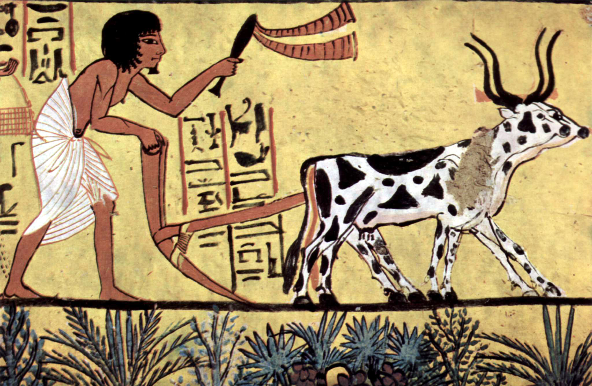
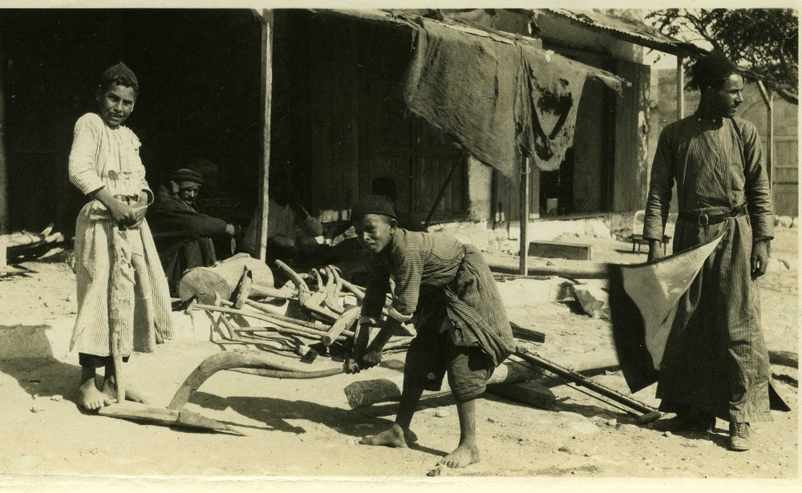

---
word_english: plough  
word_hebrew: מַחֲרֵשָׁה/מַחֲרֶשֶׁת  
transcription: <i>maḥ<small>a</small>rēšāh</i>/<i>maḥ<small>a</small>rèšet</i>    
title: plough, hoe (?)  
semantic_fields: utensils, agriculture, metals,   
contributors: paul_sanders  
first_published: 2017-12-29  
last_update: 2023-11-29  
contributors_footnote: Many thanks are due to Jan A. Wagenaar (formerly Utrecht University) for allowing me to make use of his unpublished contributions to the KLY project. 
Thanks are also due to Benjamin Bogerd (Protestant Theological University, Amsterdam). 
update_info:   

---

##Introduction

Grammatical type: noun fem.  
Occurrences:   3x HB (0/3/0); 0x Sir; 0x Qum; 0x Inscr.  (Total: 3)  

* Nebiim: 1 Sam 13:20 (2x), 21;
* Qumran: – (see <a href="#Qum">B.1</a> below).

<b> A.1</b> While the first occurrence of
מחרשתו in 1 Sam 13:20 (מַחֲרַשְׁתּוֹ, with <i>pataḥ</i> as the third vowel) is a form of 
\*מַחֲרֶשֶׁת/\*מַחֲרֵשָׁה,
the second occurrence (מַחֲרֵשָׁתוֹ, with <i>ṣ<small>e</small>rē</i> as the third vowel)

is a form of \*מַחֲרֵשָׁה.
The Masoretic vocalisation of 1 Sam 13:20-21 suggests that the second occurrence of 
מחרשתו 
is a form of the same noun as 
מַחֲרֵשֹׁת
in 13:21.[^1]
Tg<small>J</small> supports the Masoretic vocalisation and translates the two forms with <i>ṣ<small>e</small>rē</i> by forms of the same noun
(עוּשְׁפָּא),
while it represents the single form with a <i>pataḥ</i> instead of the <i>ṣ<small>e</small>rē</i> with
a form of a different noun (פְּרָשָׁא). 
However, most of the ancient versions treat the first occurrence of מחרשתו 
in 13:20 and מַחֲרֵשֹׁת
in 13:21 as forms of the same noun (see <a href="#AV">Ancient Versions</a>). 
The latter option becomes more attractive as soon as one notices that the series of 
agricultural implements in 13:20
(מַחֲרַשְׁתּוֹ,
אֵתֹו,
קַרְדֻּמּוֹ,
מַחֲרֵשָׁתוֹ)
partially corresponds to the series in 13:21
(מַחֲרֵשֹׁת,
אֵתִים,
[שְׁלֹשׁ קִלְּשׁוֹן?,]
קַרְדֻּמִּים,
דָּרְבָן).
Consequently, the first occurrence of מחרשתו 
in 13:20 and מַחֲרֵשֹׁת
in 13:21 are sometimes treated as forms of the same noun.[^2]

<b> A.2</b> 
Of course, 
the twofold occurrence of מחרשתו
in a single series of utensils (1 Sam 13:20) has raised questions.
Since part of the utensils mentioned in 13:20 reoccur 
in the same order in 13:21 (מחרשׁה/מחרשׁת,
אֵת,
קַרְדֹּם),
the latter verse was sometimes used as a basis for emending the text of 13:20.
Julius Wellhausen (1871:84) assumed that the second מחרשתו,
the fourth item of the list in 13:20, originally corresponded to הַדָּרְבָן
at the end of  13:21. He pointed to the fact that the ancient Gk. and Syr. translations 
read forms of the same noun (LXX: δρέπανον, ‘sickle’; Pesh: ܡܣܣܐ, ‘ox goad’) where MT reads מַחֲרֵשָׁתוֹ (13:20) and הַדָּרְבָן (13:21). Wellhausen’s proposal to read דָּרְבָנֹו at the end of 13:20 was taken over by many others.[^3] Other scholars, however, assumed that the reading τὸ δρέπανον αὐτου, ‘his sickle’, goes back to Heb. חֶרְמֵשֹׁו, since 
δρέπανον  represents Heb. חֶרְמֵשׁ,
‘sickle’, in Deut 16:9; 23:26 (= 23:25<small>LXX</small>). These scholars regarded the reading מחרשתו as secondary.[^4]  
Dominique Barthélemy argued that there is insufficient reason to replace מחרשתו
by a different word on the basis of the readings of LXX and Pesh. The earliest translators seem to have experienced the same problems with the Hebrew
text as modern scholars. They translated the second occurrence of מחרשתו 
differently from the first. The translators of LXX and Pesh  decided to use a noun that they used also 
to render הַדָּרְבָן,
the last utensil mentioned in 13:21. 
Barthélemy maintained that the first and second מחרשתו 
in 13:20 derive from two different nouns, \*מַחֲרֶשֶׁת
and \*מַחֲרֵשָׁה.
The two nouns must have had different meanings, but neither the earliest translators nor modern scholars could retrieve exactly to what kind of sharp utensils 
the two terms initially referred.[^5] 
<i>DCH</i> shares Barthélemy’s suggestion that
the two occurrences of  מחרשתו 
in 13:20 refer to two different agricultural utensils and translates them as ‘plough’ and ‘goad’, respectively.[^6]

<b> B.1</b>  
The sectarian composition <i>Serekh ha-Yaḥad</i> (Community Rule, ca. 100 BCE) contains 
the following enigmatic phrase:
כיא בסאון רשע מחרשו.[^7] 
The passage describes the characteristics of those who may not enter the community of the faithful. 
Although the interpretation of the phrase is disputed, it is clear that מחרשו
is not an alternative form of  מחרשתו.[^8] 
It has been proposed to regard מחרש 
as a noun meaning ‘ploughing’.[^9] 
If סאון
is taken as equivalent to Aram. סיין/סוון,
‘mud’, the whole phrase can be taken  as a proverbial saying:  ‘For in the mud of wickedness (is) his ploughing.’[^10]  

##1. Root and Comparative Material

<b> A.1</b> <i>Root</i>: 
Both \*מַחֲרֵשָׁה 
and \*מַחֲרֶשֶׁת/\*מַחֲרֵשָׁה 
are commonly assumed to derive 
from חרשׁ i, 
‘to plough, engrave’.[^11]
These nouns 
have some Semitic cognates denoting an agricultural implement, as will be shown below.
The Heb. verb חרשׁ i
stems from proto-Semitic <i>ḥrṯ</i>
and has cognates in Ug., Akk., and many other Semitic languages (see below).[^12] 
It must be distinguished 
from חרשׁ ii, 
‘to manufacture’,[^13] 
which stems from proto-Semitic <i>ḥrš</i>, just like Ug. <i>ḥrš</i>
and Phoenician
<i>ḥrš</i>, ‘craftsman, artisan’.[^14] 
Contrary to Heb. חרשׁ i, 
‘to plough, engrave’, Heb. חרשׁ ii
refers to the work of the craftsman or artisan.
Stephen Cook (1994) supposed that \*מַחֲרֵשָׁה derives from חרשׁ i, ‘to plough, engrave’,
but that \*מַחֲרֶשֶׁת/\*מַחֲרֵשָׁה derives from חרשׁ ii, 
‘to manufacture’ (see <a href="#Cook">below</a>).
Aaron Koller (2012:86-89) distinguished a third root, <i>ḫrś</i>/חרשׂ, ‘to scratch’, assuming that חרשׁ i 
means only ‘to plough’, not ‘to engrave’ or ‘to scratch’. 
He regarded the form חֲרוּשָׁה, ‘scratched’, in Jer 17:1
as a form of this verb (with ש erroneously pointed as <i>šin</i> instead of <i>śin</i>; cf. חֶרֶשׂ in Job 2:8). 
Koller saw \*מַחֲרֵשָׁה as a derivative of חרשׁ i, ‘to plough’,
but \*מַחֲרֶשֶׁת/\*מַחֲרֵשָׁה as deriving from חרשׂ, ‘to scratch’ (see <a href="#Koller">below</a>).
However, note that in the Babylonian Talmud מחרישה denotes a ‘strigil’, an instrument for scraping the skin (see <a href="#strigil">below</a>).

<b> A.2</b> <i>Akkadian</i>: 
The Heb. verb חרשׁ i
has a cognate in Akk. 
<i>erēšu</i>, which means ‘to seed by drilling seed into a furrow by means of a seeder-plow, to cultivate or plant (a field)’.[^15] 
Among the derivatives of this verb are
<i>mērešu</i> 
and <i>mēreštu</i>, which mean ‘cultivation’ or ‘cultivated land/field’.[^16] 
Derivatives relating to a utensil are not attested.

<b>A.3</b> <i>Ugaritic</i>: 
The Ug. cognate of Heb. חרשׁ I 
is <i>ḥrṯ</i>, ‘to plough’.[^17] The Ug. noun <i>mḥrṯt</i> (<i>KTU</i> 1.6:IV.3, 14; 6.14:3)
is usually interpreted as 
‘ploughed field’.[^18] 
However, Oswald Loretz proposed to regard it as
a <i>nomen instrumenti</i> denoting the ploughshare or  the plough as a whole.[^19] 

<b> A.4</b> 
<i>Arabic</i>:
The Arab. verb <i>ḥaraṯa</i> is a cognate of Heb. חרשׁ i
and means ‘to plough, to cultivate’. The Arab. noun
<i>miḥrāṯ</i> designates a plough.[^20] 
In Old South Arabian, however,
<i>mḥrṯt</i> 
refers to ploughed, cultivated land.[^21] 

<b> A.5</b> 
<i>Ethiopic</i>:
The Eth. (Geʿez) verb <i>ḥarasa</i> is a cognate of Heb. חרשׁ i
and means ‘to plough’. The noun
<i>māḥras</i> is translated as ‘ploughshare’ or as ‘plough’.[^22] 

<b> A.6</b> <i>Postbiblical Hebrew and Jewish Aramaic</i>: 
In the Mishnah, the Tosefta and the Talmudim, 
the word מַחֲרֵשָׁה 
is virtually always spelled with a <i>yod</i> as <i>mater lectionis</i>: מחרישה.
The term occurs ca. 70 times and denotes the  plough in its entirety.[^23]
Not surprisingly, the word occurs 
in a context relating to ploughing (חרשׁ <i>qal</i>).[^24] 
The מחרישה 
is said to ‘shake’ (זִעֲזֵע, pilpel of זוע) 
clods of earth and stones.[^25] 
The implement is regarded as indispensable.[^26]
The expression יתד של מחרישה, literally ‘the <i>pin</i>  of
the plough’, denotes the sharp metal plough-point.[^27] The Tosefta refers to יתדות המחרישה, 
‘plough-points’, that were attached to the plough’s חרב, 
‘tail-piece, handle’.[^28] 
In the Bab. Talmud, the expression מחרישה דכספא
does not represent a plough, but a strigil made of כספא, ‘silver’.[^29] 
Such a strigil was used for scraping the skin; cf. the meaning ‘to engrave’ of the verb חרשׁ i.
In modern Hebrew the word מחרישה means ‘plough’.

##2. Formal Characteristics

<b> A.1</b>  \*מַחֲרֶשֶׁת[^30]/\*מַחֲרֵשָׁה[^31] 
is a <i>miqtal</i> form with a feminine termination (BL, 490 aζ).

<b> A.2</b>  \*מַחֲרֵשָׁה 
is a <i>maqtil</i> form with a feminine termination. Many <i>maqtil</i> forms denote a utensil (BL, 492 qζ, sζ; Meyer 1969:34-35). 

##3. Syntagmatics

<b> A.1</b> 
In 1 Sam 13:20, מַחֲרַשְׁתּוֹ
and מַחֲרֵשָׁתוֹ
represent the first and fourth objects
of the verb לטשׁ, ‘to forge, hammer, sharpen’. The other objects are 
(2) אֵתֹו
and
(3) קַרְדֻּמּוֹ
(all marked by the accusative particle את).
1 Sam 13:21 indicates that 
the price for 
מַחֲרֵשֹׁת
as well as some other agricultural utensils
was a → פים. 
Apparently, the price was paid for either producing or repairing them (see <a href="#Exe">below</a>).

##4. Ancient Versions

In the following survey of ancient translations, ‘20<small>1</small>’ represents the first occurrence of מחרשתו 
(MT: מַחֲרַשְׁתּוֹ) in 1 Sam 13:20,
while ‘20<small>2</small>’ represents the second occurrence
(MT: מַחֲרֵשָׁתוֹ). 
‘21’ represents the  word מַחֲרֵשֹׁת in 13:21. 

<b>a. Septuagint (LXX) and other Greek versions (αʹ, σʹ, θʹ):</b> 

* ἄροτρον, ‘plough’:[^32] 20<small>1: αʹθʹ </small>[^33], 21<small>αʹ </small>[^34];
* δίκελλα, ‘two-pronged fork’:[^35] 20<small>2: σʹ </small>[^36]; 
* δρέπανον, ‘sickle’:[^37] 20<small>2: LXX</small>;
* θερίζειν, ‘to reap,[^38] harvest’:[^39] 21<small>LXX</small>;
* θεριστήριον, ‘reaping-hook’:[^40] 20<small>1</small> (LXX<small>Ant </small>[^41]);
* θέριστρον, ‘reaping-hook’:[^42] 20<small>1</small> (most mss of LXX); 
* ὕνις, ‘ploughshare’:[^43] 20<small>1: σʹ </small>[^44]. 

<b>b. Peshitta (Pesh):</b> 

* ܡܓܠܐ
(<i>magg<small>e</small>lā</i>), ‘sickle’:[^45] 20<small>1</small>, 21;
* ܡܣܣܐ
(<i>massāsā</i>), ‘(ox) goad’:[^46] 20<small>2</small>. 

<b>c. Targum  (Tg<small>J</small>):</b>

* עוּשְׁפָּא, ‘adze, carpenter’s axe’, etc., used for chipping:[^47] 20<small>2</small>, 21;
* פְּרָשָׁא,  ‘goad’, possibly also ‘ploughshare’:[^48] 20<small>1</small>.

<b>d. Vulgate (Vg):</b>

* <i>sarculum</i>, ‘hoe’:[^49] 20<small>2</small>;
* <i>vomer</i>, ‘ploughshare’:[^50] 20<small>1</small>, 21. 

<b> A.1</b> 
As the surveys show, the two occurrences of מחרשתו in 1 Sam 13:20 MT have two different counterparts in all the ancient translations.
α´, Pesh and Vg treat the first occurrence of מחרשתו (20<small>1</small>)
as a form of the same noun as מחרשת 
(21) and translate the second form (20<small>2</small>)  differently.
In LXX, the words representing מחרשתו (20<small>1</small>) and מחרשת (21) are derivatives from the same root.
On the other hand, the translation of Tg<small>J</small> suggests that the second occurrence of מחרשתו (20<small>2</small>) is a form of the same noun as מחרשת 
(21). This corresponds with the Masoretic vocalisation. 

<b> A.2</b> 
Tg<small>J</small> translates each of the implements mentioned in 1 Sam 13:20-21 consistently: \*מַחֲרֶשֶׁת/\*מַחֲרֵשָׁה is translated by 
פְּרָשָׁא (1x); אֵת is translated by סִכַּת פַּדְנָא (2x); קַרְדֹּם is translated by כּוּלְבָה (2x); \*מַחֲרֵשָׁה  is translated by עוּשְׁפָּא (2x); 
דָּרְבָן
is translated by 
זַקְתָּא. 
The fact that Heb. אֵת
was rendered as  סִכַּת פַּדְנָא, 
‘plough-point’ (→ אֵת), 
seems to suggest that \*מַחֲרֶשֶׁת/\*מַחֲרֵשָׁה
was not interpreted as such. Therefore, it may be best to translate פְּרָשָׁא
as ‘goad’.

<b>A.3</b> 
Most of the ancient translations assume that the first occurrence of 
מחרשתו
in 1 Sam 13:20 represents an implement used for ploughing
(α´,  σ´, θ´, Vg, possibly Tg<small>J</small>). LXX and Pesh, however, interpret the word as an implement used for harvesting.
In the case of LXX there is reason to believe that the translators of 1 Samuel misinterpreted the verb חרשׁ
as relating to harvesting  instead of ploughing.[^51]
In 1 Samuel, the only phrase in which the verb חרשׁ i has the meaning ‘to plough’ occurs in 8:12:
וְלַחֲרֹשׁ חֲרִישׁוֹ וְלִקְצֹר קְצִירוֹ
(MT), literally: ‘to plough the ploughing and to harvest the harvest’.
Most mss of LXX render the phrase as καὶ θερίζειν θερισμὸν αὐτοῦ καὶ τρυγᾶν τρυγητὸν αὐτου. Both θερίζειν θερισμὸν and τρυγᾶν τρυγητὸν can be translated as ‘to reap the harvest’, not as ‘to undertake the ploughing’.[^52]

<b>A.4</b>
There is insufficient reason to suppose that the Gk. translation of 1 Sam 8:12 goes back to a Heb. text that differs from 
MT.[^53] The translation of the first occurrence of
מחרשת/מחרשה 
in 13:20 by θέριστρον, ‘reaping-hook’, and
the rendering of מחרשת
in 13:21 by θερίζειν, ‘to harvest’, 
seem to be due to the same confusion regarding the meaning of חרשׁ 
and its derivatives. 
In LXX<small>Ant</small> καὶ θερίζειν θερισμὸν αὐτοῦ καὶ τρυγᾶν τρυγητὸν αὐτου is preceded by καὶ ἀροτριᾶν τὴν ἀροτρίασιν αὐτοῦ 
‘and to undertake the ploughing’.[^54] 
Apparently, the additional phrase was inserted to assimilate the LXX to the Heb. text.[^55]

<b>A.5</b>
In 1 Sam 8:12, Pesh remains close to the Masoretic reading ולחרש חרישו ולקצר קצירו
(MT).[^56] 
In the case of 1 Sam 13:20-21, however, the reading of Pesh 
(ܡܓܠܐ,
‘sickle’)
seems to have been influenced by the Gk. translation of 
the first מחרשת/מחרשה 
 (13:20) by θέριστρον/θεριστήριον, ‘reaping-hook’.

##5. Lexical/Semantic Fields

<b> A.1</b> The noun \*מַחֲרֵשָׁה 
and often also the noun \*מַחֲרֶשֶׁת/\*מַחֲרֵשָׁה
are regarded as derivatives of the verb חרשׁ i, ‘to plough, engrave’.
In the Hebrew Bible, the verb is used ten times for ploughing in a literal sense[^57] 
and four or five times for ploughing in a figurative sense.[^58]
After a → עֹל, 
‘yoke’, was fasted over the necks of two animals and attached to the plough, the animals pulled (משׁך <i>qal</i>, Deut 21:3) the plough.[^59]    

<b> A.2</b> 
The nouns \*מַחֲרֵשָׁה 
and \*מַחֲרֶשֶׁת/\*מַחֲרֵשָׁה
occur only in two lists of sharp utensils (1 Sam 13:20-21). The other items in the lists are 
→ אֵת,
→ קַרְדֹּם,
possibly
שְׁלֹשׁ קִלְּשׁוֹן
(→ קִלְּשׁוֹן),
and → דָּרְבָן.

<b> A.3</b> Koller (2012:255) assumes that 
the \*מַחֲרֶשֶׁת/\*מַחֲרֵשָׁה
was very similar to the → מַעְדֵּר
and that the different words may even designate the same tool.

##6. Exegesis

###6.1 Textual Evidence

<b> A.1</b>  In view of the meaning of חרשׁ i, 
‘to plough, engrave’, it is likely that 
one of the  occurrences of
מחרשׁה/מחרשׁת 
in the list of utensils in 1 Sam 13:20 denotes an implement used for ploughing.
Most dictionaries interpret either \*מַחֲרֵשָׁה 
or \*מַחֲרֶשֶׁת/\*מַחֲרֵשָׁה as ‘ploughshare’.[^60]
In the Mishnah, Tosefta and Talmudim, the noun מַחֲרֵשָׁה designates the entire plough, while the cognates in Arab. and Eth. (and possibly in Ug.) also denote a plough (see 
<a href="#Ugar">above</a>).   
Most of the ancient translations assume that the first item in the list of 13:20 
represents a plough (α´, θ´), 
or its cutting part ( σ´, Vg, possibly Tg<small>J</small>). Since the plough is one of the most important agricultural utensils, it is indeed not unlikely that it is represented by the first item in the list.[^61]
In view of the evidence from the Mishnah, Tosefta and Talmudim,
it is attractive to revocalise the first occurrence in 13:20 as מַחֲרֵשָׁתוֹ
(with <i>ṣ<small>e</small>rē</i>) and to maintain the vocalisation of the parallel item מַחֲרֵשֹׁת
in 13:21 (see <a href="#seree">above</a>).

<b> A.2</b> 
Ploughs were largely made of wood, as is shown by the burning of
כְּלִי הַבָּקָר,
‘equipment of the oxen’, which had just been used for ploughing a field
(1 Kgs 19:19-21), 
and the use of
כְּלִי הַבָּקָר,
‘equipment of the oxen’, for its wood
(עֵצִים;
2 Sam 24:22).
However, 1 Sam 13:19-22 demonstrates that ploughs also comprised a sharp element made of metal, apparently the 
so-called ‘plough-point’. The latter passage records that in the time of Saul and Jonathan the Israelites 
were subject to rigid constraints. 
The Philistines maintained a monopoly that enabled them to dominate the Israelites and
to prevent them from producing their own weapons.
According to many scholars, the monopoly 
concerned the production and/or repair of iron implements.[^62] 
However, the MT does not say explicitly that the implements involved were made of iron. 
It reveals only that among the Israelites there was no חָרָשׁ,
‘craftsman’ (13:19), 
who produced 
(לטשׁ; 13:20)
utensils for them.[^63] 
Only the renderings of חָרָשׁ
in LXX (τέκτων σιδήρου) and Vg (<i>faber ferrarius</i>)
specify that the craftsmen concerned were iron smiths.[^64] Actually, archaeological evidence from consecutive centuries 
demonstrates that in ancient Israel implements of bronze and implements of iron were used in the same contexts. 
Bronze plough-points and iron plough-points were also excavated in the same excavation layers (see <a href="#Exe-ar">below</a>).
The suggestion of LXX and Vg 
that the Philistines maintained an iron monopoly is 
an attractive option, but the MT may imply that the Philistines forbade all metallurgical activities among the Israelites.[^65]   
The structure of the ancient Israelite ploughs is not described in the HB or other contemporaneous 
sources. However, a reconstruction is possible on the basis of contemporaneous 
illustrations from Mesopotamia and Egypt and archaeological finds from
Israel/Palestine (see <a href="#Exe-ico">below</a>). Further, some terminological information can be found in the 
Mishnah, the Tosefta and the Talmudim, especially in mKelim 21:2.[^66] 
In the latter passage, the word מַחֲרֵשָׁה does not occur, but
the following terms are used to denote elements of the plough:
עֹל (‘yoke’),
קַטְרֵב (‘cross-bar?’),
עַיִן (‘collar-piece?’),
עֲבֹות (‘thick ropes?’),
חֶרֶב (‘tail-piece’ or ‘handle’),
בֹּרֶךְ (‘knee-shaped beam’),
יָצוּל (‘handle’ or ‘cross-piece’),
עַיִן שֶׁל מַתֶּכֶת (‘metal ring’),
לְחָיַיִן (‘guides’),
עֲרָיִין (‘plough-flanks’ or ‘mouldboards’).
Unfortunately, it remains unclear to which elements of the plough some of these Heb. terms refer.[^67] Also, it is dubious whether the ancient Israelite plough consisted of the same elements as the plough type to which this section of the Mishnah refers.

<b> A.3</b> 
Philip King and Lawrence Stager give the following description of the way in which ploughing was performed in ancient Israel (King & Stager 2001:92; cf. 88):

> Plowing prepared the ground for sowing in late October-November, after the first rain (<i>yôreh</i>) had softened the earth. A field was plowed twice, once to loosen the crusty soil before the seed was broadcast, and then at right angles to the first plowing to cover the seed. The metal-tipped scratch plow did not turn over the soil the way a moldboard plow does but simply scratched a shallow furrow by breaking and loosening the soil.

Like the ancient Egyptian and Mesopotamian ploughs, ancient Israelite ploughs were usually pulled by a pair (צֶמֶד) of oxen (בָּקָר:
1 Sam 11:7; 1 Kgs 19:21; Amos 6:12; Job 1:3, 14; 42:12). A female cow could also be use for ploughing, as is shown by the remark that in specific situations a cow that had not yet carried a yoke or pulled a plough was used (פָּרָה, ‘cow’: Num 19:2; 1 Sam 6:7;
עֶגְלָה, ‘heifer’: 
Deut 21:3; cf. Judg 14:18; Hos 10:11).
Donkeys could also be used to work the land (cf. Isa 30:24: עֲיָרִים, 
‘male donkeys’), but it was forbidden to let an ox (שׁוֹר)
and a donkey (חֲמֹור)
pull a plough together (Deut 22:10).[^68]

<b> A.4</b> If the second occurrence of מחרשׁתו
in 1 Sam 13:20 is left unemended,[^69] 
only one of the two occurrences may be assumed to designate a plough(-point).[^70] 
A classical translation of the second occurrence is ‘mattock’.[^71]
Eduard König interpreted \*מַחֲרֶשֶׁת as ‘wahrscheinlich der Schollenzerteiler, mit dem bei den Alten hinter dem Pfluge die grossen Erdklumpen zerteilt wurden’ (<i>HAWAT</i>, 219). 
Dominique Barthélemy decided to leave it untranslated (<i>CTAT</i> 1:181). 
Stephen Cook supposed that the first of the near-homonyms derives from חרשׁ i, ‘to plough, engrave’,
while the second derives from חרשׁ ii, 
‘to manufacture’
(see <a href="#RCM">above</a>).
According to Cook, the first noun clearly refers to a plough,
while the second noun, which can be translated as ‘crafted/forged tool’, can best be interpreted as an equivalent
of the parallel term דָּרְבָן,
probably ‘goad’ (end of 13:21).[^72]
However, the interpretation of the final item in the list of 13:20 remains uncertain, as Cook admits.[^73] 
Actually, the interpretation as a ‘goad’ is not attractive, since the presence of a metal point at the end of goads 
was not essential.[^74]
This noun can also be seen as a derivative of חרשׁ i
and may refer to a different tool used for ‘engraving’ the soil, wood, etc. 
However, Aaron Koller (2012:86-89) distinguished a third root, <i>ḫrś</i>/חרשׂ, ‘to scratch’, assuming that חרשׁ i 
means only ‘to plough’, not ‘to engrave’ or ‘to scratch’ (see <a href="#KollerRoot">above</a>). He interpreted 
\*מַחֲרֶשֶׁת/\*מַחֲרֵשָׁה as deriving from חרשׂ, ‘to scratch’.
With reference to Yemeni Arab. <i>mḫrš</i>, ‘harrow’, and <i>ḫrš</i>, ‘to till by hand’,
he suggested that the noun \*מַחֲרֶשֶׁת/\*מַחֲרֵשָׁה designates a hoe or a harrow. 
The noun may indeed represent a tool for weeding or tilling the soil by hand 
(cf. <i>sarculum</i> in Vg).[^75] 

<b> B.1</b> Only rarely is none of the occurrences of מחרשׁה/מחרשׁת in 1 Sam 13:20-21  identified with a plough or an 
element of it.[^76]  

###6.2 Pictorial Material

<b> A.1</b>
The lack of ancient pictures of ploughs from the Levant
(Syria-Palestine) is compensated by images
from Mesopotamia and Egypt. The ploughs are commonly depicted as drawn by two oxen.[^77]
The images show two types of plough: 

  - 
Simple ploughs without a seed drill drawn by a pair of animals and guided by a single man, who may hold a stick or goad or whip to drive 
the animals.[^78] In such cases, the seeding was done after the first ploughing.
The distinction between the two procedures is illustrated by images displaying a sower who works at some distance from the ploughman and his plough.[^79] 
  - 
Ploughs provided with a seed drill, drawn by a pair of animals and guided by a single man, 
who is assisted by another man, who takes care of the seeding process.[^80]

The depicted ploughing scenes are Mesopotamian or Egyptian, but there are good reasons to believe that the ploughs of the Israelites were quite similar to 
the ploughs on the images. In ancient Israel, ploughs were not yet provided with a seed drill 
and the sowing took place after the first ploughing of the ground.[^81]
Therefore, the Israelite ploughs were probably of the same type as the simpler ploughs
of the Mesopotamians and Egyptians. 

&nbsp;&nbsp;&nbsp;&nbsp;&nbsp;&nbsp;&nbsp;&nbsp;<small>Figure&nbsp;1:&nbsp;&nbsp;
Egyptian ploughing scene, burial chamber of Sennedjem, 13th century BCE</small>

The ploughs of the Mesopotamian and Egyptian depictions have the following features in common:

  - 
A wooden beam connects the plough with a yoke that was fastened over the necks of the pulling animals. 
  - 
The essential part of the plough is a wooden beam protruding forward in the direction of the animals, at the bottom of the plough. 
The beam may be curved and is provided with a sharp metal point that makes furrows in the ground.
  - 
The plough includes a wooden handle or a pair of handles, serving to steer the plough. Usually, the steering handle is part of the same beam as the wood to which
the plough-point was affixed. 

<b> A.2</b> 
Photographs from the early twentieth century show traditional ploughs with construction styles that hardly differed from the ancient Near Eastern 
structures.[^82]

&nbsp;&nbsp;&nbsp;&nbsp;&nbsp;&nbsp;&nbsp;&nbsp;<small>Figure&nbsp;2:&nbsp;&nbsp;
Plough shop in Beersheba, October 16, 1924 </small>
&nbsp;&nbsp;&nbsp;&nbsp;&nbsp;&nbsp;&nbsp;&nbsp;<small>Universiteitsbibliotheek Utrecht, Collectie Vriezen</small>

Recent film recordings show a way of ploughing that gives an impression of the ways in which ploughing was performed in the ancient Near East. Several informative recordings from, for example, Egypt and India have been uploaded on YouTube: 

&nbsp;&nbsp;&nbsp;&nbsp;&nbsp;&nbsp;&nbsp;&nbsp;<iframe width="560" height="315" src="https://www.youtube.com/embed/uNBhCmWYqH8?si=J9w1HdQVSsjNVTGr&amp;controls=0" title="YouTube video player" frameborder="0" allow="accelerometer; autoplay; clipboard-write; encrypted-media; gyroscope; picture-in-picture; web-share"></iframe>

&nbsp;&nbsp;

&nbsp;&nbsp;&nbsp;&nbsp;&nbsp;&nbsp;&nbsp;&nbsp;<iframe width="560" height="315" src="https://www.youtube.com/embed/AGjXFGau-Pw?si=hyzO0dkZ3cb_L_cJ&amp;controls=0&amp;start=19&amp;mute=1" title="YouTube video player" frameborder="0" allow="accelerometer; autoplay; clipboard-write; encrypted-media; gyroscope; picture-in-picture; web-share"></iframe>

&nbsp;&nbsp;

<b> A.3</b> 
\*מַחֲרֶשֶׁת/\*מַחֲרֵשָׁה may denote a hoe or harrow (see <a href="#Koller">6.1 A.4</a>).
For ancient pictures of hoes from the Levant
(Syria-Palestine), see → מַעְדֵּר.

###6.3 Archaeology

<b> A.1</b> 
The wood of ancient Near Eastern ploughs  has usually decomposed completely, but many metal plough-points have survived. 
The archaeological evidence from Israel/Palestine
shows that in the twelfth century bce 
bronze plough-points began to be replaced by iron plough-points, although the use of bronze plough-points appears to have continued for several
centuries.[^83] 
Oded Borowski offers an excellent description of the excavated plough-points:

> The plow-point was an elongated tool, 20-30 cm long, with a pointed tip for soil penetration. 
The other end was shaped like a pipe, ca. 8-10 cm wide. A wooden shaft, which was part of the 
plow-handle, was inserted into this end.[^84]

Koller (2012:89-90) shows that the archaeological evidence corresponds with the idea expressed in the Mishnah and Tosefta 
that the מַחֲרֵשָׁה scratches the soil to a depth of not more than ‘three handbreaths’ (שְׁלשָׁה טְפָחִין).
He defines the מַחֲרֵשָׁה as ‘a piece of metal hammered into the shape of a cone and attached at the end of the wooden plow, which cuts through
the soil to a depth of about 15-30 cm.’ (2012:253).
Nowadays, the designation ‘ploughshare’ is commonly used for the curved blade of the so-called mouldboard plough, which turns over the soil.
It is confusing to denote the cutting element of the  ancient Israelite scratch ploughs as ‘ploughshare’, since its form and function where quite different
from the ploughshares of mouldboard ploughs. Therefore, Borowski’s designation as ‘plough-points’ is preferable.[^85]

<b>A.2</b> 
\*מַחֲרֶשֶׁת/\*מַחֲרֵשָׁה may denote a hoe or harrow (see <a href="#Koller">6.1 A.4</a>). For remains of hoes from the Levant (Syria-Palestine), see → מַעְדֵּר.

##7. Conclusion

<b> A.1</b> 
In Biblical Hebrew, the noun \*מַחֲרֵשָׁה (< חרשׁ i, ‘to plough’)
probably denotes the ancient Israelite ‘plough’. 
In the Mishnah, Tosefta and Talmudim, the word מַחֲרֵשָׁה
denotes the plough as a whole. It is possible that one of the occurrences
of מחרשׁה/מחרשׁת
in 1 Sam 13:20  also designates the entire plough, but it cannot be excluded that at this earlier stage it represented only the metal plough-point.
If in 1 Sam 13:20 the first occurrence of מחרשׁתו
represents a plough, the form must probably be revocalised as  מַחֲרֵשָׁתוֹ.
The vocalisation of the parallel term מַחֲרֵשֹׁת
in 13:21 can be retained and this form can be translated as ‘ploughs’ or ‘plough-points’.

<b> A.2</b>  The proposals to emend the second occurrence of מחרשׁתו 
in 1 Sam 13:20 are debatable. The noun
\*מַחֲרֶשֶׁת/\*מַחֲרֵשָׁה may denote a hoe or harrow (see <a href="#Koller">6.1 A.4</a>),
but it is not possible to identify the designated tool with certainty. 

## Bibliography

For the abbreviations see the 
<a href="/store/abbreviations/">List of Abbreviations</a>.

Albeck 1959  
Chanokh Albeck (ed.), שׁשׁה סדרי משׁנה,
vol. 6:
סדר טהרות, Jerusalem: Mosad Bialiq; Tel Aviv: Devir. 

Bunte 1972  
Wolfgang Bunte, <i>Die Mischna: Text, Übersetzung und ausführliche Erklärung</i>, vol. VI/1: <i>Kelim</i>, Berlin: de Gruyter.

Borowski 1987  
Oded Borowski, <i>Agriculture in Ancient Israel</i>, Winona Lake, IN: Eisenbrauns. 

Burrows 1951  
Millar Burrows, <i>The Dead Sea Scrolls of St. Mark’s Monastery</i>, vol. II, fasc. 2: <i>Plates and Transcription of the Manual of Discipline</i>,
New Haven: ASOR. 

Charlesworth 1994  
James H. Charlesworth, <i>The Dead Sea Scrolls: Hebrew, Aramaic and Greek Texts with English Translations</i>, vol. 1: 
<i>Rule of the Community and Related Documents</i>, Tübingen: J.C.B. Mohr; Louisville: Westminster John Knox. 

Cook 1994  
Stephen L. Cook, ‘The Text and Philology of 1 Samuel XIII 20-1’, <i>VT</i> 44:250-54.

Danby 1933  
Herbert Danby, 
<i>The Mishnah Translated from the Hebrew with Introduction and Brief Explanatory Notes</i>, Oxford: Oxford University. 

Dietrich 2015  
Walter Dietrich, <i>1 Samuel 13-26</i> (BKAT, 8/2), Neukirchen-Vluyn: Neukirchener. 

Dietrich &  Loretz 2005  
Manfred Dietrich, Oswald Loretz, ‘ “Weihen” (<i>ʿly</i> Š) von <i>pgr</i>, Ochsen und Gegenständen in KTU 6.13, 6:14 und 6.62’,
<i>UF</i> 37:227-39.

Fernández Marcos & Busto Saiz 1989  
Natalio Fernández Marcos, José Ramón Busto Saiz,
<i>El texto antioqueno de la Biblia griega</i>, I: <i>1-2 Samuel</i> (TECC 50), Madrid: Instituto de Filología, C.S.I.C.

Fokkelman 1986  
Jan P. Fokkelman,
<i>Narrative Art and Poetry in the Books of Samuel</i>, vol. 2: <i>The Crossing Fates (1 Sam. 13-31 & 2 Sam. 1)</i>, Assen: Van Gorcum. 

Fritz 1990  
Volkmar Fritz, <i>Kinneret: Ergebnisse der Ausgrabungen auf dem Tell el-ʿOrēme am See Gennesaret 1982-1985</i> (ADPV 15), Wiesbaden: Harrassowitz.

Grillet & Lestienne 1997  
Bernard Grillet, Michel Lestienne, <i>La Bible d’Alexandrie</i>, 9.1: 
<i>Premier livre des Régnes</i>, Paris: Cerf.

Hamp et al. 1986 
Vinzenz Hamp, Heinz-Josef Fabry, Helmer Ringgren, 
‘חָרַשׁ <i>ḥāraš</i>, הֲרָשִׁם ,חָרָשׁ’, 
<i>TDOT</i> v:221-24. 

Hugo 2015  
	Philippe Hugo, ‘1-2 Kingdoms (1-2 Samuel)’, in: 
	James K. Aitken (ed.), 
	<i>The T&T Clark Companion to the Septuagint</i>, 
	London: Bloomsbury T&T Clark,
	127-46.

Hugo 2016  
	Philippe Hugo, ‘Basileion I und II / Das erste und zweite Buch der Königtümer / Das
	erste und zweite Buch Samuel’, in: Siegfried Kreuzer (ed.), 
	<i>Einleitung in die Septuaginta</i>
	(LXX.H, 1), Gütersloh: Gütersloher,  207-31. 

King & Stager 2001  
Philip J. King, Lawrence E. Stager,  <i>Life in Biblical Israel</i>, Louisville & London: Westminster John Knox.

Klein 1983  
Ralph W. Klein, <i>1 Samuel</i> (WBC, 10), Waco, TX: Word.

Koller 2012  
Aaron J. Koller, <i>The Semantic Field of Cutting Tools in Biblical Hebrew: The Interface of Philological, Semantic, and Archaeological Evidence</i>
(CBQMS, 49), Washington: The Catholic Biblical Association of America.

Krauss 1911  
Samuel Krauss, <i>Talmudische Archäologie</i>, vol. II, Leipzig: Fock.

Lambert 1979  
W.G. Lambert, ‘Near Eastern Seals in the Gulbenkian Museum of Oriental Art, University of Durham’, <i>Iraq</i> 41:1-45.

Loewenstamm 1959  
Samuel E. Loewenstamm, ‘The Hebrew root חרשׁ 
in the light of the Ugarit Texts’, <i>JJS</i> 10:63-65. 

Loretz 1993  
Oswald Loretz, ‘Ugaritisch-hebräisch “Pflugschar”
(<i>mḥrṯt</i> /*<i>mḥršh</i>)’, <i>SEL</i> 10:71-78.

McCarter 1980  
P. Kyle McCarter, <i>1 Samuel</i> (AB), 
Garden City NY: Doubleday.  

McNutt 1990  
	Paula M. McNutt, <i>The Forging of Israel: Iron Technology, 
	Symbolism, and Tradition in Ancient Society</i> (JSOTSup, 108), 
	Sheffield: Almond. 

Meyer 1969  
Rudolf Meyer, <i>Hebräische Grammatik</i>, II: <i>Formenlehre, Flexionstabellen</i>, 3. Auflage, Berlin: de Gruyter.

Nicholson & Shaw 2000  
Paul T. Nicholson, Ian Shaw (eds), <i>Ancient Egyptian Materials and Technology</i>, Cambridge: Cambridge University.

Seidl 2003-2005  
Ursula Seidl, ‘Pflug, B: Archäologisch’, in <i>RLA</i> 10:514-16.

Stoebe 1973  
Hans Joachim Stoebe, <i>Das erste Buch Samuelis</i> (KAT, 8/1), Gütersloh: Mohn.

Taylor 1992  
Bernard A. Taylor, <i>The Lucianic Manuscripts of 1 Reigns</i>, vol. 1: <i>Majority Text</i> (HSM, 50), Atlanta GA: Scholars.

Van der Meer 2008  
Michaël N. van der Meer, ‘Trendy Translations in the Septuagint of Isaiah: A Study of the Vocabulary of the Greek Isaiah 3, 18-23 
in the Light of Contemporary Sources’, in:
M. Karrer, W. Kraus (eds), <i>Die Septuaginta – Texte, Kontexte, Lebenswelten: 
Internationale Fachtagung veranstaltet von Septuaginta Deutsch (LXX.D), Wuppertal 20.-23. Juli 2006</i> (WUNT, 219), Tübingen: Mohr-Siebeck, 581-96.

Van der Steen 2008  
Eveline L. van der Steen, ‘Iron’, in <i>NIDB</i> 3:67-69.

Van der Steen 2009  
Eveline L. van der Steen, ‘Metallurgy’, in <i>NIDB</i> 4:68-70.

Vogelstein 1894  
Hermann Vogelstein, <i>Die Landwirtschaft in Palästina zur Zeit der Mišnah</i>, Teil I: <i>Der Getreidebau</i>,
Breslau: Graß, Barth & Comp. (W. Friedrich).

Wellhausen 1871  
Julius Wellhausen,
<i>Der Text der Bücher Samuelis untersucht</i>, Göttingen: Vandenhoeck & Ruprecht.

Wiggermann 2000  
Frans A.M. Wiggermann, ‘Agriculture in the Northern Balikh Valley: The Case of Middle Assyrian Tell Sabi Abyad’, in 
R.M. Jas (ed.), <i>Rainfall and Agriculture in Northern Mesopotamia</i>, Proceedings of the Third MOS Symposium (Leiden 1999),
Istanbul: Nederlands Historisch-archeologisch Instituut, 171-231.

Wirth 2017  
Raimund Wirth,
‘Die griechische Übersetzung der Samuelbücher: Die Samuel-Septuaginta als Herausforderung für die
alttestamentliche Textforschung’, <i>Journal of Biblical Textual Criticism</i> 22:1-13.

Wright 1943  
G. Ernest Wright, ‘Archaeological News and Views’, <i>BA</i> 6/2:32-36.

## Notes 

Many thanks are due to Jan A. Wagenaar (formerly Utrecht University) for allowing me to make use of his unpublished contributions to the KLY project. 
Thanks are also due to Benjamin Bogerd (Protestant Theological University, Amsterdam).

[^1]: If מחרשֹׁת in 13:21 were a plural form of  \*מַחֲרֶשֶׁת/\*מַחֲרֵשָׁה, the expected vocalisation in 13:21 would be  מַחֲרָשֹׁת (with <i>qameṣ</i>). Cf.  מַעֲרָכוֹת in Lev 24:6, מַאֲכָלוֹת in Prov 30:14, and the similar plural forms of other nouns mentioned in BL, 490&nbsp;aζ.
[^2]: <i>DCH</i> v: 229-30. See also the discussion in <a href="#Versions">4. A.1-2</a> and <a href="#Exe-lit">6.1</a>.
[^3]: See <i>BHK</i><small>1</small>, BDB, 361, and the literature mentioned in Barthélemy, <i>CTAT</i> 1:180.
[^4]: See <i>BHK</i><small>2/3</small>, KBL, 515; Ges<small>18</small>, 661, and the literature mentioned in Barthélemy, <i>CTAT</i> 1:180-81. See also the critical assessment of this emendation by Koller (2012:84-85). In other contexts, δρέπανον  represents Heb. מַזְמֵרָה (Isa 2:4; 18:5; Mic 4:3; Joel 4:10) or Heb. מַגָּל (Jer 50:16 = 27:16<small>LXX</small>; Joel 4:13). Remarkably, no scholars seem to have suggested reading  מזמרתו or מגלו instead of מחרשתו at the end of 1 Sam 13:20. Stoebe (1973:254) proposed reading חֲרִיצֹו instead of מחרשתו (cf. 2 Sam 12:31).
[^5]: Barthélemy, <i>CTAT</i> 1:181. Similarly: Cook (1994), who retained the MT as the <i>lectio difficilior</i>.
[^6]: <i>DCH</i> v:229-30.
[^7]: The reading is found in  1Q28/1QS iii:2  (Burrows 1951: Plate III; Charlesworth 1994:12) and 4Q257/4QpapS<small>c</small> iii:3-4 (DJD XXVI, 73, damaged).
[^8]: For unknown reasons,  the noun מחרש in the Community Rule is mentioned under the lemma   \*מַחֲרֵשָׁה/\*מַחֲרֶשֶׁת   in Ges<small>18</small>,  661.
[^9]: DJD XXVI, 76.
[^10]: See Charlesworth 1994:13 (with  different translations in n. 44); DJD XXVI, 76-77. See also the lemma \*מַחֲרָשׁ in <i>DCH</i> v:229.
[^11]: BDB, 361; KBL, 515; <i>DCH</i> v:229; <i>HALOT</i>, 572.
[^12]: For cognates of חרשׁ i  in Old Canaanite,  Aramaic, etc., see <i>DNWSI</i>, 407, 408; Koller 2012:87.
[^13]: Loewenstamm 1959;  Hamp et al. 1986:222-23; For חרשׁ ii, see Ges<small>18</small>,  402 (חֹרֵשׁ נְחֹשֶׁת וּבַרְזֶל   in Gen 4:22 and חֹרֵשׁ נְחֹשֶׁת in 1 Kgs 7:14); cf. the noun חָרָשׁ, ‘craftsman’, ‘artisan’.
[^14]: For Ug. <i>ḥrš</i>, ‘craftsman, artisan’, see <i>WUS</i>, 108;  <i>UT</i>, 399 (# 903);  <i>DULAT</i><small> 1</small>, 370-71; <i>DULAT</i><small> 3</small>, 366; <i>KWU</i>, 47.  For Phoenician <i>ḥrš</i>, ‘craftsman’, ‘artisan’, see <i>DNWSI</i>, 408.
[^15]: <i>CAD</i> E, 285-89. Similarly: <i>AHw</i> i:238-39.
[^16]: <i>CAD</i> M II, 23-25. Similarly: <i>AHw</i> ii:645-46.
[^17]: <i>WUS</i>, 108-09;  <i>UT</i>, 399 (# 905); <i>DULAT</i><small> 1</small>, 371-72; <i>DULAT</i><small> 3</small>, 367; <i>KWU</i>, 47.
[^18]: <i>WUS</i>, 108;  <i>DLU</i>, 268;  <i>UG</i>, 267;  <i>DULAT</i><small> 1</small>, 537-38; <i>DULAT</i><small> 3</small>, 531.
[^19]: Loretz 1993.  After a discussion of the various translations, the interpretation as ‘plough(share)’ is rejected in Dietrich & Loretz 2005, 228-30 (<i>bmḥrṯt</i> in <i>KTU</i> 6.14:3 interpreted as ‘from the agricultural field’; cf. <i>TUAT.NF</i> 6: 86). <i>KWU</i>, 71, assumes the meaning ‘Ackerland’ (cultivated land) for the occurrences  in <i>KTU</i> 1.6:IV.3, 14,  but prefers the translation ‘Pflug’ (plough) for the occurrence in <i>KTU</i> 6.14:3.
[^20]: Lane,  541-42; Wehr, 166.
[^21]: <i>SD</i>, 71; <i>DOSA</i>, 192.
[^22]: <i>CDG</i>, 243.
[^23]: In addition to the occurrences mentioned in the following notes, the word מחרישה occurs in  mBava Batra 2:1, 12, 13; tShabbat 6:8; tBava Qamma 2:6; tBava Metziʿa 9:18; tBava Batra 1:2, 14; tKelim Bava Metziʿa 5:7; t.ʾOhalot 15:13; bTaʿanit 25b;  bBava Qamma 30a;  bBava Batra 17a, 18a, 19a, 26a, 27b, 82b; yPeʾah 2, 17a;  6, 19c; yKilʾayim 7, 30d;     yNazir 7, 55d;  yBava Qamma 3, 3c; yBava Metziʿa 9, 12b (together with קורדום;  cf. → קַרְדֹּם in 1 Sam 13:20-21);  yBava Batra 2, 13ab; 7, 15c. In mSheviʿit  5:6  and bʿAvodah Zarah 15b, reference is made to מַחֲרֵישָׁה וְכָל כֵּלֶיהָ,  ‘the plough and all its implements’.
[^24]: mʾOhalot 17:1-3.
[^25]: mSheviʿit 3:7;   tSheviʿit 3:4;  ySheviʿit 3, 34bd;  mʿOrlah 1:3;  yʿOrlah 1, 60c.
[^26]: According  to mBava Metziʿa 9:13, a creditor who wants to take a pledge from a debtor may take a כַּר, ‘pillow’, by day and must give it back  by night (cf. Deut 24:12-13) and may take a מַחֲרֵשָׁה by night and must return it by day.  Apparently, the כַּר and the מַחֲרֵשָׁה were seen as essential.  The rule is quoted in bBava Metziʿa 113a, yBava Metziʿa 9, 12a, and bTemurah 6a. See also Sifre Devarim 277.
[^27]: mShabbat 17:4 quotes Rabbi  Yose as saying that on the Shabbat ‘all utensils may be moved except for the large saw and the plough-point’ (כל הכלים נטלין  חוץ מן המסר הגדול ויתד של מחרשה). The saying occurs also  in tShabbat 14:1;  bShabbat 123b, 157a; bʿEruvin 35a; yShabbat 17, 16a.  Further, the expression יתד של מחרישה occurs also in bʿEruvin 86a.
[^28]: tKelim Bava Batra 1:7, which refers also to the עיין, ‘eye’, as an element that could be detached from the plough.  In mKelim 21:2 the terms חרב and עיין are also used for parts of the plough  (see <a href="#Kelim">above</a>).
[^29]: Jastrow, <i>DTT</i>, 764,  <i>WTM</i> iii:82, with reference to bKetubbot 68a, bBava Metziʿa 113b.   According to bBava Metziʿa 113ab, Raba son of Rabbah interpreted the word מחרישה in mBava Metziʿa 9:13  (see <a href="#mBM9:13">above</a>) as ‘strigil’, not as ‘plough’.
[^30]: This form is proposed in BDB, 361; KBL, 515; <i>HALOT</i>, 572; Ges<small>18</small>, 661.
[^31]: This  form is proposed in <i>DCH</i> v:229.
[^32]: Adrados, <i>DGE</i>, 1167; LEH<small>1</small>, 121;  <i>GELS</i>, 178.
[^33]: LSJ, 1849; Montanari, <i>BDAG</i>, 2184.
[^34]: Field<small>i</small>, 507-08.
[^35]: Field<small>i</small>, 507.
[^36]: Field<small>i</small>, 508.
[^37]: <i>GELS</i>, 328,  with reference to Van der Meer 2008:592-96. In all the other verses (Gen 24:65; 38:14, 19; Isa 3:23; Song 5:7), θέριστρον  is translated as ‘light summer garment’ or ‘veil’. 
[^38]: LSJ, 793; <i>GELS</i>, 328.
[^39]: Fernández Marcos & Busto Saiz 1989:36; Taylor 1992:42.
[^40]: LSJ, 430; Montanari, <i>BDAG</i>, 530.  Adrados, <i>DGE</i>, 1094:1) ‘<i>azada de dos puntas, laya</i>’, 2) ‘<i>piqueta, azuela</i> para demolición’.
[^41]: Field<small>i</small>, 507-08.
[^42]: Adrados, <i>DGE</i>, 521; LEH<small>1</small>, 62; <i>GELS</i>, 92.
[^43]: LEH<small>1</small>, 204.
[^44]: <i>GELS</i>, 328.
[^45]: Payne Smith, <i>CSD</i>, 250; Sokoloff, <i>SLB</i>, 709.
[^46]: Payne Smith, <i>CSD</i>, 285; Sokoloff, <i>SLB</i>, 793. <i>SLB</i> gives as a   second translation ‘part of plow’.
[^47]: Jastrow, <i>DTT</i>, 1059. <i>WTM</i> iii:711 (Heb. עֹושֶׁף): ‘der spitze Theil eines Instrumentes, welcher zum Bohren und Pflügen diente, der andere scharfe Theil dieses Instrumentes diente zum Holzspalten’. According to mKelim 13:3, the → קַרְדֹּם  has an  עֹושֶׁף ‘paring/chipping edge’  and a  בֵּית בִּקּוּעַ   ‘splitting/chopping edge’.
[^48]: Jastrow, <i>DTT</i>, 1243, distinguishes פְּרָשָׁא I, ‘[driving] goad’ (Tg<small>J</small> Judg 3:31), from פְּרָשָׁא II, ‘[breaker, crusher,] ploughshare’ (1 Sam 13:20). <i>WTM</i> iv:145, and Dalman, <i>ANHT</i>, 354, suggest that פְּרָשָׁא means ‘ox goad’ in Judg 3:31 as well as 1 Sam 13:20. See further the discussion in section <a href="#Targ">A.2</a>.
[^49]: <i>OLD</i>, 1691. Lewis & Short, <i>LD</i>, 1631, describe <i>sarculum</i> as ‘an implement for loosening the soil, weeding, etc., <i>a light hoe</i>’.
[^50]: Lewis & Short, <i>LD</i>, 2014;  <i>OLD</i>, 2103.
[^51]: For the distinctive character of the transmitted LXX text of  1 Samuel, see Hugo 2015:129-32; Hugo 2016:222-23.
[^52]: <i>GELS</i>, 328, 689.   For the precise meaning of θερίζειν θερισμὸν   and  τρυγᾶν τρυγητὸν,  see also  Grillet & Lestienne 1997:196-97.
[^53]: Grillet and Lestienne (1997:197) suggest that the Heb. source used by the Gk. translators  read ולקצר קצירו ולבצר בצירו instead of ולחרש חרישו ולקצר קצירו (MT). See also DJD  XVII, 59. However, in addition to the deviating Gk. rendering of מחרשת/מחרשה in 1 Sam 13:20-21, reference must be made to a fragment of 4Q51/4QSam<small>a</small> showing the letters [ולחר]ש חר̊[ישו] at the expected position (DJD XVII, 58). The Gk. translation seems to be due to confusion about the meaning of Heb. חרשׁ; see Wirth 2017:5.
[^54]: Fernández Marcos & Busto Saiz 1989:22; Taylor 1992:25.
[^55]: McCarter argues that the Antiochene text of LXX reflects the initial Heb. reading (reconstructed as לחרש חרישו ולקצר קצירו ולבצר בצירו). This leads to the artificial assumption that the shorter readings of MT and the rest of LXX are ‘haplographic, each in its own way’ (McCarter 1980:155).
[^56]: Pesh reads  ܘܢܕܒܪܘܢ ܕܒܪܗ ܘܢܚܨܕܘܢ ܚܨܕܗ  (<i>wndbrwn dbrh wnḥṣdwn ḥṣdh</i>).  The verb ܕܒܪ  (<i>dbr</i>) is a common translation of Heb.  חרשׁ i  with the meaning ‘to plough’ (see  Deut 22:10;  1 Kgs 19:19, etc.),  while ܚܨܕ  (<i>ḥṣd</i>) is a standard translation of the verb קצר (see 1 Sam 6:13; 2 Kgs 4:18; 19:29, etc.).
[^57]: Deut 22:10;  1 Sam 8:12;  1 Kgs 19:19;  Isa 28:24;  Jer 26:18;  Amos 6:12;  9:13;  Mic 3:12;  Job 1:14;  Prov 20:4.
[^58]: Judg 14:18, Hos 10:11, 13; Ps 129:3; Job 4:8.
[^59]: For other terms used in connection with ploughing, see Borowski 1987:48, 51-53.
[^60]: Gesenius, <i>TPC</i> i:530; BDB, 361; GB, 416; <i>HAWAT</i>, 219; KBL, 515; Zorell, 428; <i>DCH</i> v:229; <i>HALOT</i>, 572; Ges<small>18</small>, 661.
[^61]: Compare the rule in mBava Metziʿa 9:13 implying that a creditor may not take a מַחֲרֵשָׁה as a pledge during the day. See <a href="#mBM9:13">above</a>.
[^62]: Klein 1983:127-28; Van der Steen 2008:67; 2009:69.
[^63]: The verb לטשׁ means ‘to forge, hammer, sharpen’. 1 Sam 13:20-21 was often assumed to relate to the repair of metal implements (e.g., McCarter 1980:232; Klein 1983:128), but is likelier that the passage has their production in mind.  See Stoebe 1973:254-55.
[^64]: However, see also  כל מן דברזל  ‘each iron implement’  in 1 Sam 13:21 Tg<small>J</small>.
[^65]: McNutt 1990:19, 144, 205, 238.  Cf. also Dietrich 2015:50.
[^66]: In addition to mKelim 21:2, see the evidence discussed in <a href="#Postbib">1. A.6</a>. tKelim Bava Metziʿa 5:7 mentions    a  ב(ו)רית מחרישה, ‘hoop of the plough’. The בֹּרֶךְ הַמַּחֲרֵשָׁה,  ‘knee of the plough’, is also mentioned in mʾOhalot 17:1-3 and  bTaʿanit 25b.
[^67]: For the disputed translation of the terms, see  <i>WTM</i>;  Jastrow, <i>DTT</i>;  Dalman, <i>ANHT</i>;  Krauss 1911:172-73, 553-56; Danby 1933:636; Bunte 1972:372-75; Koller 2012:93-94.  A drawing in Albeck’s edition of the Heb. text (1959:93) shows which elements of the plough were assumed to be designated by the terms חֶרֶב,  בֹּרֶךְ,  יָצוּל  and עֲרָיִין.
[^68]: See also Borowski 1987:52.
[^69]: For emendation proposals and Barthélemy’s objections, see <a href="#Emend">above</a>.
[^70]: Gesenius, <i>TPC</i> i:530,  translated one of the occurrences as <i>vomer</i>, ‘ploughshare’, and the other as <i>cultrum</i>, ‘knife’, <i>dens aratri</i>, ‘plough-point’.
[^71]: KJV, ASV, NJPS. In these translations, not only the final item of the list in 13:20 (MT: מַחֲרֵשָׁתוֹ) is translated as ‘mattock’, but the first item of the list in 13:21 (MT: מַחֲרֵשֹׁת) is also translated as ‘mattocks’, undoubtedly because these forms have the <i>ṣ<small>e</small>rē</i> vowel in common.
[^72]: Cook 1994. In <i>DCH</i>, where the first occurrence of מחרשׁה/מחרשׁת  in 13:20 is translated as ‘ploughshare’, the second occurrence is also interpreted as ‘goad’ because of the parallelism with דָּרְבָן (<i>DCH</i> v:229-30).
[^73]: Cook 1994:252, 254, n. 11.
[^74]: See Stoebe 1973:254.
[^75]: In NASB not only מחרשׁה/מחרשׁת at the end of 13:20 but also דָּרְבָן at the end of 13:21 is translated as ‘hoe’.
[^76]: Fokkelman (1986:45) identified the first occurrence of מחרשׁה/מחרשׁת in 1 Sam 13:20 with a scythe, probably due to LXX θέριστρον.  Like many others (see <a href="#Emend2">above</a>), Fokkelman replaced the second occurrence  in the same verse by חֶרְמֵשׁ, ‘sickle’.
[^77]: Wiggermann (1999:189-90, 228) remarks that if one ox is depicted this must be due to artistic convention, ‘since one ox cannot pull a plough in a straight line’ (190). Differently: Borowski 1987:51; Seidl 2003-2005:514.
[^78]: Egyptian: Fig. 1 in the present article; <i>ANEP</i>, 25 (fig. 84),  27 (fig. 91),  37 (fig. 122);    <i>BRL</i><small>2</small>, 255 (fig. 66/2); Borowski 1987:53 (fig. 5), 58 (fig. 8), 60 (fig. 10); Mesopotamian: Wiggermann 1999:228 (fig. 7a, 7b).
[^79]: Mesopotamian: Lambert 1979:22-23, regarding Plate VII fig. 63; Wiggermann 1999:228 (fig. 7c), 230 (fig. 9); Egyptian: Borowski 1987:53 (fig. 5); Nicholson & Shaw 2000:270 (fig. 11.2).
[^80]: Only Mesopotamian: <i>ANEP</i>, 25 (fig. 86, cf. 88);  Borowski 1987:55 (fig. 6; cf. 56 fig. 7); Wiggermann 1999:228 (fig. 7d);  Seidl 2003-2005, 514.
[^81]: Borowski 1987:53-56. However, Borowski (47-48, 53-54) shows that also in Israel the relationship between ploughing and sowing  was close, since ploughing was done for the sole   purpose of sowing (cf. Isa 28:24).
[^82]: See Figure 2 and Dalman, <i>AuS</i> 2,  plates 18-39. See also the discussion in Dalman, <i>AuS</i> 2, 64-115; Borowski 1987:48; King & Stager 2001:92.

[^83]: For the gradual replacing of bronze implements by iron implements in Israel/Palestine during the twelfth to tenth centuries bce, see McNutt 1990:209-11.
[^84]: Borowski 1987:51, with  several drawings of plough-points (50-51, fig. 3, 4) and a survey of the sites where they were   discovered (49, 51).   For a similar description as well as drawings of plough-points, see <i>BRL</i><small>2</small>, 255 (fig. 66/1).  Excellent drawings of two iron plough-points excavated in Kinneret are offered in Fritz 1990:366-67   (Plate 116).  For a photo of an iron plough-point and other iron implements from Tel Miqne-Ekron,   see King & Stager 2001:93.
[^85]: Cf. also  Wright 1943:35; Dietrich 2015:28.
