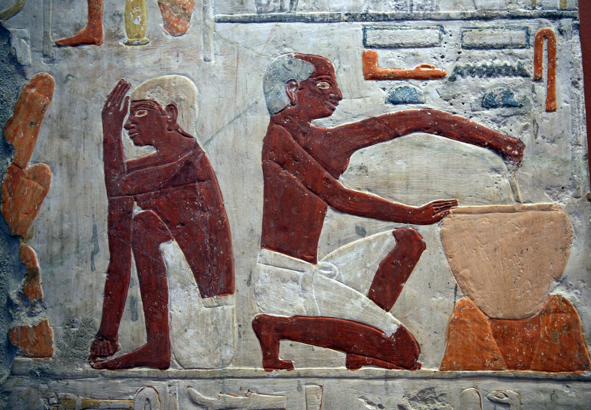

## Introduction

Grammatical type: noun fem.   
Occurrences: 2x HB (0/2/0); 0x Sir; 0x Qum; 0x Inscr.  (Total: 2)

* Nebiim: 1 Sam 2:14; Mic 3:3.
* Text doubtful: None, but see A.1 below.

### Text Doubtful

<b>A.1</b> The critical apparatus of <i>BHS</i> does not express any doubt regarding the reading קַלַּחַת in MT 1 Sam 2:14,
nor regarding the rest of the list of four vessels in that verse. There is, nevertheless, a problem with the text. MT, supported by Pesh, Tg, and Vg, attests four cooking utensils, 
כִּיּוֹר,
דּוּד, 
קַּלַּחַת, 
and פָּרוּר,
while LXX mentions only three utensils: λέβης, χαλκίον, and κύθρα.[^1] 
4QSam<small>a</small> (col. III line 4) represents 
only two vessels: בסיר או בׄפ̊רור̊, of which the first vessel (סיר) is not attested in MT. According to the editors of 4QSam<small>a</small> the reading of סיר attested in 4QSam<small>a</small> is certainly original, because the word λέβης, ‘cauldron’ (<i>GELS</i>, 427), in
LXX<small>B,Ant</small>  mostly represents Heb. סיר.[^2] 
In addition to 1 Sam 2:14, λέβης only once seems to be the counterpart of MT’s כִּיּוֹר in 1 Kgs 7:40 (3 Kgdms 7:26), which is textual critically uncertain because the text obviously contains הַכִּיֹּרוֹת erroneously for הַסִּירוֹת (cf. MT 1 Kgs 7:45 וְאֶת־הַסִּירוֹת / LXX 3 Kgdms 7:31 καὶ τοὺς λέβητας). 
On the other hand, λέβης also reflects דּוּד, the second utensil in MT’s list (cf. 2 Chr 35:13; 1 Esdr 1:13).[^3]   
A serious problem regarding the testimony of 4QSam<small>a</small> is the fact that the narrative sequence differs between MT and 4QSam<small>a</small>: MT’s vv. 13–14 are read as the sequel of 1 Sam 2:16 in 4QSam<small>a</small>. Due to the textual differences of this chapter in MT and 4QSam<small>a</small>, scholars differ with regard to the most original reading. Some tend to give priority to MT’s reading of four vessels, which number in their view decreased subsequently in LXX and 4QSam<small>a</small> (e.g., Rofé 2010; Dietrich 2010). Others give priority the reading of 4QSam<small>a</small> and suppose that the list of vessels gradually expanded during the course of transmission.[^4] 
However, because MT’s reading of קַּלַּחַת itself is not doubted and presupposed in all LXX retroversions,[^5] the reading  of our lemma is ascertained; cf. also
<a href="#AVA1">Ancient Versions A.1</a> below.

[^1]: LXX<small>Ant</small> has a different order of the three vessels, namely λέβης, χύθρα, and χαλκεῖον; see Fernandez Marcos and Busto Saiz 1989, PAGE. For differences in the number of cooking vessels in LXX, see Parry 2006:00.
[^2]: Cf. HRCS<small>2</small>, 863c; Hutzli 2010: ; DJD XVII:42; see also Parry 2006:93; Trebolle 2010:275–76.
[^3]: See <i>GHTIS</i>, 74, giving three occurrences for דּוּד, and five for סִיר, whereas HRCS<small>2</small>, 863c lists 21 occurrences; cf. also Hützli 2010:217, n. 14. 
[^4]: See DJD XVII:42; Trebolle 2010; see especially Parry 2006, esp. 84–85.
[^5]: See DJD XVII:42; Parry 2006: 87; Trebolle 2010:276.

## 1 Root and Comparative Material

<b>A.1</b> <i>Egyptian</i>: Thomas Lambdin and Maximilian Ellenbogen 	regard קַלַּחַת as a loan from Egyptian <i>qrḥt</i>, ‘earthen pot’ 
(<i>WÄS</i>, Bd. 5, 62-3; Hannig, 864).[^9] 
James Hoch (<i>SWET</i>, 331-32), however, is of the opinion that Egyptian <i>krḥt</i>, a type of basket for grapes or flowers, as well as Coptic <i>calaht</i>, a pot (Crum, <i>CD</i> 813-14), are loans from the Canaanite word <i>qlḥt</i>. Hoch’s suggestion is unlikely, however, and the Coptic word is better derived from Egyptian <i>qrḥt</i>. The latter is a rather general term for earthen-ware (Vachala 1992:109–11), but the vessel could also be made of metals like silver, gold, or bronze. The Coptic word denotes a blackened cooking pot and serves as a rendering of κύθρα/χύτρα in 1 Sam 2:14 and Mic 3:3. An Egyptian goddess bearing the name <i>qrḥt</i> is attested, but it is unclear whether she had anything to do with the vessel.

[^9]: Lambdin 1953: 154; <i>FWOT</i>, 149; see also <i>HAL</i>, 1030; <i>HALOT</i> 1102.

<b>A.2</b> <i>Akkadian</i>: 
If <i>qlḥ(t)</i> was the original form, a 
further cognate might be the Assyrian vessel <i>qulliu</i>, plural <i>qulliātu</i>, a type of bowl or pot in which food was prepared and/or served. Sometimes it appears to be made of clay, but more often of bronze (<i>CAD</i> Q: 297-98; 
Salonen, <i>Hausgeräte</i>, 2:110-11). It is hardly a jar (cf. <i>AHw</i>, 
926: ‘ein Ton- od Bronzekrug’), in contrast to Heb. 
קולית, 
Syr. <i>qūlā</i>, <i>qūletā</i> 
and Arab. <i>qillah</i> which all 
denote a type of jar or pitcher, not a cooking pot.	

<b>A.3</b> <i>Ugaritic</i>: 
Another cognate appears to be Ugaritic <i>qlḫt</i>, attested in <i>KTU</i> 5.22:16. This is a list of seemingly unconnected words and names. Apparently the tablet is a scribal exercise. The circumstance that the 
preceding two entries have to do with the hand-mill and the following entry is <i>qmḫ</i>, ‘flour’, suggests that the pot was regularly used for recipes containing flour. However, the scribe was very inexperienced and often confused the <i>ḥ</i> that was dictated to him with <i>ḫ</i> (for example in <i>qmḫ</i> = <i>qmḥ</i>, cf. Dietrich, Loretz, and Sanmartín 1975:166). So it is possible that the original Ugaritic form was <i>qlḥt</i>, which in turn might suggest a connection with the Ugaritic divine name <i>qlḥ</i>.[^10] 

[^10]: De Moor 1970a:225; De Moor 1970b:317; for parallels, cf. Haas 1994:520-38). 

<b>A.4</b> Rabbinic Hebrew</i>: The occurrences of the word קלחת in bBer., 56b; bSanh., 110b; Num. R., XVIII.2 are all derived from  Mic 3:3 and 
do not help to elucidate the meaning of the word in Classical Hebrew. 
bB.Bat., 74a, however, compares the heat to which the 
קלחת is exposed to the fire of hell and seems to indicate that the meat was turned over and over in it (הדר) while searing. 

## 2. Formal Characteristic

<b>A.1</b> Feminine word with the <i>qattalat</i> form; see BL, 476–77, 476-77, §61yβ-aγ.

## 3. Syntagmatics 

<b>A.1</b> קַּלַּחַת, preceded by the preposition בְּ, ‘into’, is complement to the verb נכה <i>hiph.</i>, ‘to thrust’, in 1 Sam 2:14.

<b>A.2</b> קַּלַּחַת is <i>nomen rectum</i> of בְּתוֹךְ, ‘in (the midst of)’, in Mic 3:3. It is part of a nominal clause:
וּכְבָשָׂר בְּתוֹךְ קַלָּחַת, ‘and like meat in (the midst of) a caldron’. 

## 4. Ancient Versions

<b>Septuagint (LXX)</b> 
 
* χαλκίον (LXX), ‘copper cauldron’,[^21] or χύτρας (LXX<small>Ant</small>), ‘earthen pot’:[^22] 1 Sam 2:14; see A.1 below;
* χύτρας, ‘<i>earthen pot</i>: receptacle for meat’:[^23] Mic 3:3. 

[^21]: <i>LEH</i><small>3</small>, 659; <i>GELS</i>, 728.
[^22]: <i>LEH</i><small>3</small>, 359; <i>GELS</i>,  417, κύθρας is a spelling variant of χύτρας.
[^23]: <i>GELS</i>, 738; <i>LEH</i><small>1</small>, 521: ‘earthen pot’; <i>LEH</i><small>3</small>, 670: ‘earthen pot’; LSJ, 2013: ‘earthen pot, pipkin’.

<b>Peshitta (Pesh)</b> 

* ܩܪܕܠܐ݁ (<i>qerdelā</i>), ‘a large hanging pot</i>’:[^24] 1 Sam 2:14; 
* ܩܕܪܐ (<i>qedrā</i>), ‘a pot’:[^25] Mic 3:3.

[^24]: Payne Smith, <i>CSD</i>, 518; Sokoloff, <i>SLB</i>, 1402: ‘pot’.
[^25]: Payne Smith, <i>CSD</i>, 491; Sokoloff, <i>SLB</i>, 1321–22. The latter lexicon does not take קַלַּחַת as the Hebrew counterpart but סִּיר from the preceding clause. 

<b>Targum (Tg)</b>
 
* קדרא, ‘pot’:[^26] 
1 Sam 2:14; Mic 3:3.

[^26]: Sokoloff, <i>DJPA</i>, 476: ‘pot’ (of earthenware or bronze, put on a stove); Levy, <i>CWT</i>, 2:346: ‘Kochgeschirr, Kessel, Topf’.

<b>Vulgate (Vg)</b> 

* <i>olla</i>, ‘pot, jar’:[^27] 1 Sam 2:14; Mic 3:3.

[^27]: Lewis & Short, <i>LD</i>, 1263.

<b>A.1</b> Establishing the correct Greek counterpart of קַלַּחַת in MT 1 Sam 2:14 (LXX 1 Kgdms 2:14) is difficult. As mentioned before, MT has four cooking utensils:
כִּיּוֹר,
דּוּד,
קַּלַּחַת,
and 
פָּרוּר.
LXX (supported by VL[^28]) has three cooking utensils: 
λέβης, χαλκίον, and κύθρα, while in
LXX<small>Ant</small> the order of these vessels is different, namely λέβης, χύθρα, and χαλκεῖον.[^29]  
The problem starts with the question for which Heb. word the Gr. word λέβης is the counterpart. This is important in view of the reading in 4QSam<small>a</small>, reading only two cooking utensils: סיר and פרור (see <a href="#TDA1">Text Doubtful A.1</a> above). Because λέβης, the first utensil in the LXX text, is used mostly as the counterpart of Heb. סִיר, scholars assume that the Heb. <i>Vorlage</i> of LXX read סִיר similarly to 4QSam<small>a</small> instead of MT’s כִּיּוֹר. The latter reading כִּיּוֹר may orginally have been a defective reading כִּיֹּר, which was a misreading for סִיר. However, this is not completely conclusive because λέβης is also used as rendering of דּוּד, the second utensil in MT’s list (cf. 2 Chr 35:13; 1 Esdr 1:13). 
LXX’s λέβης thus equals 4QSam<small>B</small>’s סיר/MT’s כִּיּוֹר but also MT’s דּוּד, which may suggest that LXX had a comparable list of utensils in its Vorlage as MT and  condensed the list by using one rendering for the first two utensils.[^31]
If thus LXX’s first word λέβης is the possible eaquivalent of MT’s first and second word, than LXX’s second word, χαλκίον (or LXX<small>Ant</small>’s χύθρα), may be the renderring for MT’s קַּלַּחַת.   

[^28]: According to <i>Palimpsestus Vindobonensis</i>, reading <i></i>cf. Belsheim 1885:7. 
[^29]: See Fernandez Marcos and Busto Saiz 1989: PAGE. <i>LEH</i><small>3</small>, 659; <i>GELS</i>, 728, χαλκεῖον is a variant of χαλκίον, ‘bronze cauldron’.
[^30]: The occurence of the word כִּיֹּרוֹת (pl. of כִּיּוֹר( in 1 Kgs 7:40 is debated and may be a scribal error for סִירוֹת, see <i>BHS</i> Apparatus; MT is supported in this case by Tg; but partly also by Pesh, which has a double translation ܠܩܢܐ ܘܩܕܣܐ  (<i>lqnʾ wqdsʾ</i>) ‘basins and caldrons’, of which the first word equals in the preceding verses MT’s dir="rtl">סִירוֹת. See further Mulder 1998:354–55.
[^31]: Condensation as translation technique in the LXX is described in, <i>inter alii</i>, Van der Vorm-Croughs 2014:187–200. This translation technique is also known from the Targumim. Smelik (1995:97) labelled this technique as ‘minimalising’.  

## 5. Lexical/Semantic Fields

<b>A.1</b> קַלַּחַת occurs in a list of cooking vessels: 
בַכִּיּוֹר אוֹ בַדּוּד אוֹ בַקַּלַּחַת אוֹ בַפָּרוּר, ’into the pan, or the kettle, or הַקַּלַּחַת, or the pot’ in 1 Sam 2:14. 

<b>A.2</b> קַלַּחַת occurs in parallelism with סִיר, ‘kettle’, in Mic 3:3.

<b>A.3</b> In both occurrences (1 Sam 2:13–14; Mic 3:3) the קַלַּחַת is used to prepare בָּשָׂר, ‘meat’.

## 6. Exegesis 

<b>A.1</b> All the renderings of the word קַלַּחַת in lexica and more specific word studies are rather general. James Kelso (<i>CVOT</i>, 31, #76) shortly states that ‘the vessel is used for cooking a meat stew’, whereas Alexander Honeyman (1939:90) concludes that existing evidence is insufficient ‘to fix this cooking-vessel more nearly’. The word is rendered as ‘caldron’ (BDB, 886; <i>KBL</i> 839), ‘cauldron, pot [for cooking]’ (<i>DCH</i> vii:255; similarly <i>HALOT</i>, 1102); ‘<i>olla</i>, <i>lebes</i> carni coquenda’ (Gesenius, <i>TPC</i>, 1216); ‘Topf, Kessel’ (<i>GB</i>, 714; <i>KBL</i> 839; <i>HALAT</i>, 1030); ‘Kessel, Schüssel’ (<i>HCHAT</i>, 2:316); ‘Pfanne uä’ (<i>HAWAT</i>, 409); and as ‘puchero, olla’ (<i>DBHE</i>, 636; similarly <i>LHA</i>, 724).

### 6.1 Literal Use

<b>A.2</b> According to 1 Sam 2:13-14 the קַלַּחַת was a vessel used in the sanctuary at 
Shiloh for preparing a sacrificial meal (זֶבַח). Presumably the priests, sons of Eli, had a right to take a share from the meat (בָּשָׂר). A servant of the priest would come along ‘when the meat was cooking’ 
(כְּבַשֵּׁל הַבָּשָׂר, v. 13) and would spear a chunk on behalf of the priest with his 
three-pronged fork (ְהַמַּזְלֵג שְׁלֹשׁ־הַשִּׁנַּיִם). He would thrust (נכה <i>hiph.</i>) the fork into the pan (כִּיֹּור), or kettle (דּוּד), or קַלַּחַת, or pot (פָּּרוּר) to bring up (עלה <i>hiph.</i>) the piece.   
Both the circumstance that the vessels mentioned were intended for preparing a communal festive meal and the use of a three-pronged fork suggest that all these vessels were fairly large and had a wide opening. 
The use of the verb עלה <i>hiph.</i> might suggest that they were all fairly deep. The material of which the vessel was made is not mentioned.

### 6.2 Figurative Use

<b>A.3</b>  Mic 3:2-3 accuses the leaders of Israel of tearing off the skin from the people (פשׁט <i>hiph.</i>), and their flesh (שְׁאֵר) from their bones, and even of eating the flesh of the people, and flaying their skin from them. Finally they ‘break their bones in pieces, and spread them out in a kettle (בַּסִּיר), like flesh (כְבָשָׂר) in a קַלַּחַת’. Obviously the prophet – probably Micah the Morashtite – does not accuse the leaders of cannibalism here. He compares their policy of dispossessing small farmers (cf. 2:1-2, 9), tearing off the clothes of peaceful passers-by (cf. 2:8, the same verb פשׁט <i>hiph.</i>) and misleading innocent people (3:4-11) with a butcher’s trade.[^30] 
Nothing here suggests that the קַלַּחַת is a special cultic vessel. Again the material of which it was made remains unclear.   
The verb פרשׂ, ‘to spread out’, suggests a fairly wide vessel suitable for cooking chunks of meat approximately as long 
as pieces of bone. Apparently  סִיר was a similar vessel since both are ruled by the same verb in Mic 3:3. Since the סִיר is for cooking the bones whereas the קַלַּחַת is for the meat, the latter might be a cooking pot of higher quality. The spreading out of 
the chunks suggests a fairly flat bottom.

[^30]: On cannibalism and the content of Mic 3:3, see De Moor 2020:172–74. 

### 6.3. Illustrations

<b>A.4</b> Despite the fact that some cooking vessels such as 
סִיר,
דּוּד,
and 
פָּרוּר could be identified with archaeological findings,[^39] 
it is impossible to provide an illustration of 
קַלַּחַת.[^40] 
There is an abundance of cooking vessels from archaeological excations, which may give some ideas about the forms of such receptacles.[^41] 
Next to these archaeological findings, there are illustrations of cooking and baking activity in the ancient world. See, e.g., the following two small statues (see also Long 2009:280).

     
Female servant stirring in a cooking vessel, ISAC Museum Chicago.

   
Servant stirring in a cooking vessel, Ägyptisches Museum Leipzig.

See further the following illustration from a bread baking scene in Ancient Egypt, showing the interest in the production of food also in the afterlife:

   
Scene from production of bread[^42]

[^39]: See <i>CVOT</i>, 27 \# 63, with 48 fig. 16 for סִיר; 18 \# 39, with 48 fig. 17 for דּוּד; 29 \# 68, with 48 fig. 19 for פָּרוּר (similarly in <i>BHH</i> 3:2006–07).
[^40]: According to CVOT, 31 \# 76 קַּלַּחַת’ is a cooking-pot but there is no further clue as to which specific member of the cooking-pot family is so designated’; similarly <i>BHH</i> 3:2007.  
[^41]: Cf., e.g., Honeyman 1939, plates 18–20; <i>CVOT</i>, 47–48; <i>ANEP</i>, 44–45 \## 147–48; <i>BRL</i>, 168–85).  
[^42]: Description: One man makes cake paste, another one monitors the baking of bread molds. Limestone (2500-2350 BC) 5th dynasty. Paris, Musee Du Louvre.

## 7 Conclusion

The textual evidence suggests that a קַלַּחַת is a fairly deep earthen or metal cooking pot with a rather wide opening. In this vessel chunks of meat were spread out on the flat or concave bottom, apparently for maximum exposure to the heat, thus probably for a first searing. This process also explains why people replaced the vessel by metal versions (Egypt, Assyria) if they could afford it. The association with flour in the Ugaritic text suggests that after the searing water was added for prolonged simmering (בשׁל) and that finally the broth was thickened with flour to obtain what we would call a stew. Therefore the best rendering might be ‘stewpot’.

## Bibliography

Belsheim 1885 
Johannes Belsheim, <i>Palimpsestus Vindobonensis antiqvissimae Veteris Testamenti: Translationis Latin fragmentaæ</i>, Christianiæ: Libraræ P.T. Mallingi. 

Bottéro 1995   
Jean Bottéro, 
<i>Textes culinaires mésopotamiens</i>, 
Winona Lake: Eisenbrauns.

Cathcart 1972   
Kevin J. Cathcart, ‘Notes on Some Hebrew Words for Vessels and Their Cognates’,
<i>Rivista degli studi orientali</i> 47:55-58

Cross, Parrey, and Saley 2005  
Frank M. Cross, Donald W. Parry, and Richard J. Saley, 
“4QSam<small>a</small>”, DJD XVII:1–217.

Dietrich 2010   
Walter Dietrich,
‘Doch ein Text hinter den Texten? Vorläufige textkritische Einsichten eines Samuel-Kommentators’, 
in: Hugo and Schenker 2010:133–59.

Dietrich, Loretz, and Sanmartín 1975  
Manfried Dietrich, Oswald Loretz, Joaquín Sanmartín, 
<i>UF</i> 7:166

Fernández Marcos and Busto Saiz 1989  
Natalio Fernández Marcos and José R. Busto Saiz, with the collaboration of Victoria Spottorno and S. Peter
Cowe, <i>El texto antioqueno de la Biblia griega</i> I: I-2 Samuel (TECC, 50),Madrid:  CSIC.

Haas 1994  
Volkert Haas, <i>Geschichte der hethitischen Religion</i>, Leiden: Brill.

Honeyman 1939   
Alexander M. Honeyman, ‘The pottery vessels of the Old Testament’, <i>PEQ</i> 71:76-90. 

Hugo and Schenker 2010  
Philippe Hugo and Adrian Schenker (eds.),
<i>Archaeology of the Books of Samuel: The Entangling of the Textual and Literary History</i> (SVT, 132),
Leiden: Brill.

Hutzli 2010  
Jürg Hutzli, ‘Theologische Textänderungen im Massoretischen Text und in der Septuaginta von 1–2 Sam’, in Hugo and Schenker 2010:213–36.

Lambdin 1953  
Thomas O. Lambdin, ‘Egyptian Loan Words in the Old Testament’, JAOS 73:145-55.

Long 2009  
V. Philips Long, ‘1 Samuel’, <i>ZIBBC</i>, 2:266–411.

De Moor 1970a  
Johannes C. de Moor, ‘The Semitic Pantheon of Ugarit’, <i>UF</i> 2:187–28.

De Moor 1970b  
Johannes C. de Moor, ‘Studies in the New Alphabetic Texts from Ras Shamra, II’, <i>UF</i> 2:303–27.

De Moor 2020  
Johannes C. de Moor, <i>Micah</i> (HCOT) Leuven: Peeters.

Mulder 1998  
Martin J. Mulder, <i>1 Kings, Volume I: 1 Kings 1–11</i> (HCOT) Leuven: Peeters.

 
Parry 2006 
Donald W. Parry, ‘“How Many Vessels”? An Examination of MT 1 Sam 2:14/4QSam<small>a</small> 1 Sam 2:16’, in: Peter W. Flint, Emanuel Tov, and James C. VanderKam (eds.), <i>Studies in the Hebrew Bible, Qumran, and the Septuagint Presented to Eugene Ulrich</i> (SVT, 101), Leiden: Brill, 84–95. 

Rios 2001  
Alicia Rios, ‘The <i>Olla</i>’, <i>Gastronomica: The Journal of Food and Culture</i> 1:22-4.

Rofé 2010  
Alexander Rofé, ‘Midrashic Traits in 4Q51 (so-called 4QSam<small>a</small>)’,   
in: Hugo and Schenker 2010:75–88.

Smelik 1995  
Willem F. Smelik, <i>The Targum of Judges</i> (OTS, 36)
Leiden: Brill.

Trebolle 2010  
Julio Trebolle, ‘Textual Criticism and the Composition History of Samuel. Connections between Pericopes in 1 Samuel 1–4’, in: Hugo and Schenker 2010:261–85.

Ulrich 2017  
Eugene Ulrich, ‘Textual History of Samuel’, <i>THB</i> 1<small>B</small>:301–09.

Vachala 1992   
Břetislav Vachala, ‘Fragment einer Töpferszene aus der Ptahschepses-Mastaba’, <i>GM</i> 130: 109-11.

Van der Vorm-Croughs 2014  
Mirjam van der Vorm-Croughs,
<i>The Old Greek of Isaiah: An Analysis of Its Pluses and Minuses</i>
(Septuagint and Cognate Studies, 61), 
Atlanta: Society of Biblical Literature.

## Notes

