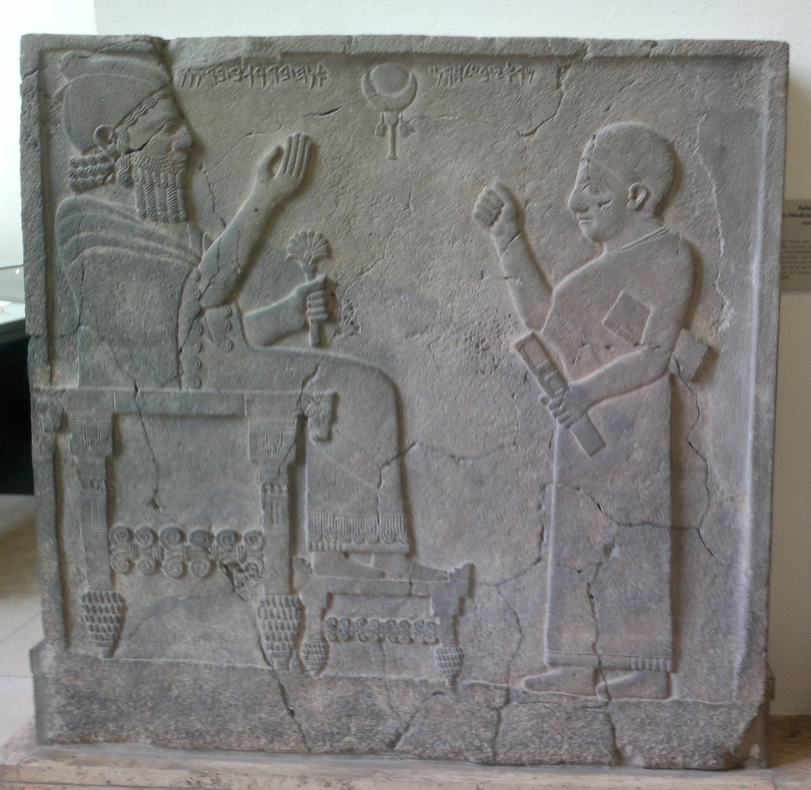
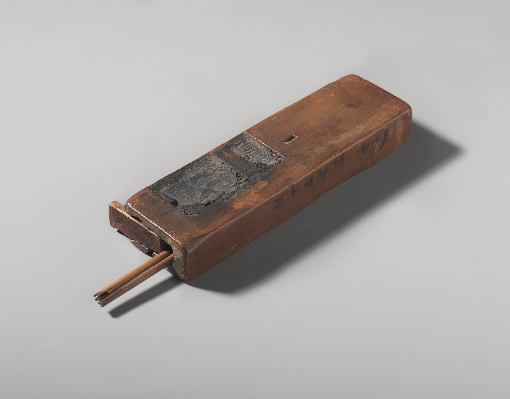

## Introduction

Grammatical type: noun masc.

Occurrences: 3x HB (0/0/3); 0x Sir; 0x Qum; 0x Inscr. (Total: 3)

* Nebiim: Ezek 9:2, 3, 11.

Ketiv/ Qere: none.

## 1. Root and Comparative Material

<b>A.1</b>
The etymology is unclear. A relation to קַשְׂוָה, ‘vessel’ (4x; Exod 25:29, 37:16; Num 4:7; 1 Chron 28:17), is supposed by several scholars (Gesenius, <i>TPC</i>, 1240; <i>CEDHL</i>, 586), but both the sibilant and the last radical are problematic in that case; see also Blau (1970: 117), who considers this etymology as doubtful.

<b>A.2</b>
<i>Egyptian.</i>
Some authors connect the word with Egyptian <i>gstj</i>, ‘palette of a scribe’ (e.g., GB, 719; </i>CVOT</i>, 39; Lambdin 1953, 154; Driver 1954, 86; <i>KBL</i>, 844;  Muchiki 1999: 255; Noonan 2019: 194; Zhakevich 2020: 140, 143; <i>HAL</i>, 1042; <i>MHH</i>, 953; Ges18, 1178 (with [?]); cf. <i>WÄS</i>, 207; <i>WSP</i>, 822). However, <i>BÄV</i> and <i>SWET</i> do not accept this connection.

<b>A.3</b> 
<i>Old and Imperial Aramaic.</i>
Connection with <i>gšwt</i> is highly uncertain (<i>DNWSI</i>, vol. 1, 236).

<b>A.4</b> 
<i>Syriac.</i>
The Syriac ܩܣܛܐ (<i>qesṭā</i>), ‘pint’ or ‘pot’, is a loan from Greek ξέστης  (Payne Smith, <i>CSD</i>, 511; Sokoloff, <i>SLB</i>, 1387), 
but might be considered a cognate, in spite of the different final consonant. Cf. Gesenius, <i>TPC</i>, 1240; <i>HCHAT</i>, Bd. 2, 323.  

<b>A.5</b> 
<i>Classical Arabic.</i>
Gesenius, <i>TPC</i>, 1240, and BDB, 903, compare Arabic <i>qašwah</i>, a basket of palm-leaves (<i>DAF</i>, t. 2, 744), but both the sibilant and the last radical are problematic in that case. 

<b>A.6</b> 
<i>Modern South Arabic.</i>
If the word has a general meaning (see <a href="#Exe-lit">Exegesis, Textual Evidence, A.1</a>), 
Oman Arabic <i>qašš</i>, ‘utensil’ (<i>CDG</i>, 448), and Mehri <i>qaś</i> or <i>qeš</i>, ‘hand-baggage’ (<i>ML</i>, 241), might be considered. 

<b>A.7</b> 
<i>Ethiopic.</i>
König, <i>HAWAT</i>, 413, and Leslau, <i>CDG</i>, 448, consider the possibility that Geez <i>qaśut</i>, ‘vase, water pot, container for mead’, is related, 
but Leslau rejects the idea. 

<b>A.8</b>
<i>Greek.</i>
A connection with Greek κίστη, ‘basket, hamper’, but also ‘writing-case’ (LSJ, 954), is certainly not to be excluded now that it has become clear that contacts between the Levant and Greece started much earlier than hitherto thought. See also Latin <i>cista</i>, ‘a wooden box or basket, often woven of slips or twigs, used for keeping money, clothes, books, fruit, etc.’ (Lewis & Short, <i>LD</i>, 344). The only dictionary considering this possibility is Zorell, 729.

## 2. Formal Characteristics

<b>A.1</b> 
קֶסֶת is a segholate noun and in Ezek 9:2, 3 found in the construct state 
(GK, §89, 2e.b), and in Ezek 9:11 in the absolute state.

## 3. Syntagmatics

<b>A.1</b> קֶסֶת occurs in Ezek 9:2, 3 in a singular genitive construct, and 
in Ezek 9:11 it is absolute.

<b>A.2</b> קֶסֶת occurs as <i>nomen regens</i> of
הַסֹּפֵר, ‘the scribe’, in Ezek 9:2, 3.

<b>A.3</b> קֶסֶת occurs only in nominal clauses:
קֶסֶת הַסֹּפֵר בְּמָתְנָיו(וְ), ‘(and) the קֶסֶת of the scribe (was) on his waist’, Ezek 9:2, 3; 
הַקֶּסֶת בְּמָתְנָיו , ‘the קֶסֶת (was) on his waist’, Ezek 9:11.

<b>A.4</b> קֶסֶת is connected with the word מָתְנָיו ‘his waist’, Ezek. 9:2, 3, 11.

## 4. Ancient Versions

<b>a. Septuagint (LXX) and other Greek versions:</b>

* ζώνη, ‘belt’:[^1]
Ezek 9:2LXX[^2], 3LXX;[^3], 11LXX;[^4] 

* πινακίδιον, ‘small writing-tablet’:[^5]
Ezek 9:2σʹ,[^6]
9:11σʹ;[^7]

* κάστυ, ‘<i>kastu</i>’:[^8]
Ezek 9:2αʹ[^9]; Ezek 9:2θʹ[^10], 11θʹ;[^11]

* μελανοδοχεῖον, ‘inkstand’:[^12]
Ezek 9:2αʹ[^13], Ezek 9:11αʹ.[^14]

<b>b. Peshitta (Pesh):</b>

* ܐܣܪ ܚ̈ܨܐ (<i>asār ḥaṣa</i>), ‘belt’, ‘waist-band’:[^15] 
Ezek 9:2, 3. (For vs. 11 see <a href="#AV5">Ancient Versions, A.5</a>).

<b>c. Targumim (Tg):</b> 

* פנקס, ‘tablet’:[^16]
TgJ Ezek 9:2, 3, 11.

<b>d. Vulgate (Vg):</b> 

* <i>atramentarium</i>, ‘inkstand’:[^17]
Ezek 9:2, 3, 11.

<b>A.1</b> 
In Hexaplaric material, the text of Ezek 9:2 according to ‘the Hebrew’ is cited as 
μέλαν καὶ κάλαμος γραφέως ἐπὶ τῆς ὀσφύος αὐτοῦ [^18], ‘ink and reed of a scribe on his waist’ (LSJ, 359, 866, 1095-96, 1264). This reading is mentioned in the commentary of Ishoʿdad of Merv as ܘܩܪܠܡܐ ܠܡ ܕܣܦܪܐ ܒܐܝܕܗ (<i>wqarlāmā lam dseprā baydēh</i>)
 (citing from Lund 2006: 183). 
Here the word קֶסֶת is rendered as ܩܪܠܡܐ (<i>qarlāmā</i>), 
which has a metathesis of the middle letters of ܩܠܡܪܐ (<i>qalāmrā</i>), ‘writing-case’ 
(Sokoloff, <i>SLB</i>, 1412, 1373; Payne Smith, <i>TS</i>, 3636), a loanword from Greek (καλαμάριον, ‘reed-case’; LSJ, 865)[^19]; <i>pace</i> Lund 2006: 183.
It seems that ‘the Hebrew’ in the Hexaplaric material describes the contents of a writing-case μελαν καὶ καλαμος, 
whereas Ishoʿdad of Merv presents a rendering that denotes the utensil explicitly (< καλαμάριον).

<b>A.2</b>
In the still unedited (Syriac) version of Jacob of Edessa (MS Vat.sir. 5, fols. 20r, 20v, 21v) the construction is rendered trice as ܐܣܪ ܚܨ̈ܐ ܕܣܐܦܝܠܐ
(<i>asār ḥaṣa dsapilā</i>), 
‘a waist-band of lapis lazuli’. This might reflect θ´ and the variant MS of α´.

<b>A.3</b>
A refutation of the suggestion by Eisler (1930: 586) that lxx interpreted קסר as ‘belt’ is found with Winkle (2006: 57 n. 29), 
who holds that this probably had to be קשׁר, ‘alliance, conspiracy’, pointing to the related word קשֻּׁריִם, ‘ribbons, breastsashes [of women]’.

<b>A.4</b>
The Greek πίναξ, ‘writing tablet’, and its diminutive πινακίδιον, ‘small writing-tablet’, are found in  σ´, and as a loanword in 
t (פנקס) and in the Syriac rendering of  σ´ at 9:11 ܦܢܩܝܬܐ (<i>penqitā</i>) (Sokoloff, <i>SLB</i>, 1207; Payne Smith, <i>TS</i>, 3180-81). 

 <b>A.5</b> 
In Ezek 9:11 s has no rendering of the word. 

<b>B.1</b>
In the ancient translations of Ezek 9:2 3, the word’s <i>nomen rectum</i> הַסֹּפֵר is rendered as follows: 
ספרא, ‘scribe’s’ (Tg), ܣܦܝܠܐ (<i>sapilā</i>), ‘lapis lazuli’ (Pesh), 
and <i>scriptoris</i>, ‘scribe’s’ (Vg). 
lxx deviates and translates the construct קֶסֶת הַסֹּפֵר in 9:2 as ζώνη σαπφείρου, ‘belt of lapis lazuli’, but omits הַסֹּפֵר in 9:3.

The translation of lxx and s of קֶסֶת הַסֹּפֵר as ‘belt of lapis lazuli’ is discussed by Winkle (2006: 56-70), 
who deems it possible that the lxx translator read קשׁת הַסֵּפִּיר 
connecting it to the priestly clothing of 9:2 
ἐνδεδυκὼς ποδήρη, καὶ ζώνη σαπφείρου ἐπὶ τῆς ὀσφύος αὐτοῦ, ‘a full-length robe and a sapphire belt was upon his loin’. 
Winkle (2006: 63) points to LXX’s rendering of Exod 28:4.

## 5. Lexical/Semantic Fields

<b>A.1</b> The word denotes a utensil placed on the waist (בְּמָתְנָיו) (Ezek 9:2, 3, 11) of a scribe (סֹפֵר) (Ezek 9:2, 3), 
who belongs to a party of armed men (or six soldiers) having a ‘utensil for shattering’ (כְּלִי מַפָּצֹו) in their hands. 
The scribe has a קֶסֶת on his waist and is clothed in a linen cloth (לָבֻשׁ בַּדִּים). 
This scribe has to make a sign (וְהִתְוִיתָ תָּו) on the foreheads of a distinguished group of Jerusalemites and has to make up a report to God (9:11), 
who gave him his orders near the bronze altar (מִזְבַּח הַנְּחשֶׁת). 
Based on Ezek 9 one cannot escape the conclusion that the קֶסֶת is related to scribal activities possibly connected to the temple.

## 6. Exegesis

### 6.1 Textual Evidence

<b>A.1</b>
The word occurs three times, namely in Ezek 9:2, 3, 11. 
Although all the three instances belong to the same vision of Ezekiel, the object is used in a literal way. It is in the possession of a man in linen dress, possibly a clergyman, 
who belongs to a group of six persons. 
For other interpretations, see
Winkle (2006: 57 n. 24), who sees the scribe as the seventh of the group, and Noonan (2019: 234), who states that all six people were carrying a קֶסֶת.
God ordered this group to kill the unfaithful people of Jerusalem. 
The god-fearing people, however, had to be saved from death. Therefore, they should get a mark on their foreheads.

From the text it is not clear how the mark was applied. It could be by means of a (writing) instrument or by means of a finger. 
Apart from the mentioning in Ezek 9, the governing verb (תוה) is found only once in HB: 1 Sam 21:14. 
There, David is scrabbling on the doors of the gate of king Achish’s palace in Gath, but the text does not specify any sort of instrument used. David most probably scrabbled with his fingers or nails.

The marking of slaves by, for instance, branding or writing (owner’s) names or individual letters is attested in various sources (Dandamaev 1984: 229-34 n. 205). 
The application of individual letters is found designated in Babylonian and Achaemenid cuneiform sources as a '<i>sēperu</i> 
(i.e. scribe’s) <i>mark</i>’ (probably letters of a North-Western Semitic alphabet) (Bloch 2018: 31-46, esp. 46), 
and is found applied on a horse or a donkey, and on the hand and wrist of several slaves (cf. Isa 44:5).

While in Ezek 9:2 and 3 the word קֶסֶת is used with the genitive הַסֹּפֵר, ‘of the scribe’, 
in the third case this addition is lacking. Unfortunately the genitive merely confirms that the קֶסֶת 
was a piece of scribal equipment, but does not throw light on its exact nature. 
The mere fact that הַסֹּפֵר had to be added would seem to exclude a technical term that was clear in itself. 
If it were a more general term like ‘equipment’ or ‘utensil’ (cf. <i>HWAT</i>, 669: ‘das Schreibzug ... am Gürtel getragen’; KBL, 845: 
‘Schreibzeug <i>writing-case</i>’; <i>DBHE</i>, 640: ‘Avíos, instrumentos’; Block 1997: 300-01, 305: ‘kit’; Ges18, 1178: ‘Schreibzeug’), 
the addition of the genitive ‘of a scribe’ would become understandable.

The man in white linen has to pass through the city and has to put a mark, probably a Taw - a cross in ancient Hebrew (cf. Van Staalduine-Sulman 1993: 290) - 
on the foreheads of the faithful who are disturbed because of all the abominations done in Jerusalem (9:4). 
This renders the current hypothesis that the קֶסֶת was an inkpot more or less plausible 
(see <i>CEDHL</i>, 586: ‘inkstand’; <i>CVOT</i>, 39: ‘ink horn’; <i>DCH</i>, vol. 7, 272: ‘writing case, or perh. inkpot’; 
Driver 1954: 86: ‘ink-pot, palette’; <i>EmcM</i>, vol. 7, 205-09; <i>FWOT</i>, 150: ‘writer’s palette’; GB, 719: ‘Gefäß des Schreibers, 
Tintenfaß’; <i>HAWAT</i>, 413: ‘Tintenfass’; <i>HCHAT</i>, Bd. 2, 323: ‘Gefäss des Schreibers ... d.h. Tintenfass’; Lambdin 1953: 154, 
‘a scribe’s vessel, an ink vessel’; Zorell, 729: ‘vasculum utensilia scribae continens’; <i>MHH</i>, 953: כלי לדיו; <i>NIDOTTE</i>, vol. 4, 1291: 
‘a scribe’s palette’; Gesenius <i>TPC</i>, 1240: ‘ampulla, vasculum ... atramentarium’).

The man clothed in linen is walking with the קֶסֶת on his waist (בְּמָתְנָיו). 
This expression cannot mean anything else (Gen 37:34; 1 Kgs 2:5; 20:31-32; 2 Kgs 1:8; Ezek 23:15; Ps 66:11; Job 12:18) and explains some of the renderings found in the <a href="#AV">Ancient Versions</a>. It seems unlikely that a person walking in a white tunic would let an inkpot or palette with wet ink pads
dangle from his girdle. The matter cannot be decided on the basis of context alone.

### 6.2 Pictorial Material

<b>A.1</b>
When an influence from the Egyptian scribal practise is supposed 
(cf. the corresponding use of the terminology, see for instance Schniedewind 2019, Zhakevich 2020), 
Egyptian iconographic representations of a ‘writing-case’ are instructive. Indeed, the Egyptian hieroglyph for ‘scribe’ 
depicts a ‘writing-case’ (consisting of a representation of a tube case, a bag, and the scribal palette). 

Standing scribes are depicted holding the palette in the left hand, cf. Breasted 1916: 236. For North-Western Semitic evidence, see the 
Aramean scribe on the well-known orthostat from Sam'al (<i>ANEP</i> 460) (Fig. 1). Breasted 1916: 236 shows a depiction of a 
seated scribe having the writing equipment slung over his shoulders and in so doing having the writing-case 
hanging in front of him. A good example of an Egyptian scribe sitting with a writing-case attached to his loincloth is found in Mazar, Avi-Yonah and Malamat 1960: 166.

In Assyrian iconography scribes are seemingly standing still, and the alphabet scribes 
(depicted standing, not seated) 
are not depicted with a writing-case, inkpot or other utensils, but with Van der Kooij 1986: 83 it is assumed that it would have been normal and essential for a scribe to carry them. 

### 6.3 Archaeology

<b>A.1</b>
One of the finds from the Jewish outpost in Elephantine is a small hand-held wooden palette with reed pens and pigments. This palette, according to Aimé-Giron, dating from the 4th century BCE and of non-Egyptian provenance (Aimé-Giron 1939: 52, 54), has an obscure description in Aramaic script that can be translated as ‘tablet of Hāya’ (?). The word used for ‘tablet’ or ‘palette’ seems to be פסא;  Aimé-Giron points to the Phoenician פס (<i>DNSWI</i>, vol. 2, 921) (Aimé-Giron 1939: 54). The Aramaic script is dated to ca. 500 BCE according to Van der Kooij 1986: 75 (see Fig. 2 and 3).

Another find, part of a small scribal archive found in Gebelein (Egypt, dated to the fourth dynasty), is a rectangular wooden box containing papyri and writing equipment (cakes of black and red ink, writing reeds and a mortar) (Piacentini 2001, 190; cf. <i>AEMI</i>, index s.v. scribes; see Fig. 4).

Gacek 2009: 293-94 mentions the practise in Ezek 9 of carrying the קֶסֶת on the hip and points that in Arabic tradition a writing-case (sg. <i>dawāh</i> (often made of silver and consisting of a penbox and an inkpot) was right through the Ottoman period worn like a sword attached to a waist-belt. This only may point towards the practicality of carrying scribal equipment in the most efficient way possible.

&nbsp;&nbsp;&nbsp;&nbsp;&nbsp;&nbsp;&nbsp;&nbsp;<small>Figure&nbsp;1:&nbsp;&nbsp;
King Barrakkab receiving a scribe, ca. 730 BCE (Berlin, Vorderasiatisches Museum VA 2817)](https://commons.wikimedia.org/wiki/File:Orthostat_relief_of_King_Barrakib_from_Zincirli.jpg)</small>

&nbsp;&nbsp;&nbsp;&nbsp;&nbsp;&nbsp;&nbsp;&nbsp;<small>Figure&nbsp;2:&nbsp;&nbsp;
Scribe’s Palette and Reed Pens, Elephantine, Egypt, 525-343 BCE (Brooklyn, Brooklyn Museum 16.99a-d)](https://www.brooklynmuseum.org/opencollection/objects/9356)</small>

&nbsp;&nbsp;&nbsp;&nbsp;&nbsp;&nbsp;&nbsp;&nbsp;<small>Figure&nbsp;3:&nbsp;&nbsp;
Aramaic inscription on the side of the palette, Elephantine, Egypt, 525-343 BCE (Brooklyn, Brooklyn Museum 16.99a-d)](https://www.brooklynmuseum.org/opencollection/objects/9356)</small>

[Figure 4]
Figure 4. Wooden box found in Gebelein, ca. 2500 BCE
Image in Posener-Kriéger 1994: 315, figure 2

## 7. Conclusion

<b>A.1</b>
The Hebrew text implies that the utensil under investigation belongs to the equipment of a scribe. Unfortunately the exact meaning of קֶסֶת cannot be established with certainty, as was recognised by Honeyman 1939. From antiquity on, translators have guessed after its meaning. Some opted for ‘inkpot’ or ‘inkstand’. After the discovery of the palettes of Egyptian scribes some proposed a connection with the Egyptian word for ‘palette’, but other experts rejected this, and although it is a conjecture, the wording found on a 4th-century BCE palette might suggest that at least in Aramaic also other words were used for a ‘palette’ (see <a href="#Exe-ar">Exegesis, Archaeology, A.1</a>). 

The explicit addition of the genitive ‘of a scribe’ in two of the three instances might suggest a rather general term like ‘equipment’ (see 
<a href="#Exe-lit">Exegesis, Textual Evidence, A.1</a>) and there is some very weak etymological support for this (<a href="#RCM6">Root and Comparative Material, A.6</a>). But why would such a rare word have been chosen in a verse in which the common Hebrew word for equipment (→ כְּלִי) is also used? 

The best option would seem to accept that קֶסֶת is a Greek loan word meaning ‘writing-case’ (see <a href="#RCM8">Root and Comparative Material, A.8</a>), a possibility mentioned by Zorell, 729, who renders accordingly ‘<i>vasculum utensilia scribae continens</i>’ (a vessel containing a scribe’s utensils), cf. also the rendering of the word in Ezek 9:2 by ‘the Hebrew’ (see <a href="#AV">Ancient Versions, A.1</a>). In Egypt a wooden box has been found containing all the equipment a scribe might need: papyri, cakes of black and red ink, writing reeds and a mortar (see <a href="#Fig">Figure 4</a>). This is a more likely object to be carried around by a scribe in a white cloak who might even hook the case on his girdle while walking, as was customary until well into Ottoman times (see <a href="#Exe-ar">Exegesis, Archaeology, A.1</a>).

<b>Bibliography</b>

For the abbreviations see the 
<a href="/store/abbreviations/">List of Abbreviations</a>. 

Aimé-Giron 1939  
Noël Aimé-Giron, ‘Adversaria Semitica’, <i>BIFAO</i> 38, 47-57.

Blau 1970  
Joshua Blau, <i>On Pseudo-Corrections in Some Semitic Languages</i>, Jerusalem: The Israel Academy of Sciences and Humanities.

Breasted 1916  
James H. Breasted, ‘The Physical Processes of Writing in the Early Orient and Their Relation to the Origin of the Alphabet’, <i>AJSLL</i> 32/4, 230-49.

Bloch 2018  
Yigal Bloch, <i>Alphabet Scribes in the Land of Cuneiform. Seperu Professionals in Mesopotamia in the Neo-Babylonian and Achaemenid Periods </i> (Gorgias Studies in the Ancient Near East) 11, Piscataway: Gorgias Press.

Block 1997  
Daniel I. Block, <i>The Book of Ezekiel: Chapters 1-24</i> (NICOT), Grand Rapids: Eerdmans.

Dandamaev 1984  
Muhammad A. Dandamaev, <i>Slavery in Babylonia: From Nabopolassar to Alexander the Great, 626-331 B.C.</i>, DeKalb: Northern Illinois University Press.

Driver 1954  
Godfrey R. Driver, <i>Semitic Writing from Pictograph to Alphabet</i>, London: Oxford University Press.

Eisler 1930  
Robert Eisler, '<i>gśtj</i> = κάστυ τοῦ γραμματγέος  = קֶסֶת הַסֹּפֵר im Danielkommentar des Hyppolytos von Rom’, <i>OLZ</i> 33, 585-87.

Gacek 2009  
Adam Gacek, <i>Arabic Manuscripts. A Vademecum for Readers</i> (Handbook of Oriental Studies. Section 1, The Near and Middle East, 98), Leiden / Boston: Brill.

Honeyman 1939  
A.M. Honeyman, ‘The Pottery Vessels of the Old Testament’, <i>PEQ</i> 71/2, 76-90.

Van der Kooij 1986
Gerrit van der Kooij, <i>Early North-West Semitic Script Traditions: An Archeological Study of the Linear Alphabetic Scripts up to c. 500 B.C., Ink and Argillary</i> PhD diss.,
Rijksuniversiteit te Leiden.

Lambdin 1953  
Thomas O. Lambdin, ‘Egyptian Loan Words in the Old Testament’, <i>JAOS</i> 73/3, 145-55.

Lund 2006  
Jerome A. Lund, ‘Ishoʿdad’s Knowledge of Hebrew as Evidences from his Treatment of Peshitta Ezekiel’ in: Bas ter Haar Romeny (ed.) <i>The Peshitta: Its Use in Literature and Liturgy: Papers Read at the Third Peshitta Symposium</i> (Monographs of the Peshitta Institute, 15) Leiden: Brill, 177-86.

Mazar, Avi-Yonah and Malamat 1960  
Mazar, Benjamin, Michael Avi-Yonah, and Abraham Malamat, <i>Views of the Biblical World</i> vol. 3, Jerusalem-Ramat Gan: The International Publishing Company.

Muchiki 1999  
Yoshiyuki Muchiki, <i>Egyptian Proper Names and Loanwords in North-West Semitic</i> (Society of Biblical Literature Dissertation Series, 173) Atlanta: Society
of Biblical Literature.

Noonan 2019  
Benjamin J. Noonan, <i>Non-Semitic Loanwords in the Hebrew Bible: A Lexicon of Language Contact</i> (Linguistic Studies in Ancient West Semitic, 14) University Park: Eisenbrauns.

Piacentini 2001  
Patrizia Piacentini, ‘Scribes’, in: D.B. Redford (ed.), <i>Oxford Encyclopedia of Ancient Egypt</i>, vol. 3, Oxford: Oxford University Press, 187-92.

Posener-Kriéger 1994  
Paule Posener-Kriéger, ‘Le coffret de Gebelein’, in: Catherine Berger, Giséle Clerc and Nicolas Grimal (eds.), <i>Hommages á Jean Leclant</i>, vol. I (Bibliothèque d’Étude, 106/1), Cairo: Institut français d’archéologie orientale, 315-26.

Schniedewind 2019  
William M. Schniedewind, <i>The Finger of the Scribe. How Scribes Learned to Write the Bible</i>, New York: Oxford University Press.

Van Staalduine-Sulman 1993  
Eveline van Staalduine-Sulman, ‘The Aramaic Song of the Lamb’, in: J.C. de Moor & W.G.E. Watson (eds.), <i>Verse in Ancient Near Eastern Prose</i> (AOAT, 42), Neukirchen-Vluyn.

Winkle 2006  
Ross E. Winkle, ‘Iridescence in Ezekiel’, <i>Andrews University Seminary Studies</i> 44/1, 51-77.

Zhakevich 2020  
Philip Zhakevich, <i>Scribal Tools in Ancient Israel. A Study of Biblical Hebrew Terms for Writing Materials and Implements</i> (History, archeology, and culture of the Levant, 9), Pennsylvania: Pennsylvania State University Press, Eisenbrauns.

[^1]: LSJ, 759; <i>GELS</i>, 316.
[^2]: FieldII, 790.
[^3]: no discussion in FieldII.
[^4]: FieldII, 792.
[^5]: LSJ, 1405.
[^6]: FieldII, 790.
[^7]: FieldII, 792.
[^8]: LSJ, 882.
[^9]: FieldII, 790.
[^10]: FieldII, 790.
[^11]: According to Jerome FieldII, 792.
[^12]: LSJ, 1095.
[^13]: FieldII, 790, another manuscript of α´.
[^14]: FieldII, 792.
[^15]: Payne Smith, <i>TS</i>, 322, 1350; Sokoloff, <i>SLB</i>, 79-80, 482-83.
[^16]: Jastrow, <i>DTT</i>, 1166; Sokoloff, <i>DJBA</i>, 901; Sokoloff, <i>DJPA</i>, 431.
[^17]: Lewis & Short, <i>LD</i>, 192; cf. <i>OLD</i>, 198.
[^18]: FieldII, 790.
[^19]: See also the note of Jerome to Ezek 9:2 mentioned in FieldII, 790.

